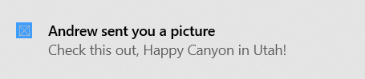

# Send a local app notification from other types of unpackaged apps

This topic is for you if you're developing an unpackaged app that's not C# or C++.

That is, if you're *not* developing a packaged app (see [Create a new project for a packaged WinUI 3 desktop app](../../../winui/winui3/create-your-first-winui3-app.md#packaged-create-a-new-project-for-a-packaged-c-or-c-winui-3-desktop-app)),
and you're not developing a packaged app with external location (see [Grant package identity by packaging with external location](../../../desktop/modernize/grant-identity-to-nonpackaged-apps.md)), and your app isn't C# or C++.

An app notification is a message that an app can construct and deliver to the user while the user is not currently using your app. This quickstart walks you through the steps to create, deliver, and display a Windows app notification. This quickstart uses local notifications, which are the simplest notification to implement.

> [!NOTE]
> The term "toast notification" is being replaced with "app notification". These terms both refer to the same feature of Windows, but over time we will phase out the use of "toast notification" in the documentation.

> [!IMPORTANT]
> If you're writing a C# app, then please see the [C# documentation](send-local-toast.md). If you're writing a C++ app, the please see the [C++ UWP](send-local-toast-cpp-uwp.md) or [C++ WRL](send-local-toast-desktop-cpp-wrl.md) documentation.

## Step 1: Register your app in the registry

You first need to register your app's information in the registry, including a unique AUMID that identifies your app, your app's display name, your icon, and a COM activator's GUID.

```xml
<registryKey keyName="HKEY_LOCAL_MACHINE\Software\Classes\AppUserModelId\<YOUR_AUMID>">
    <registryValue
        name="DisplayName"
        value="My App"
        valueType="REG_EXPAND_SZ" />
    <registryValue
        name="IconUri"
        value="C:\icon.png"
        valueType="REG_EXPAND_SZ" />
    <registryValue
        name="IconBackgroundColor"
        value="AARRGGBB"
        valueType="REG_SZ" />
    <registryValue
        name="CustomActivator"
        value="{YOUR COM ACTIVATOR GUID HERE}"
        valueType="REG_SZ" />
</registryKey>
```

## Step 2: Set up your COM activator

Notifications can be clicked at any point in time, even when your app isn't running. Thus, notification activation is handled through a COM activator. Your COM class must implement the `INotificationActivationCallback` interface. The GUID for your COM class must match the GUID you specified in the registry CustomActivator value.

```cpp
struct callback : winrt::implements<callback, INotificationActivationCallback>
{
    HRESULT __stdcall Activate(
        LPCWSTR app,
        LPCWSTR args,
        [[maybe_unused]] NOTIFICATION_USER_INPUT_DATA const* data,
        [[maybe_unused]] ULONG count) noexcept final
    {
        try
        {
            std::wcout << this_app_name << L" has been called back from a notification." << std::endl;
            std::wcout << L"Value of the 'app' parameter is '" << app << L"'." << std::endl;
            std::wcout << L"Value of the 'args' parameter is '" << args << L"'." << std::endl;
            return S_OK;
        }
        catch (...)
        {
            return winrt::to_hresult();
        }
    }
};
```

## Step 3: Send an app notification

In Windows 10, your app notification content is described using an adaptive language that allows great flexibility with how your notification looks. See the [App notification content](adaptive-interactive-toasts.md) documentation for more information.

We'll start with a simple text-based notification. Construct the notification content (using the Notifications library), and show the notification!

> [!IMPORTANT]
> You must use your AUMID from earlier when sending the notification so that the notification appears from your app.



```cpp
// Construct the toast template
XmlDocument doc;
doc.LoadXml(L"<toast>\
    <visual>\
        <binding template=\"ToastGeneric\">\
            <text></text>\
            <text></text>\
        </binding>\
    </visual>\
</toast>");

// Populate with text and values
doc.SelectSingleNode(L"//text[1]").InnerText(L"Andrew sent you a picture");
doc.SelectSingleNode(L"//text[2]").InnerText(L"Check this out, The Enchantments in Washington!");

// Construct the notification
ToastNotification notif{ doc };

// And send it! Use the AUMID you specified earlier.
ToastNotificationManager::CreateToastNotifier(L"MyPublisher.MyApp").Show(notif);
```

## Step 4: Handling activation

Your COM activator will be activated when your notification is clicked.

## More details

### AUMID restrictions

The AUMID should be at most 129 characters long. If the AUMID is more than 129 characters long, scheduled toast notifications won't work - you'll get the following exception when adding a scheduled notification: *The data area passed to a system call is too small. (0x8007007A)*.
