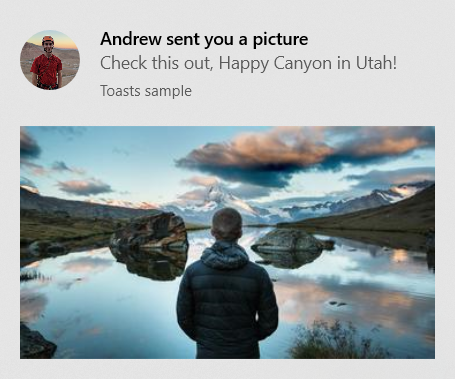
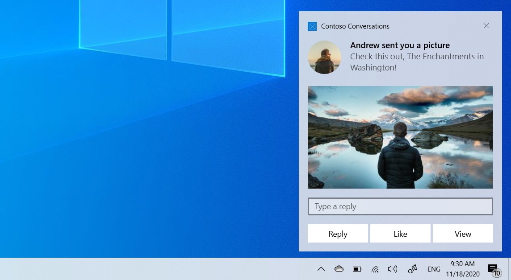

# Send a local app notification from a C# app

[!INCLUDE [intro](includes/send-toast-intro.md)]

> [!NOTE]
> The term "toast notification" is being replaced with "app notification". These terms both refer to the same feature of Windows, but over time we will phase out the use of "toast notification" in the documentation.

> [!IMPORTANT]
> If you're writing a C++ app, please see the [C++ UWP](send-local-toast-cpp-uwp.md) or [C++ WRL](send-local-toast-desktop-cpp-wrl.md) documentation.

## Step 1: Install NuGet package

[!INCLUDE [nuget package](includes/nuget-package.md)]

[!INCLUDE [nuget package .NET warnings](includes/nuget-package-dotnet-warnings.md)]

Our code sample will use this package. This package allows you to create app notifications without using XML, and also allows desktop apps to send app notifications.

## Step 2: Send an app notification

[!INCLUDE [basic toast intro](includes/send-toast-basic-toast-intro.md)]

```csharp
// Requires Microsoft.Toolkit.Uwp.Notifications NuGet package version 7.0 or greater
new ToastContentBuilder()
    .AddArgument("action", "viewConversation")
    .AddArgument("conversationId", 9813)
    .AddText("Andrew sent you a picture")
    .AddText("Check this out, The Enchantments in Washington!")
    .Show(); // Not seeing the Show() method? Make sure you have version 7.0, and if you're using .NET 6 (or later), then your TFM must be net6.0-windows10.0.17763.0 or greater
```

Try running this code and you should see the notification appear!

## Step 3: Handle activation

After showing a notification, you likely need to handle the user clicking the notification (whether that means bringing up specific content after the user clicks it, opening your app in general, or performing an action when the user clicks the notification).

The steps for handling activation differ for UWP, and for packaged and unpackaged desktop apps.

#### [Desktop (MSIX)](#tab/desktop-msix)

First, in your **Package.appxmanifest**, add:

1. Declaration for **xmlns:com**
1. Declaration for **xmlns:desktop**
1. In the **IgnorableNamespaces** attribute, **com** and **desktop**
1. **desktop:Extension** for **windows.toastNotificationActivation** to declare your toast activator CLSID (using a new GUID of your choice).
1. MSIX only: **com:Extension** for the COM activator using the GUID from step #4. Be sure to include the `Arguments="-ToastActivated"` so that you know your launch was from a notification

**Package.appxmanifest**

```xml
<!--Add these namespaces-->
<Package
  ...
  xmlns:com="http://schemas.microsoft.com/appx/manifest/com/windows10"
  xmlns:desktop="http://schemas.microsoft.com/appx/manifest/desktop/windows10"
  IgnorableNamespaces="... com desktop">
  ...
  <Applications>
    <Application>
      ...
      <Extensions>

        <!--Specify which CLSID to activate when toast clicked-->
        <desktop:Extension Category="windows.toastNotificationActivation">
          <desktop:ToastNotificationActivation ToastActivatorCLSID="replaced-with-your-guid-C173E6ADF0C3" /> 
        </desktop:Extension>

        <!--Register COM CLSID LocalServer32 registry key-->
        <com:Extension Category="windows.comServer">
          <com:ComServer>
            <com:ExeServer Executable="YourProject\YourProject.exe" Arguments="-ToastActivated" DisplayName="Toast activator">
              <com:Class Id="replaced-with-your-guid-C173E6ADF0C3" DisplayName="Toast activator"/>
            </com:ExeServer>
          </com:ComServer>
        </com:Extension>

      </Extensions>
    </Application>
  </Applications>
 </Package>
```

Then, **in your app's startup code** (App.xaml.cs OnStartup for WPF), subscribe to the OnActivated event.

[!INCLUDE [desktop toast activation sequence](includes/desktop-toast-activation-code.md)]

[!INCLUDE [desktop toast activation sequence](includes/desktop-toast-activation-sequence.md)]

#### [Desktop (unpackaged)](#tab/desktop)

[!INCLUDE [desktop toast activation sequence](includes/desktop-toast-activation-sequence.md)]

**In your app's startup code** (App.xaml.cs OnStartup for WPF), subscribe to the OnActivated event.

[!INCLUDE [desktop toast activation sequence](includes/desktop-toast-activation-code.md)]

#### [UWP](#tab/uwp)

When the user clicks your notification (or a button on the notification with foreground activation), your app's **App.xaml.cs** **OnActivated** will be invoked, and the arguments you added will be returned.

**App.xaml.cs**

```csharp
protected override void OnActivated(IActivatedEventArgs e)
{
    // Handle notification activation
    if (e is ToastNotificationActivatedEventArgs toastActivationArgs)
    {
        // Obtain the arguments from the notification
        ToastArguments args = ToastArguments.Parse(toastActivationArgs.Argument);

        // Obtain any user input (text boxes, menu selections) from the notification
        ValueSet userInput = toastActivationArgs.UserInput;
 
        // TODO: Show the corresponding content
    }
}
```

[!INCLUDE [OnLaunched warning](includes/onlaunched-warning.md)]
---

## Step 4: Handle uninstallation

#### [Desktop (MSIX)](#tab/desktop-msix)

You don't need to do anything! When MSIX apps are uninstalled, all notifications and any other related resources are automatically cleaned up.

#### [Desktop (unpackaged)](#tab/desktop)

If your app has an uninstaller, in your uninstaller you should call `ToastNotificationManagerCompat.Uninstall();`. If your app is a "portable app" without an installer, consider calling this method upon app exit unless you have notifications that are meant to persist after your app is closed.

The uninstall method will clean up any scheduled and current notifications, remove any associated registry values, and remove any associated temporary files that were created by the library.

#### [UWP](#tab/uwp)

You don't need to do anything! When UWP apps are uninstalled, all notifications and any other related resources are automatically cleaned up.

---

## Add images

You can add rich content to notifications. We'll add an inline image and a profile (app logo override) image.

[!INCLUDE [images note](includes/images-note.md)]

> [!IMPORTANT]
> Http images are supported only in packaged apps that have the internet capability in their manifest. Unpackaged apps don't support http images; you must download the image to your local app data, and reference it locally.



```csharp
// Construct the content and show the toast!
new ToastContentBuilder()
    ...

    // Inline image
    .AddInlineImage(new Uri("https://picsum.photos/360/202?image=883"))

    // Profile (app logo override) image
    .AddAppLogoOverride(new Uri("ms-appdata:///local/Andrew.jpg"), ToastGenericAppLogoCrop.Circle)
    
    .Show();
```

## Add buttons and inputs

You can add buttons and inputs to make your notifications interactive. Buttons can launch your foreground app, a protocol, or your background task. We'll add a reply text box, a "Like" button, and a "View" button that opens the image.



```csharp
int conversationId = 384928;

// Construct the content
new ToastContentBuilder()
    .AddArgument("conversationId", conversationId)
    ...

    // Text box for replying
    .AddInputTextBox("tbReply", placeHolderContent: "Type a response")

    // Buttons
    .AddButton(new ToastButton()
        .SetContent("Reply")
        .AddArgument("action", "reply")
        .SetBackgroundActivation())

    .AddButton(new ToastButton()
        .SetContent("Like")
        .AddArgument("action", "like")
        .SetBackgroundActivation())

    .AddButton(new ToastButton()
        .SetContent("View")
        .AddArgument("action", "viewImage")
        .AddArgument("imageUrl", image.ToString()))
    
    .Show();
```

The activation of foreground buttons are handled in the same way as the main notification body (your App.xaml.cs OnActivated will be called).

Note that arguments added to the top-level app notification (like conversation ID) will also be returned when the buttons are clicked, as long as buttons use the AddArgument API as seen above (if you custom assign arguments on a button, the top-level arguments won't be included).

## Handle background activation

#### [Desktop](#tab/desktop-msix+desktop)

For desktop applications, background activations are handled the same as foreground activations (your **OnActivated** event handler will be triggered). You can choose to not show any UI and close your app after handling activation.

#### [UWP](#tab/uwp)

When you specify background activation on your app notification (or on a button inside the notification), your background task will be executed instead of activating your foreground app.

For more information on background tasks, please see [Support your app with background tasks](/windows/uwp/launch-resume/support-your-app-with-background-tasks).

If you are targeting build 14393 or later, you can use in-process background tasks, which greatly simplify things. Note that in-process background tasks will fail to run on older versions of Windows. We'll use an in-process background task in this code sample.

```csharp
const string taskName = "ToastBackgroundTask";

// If background task is already registered, do nothing
if (BackgroundTaskRegistration.AllTasks.Any(i => i.Value.Name.Equals(taskName)))
    return;

// Otherwise request access
BackgroundAccessStatus status = await BackgroundExecutionManager.RequestAccessAsync();

// Create the background task
BackgroundTaskBuilder builder = new BackgroundTaskBuilder()
{
    Name = taskName
};

// Assign the toast action trigger
builder.SetTrigger(new ToastNotificationActionTrigger());

// And register the task
BackgroundTaskRegistration registration = builder.Register();
```

Then in your App.xaml.cs, override the OnBackgroundActivated method. You can then retrieve the pre-defined arguments and user input, similar to the foreground activation.

**App.xaml.cs**

```csharp
protected override async void OnBackgroundActivated(BackgroundActivatedEventArgs args)
{
    var deferral = args.TaskInstance.GetDeferral();
 
    switch (args.TaskInstance.Task.Name)
    {
        case "ToastBackgroundTask":
            var details = args.TaskInstance.TriggerDetails as ToastNotificationActionTriggerDetail;
            if (details != null)
            {
                ToastArguments arguments = ToastArguments.Parse(details.Argument);
                var userInput = details.UserInput;

                // Perform tasks
            }
            break;
    }
 
    deferral.Complete();
}
```

---

## Set an expiration time

In Windows 10, all app notifications go in Action Center after they are dismissed or ignored by the user, so users can look at your notification after the popup is gone.

However, if the message in your notification is only relevant for a period of time, you should set an expiration time on the app notification so the users do not see stale information from your app. For example, if a promotion is only valid for 12 hours, set the expiration time to 12 hours. In the code below, we set the expiration time to be 2 days.

> [!NOTE]
> The default and maximum expiration time for local app notifications is 3 days.

```csharp
// Create toast content and show the toast!
new ToastContentBuilder()
    .AddText("Expires in 2 days...")
    .Show(toast =>
    {
        toast.ExpirationTime = DateTime.Now.AddDays(2);
    });
```

## Provide a primary key for your notification

If you want to programmatically remove or replace the notification you send, you need to use the Tag property (and optionally the Group property) to provide a primary key for your notification. Then, you can use this primary key in the future to remove or replace the notification.

To see more details on replacing/removing already delivered app notifications, please see [Quickstart: Managing toast notifications in action center (XAML)](/previous-versions/windows/apps/dn631260(v=win.10)).

Tag and Group combined act as a composite primary key. Group is the more generic identifier, where you can assign groups like "wallPosts", "messages", "friendRequests", etc. And then Tag should uniquely identify the notification itself from within the group. By using a generic group, you can then remove all notifications from that group by using the [RemoveGroup API](/uwp/api/Windows.UI.Notifications.ToastNotificationHistory#Windows_UI_Notifications_ToastNotificationHistory_RemoveGroup_System_String_).

```csharp
// Create toast content and show the toast!
new ToastContentBuilder()
    .AddText("New post on your wall!")
    .Show(toast =>
    {
        toast.Tag = "18365";
        toast.Group = "wallPosts";
    });
```

## Clear your notifications

Apps are responsible for removing and clearing their own notifications. When your app is launched, we do NOT automatically clear your notifications.

Windows will only automatically remove a notification if the user explicitly clicks the notification.

Here's an example of what a messaging app should do…

1. User receives multiple app notifications about new messages in a conversation.
2. User taps one of those notifications to open the conversation.
3. The app opens the conversation and then clears all notifications for that conversation (by using [RemoveGroup](/uwp/api/Windows.UI.Notifications.ToastNotificationHistory) on the app-supplied group for that conversation).
4. User's Action Center now properly reflects the notification state, since there are no stale notifications for that conversation left in Action Center.

To learn about clearing all notifications or removing specific notifications, see [Quickstart: Managing toast notifications in action center (XAML)](/previous-versions/windows/apps/dn631260(v=win.10)).

```csharp
ToastNotificationManagerCompat.History.Clear();
```

## Resources

* [Full code sample on GitHub](https://github.com/WindowsNotifications/quickstart-sending-local-toast-win10)
* [App notification content documentation](adaptive-interactive-toasts.md)
* [ToastNotification Class](/uwp/api/Windows.UI.Notifications.ToastNotification)
* [ToastNotificationActivatedEventArgs Class](/uwp/api/Windows.ApplicationModel.Activation.ToastNotificationActivatedEventArgs)
