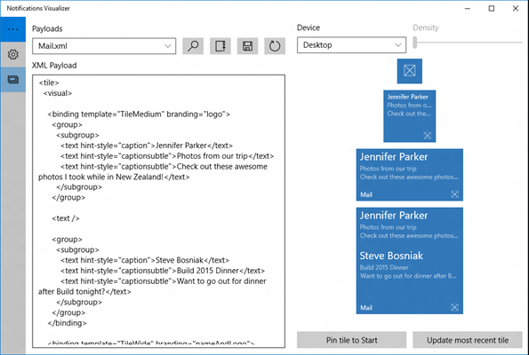
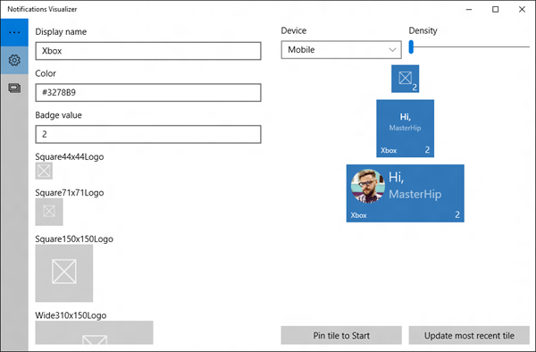

# Notifications Visualizer

Notifications Visualizer is a Windows app [in the Store](https://apps.microsoft.com/detail/9nblggh5xsl1) that helps developers design interactive toast notifications for Windows.

> [!NOTE]
> Live Tiles are not supported in Windows 11. The Notifications Visualizer app still supports designing toast notification payloads, which remain the primary notification surface. For toast notification development, see [App notification content](app-notifications/app-notifications-content.md).

## Overview

Notifications Visualizer provides instant visual previews of your toast notification as you edit the XML payload, similar to Visual Studio's XAML editor/design view. The app also checks for errors, which ensures that you create a valid toast notification payload.

This screenshot from the app shows the XML payload and how tile sizes appear on a selected device:

 

With Notifications Visualizer, you can create and test toast payloads without having to edit and deploy your own app. Once you've created a payload with ideal visual results, you can integrate that into your app. See [Send a local app notification](app-notifications/app-notifications-quickstart.md) to learn more.

> [!IMPORTANT]
> Notifications Visualizer's simulation of toast notifications isn't always completely accurate, and it doesn't support some advanced payload properties. When you have the toast you want, test it by popping the toast notification to verify that it appears as you intend.

 

## Features

Notifications Visualizer comes with a number of sample payloads to showcase what's possible with interactive toasts to help you get started. You can experiment with all the different text options, groups/subgroups, background images, and you can see how the notification adapts to different devices and screens. Once you've made changes, you can save your updated payload to a file for future use.

The editor provides real-time errors and warnings. For example, if your payload is greater than 5 KB (a platform limitation), Notifications Visualizer warns you that your payload exceeds that limit. It gives you warnings for incorrect attribute names or values, which helps you debug visual issues.

You can control notification properties like display name, color, logos, and badge value. These options help you instantly understand how your notification properties and payloads interact, and the results they produce.

This screenshot from the app shows the tile editor:

 

## Related topics

* [Get Notifications Visualizer in the Store](https://apps.microsoft.com/detail/9nblggh5xsl1)
* [App notification content](app-notifications/app-notifications-content.md)
* [Send a local app notification](app-notifications/app-notifications-quickstart.md)
