# Quickstart: Push notifications in the Windows App SDK

In this quickstart you will create a desktop Windows application that sends and receives push notifications using the [Windows App SDK](../../../windows-app-sdk/index.md).

## Prerequisites

- [Start developing Windows apps](../../../get-started/start-here.md)
- Either [Create a new project that uses the Windows App SDK](../../../winui/winui3/create-your-first-winui3-app.md) OR [Use the Windows App SDK in an existing project](../../../windows-app-sdk/use-windows-app-sdk-in-existing-project.md)
- An [Azure Account](https://azure.microsoft.com/free/) is required in order to use Windows App SDK push notifications.
- Read [Push notifications overview](../../../windows-app-sdk/notifications/push-notifications/index.md)
- Install the [Desktop Development with C++ workload](cpp/build/vscpp-step-0-installation#step-4---choose-workloads) to use the C++ console app template

## Sample app

This quickstart walks through adding push notifications support to your app on Windows App SDK 1.5. See similar code to this quickstart in the sample apps found on [GitHub](https://github.com/microsoft/WindowsAppSDK-Samples/tree/main/Samples/Notifications/Push/). Make sure to check out the [branch with your preferred version of the Windows App SDK](https://github.com/microsoft/WindowsAppSDK-Samples/branches) for the samples that best match your project.

> [!div class="button"]
> [Sample App Code](https://github.com/microsoft/WindowsAppSDK-Samples/tree/main/Samples/Notifications/Push)

You can also find samples for each version of Windows App SDK by [selecting a version branch in the samples repository](https://github.com/microsoft/WindowsAppSDK-Samples/branches).
 
## API reference

For API reference documentation for push notifications, see [Microsoft.Windows.PushNotifications Namespace](/windows/windows-app-sdk/api/winrt/microsoft.windows.pushnotifications).

## Configure your app's identity in Azure Active Directory (AAD)

Push notifications in Windows App SDK use identities from Azure Active Directory (AAD). Azure credentials are required when requesting a WNS Channel URI and when requesting access tokens in order to send push notifications. **Note**: We do **NOT** support using Windows App SDK push notifications with Microsoft Partner Center.  

### Step 1: Create an AAD app registration

Login to your Azure account and create a new [**AAD App Registration**](https://ms.portal.azure.com/#blade/Microsoft_AAD_RegisteredApps/ApplicationsListBlade) resource. Select *New registration*.

### Step 2: Provide a name and select a multi-tenant option

1. Provide an app name.
1. Push notifications require the multi-tenant option, so select that. 
    1. For more information about tenants, see [Who can sign in to your app?](/azure/active-directory/develop/single-and-multi-tenant-apps#who-can-sign-in-to-your-app).
1. Select *Register*
1. Take note of your **Application (client) ID**, as this is your **Azure AppId** that you will be using during activation registration and access token request.
1. Take note of your **Directory (tenant) ID**, as this is your **Azure TenantId** that you will be using when requesting an access token.
    > [!IMPORTANT]
    > 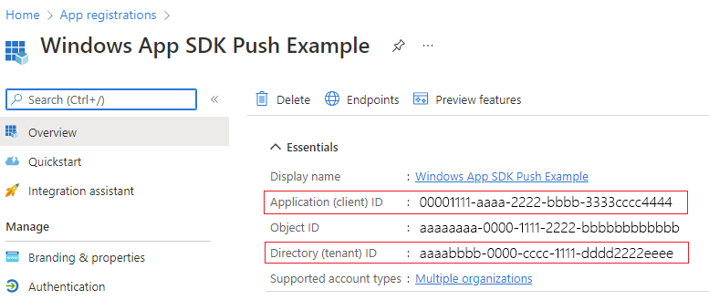
    > Take note of your **Application (client) ID** and **Directory (tenant) ID**.
1. Take note of your **Object ID**, as this is your **Azure ObjectId** that you will be using when requesting a channel request.  Note that this is NOT the object ID listed on the **Essentials** page. Instead, to find the correct **Object ID**, click on the app name in the **Managed application in local directory** field on the **Essentials** page:
    > 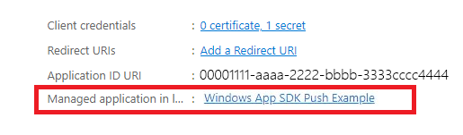
    
    > 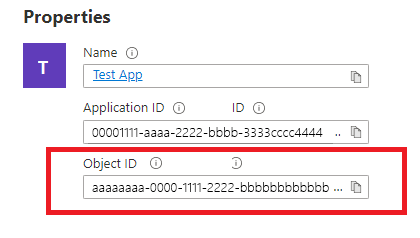
    
    > [!NOTE] 
    > A **service principal** is required to get an Object ID, if there is not one associated with your app, follow the steps in one of the following articles to create one in the Azure portal or using the command line:
    >
    > [Use the portal to create an Azure AD application and service principal that can access resources](/azure/active-directory/develop/howto-create-service-principal-portal)
    >
    > [Use Azure PowerShell to create a service principal with a certificate](/azure/active-directory/develop/howto-authenticate-service-principal-powershell)
    

### Step 3: Create a secret for your app registration

Your secret will be used along with your Azure AppId/ClientId when requesting an access token to send push notifications.

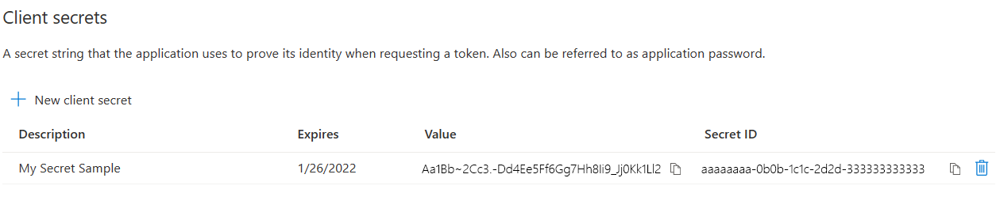

Navigate to **Certificates & secrets** and select **New client secret**.

> [!IMPORTANT]
> Ensure you copy your secret once created and store it in a safe location, like Azure Key Vault. It will only be viewable once right after creation.

### Step 4: Map your app's Package Family Name to its Azure AppId

If your app is packaged (including packaged with an external location), you can use this flow to map your app's Package Family Name (PFN) and its Azure AppId.

If your app is a packaged Win32 app, then create a Package Family Name (PFN) mapping request by emailing [Win_App_SDK_Push@microsoft.com](mailto:Win_App_SDK_Push@microsoft.com) with subject line "Windows App SDK Push Notifications Mapping Request" and body "PFN: \[your PFN\]", AppId: \[your APPId\], ObjectId: \[your ObjectId\]. Mapping requests are completed on a weekly basis. You will be notified once your mapping request has been completed.

Once you have your Azure AppId, ObjectId, and secret, you can add those credentials to the sample code below. 

## Configure your app to receive push notifications from the C++ console template

This section walks through creating a console app template and turning it into an unpackaged C++ console app with push notifications. If you want a instructions for adding push notifications to an existing project or more step-by-step instructions for the C++ code below, see [Configure an existing app to receive push notifications](#configure-an-existing-app-to-receive-push-notifications).

>[!IMPORTANT]
> C# and packaged app examples are available on the [Windows App SDK Samples repository](https://github.com/microsoft/WindowsAppSDK-Samples). Make sure to check out [the branch with your preferred version of the Windows App SDK](https://github.com/microsoft/WindowsAppSDK-Samples/branches) for the guide that best matches your project.

### Step 1: Initialize the Console App template

In Visual Studio, click **Create a new project**. In the dropdown boxes, filter the language to **C++**, platform to **Windows**, and project type to **Console**. Select the **Console App** template. 

Once you select the template, click **Next**. Name the solution "PushNotificationsQuickstart". Then click **Create**.

When Visual Studio opens, you should find the following in your Solution Explorer:
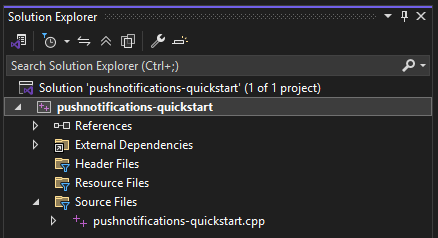

### Step 2: Add in sample code

First, we will add a file called `packages.config`, which contains the libraries for the sample to run:

```xaml
<?xml version="1.0" encoding="utf-8"?>
<packages>
  <package id="Microsoft.Windows.CppWinRT" version="2.0.240405.15" targetFramework="native" />
  <package id="Microsoft.Windows.ImplementationLibrary" version="1.0.220914.1" targetFramework="native" />
  <package id="Microsoft.Windows.SDK.BuildTools" version="10.0.22621.756" targetFramework="native" />
  <package id="Microsoft.WindowsAppSDK" version="1.5.240227000" targetFramework="native" />
</packages>
```

> [!NOTE] If you're finding extra spaces when you paste in the XML, ensure the file extension is `.config`, not `.cpp` (or `.config.cpp`). Visual Studio may make the file a `.cpp` file by default.

Next, update the `PushNotificationsQuickstart.vcxproj` file. To edit it, right click on your project file (just under your solution) and select **Unload project**. If it asks you to save any files, click **Yes**.
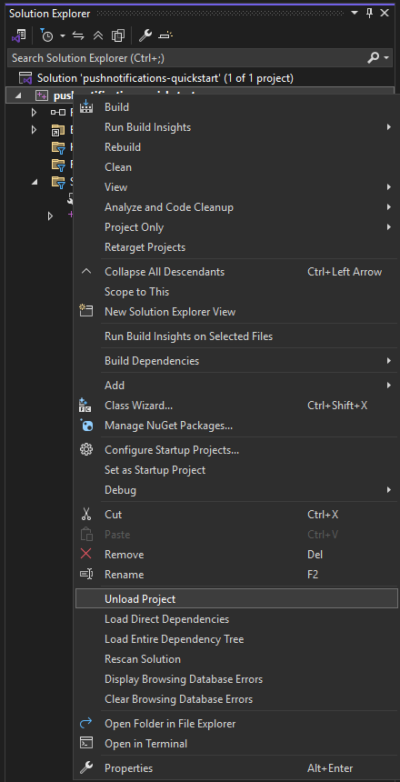

Your project should then look like this:
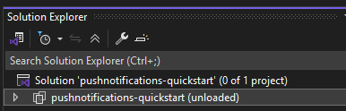

Double click the project now and `{PushNotificationsQuickstart.vcxproj}` will appear:

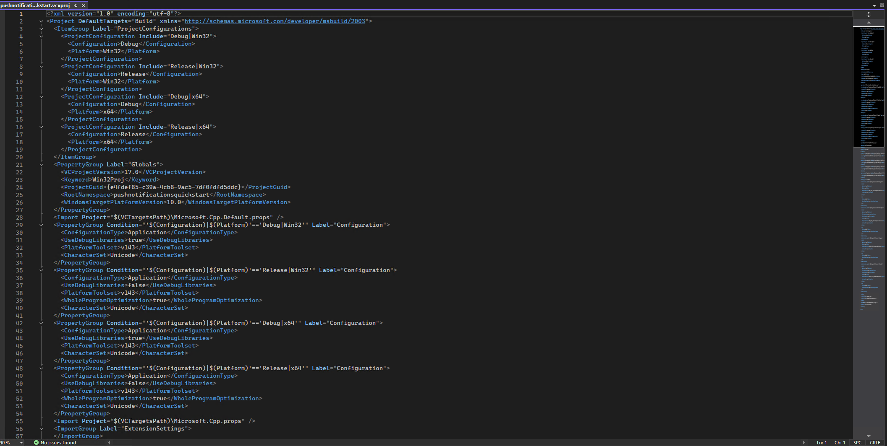

Make note of two properties under the "Globals" property group in this file: `<ProjectGuid>` and `<RootNamespace>`. These are unique to your project and are needed to reload the file.

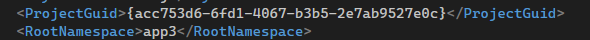

Once you have saved those properties outside of the code, paste in the following code block, replacing SOLUTION_NAMESPACE_HERE, PROJECT_GUID_HERE, CPP_FILE_NAME_HERE with your solution name, project GUID, and `.cpp` file name, respectfully.

```xml
<?xml version="1.0" encoding="utf-8"?>
<Project DefaultTargets="Build" xmlns="http://schemas.microsoft.com/developer/msbuild/2003">
    <Import Project="..\packages\Microsoft.Windows.CppWinRT.2.0.240405.15\build\native\Microsoft.Windows.CppWinRT.props" Condition="Exists('..\packages\Microsoft.Windows.CppWinRT.2.0.240405.15\build\native\Microsoft.Windows.CppWinRT.props')" />
    <Import Project="..\packages\Microsoft.WindowsAppSDK.1.5.240227000\build\native\Microsoft.WindowsAppSDK.props" Condition="Exists('..\packages\Microsoft.WindowsAppSDK.1.5.240227000\build\native\Microsoft.WindowsAppSDK.props')" />
    <Import Project="..\packages\Microsoft.Windows.SDK.BuildTools.10.0.22621.756\build\Microsoft.Windows.SDK.BuildTools.props" Condition="Exists('..\packages\Microsoft.Windows.SDK.BuildTools.10.0.22621.756\build\Microsoft.Windows.SDK.BuildTools.props')" />
    <ItemGroup Label="ProjectConfigurations">
        <ProjectConfiguration Include="Debug|Win32">
            <Configuration>Debug</Configuration>
            <Platform>Win32</Platform>
        </ProjectConfiguration>
        <ProjectConfiguration Include="Release|Win32">
            <Configuration>Release</Configuration>
            <Platform>Win32</Platform>
        </ProjectConfiguration>
        <ProjectConfiguration Include="Debug|x64">
            <Configuration>Debug</Configuration>
            <Platform>x64</Platform>
        </ProjectConfiguration>
        <ProjectConfiguration Include="Release|x64">
            <Configuration>Release</Configuration>
            <Platform>x64</Platform>
        </ProjectConfiguration>
    </ItemGroup>
    <PropertyGroup Label="Globals">
        <VCProjectVersion>17.0</VCProjectVersion>
        <Keyword>Win32Proj</Keyword>
        <ProjectGuid>{PROJECT_GUID_HERE}</ProjectGuid>
        <RootNamespace>PushNotificationsQuickstart</RootNamespace>
        <WindowsTargetPlatformVersion>10.0</WindowsTargetPlatformVersion>
        <!--
    To use the Windows App SDK in an app packaged with external location or unpackaged, you must initialize the Windows
    App SDK before using its APIs. You can use auto-initialization by adding <WindowsPackageType>None</WindowsPackageType> in the
    Globals property section like below or call the bootstrapper API for custom behavior like error handling UI and/or logging, or
    to load a version of the Windows App SDK that's different than the one you built with. See
    https://learn.microsoft.com/windows/apps/windows-app-sdk/use-windows-app-sdk-run-time for more information.
    -->
        <WindowsPackageType>None</WindowsPackageType>
    </PropertyGroup>
    <Import Project="$(VCTargetsPath)\Microsoft.Cpp.Default.props" />
    <PropertyGroup Condition="'$(Configuration)|$(Platform)'=='Debug|Win32'" Label="Configuration">
        <ConfigurationType>Application</ConfigurationType>
        <UseDebugLibraries>true</UseDebugLibraries>
        <PlatformToolset>v143</PlatformToolset>
        <CharacterSet>Unicode</CharacterSet>
    </PropertyGroup>
    <PropertyGroup Condition="'$(Configuration)|$(Platform)'=='Release|Win32'" Label="Configuration">
        <ConfigurationType>Application</ConfigurationType>
        <UseDebugLibraries>false</UseDebugLibraries>
        <PlatformToolset>v143</PlatformToolset>
        <WholeProgramOptimization>true</WholeProgramOptimization>
        <CharacterSet>Unicode</CharacterSet>
    </PropertyGroup>
    <PropertyGroup Condition="'$(Configuration)|$(Platform)'=='Debug|x64'" Label="Configuration">
        <ConfigurationType>Application</ConfigurationType>
        <UseDebugLibraries>true</UseDebugLibraries>
        <PlatformToolset>v143</PlatformToolset>
        <CharacterSet>Unicode</CharacterSet>
    </PropertyGroup>
    <PropertyGroup Condition="'$(Configuration)|$(Platform)'=='Release|x64'" Label="Configuration">
        <ConfigurationType>Application</ConfigurationType>
        <UseDebugLibraries>false</UseDebugLibraries>
        <PlatformToolset>v143</PlatformToolset>
        <WholeProgramOptimization>true</WholeProgramOptimization>
        <CharacterSet>Unicode</CharacterSet>
    </PropertyGroup>
    <Import Project="$(VCTargetsPath)\Microsoft.Cpp.props" />
    <ImportGroup Label="ExtensionSettings">
    </ImportGroup>
    <ImportGroup Label="Shared">
    </ImportGroup>
    <ImportGroup Label="PropertySheets" Condition="'$(Configuration)|$(Platform)'=='Debug|Win32'">
        <Import Project="$(UserRootDir)\Microsoft.Cpp.$(Platform).user.props" Condition="exists('$(UserRootDir)\Microsoft.Cpp.$(Platform).user.props')" Label="LocalAppDataPlatform" />
    </ImportGroup>
    <ImportGroup Label="PropertySheets" Condition="'$(Configuration)|$(Platform)'=='Release|Win32'">
        <Import Project="$(UserRootDir)\Microsoft.Cpp.$(Platform).user.props" Condition="exists('$(UserRootDir)\Microsoft.Cpp.$(Platform).user.props')" Label="LocalAppDataPlatform" />
    </ImportGroup>
    <ImportGroup Label="PropertySheets" Condition="'$(Configuration)|$(Platform)'=='Debug|x64'">
        <Import Project="$(UserRootDir)\Microsoft.Cpp.$(Platform).user.props" Condition="exists('$(UserRootDir)\Microsoft.Cpp.$(Platform).user.props')" Label="LocalAppDataPlatform" />
    </ImportGroup>
    <ImportGroup Label="PropertySheets" Condition="'$(Configuration)|$(Platform)'=='Release|x64'">
        <Import Project="$(UserRootDir)\Microsoft.Cpp.$(Platform).user.props" Condition="exists('$(UserRootDir)\Microsoft.Cpp.$(Platform).user.props')" Label="LocalAppDataPlatform" />
    </ImportGroup>
    <PropertyGroup Label="UserMacros" />
    <ItemDefinitionGroup Condition="'$(Configuration)|$(Platform)'=='Debug|Win32'">
        <ClCompile>
            <WarningLevel>Level3</WarningLevel>
            <SDLCheck>true</SDLCheck>
            <PreprocessorDefinitions>WIN32;_DEBUG;_CONSOLE;%(PreprocessorDefinitions)</PreprocessorDefinitions>
            <ConformanceMode>true</ConformanceMode>
        </ClCompile>
        <Link>
            <SubSystem>Console</SubSystem>
            <GenerateDebugInformation>true</GenerateDebugInformation>
        </Link>
    </ItemDefinitionGroup>
    <ItemDefinitionGroup Condition="'$(Configuration)|$(Platform)'=='Release|Win32'">
        <ClCompile>
            <WarningLevel>Level3</WarningLevel>
            <FunctionLevelLinking>true</FunctionLevelLinking>
            <IntrinsicFunctions>true</IntrinsicFunctions>
            <SDLCheck>true</SDLCheck>
            <PreprocessorDefinitions>WIN32;NDEBUG;_CONSOLE;%(PreprocessorDefinitions)</PreprocessorDefinitions>
            <ConformanceMode>true</ConformanceMode>
        </ClCompile>
        <Link>
            <SubSystem>Console</SubSystem>
            <GenerateDebugInformation>true</GenerateDebugInformation>
        </Link>
    </ItemDefinitionGroup>
    <ItemDefinitionGroup Condition="'$(Configuration)|$(Platform)'=='Debug|x64'">
        <ClCompile>
            <WarningLevel>Level3</WarningLevel>
            <SDLCheck>true</SDLCheck>
            <PreprocessorDefinitions>_DEBUG;_CONSOLE;%(PreprocessorDefinitions)</PreprocessorDefinitions>
            <ConformanceMode>true</ConformanceMode>
        </ClCompile>
        <Link>
            <SubSystem>Console</SubSystem>
            <GenerateDebugInformation>true</GenerateDebugInformation>
        </Link>
    </ItemDefinitionGroup>
    <ItemDefinitionGroup Condition="'$(Configuration)|$(Platform)'=='Release|x64'">
        <ClCompile>
            <WarningLevel>Level3</WarningLevel>
            <FunctionLevelLinking>true</FunctionLevelLinking>
            <IntrinsicFunctions>true</IntrinsicFunctions>
            <SDLCheck>true</SDLCheck>
            <PreprocessorDefinitions>NDEBUG;_CONSOLE;%(PreprocessorDefinitions)</PreprocessorDefinitions>
            <ConformanceMode>true</ConformanceMode>
        </ClCompile>
        <Link>
            <SubSystem>Console</SubSystem>
            <GenerateDebugInformation>true</GenerateDebugInformation>
        </Link>
    </ItemDefinitionGroup>
    <ItemGroup>
        <!-- Update this file to include your .cpp file name -->
        <ClCompile Include="PushNotificationsQuickstart.cpp" />
    </ItemGroup>
    <ItemGroup>
        <None Include="packages.config" />
    </ItemGroup>
    <Import Project="$(VCTargetsPath)\Microsoft.Cpp.targets" />
    <ImportGroup Label="ExtensionTargets">
        <Import Project="..\packages\Microsoft.Windows.SDK.BuildTools.10.0.22621.756\build\Microsoft.Windows.SDK.BuildTools.targets" Condition="Exists('..\packages\Microsoft.Windows.SDK.BuildTools.10.0.22621.756\build\Microsoft.Windows.SDK.BuildTools.targets')" />
        <Import Project="..\packages\Microsoft.WindowsAppSDK.1.5.240227000\build\native\Microsoft.WindowsAppSDK.targets" Condition="Exists('..\packages\Microsoft.WindowsAppSDK.1.5.240227000\build\native\Microsoft.WindowsAppSDK.targets')" />
        <Import Project="..\packages\Microsoft.Windows.CppWinRT.2.0.240405.15\build\native\Microsoft.Windows.CppWinRT.targets" Condition="Exists('..\packages\Microsoft.Windows.CppWinRT.2.0.240405.15\build\native\Microsoft.Windows.CppWinRT.targets')" />
        <Import Project="..\packages\Microsoft.Windows.ImplementationLibrary.1.0.220914.1\build\native\Microsoft.Windows.ImplementationLibrary.targets" Condition="Exists('..\packages\Microsoft.Windows.ImplementationLibrary.1.0.220914.1\build\native\Microsoft.Windows.ImplementationLibrary.targets')" />
    </ImportGroup>
    <Target Name="EnsureNuGetPackageBuildImports" BeforeTargets="PrepareForBuild">
        <PropertyGroup>
            <ErrorText>This project references NuGet package(s) that are missing on this computer. Use NuGet Package Restore to download them.  For more information, see http://go.microsoft.com/fwlink/?LinkID=322105. The missing file is {0}.</ErrorText>
        </PropertyGroup>
        <Error Condition="!Exists('..\packages\Microsoft.Windows.SDK.BuildTools.10.0.22621.756\build\Microsoft.Windows.SDK.BuildTools.props')" Text="$([System.String]::Format('$(ErrorText)', '..\packages\Microsoft.Windows.SDK.BuildTools.10.0.22621.756\build\Microsoft.Windows.SDK.BuildTools.props'))" />
        <Error Condition="!Exists('..\packages\Microsoft.Windows.SDK.BuildTools.10.0.22621.756\build\Microsoft.Windows.SDK.BuildTools.targets')" Text="$([System.String]::Format('$(ErrorText)', '..\packages\Microsoft.Windows.SDK.BuildTools.10.0.22621.756\build\Microsoft.Windows.SDK.BuildTools.targets'))" />
        <Error Condition="!Exists('..\packages\Microsoft.WindowsAppSDK.1.5.240227000\build\native\Microsoft.WindowsAppSDK.props')" Text="$([System.String]::Format('$(ErrorText)', '..\packages\Microsoft.WindowsAppSDK.1.5.240227000\build\native\Microsoft.WindowsAppSDK.props'))" />
        <Error Condition="!Exists('..\packages\Microsoft.WindowsAppSDK.1.5.240227000\build\native\Microsoft.WindowsAppSDK.targets')" Text="$([System.String]::Format('$(ErrorText)', '..\packages\Microsoft.WindowsAppSDK.1.5.240227000\build\native\Microsoft.WindowsAppSDK.targets'))" />
        <Error Condition="!Exists('..\packages\Microsoft.Windows.CppWinRT.2.0.240405.15\build\native\Microsoft.Windows.CppWinRT.props')" Text="$([System.String]::Format('$(ErrorText)', '..\packages\Microsoft.Windows.CppWinRT.2.0.240405.15\build\native\Microsoft.Windows.CppWinRT.props'))" />
        <Error Condition="!Exists('..\packages\Microsoft.Windows.CppWinRT.2.0.240405.15\build\native\Microsoft.Windows.CppWinRT.targets')" Text="$([System.String]::Format('$(ErrorText)', '..\packages\Microsoft.Windows.CppWinRT.2.0.240405.15\build\native\Microsoft.Windows.CppWinRT.targets'))" />
        <Error Condition="!Exists('..\packages\Microsoft.Windows.ImplementationLibrary.1.0.220914.1\build\native\Microsoft.Windows.ImplementationLibrary.targets')" Text="$([System.String]::Format('$(ErrorText)', '..\packages\Microsoft.Windows.ImplementationLibrary.1.0.220914.1\build\native\Microsoft.Windows.ImplementationLibrary.targets'))" />
    </Target>
</Project>
```

right click on the project file and select **Reload project**.

Now, click on the `.cpp` file.

> [!IMPORTANT]
> If you see this error:
>
>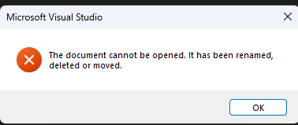
>
>it's most likely because `<RootNamespace>`, `<ProjectGuid>` and/or the `.cpp` filename weren't all updated. To resolve, unload the project, clicking "Don't save" on the pop-up. Then open the `.vcxproj` file, ensure SOLUTION_NAMESPACE_HERE, PROJECT_GUID_HERE, CPP_FILE_NAME_HERE have been replaced with your project information, and reload again.

Add in the code for `PushNotificationsQuickstart.cpp` below:

```cpp
#include <iostream>
#include <winrt/Microsoft.Windows.PushNotifications.h>
#include <winrt/Windows.Foundation.h>
#include <winrt/Microsoft.Windows.AppLifecycle.h>
#include <winrt/Windows.ApplicationModel.Background.h>
#include <wil/cppwinrt.h>
#include <wil/result.h>

using namespace winrt::Microsoft::Windows::PushNotifications;
using namespace winrt::Windows::Foundation;
using namespace winrt::Microsoft::Windows::AppLifecycle;

// To obtain an AAD RemoteIdentifier for your app,
// follow the instructions on https://learn.microsoft.com/azure/active-directory/develop/quickstart-register-app
winrt::guid remoteId{ "00000000-0000-0000-0000-000000000000" }; // Replace this with your own Azure ObjectId

winrt::Windows::Foundation::IAsyncOperation<PushNotificationChannel> RequestChannelAsync()
{
    auto channelOperation = PushNotificationManager::Default().CreateChannelAsync(remoteId);

    // Set up the in-progress event handler
    channelOperation.Progress(
        [](auto&& sender, auto&& args)
        {
            if (args.status == PushNotificationChannelStatus::InProgress)
            {
                // This is basically a noop since it isn't really an error state
                std::cout << "Channel request is in progress." << std::endl << std::endl;
            }
            else if (args.status == PushNotificationChannelStatus::InProgressRetry)
            {
                LOG_HR_MSG(
                    args.extendedError,
                    "The channel request is in back-off retry mode because of a retryable error! Expect delays in acquiring it. RetryCount = %d",
                    args.retryCount);
            }
        });

    auto result = co_await channelOperation;

    if (result.Status() == PushNotificationChannelStatus::CompletedSuccess)
    {
        auto channelUri = result.Channel().Uri();

        std::cout << "channelUri: " << winrt::to_string(channelUri.ToString()) << std::endl << std::endl;

        auto channelExpiry = result.Channel().ExpirationTime();

        // Caller's responsibility to keep the channel alive
        co_return result.Channel();
    }
    else if (result.Status() == PushNotificationChannelStatus::CompletedFailure)
    {
        LOG_HR_MSG(result.ExtendedError(), "We hit a critical non-retryable error with channel request!");
        co_return nullptr;
    }
    else
    {
        LOG_HR_MSG(result.ExtendedError(), "Some other failure occurred.");
        co_return nullptr;
    }

};

PushNotificationChannel RequestChannel()
{
    auto task = RequestChannelAsync();
    if (task.wait_for(std::chrono::seconds(300)) != AsyncStatus::Completed)
    {
        task.Cancel();
        return nullptr;
    }

    auto result = task.GetResults();
    return result;
}

void SubscribeForegroundEventHandler()
{
    winrt::event_token token{ PushNotificationManager::Default().PushReceived([](auto const&, PushNotificationReceivedEventArgs const& args)
    {
        auto payload{ args.Payload() };

        std::string payloadString(payload.begin(), payload.end());
        std::cout << "\nPush notification content received in the FOREGROUND: " << payloadString << std::endl;
    }) };

    std::cout << "Push notification foreground event handler registered." << std::endl;
}

int main()
{
    // Set up an event handler, so we can receive notifications in the foreground while the app is running.
    // You must register notification event handlers before calling Register(). Otherwise, the following runtime
    // exception will be thrown: System.Runtime.InteropServices.COMException: 'Element not found. Must register
    // event handlers before calling Register().'
    SubscribeForegroundEventHandler();

    // Register the app for push notifications.
    PushNotificationManager::Default().Register();

    auto args{ AppInstance::GetCurrent().GetActivatedEventArgs() };
    switch (args.Kind())
    {
    case ExtendedActivationKind::Launch:
    {
        std::cout << "App launched by user or from the debugger." << std::endl;
        if (PushNotificationManager::IsSupported())
        {
            std::cout << "Push notifications are supported on this device." << std::endl;

            // Request a WNS Channel URI which can be passed off to an external app to send notifications to.
            // The WNS Channel URI uniquely identifies this app for this user and device.
            PushNotificationChannel channel{ RequestChannel() };
            if (!channel)
            {
                std::cout << "\nThere was an error obtaining the WNS Channel URI" << std::endl;

                if (remoteId == winrt::guid{ "00000000-0000-0000-0000-000000000000" })
                {
                    std::cout << "\nThe ObjectID has not been set. Refer to the readme file accompanying this sample\nfor the instructions on how to obtain and setup an ObjectID" << std::endl;
                }
            }

            std::cout << "\nPress 'Enter' at any time to exit App." << std::endl;
            std::cin.ignore();
        }
        else
        {
            std::cout << "Push notifications are NOT supported on this device." << std::endl;
            std::cout << "App implements its own custom socket here to receive messages from the cloud since Push APIs are unsupported." << std::endl;
            std::cin.ignore();
        }
    }
    break;

    case ExtendedActivationKind::Push:
    {
        std::cout << "App activated via push notification." << std::endl;
        PushNotificationReceivedEventArgs pushArgs{ args.Data().as<PushNotificationReceivedEventArgs>() };

        // Call GetDeferral to ensure that code runs in low power
        auto deferral{ pushArgs.GetDeferral() };

        auto payload{ pushArgs.Payload() };

        // Do stuff to process the raw notification payload
        std::string payloadString(payload.begin(), payload.end());
        std::cout << "\nPush notification content received in the BACKGROUND: " << payloadString.c_str() << std::endl;
        std::cout << "\nPress 'Enter' to exit the App." << std::endl;

        // Call Complete on the deferral when finished processing the payload.
        // This removes the override that kept the app running even when the system was in a low power mode.

        deferral.Complete();
        std::cin.ignore();
    }
    break;

    default:
        std::cout << "\nUnexpected activation type" << std::endl;
        std::cout << "\nPress 'Enter' to exit the App." << std::endl;
        std::cin.ignore();
        break;
    }
}
```

In your `.cpp` file, you'll see the following `remoteId` variable towards the top:

```cpp
// To obtain an AAD RemoteIdentifier for your app,
// follow the instructions on https://learn.microsoft.com/azure/active-directory/develop/quickstart-register-app
winrt::guid remoteId{ "00000000-0000-0000-0000-000000000000" }; // Replace this with your own Azure ObjectId
```

Replace this remote ID with your Azure ObjectId.

Finally, we need to load in the packages we reference in `packages.config`. To do this, right click on the solution and select **Restore NuGet packages**.

Use Visual Studio to build and install your app. Right click on the solution file in the Solution Explorer and select **Deploy**. Visual Studio will build your app and install it on your machine. You can run the app by launching it via the Start Menu or the Visual Studio debugger. You should see a console window that looks like this:

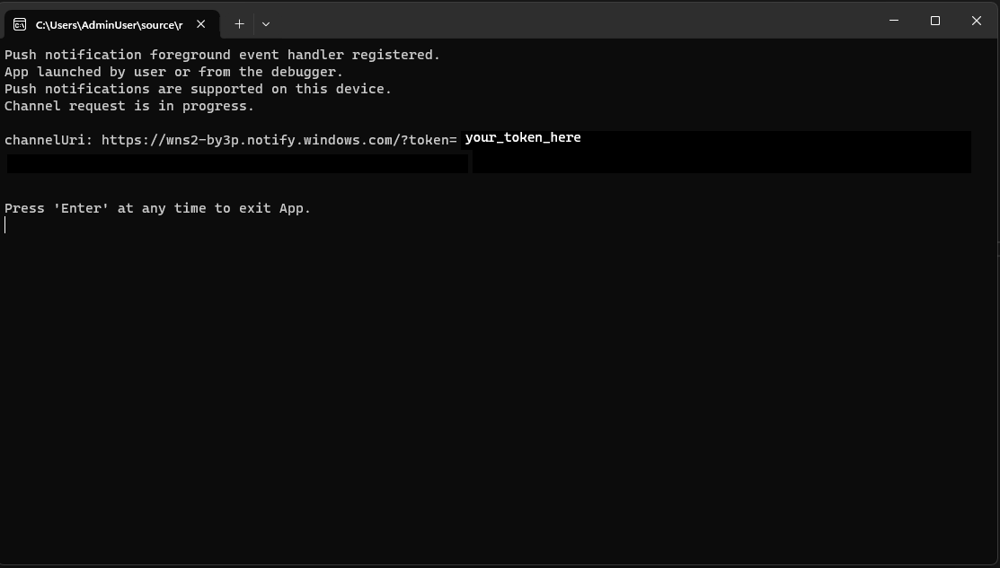

To send notifications to your app, see [Send a push notification to your app](#send-a-push-notification-to-your-app).

## Configure an existing app to receive push notifications

### Before you start

To get the most out of this guide, you'll want to know the following about your app:
* The *language* you're using (C++ or C#). This tutorial focuses on C++.
* The *package type* for your app (packaged, unpackaged, packaged with external location, sparse packaged). This example uses an unpackaged app.

>[!IMPORTANT]
> C# and packaged app examples are available on the [Windows App SDK Samples repository](https://github.com/microsoft/WindowsAppSDK-Samples). Make sure to check out [the branch with your preferred version of the Windows App SDK](https://github.com/microsoft/WindowsAppSDK-Samples/branches) for the guide that best matches your project.

### Step 1: Add Windows App SDK (if it's not already installed)

If this is your first time adding Windows App SDK, you can add it by right clicking the solution, selecting **Manage NuGet packages** and searching for "Windows App SDK". In order to generate and use the Push Notification header files, you'll need to install:
* Microsoft.WindowsAppSDK (this tutorial uses 1.5.240227000)
* Microsoft.Windows.SDK.BuildTools (this tutorial uses 10.0.22621.756) - it sometimes installs with Windows App SDK
* Microsoft.Windows.CppWinRT (this tutorial uses 2.0.240405.15) - this library allows you to use the modern Windows APIs in C++ by projecting Windows Runtime (WinRT) APIs into C++ code and generates the header files we need.

> [!NOTE] 
> If this is the first time you are using Windows App SDK in your project and it is packaged with external location or unpackaged, make sure the Windows App SDK is initialized either with auto-initialization (set the project property `<WindowsPackageType>None</WindowsPackageType>` in the `.vcxproj` file) or use the bootstrapper API.
>
> Otherwise, the app will throw `System.Runtime.InteropServices.COMException (0x80040154): Class not registered (0x80040154 (REGDB_E_CLASSNOTREG))` and will not run.
>
>See [Use the Windows App SDK runtime for apps packaged with external location or unpackaged](/windows/apps/windows-app-sdk/use-windows-app-sdk-run-time) for more details.

### Step 2: Add namespaces

Next, add the namespace for Windows App SDK push notifications `Microsoft.Windows.PushNotifications`.

```cpp
#include <winrt/Microsoft.Windows.PushNotifications.h>

using namespace winrt::Microsoft::Windows::PushNotifications;
```

If you get a "Can't find Microsoft.Windows.PushNotifications" error, that likely means the header files haven't been generated. Build the app without the namespaces first (keep the includes without an error), then trying adding them in again.

### Step 2: Add your COM activator to your app's manifest

> [!IMPORTANT]
> If your app is unpackaged (that is, it lacks package identity at runtime), then skip to **Step 3: Register for and respond to push notifications on app startup**.

If your app is packaged (including packaged with external location):
Open your **Package.appxmanifest**. Add the following inside the `<Application>` element. Replace the `Id`, `Executable`, and `DisplayName` values with those specific to your app.


```xaml
<!--Packaged apps only-->
<!--package.appxmanifest-->

<Package
  ...
  xmlns:com="http://schemas.microsoft.com/appx/manifest/com/windows10"
  ...
  <Applications>
    <Application>
      ...
      <Extensions>

        <!--Register COM activator-->    
        <com:Extension Category="windows.comServer">
          <com:ComServer>
              <com:ExeServer Executable="SampleApp\SampleApp.exe" DisplayName="SampleApp" Arguments="----WindowsAppRuntimePushServer:">
                <com:Class Id="[Your app's Azure AppId]" DisplayName="Windows App SDK Push" />
            </com:ExeServer>
          </com:ComServer>
        </com:Extension>
    
      </Extensions>
    </Application>
  </Applications>
 </Package>    
```

### Step 3: Register for and respond to push notifications on app startup

Update your app's `main()` method to add the following:

1. Register your app to receive push notifications by calling [PushNotificationManager::Default().Register()](/windows/windows-app-sdk/api/winrt/microsoft.windows.pushnotifications.pushnotificationmanager.register).
1. Check the source of the activation request by calling [AppInstance::GetCurrent().GetActivatedEventArgs()](). If the activation was triggered from a push notification, respond based on the notification's payload.

> [!IMPORTANT]
> You must call **PushNotificationManager::Default().Register** before calling [AppInstance.GetCurrent.GetActivatedEventArgs](/windows/windows-app-sdk/api/winrt/microsoft.windows.applifecycle.appinstance.getactivatedeventargs).

At this point, the code should look like this:
```cpp
#include <iostream>
#include <winrt/Microsoft.Windows.PushNotifications.h>
#include <winrt/Windows.Foundation.h>
#include <winrt/Microsoft.Windows.AppLifecycle.h>

using namespace winrt::Microsoft::Windows::PushNotifications;
using namespace winrt::Windows::Foundation;
using namespace winrt::Microsoft::Windows::AppLifecycle;

int main()
{
    // Register the app for push notifications.
    PushNotificationManager::Default().Register();

    auto args{ AppInstance::GetCurrent().GetActivatedEventArgs() };
    switch (args.Kind())
    {
    case ExtendedActivationKind::Launch:
        std::cout << "App launched by user or from the debugger." << std::endl;
        break;
    case ExtendedActivationKind::Push:
        std::cout << "App activated via push notification." << std::endl;
        break;
    default:
        std::cout << "\nUnexpected activation type" << std::endl;
        std::cout << "\nPress 'Enter' to exit the App." << std::endl;
        std::cin.ignore();
        break;
    }
}

```

#### Adding foreground event handlers

To handle an event in the foreground, register a handler for [PushNotificationManager.PushReceived](/windows/windows-app-sdk/api/winrt/microsoft.windows.pushnotifications.pushnotificationmanager.pushreceived).

>[!IMPORTANT]
> You also must register any [PushNotificationManager.PushReceived](/windows/windows-app-sdk/api/winrt/microsoft.windows.pushnotifications.pushnotificationmanager.pushreceived) event handlers before calling PushNotificationManager.Register(). Otherwise, the following runtime exception will be thrown:
> ```
> System.Runtime.InteropServices.COMException: Element not found. Must register event handlers before calling Register().
> ```

Here's the updated event handler with the foreground handler:

```cpp
#include <iostream>
#include <winrt/Microsoft.Windows.PushNotifications.h>
#include <winrt/Windows.Foundation.h>
#include <winrt/Microsoft.Windows.AppLifecycle.h>

using namespace winrt::Microsoft::Windows::PushNotifications;
using namespace winrt::Windows::Foundation;
using namespace winrt::Microsoft::Windows::AppLifecycle;

void SubscribeForegroundEventHandler()
{
    winrt::event_token token{ PushNotificationManager::Default().PushReceived([](auto const&, PushNotificationReceivedEventArgs const& args)
    {
        auto payload{ args.Payload() };

        std::string payloadString(payload.begin(), payload.end());
        std::cout << "\nPush notification content received in the FOREGROUND: " << payloadString << std::endl;
    }) };

    std::cout << "Push notification foreground event handler registered." << std::endl;
}

int main()
{
    // Set up an event handler, so we can receive notifications in the foreground while the app is running.
    // You must register notification event handlers before calling Register(). Otherwise, a runtime exception
    // will be thrown.
    SubscribeForegroundEventHandler();

    // Register the app for push notifications.
    PushNotificationManager::Default().Register();

    auto args{ AppInstance::GetCurrent().GetActivatedEventArgs() };
    switch (args.Kind())
    {
    case ExtendedActivationKind::Launch:
        std::cout << "App launched by user or from the debugger." << std::endl;
        break;
    case ExtendedActivationKind::Push:
        std::cout << "App activated via push notification." << std::endl;
        break;
    default:
        std::cout << "\nUnexpected activation type" << std::endl;
        std::cout << "\nPress 'Enter' to exit the App." << std::endl;
        std::cin.ignore();
        break;
    }
}

```

#### Add the PushNotificationManager::IsSupported() check

Next, add a check if the PushNotification APIs are supported with [PushNotificationManager.IsSupported()](/windows/windows-app-sdk/api/winrt/microsoft.windows.pushnotifications.pushnotificationmanager.issupported). If not, we recommend that you use polling or your own custom socket implementation.

```cpp
#include <iostream>
#include <winrt/Microsoft.Windows.PushNotifications.h>
#include <winrt/Windows.Foundation.h>
#include <winrt/Microsoft.Windows.AppLifecycle.h>

using namespace winrt::Microsoft::Windows::PushNotifications;
using namespace winrt::Windows::Foundation;
using namespace winrt::Microsoft::Windows::AppLifecycle;

void SubscribeForegroundEventHandler()
{
    winrt::event_token token{ PushNotificationManager::Default().PushReceived([](auto const&, PushNotificationReceivedEventArgs const& args)
    {
        auto payload{ args.Payload() };

        std::string payloadString(payload.begin(), payload.end());
        std::cout << "\nPush notification content received in the FOREGROUND: " << payloadString << std::endl;
    }) };

    std::cout << "Push notification foreground event handler registered." << std::endl;
}

int main()
{
    // Set up an event handler, so we can receive notifications in the foreground while the app is running.
    // You must register notification event handlers before calling Register(). Otherwise, a runtime exception
    // will be thrown.
    SubscribeForegroundEventHandler();

    // Register the app for push notifications.
    PushNotificationManager::Default().Register();

    auto args{ AppInstance::GetCurrent().GetActivatedEventArgs() };
    switch (args.Kind())
    {
        case ExtendedActivationKind::Launch:
        {
            std::cout << "App launched by user or from the debugger." << std::endl;
            if (PushNotificationManager::IsSupported())
            {
                std::cout << "Push notifications are supported on this device." << std::endl;

                std::cout << "\nPress 'Enter' at any time to exit App." << std::endl;
                std::cin.ignore();
            }
            else
            {
                std::cout << "Push notifications are NOT supported on this device." << std::endl;
                std::cout << "App implements its own custom socket here to receive messages from the cloud since Push APIs are unsupported." << std::endl;
                std::cin.ignore();
            }
        }
        break;

        case ExtendedActivationKind::Push:
            std::cout << "App activated via push notification." << std::endl;
            break;

        default:
            std::cout << "\nUnexpected activation type" << std::endl;
            std::cout << "\nPress 'Enter' to exit the App." << std::endl;
            std::cin.ignore();
            break;
    }
}

```

Now that there's confirmed push notifcation support, add in behavior based on [PushNotificationReceivedEventArgs](/windows/windows-app-sdk/api/winrt/microsoft.windows.pushnotifications.pushnotificationreceivedeventargs):

```cpp
#include <iostream>
#include <winrt/Microsoft.Windows.PushNotifications.h>
#include <winrt/Windows.Foundation.h>
#include <winrt/Microsoft.Windows.AppLifecycle.h>
#include <winrt/Windows.ApplicationModel.Background.h>

using namespace winrt::Microsoft::Windows::PushNotifications;
using namespace winrt::Windows::Foundation;
using namespace winrt::Microsoft::Windows::AppLifecycle;

void SubscribeForegroundEventHandler()
{
    winrt::event_token token{ PushNotificationManager::Default().PushReceived([](auto const&, PushNotificationReceivedEventArgs const& args)
    {
        auto payload{ args.Payload() };

        std::string payloadString(payload.begin(), payload.end());
        std::cout << "\nPush notification content received in the FOREGROUND: " << payloadString << std::endl;
    }) };

    std::cout << "Push notification foreground event handler registered." << std::endl;
}

int main()
{
    // Set up an event handler, so we can receive notifications in the foreground while the app is running.
    // You must register notification event handlers before calling Register(). Otherwise, a runtime exception
    // will be thrown.
    SubscribeForegroundEventHandler();

    // Register the app for push notifications.
    PushNotificationManager::Default().Register();

    auto args{ AppInstance::GetCurrent().GetActivatedEventArgs() };
    switch (args.Kind())
    {
        case ExtendedActivationKind::Launch:
        {
            std::cout << "App launched by user or from the debugger." << std::endl;
            if (PushNotificationManager::IsSupported())
            {
                std::cout << "Push notifications are supported on this device." << std::endl;

                std::cout << "\nPress 'Enter' at any time to exit App." << std::endl;
                std::cin.ignore();
            }
            else
            {
                std::cout << "Push notifications are NOT supported on this device." << std::endl;
                std::cout << "App implements its own custom socket here to receive messages from the cloud since Push APIs are unsupported." << std::endl;
                std::cin.ignore();
            }
        }
        break;

        case ExtendedActivationKind::Push:
        {
            std::cout << "App activated via push notification." << std::endl;
            PushNotificationReceivedEventArgs pushArgs{ args.Data().as<PushNotificationReceivedEventArgs>() };

            // Call GetDeferral to ensure that code runs in low power
            auto deferral{ pushArgs.GetDeferral() };

            auto payload{ pushArgs.Payload() };

            // Do stuff to process the raw notification payload
            std::string payloadString(payload.begin(), payload.end());
            std::cout << "\nPush notification content received in the BACKGROUND: " << payloadString.c_str() << std::endl;
            std::cout << "\nPress 'Enter' to exit the App." << std::endl;

            // Call Complete on the deferral when finished processing the payload.
            // This removes the override that kept the app running even when the system was in a low power mode.

            deferral.Complete();
            std::cin.ignore();
        }
        break;

        default:
            std::cout << "\nUnexpected activation type" << std::endl;
            std::cout << "\nPress 'Enter' to exit the App." << std::endl;
            std::cin.ignore();
            break;
    }
}

```

### Step 4: Request a WNS Channel URI and register it with the WNS server

WNS Channel URIs are the HTTP endpoints for sending push notifications. Each client must request a Channel URI and register it with the WNS server to receive push notifications.

> [!NOTE]
> WNS Channel URIs expire after 30 days.

```cpp
auto channelOperation{ PushNotificationManager::Default().CreateChannelAsync(winrt::guid("[Your app's Azure ObjectID]")) };
```

If you're following the tutorial code, add your Azure Object ID here:
```cpp
// To obtain an AAD RemoteIdentifier for your app,
// follow the instructions on https://learn.microsoft.com/azure/active-directory/develop/quickstart-register-app
winrt::guid remoteId{ "00000000-0000-0000-0000-000000000000" }; // Replace this with your own Azure ObjectId
```

The **PushNotificationManager** will attempt to create a Channel URI, retrying automatically for no more than 15 minutes. Create an event handler to wait for the call to complete. Once the call is complete, if it was successful, register the URI with the WNS  server.

> [!NOTE]
> To use LOG_HR_MSG included in the following code chunks, use Package Manager to import `Microsoft.Windows.ImplementationLibrary`, version 1.0.220914.1.

```cpp
// cpp-console.cpp
// This snippet only includes the channel request code. See the working sample in the next snippet for a more complete example.

winrt::Windows::Foundation::IAsyncOperation<PushNotificationChannel> RequestChannelAsync()
{
    // To obtain an AAD RemoteIdentifier for your app,
    // follow the instructions on https://learn.microsoft.com/azure/active-directory/develop/quickstart-register-app
    auto channelOperation = PushNotificationManager::Default().CreateChannelAsync(remoteId);

    // Setup the inprogress event handler
    channelOperation.Progress(
        [](auto&& sender, auto&& args)
        {
            if (args.status == PushNotificationChannelStatus::InProgress)
            {
                // This is basically a noop since it isn't really an error state
                std::cout << "Channel request is in progress." << std::endl << std::endl;
            }
            else if (args.status == PushNotificationChannelStatus::InProgressRetry)
            {
                LOG_HR_MSG(
                    args.extendedError,
                    "The channel request is in back-off retry mode because of a retryable error! Expect delays in acquiring it. RetryCount = %d",
                    args.retryCount);
            }
        });

    auto result = co_await channelOperation;

    if (result.Status() == PushNotificationChannelStatus::CompletedSuccess)
    {
        auto channelUri = result.Channel().Uri();

        std::cout << "channelUri: " << winrt::to_string(channelUri.ToString()) << std::endl << std::endl;

        auto channelExpiry = result.Channel().ExpirationTime();

        // Caller's responsibility to keep the channel alive
        co_return result.Channel();
    }
    else if (result.Status() == PushNotificationChannelStatus::CompletedFailure)
    {
        LOG_HR_MSG(result.ExtendedError(), "We hit a critical non-retryable error with channel request!");
        co_return nullptr;
    }
    else
    {
        LOG_HR_MSG(result.ExtendedError(), "Some other failure occurred.");
        co_return nullptr;
    }

};

PushNotificationChannel RequestChannel()
{
    auto task = RequestChannelAsync();
    if (task.wait_for(std::chrono::seconds(300)) != AsyncStatus::Completed)
    {
        task.Cancel();
        return nullptr;
    }

    auto result = task.GetResults();
    return result;
}

```

Here's the sample so far with the channel request code added in:

```cpp
#include <iostream>
#include <winrt/Microsoft.Windows.PushNotifications.h>
#include <winrt/Windows.Foundation.h>
#include <winrt/Microsoft.Windows.AppLifecycle.h>
#include <winrt/Windows.ApplicationModel.Background.h>
#include <wil/cppwinrt.h>
#include <wil/result.h>

using namespace winrt::Microsoft::Windows::PushNotifications;
using namespace winrt::Windows::Foundation;
using namespace winrt::Microsoft::Windows::AppLifecycle;

// To obtain an AAD RemoteIdentifier for your app,
// follow the instructions on https://learn.microsoft.com/azure/active-directory/develop/quickstart-register-app
winrt::guid remoteId{ "00000000-0000-0000-0000-000000000000" }; // Replace this with your own Azure ObjectId

winrt::Windows::Foundation::IAsyncOperation<PushNotificationChannel> RequestChannelAsync()
{
    auto channelOperation = PushNotificationManager::Default().CreateChannelAsync(remoteId);

    // Set up the in-progress event handler
    channelOperation.Progress(
        [](auto&& sender, auto&& args)
        {
            if (args.status == PushNotificationChannelStatus::InProgress)
            {
                // This is basically a noop since it isn't really an error state
                std::cout << "Channel request is in progress." << std::endl << std::endl;
            }
            else if (args.status == PushNotificationChannelStatus::InProgressRetry)
            {
                LOG_HR_MSG(
                    args.extendedError,
                    "The channel request is in back-off retry mode because of a retryable error! Expect delays in acquiring it. RetryCount = %d",
                    args.retryCount);
            }
        });

    auto result = co_await channelOperation;

    if (result.Status() == PushNotificationChannelStatus::CompletedSuccess)
    {
        auto channelUri = result.Channel().Uri();

        std::cout << "channelUri: " << winrt::to_string(channelUri.ToString()) << std::endl << std::endl;

        auto channelExpiry = result.Channel().ExpirationTime();

        // Caller's responsibility to keep the channel alive
        co_return result.Channel();
    }
    else if (result.Status() == PushNotificationChannelStatus::CompletedFailure)
    {
        LOG_HR_MSG(result.ExtendedError(), "We hit a critical non-retryable error with channel request!");
        co_return nullptr;
    }
    else
    {
        LOG_HR_MSG(result.ExtendedError(), "Some other failure occurred.");
        co_return nullptr;
    }

};

PushNotificationChannel RequestChannel()
{
    auto task = RequestChannelAsync();
    if (task.wait_for(std::chrono::seconds(300)) != AsyncStatus::Completed)
    {
        task.Cancel();
        return nullptr;
    }

    auto result = task.GetResults();
    return result;
}

void SubscribeForegroundEventHandler()
{
    winrt::event_token token{ PushNotificationManager::Default().PushReceived([](auto const&, PushNotificationReceivedEventArgs const& args)
    {
        auto payload{ args.Payload() };

        std::string payloadString(payload.begin(), payload.end());
        std::cout << "\nPush notification content received in the FOREGROUND: " << payloadString << std::endl;
    }) };

    std::cout << "Push notification foreground event handler registered." << std::endl;
}

int main()
{
    // Set up an event handler, so we can receive notifications in the foreground while the app is running.
    // You must register notification event handlers before calling Register(). Otherwise, the following runtime
    // exception will be thrown: System.Runtime.InteropServices.COMException: 'Element not found. Must register
    // event handlers before calling Register().'
    SubscribeForegroundEventHandler();

    // Register the app for push notifications.
    PushNotificationManager::Default().Register();

    auto args{ AppInstance::GetCurrent().GetActivatedEventArgs() };
    switch (args.Kind())
    {
        case ExtendedActivationKind::Launch:
        {
            std::cout << "App launched by user or from the debugger." << std::endl;
            if (PushNotificationManager::IsSupported())
            {
                std::cout << "Push notifications are supported on this device." << std::endl;

                // Request a WNS Channel URI which can be passed off to an external app to send notifications to.
                // The WNS Channel URI uniquely identifies this app for this user and device.
                PushNotificationChannel channel{ RequestChannel() };
                if (!channel)
                {
                    std::cout << "\nThere was an error obtaining the WNS Channel URI" << std::endl;

                    if (remoteId == winrt::guid{ "00000000-0000-0000-0000-000000000000" })
                    {
                        std::cout << "\nThe ObjectID has not been set. Refer to the readme file accompanying this sample\nfor the instructions on how to obtain and setup an ObjectID" << std::endl;
                    }
                }

                std::cout << "\nPress 'Enter' at any time to exit App." << std::endl;
                std::cin.ignore();
            }
            else
            {
                std::cout << "Push notifications are NOT supported on this device." << std::endl;
                std::cout << "App implements its own custom socket here to receive messages from the cloud since Push APIs are unsupported." << std::endl;
                std::cin.ignore();
            }
        }
        break;

        case ExtendedActivationKind::Push:
        {
            std::cout << "App activated via push notification." << std::endl;
            PushNotificationReceivedEventArgs pushArgs{ args.Data().as<PushNotificationReceivedEventArgs>() };

            // Call GetDeferral to ensure that code runs in low power
            auto deferral{ pushArgs.GetDeferral() };

            auto payload{ pushArgs.Payload() };

            // Do stuff to process the raw notification payload
            std::string payloadString(payload.begin(), payload.end());
            std::cout << "\nPush notification content received in the BACKGROUND: " << payloadString.c_str() << std::endl;
            std::cout << "\nPress 'Enter' to exit the App." << std::endl;

            // Call Complete on the deferral when finished processing the payload.
            // This removes the override that kept the app running even when the system was in a low power mode.

            deferral.Complete();
            std::cin.ignore();
        }
        break;

        default:
            std::cout << "\nUnexpected activation type" << std::endl;
            std::cout << "\nPress 'Enter' to exit the App." << std::endl;
            std::cin.ignore();
            break;
    }
}

```

### Step 5: Build and install your app

Use Visual Studio to build and install your app. Right click on the solution file in the Solution Explorer and select **Deploy**. Visual Studio will build your app and install it on your machine. You can run the app by launching it via the Start Menu or the Visual Studio debugger.

The tutorial code's console will look like this:
. You'll need the token to [send a push notification to your app](#send-a-push-notification-to-your-app).

## Send a push notification to your app

At this point, all configuration is complete and the WNS server can send push notifications to client apps. In the following steps, refer to the [Push notification server request and response headers](push-request-response-headers.md) for more detail.

### Step 1: Request an access token

To send a push notification, the WNS server first needs to request an access token. Send an HTTP POST request with your Azure TenantId, Azure AppId, and secret. For information on retrieving the Azure TenantId and Azure AppId, see [Get tenant and app ID values for signing in](/azure/active-directory/develop/howto-create-service-principal-portal#get-tenant-and-app-id-values-for-signing-in).

HTTP Sample Request:

```HTTP
POST /{tenantID}/oauth2/v2.0/token Http/1.1
Host: login.microsoftonline.com
Content-Type: application/x-www-form-urlencoded
Content-Length: 160

grant_type=client_credentials&client_id=<Azure_App_Registration_AppId_Here>&client_secret=<Azure_App_Registration_Secret_Here>&scope=https://wns.windows.com/.default/
```

C# Sample Request:

```csharp
//Sample C# Access token request
var client = new RestClient("https://login.microsoftonline.com/{tenantID}/oauth2/v2.0");
var request = new RestRequest("/token", Method.Post);
request.AddHeader("Content-Type", "application/x-www-form-urlencoded");
request.AddParameter("grant_type", "client_credentials");
request.AddParameter("client_id", "[Your app's Azure AppId]");
request.AddParameter("client_secret", "[Your app's secret]");
request.AddParameter("scope", "https://wns.windows.com/.default");
RestResponse response = await client.ExecutePostAsync(request);
Console.WriteLine(response.Content);
```

If your request is successful, you will receive a response that contains your token in the **access_token** field.

```json
{
    "token_type":"Bearer",
    "expires_in":"86399",
    "ext_expires_in":"86399",
    "expires_on":"1653771789",
    "not_before":"1653685089",
    "access_token":"[your access token]"
}
```

### Step 2. Send a raw notification

Create an HTTP POST request that contains the access token you obtained in the previous step and the content of the push notification you want to send. The content of the push notification will be delivered to the app.

```http
POST /?token=[The token query string parameter from your channel URL. E.g. AwYAAABa5cJ3...] HTTP/1.1
Host: dm3p.notify.windows.com
Content-Type: application/octet-stream
X-WNS-Type: wns/raw
Authorization: Bearer [your access token]
Content-Length: 46

{ Sync: "Hello from the Contoso App Service" }
```

```csharp
var client = new RestClient("[Your channel URL. E.g. https://wns2-by3p.notify.windows.com/?token=AwYAAABa5cJ3...]");
var request = new RestRequest();
request.Method = Method.Post; 
request.AddHeader("Content-Type", "application/octet-stream");
request.AddHeader("X-WNS-Type", "wns/raw");
request.AddHeader("Authorization", "Bearer [your access token]");
request.AddBody("Notification body");
RestResponse response = await client.ExecutePostAsync(request);");
```

### Step 3: Send a cloud-sourced app notification

If you are only interested in sending raw notifications, disregard this step. To send a cloud-sourced app notification, also known a push toast notification, first follow [Quickstart: App notifications in the Windows App SDK](../../../windows-app-sdk/notifications/app-notifications/app-notifications-quickstart.md). App notifications can either be push (sent from the cloud) or sent locally. Sending a cloud-sourced app notification is similar to sending a raw notification in **Step 2**, except the *X-WNS-Type* header is `toast`, *Content-Type* is `text/xml`, and the content contains the app notification XML payload. See [Notifications XML schema](/uwp/schemas/tiles/toastschema/schema-root) for more on how to construct your XML payload.

Create an HTTP POST request that contains your access token and the content of the cloud-sourced app notification you want to send. The content of the push notification will be delivered to the app.

```http
POST /?token=AwYAAAB%2fQAhYEiAESPobjHzQcwGCTjHu%2f%2fP3CCNDcyfyvgbK5xD3kztniW%2bjba1b3aSSun58SA326GMxuzZooJYwtpgzL9AusPDES2alyQ8CHvW94cO5VuxxLDVzrSzdO1ZVgm%2bNSB9BAzOASvHqkMHQhsDy HTTP/1.1
Host: dm3p.notify.windows.com
Content-Type: text/xml
X-WNS-Type: wns/toast
Authorization: Bearer [your access token]
Content-Length: 180

<toast><visual><binding template="ToastGeneric"><text>Example cloud toast notification</text><text>This is an example cloud notification using XML</text></binding></visual></toast>
```

```csharp
var client = new RestClient("https://dm3p.notify.windows.com/?token=AwYAAAB%2fQAhYEiAESPobjHzQcwGCTjHu%2f%2fP3CCNDcyfyvgbK5xD3kztniW%2bjba1b3aSSun58SA326GMxuzZooJYwtpgzL9AusPDES2alyQ8CHvW94cO5VuxxLDVzrSzdO1ZVgm%2bNSB9BAzOASvHqkMHQhsDy");
client.Timeout = -1;

var request = new RestRequest(Method.POST);
request.AddHeader("Content-Type", "text/xml");
request.AddHeader("X-WNS-Type", "wns/toast");
request.AddHeader("Authorization", "Bearer <AccessToken>");
request.AddParameter("text/xml", "<toast><visual><binding template=\"ToastGeneric\"><text>Example cloud toast notification</text><text>This is an example cloud notification using XML</text></binding></visual></toast>",  ParameterType.RequestBody);
Console.WriteLine(response.Content);
```

## Resources

- [Windows Push Notification Service (WNS)](https://aka.ms/wns)
- [Push notifications sample code on GitHub](https://github.com/microsoft/WindowsAppSDK-Samples/tree/main/Samples/Notifications/Push/)
- [Microsoft.Windows.PushNotifications API details](https://github.com/microsoft/WindowsAppSDK/blob/main/specs/PushNotifications/PushNotifications-spec.md#api-details)
- [Push notifications spec on GitHub](https://github.com/microsoft/WindowsAppSDK/blob/main/specs/PushNotifications/PushNotifications-spec.md)
- [Toast content](../app-notifications/adaptive-interactive-toasts.md)
- [Notifications XML schema](/uwp/schemas/tiles/toastschema/schema-root)
