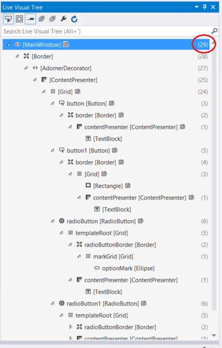

# Best practices for your WinUI app's startup performance

Create WinUI apps with Windows App SDK that start quickly by reducing startup work, simplifying the first frame, and loading non-critical features after the window is interactive.

## Best practices for your app's startup performance

In part, users perceive whether your app is fast or slow based on how long it takes to start up. For the purposes of this topic, an app's startup time begins when the user starts the app and ends when the user can interact with the app in a meaningful way. This article provides suggestions on how to get better startup performance out of a WinUI app.

### Measuring your app's startup time

Be sure to start your app a few times before you actually measure its startup time. This gives you a baseline for your measurement and helps ensure that you're measuring as reasonably short a startup time as possible.

Take measurements that are representative of what the end user will experience. Measure Release builds on representative hardware, look at both cold and warm startup, and focus on the time to the first interactive frame rather than only the time until the process exists.

### Defer work as long as possible

To improve your app's startup time, do only the work that absolutely needs to be done to let the user start interacting with the app. This can be especially beneficial if you can delay loading additional assemblies. The common language runtime loads an assembly the first time it is used. If you can minimize the number of assemblies that are loaded, you might be able to improve your app's startup time and its memory consumption.

### Do long-running work independently

Your app can be interactive even though there are parts of the app that aren't fully functional. For example, if your app displays data that takes a while to retrieve, you can make that code execute independently of the app's startup code by retrieving the data asynchronously. When the data is available, populate the app's user interface with the data.

Many of the APIs that retrieve data are asynchronous, so you will probably be retrieving data asynchronously anyway. For more info, see [Asynchronous programming with async and await](/dotnet/csharp/asynchronous-programming/). If you do work that doesn't use asynchronous APIs, you can use the `Task` class to do long-running work so that you don't block the user from interacting with the app. This keeps your app responsive while the data loads.

If your app takes an especially long time to load part of its UI, consider showing a message in that area such as "Getting latest data" so that your users know that the app is still processing.

## Minimize startup time

All but the simplest apps require a perceivable amount of time to load resources, parse XAML, set up data structures, and run logic during launch. For WinUI apps, it helps to think about startup in four stages: process launch, window creation, main page creation, and layout/render for the first frame.

The startup period is the time between the moment a user starts the app and the moment the app becomes functional. This is a critical time because it's a user's first impression of your app. Users expect instant and continuous feedback from the system and from apps. The system and the app are perceived to be broken or poorly designed when apps don't start quickly.

### Introduction to the stages of startup

Startup involves a number of moving pieces, and all of them need to be coordinated for the best user experience. The following steps occur between the user launching your app and the application content being shown.

- The process launches and template-generated startup code calls `Main`.
- The `Application` object is created.
  - The app constructor calls `InitializeComponent`, which causes `App.xaml` to be parsed and objects to be created.
- [**Application.OnLaunched**](/windows/windows-app-sdk/api/winrt/microsoft.ui.xaml.application.onlaunched) is raised.
  - App code creates the main window, assigns the initial content, and calls `Activate`.
  - The main page constructor calls `InitializeComponent`, which causes the page XAML to be parsed and objects to be created.
- The XAML framework runs the layout pass, including measure and arrange.
  - `ApplyTemplate` causes control template content to be created for each control, which is typically the bulk of layout time during startup.
- Render creates visuals for the window contents.
- The first frame is presented, and post-startup work continues asynchronously.

### Do less in your startup path

Keep your startup code path free from anything that is not needed for your first frame.

- If you have user DLLs containing controls that are not needed during the first frame, consider delay-loading them.
- If you have a portion of your UI that depends on data from the cloud, split that UI. First, bring up the UI that is not dependent on cloud data, and then asynchronously bring up the cloud-dependent UI. You should also consider caching data locally so that the application can work offline or not be affected by slow network connectivity.
- Show progress UI if your UI is waiting for data.
- Be cautious of app designs that involve a lot of parsing of configuration files, or UI that is dynamically generated by code.

### Reduce element count

Startup performance in a XAML app is directly correlated to the number of elements you create during startup. The fewer elements you create, the less time your app will take to start up. As a rough benchmark, consider each element to take 1 ms to create.

- Templates used in items controls can have the biggest impact, as they are repeated multiple times. See [ListView and GridView UI optimization](/windows/uwp/debug-test-perf/optimize-gridview-and-listview).
- UserControls and control templates are expanded, so those should also be taken into account.
- If you create any XAML that does not appear on the screen, then you should justify whether those pieces of XAML should be created during startup.

The Visual Studio Live Visual Tree window shows the child element counts for each node in the tree.



**Use deferral**. Collapsing an element, or setting its opacity to 0, doesn't prevent the element from being created. Using `x:Load` or `x:DeferLoadStrategy`, you can delay the loading of a piece of UI and load it when needed. This is a good way to delay processing UI that isn't visible during startup so that you can load it when needed or as part of a set of delayed logic. To trigger the loading, you need only call `FindName` for the element. For an example and more information, see [x:Load attribute](../platform/xaml/x-load-attribute.md) and [x:DeferLoadStrategy attribute](../platform/xaml/x-deferloadstrategy-attribute.md).

**Virtualization**. If you have list or repeater content in your UI, then it's highly advised that you use UI virtualization. If list UI isn't virtualized, then you are paying the cost of creating all the elements up front, and that can slow down your startup. See [ListView and GridView UI optimization](/windows/uwp/debug-test-perf/optimize-gridview-and-listview).

Application performance is not only about raw performance; it's also about perception. Changing the order of operations so that visual aspects occur first commonly makes the user feel like the application is faster. Users consider the application loaded when content is on the screen. Applications commonly need to do multiple things during startup, and not all of that work is required to bring up the UI, so those pieces should be delayed or prioritized lower than the UI.

This article talks about the *first frame*, which comes from animation and video terminology and is a measure of how long it takes until content is seen by the end user.

### Improve startup perception

Let's use the example of a simple online game to identify each phase of startup and different techniques to give the user feedback throughout the process.

In the first phase, the process launches and the app creates its window. During this time, the user has not yet seen the app's own content. Your goal is to get a lightweight window on screen quickly.

The second phase encompasses creating and initializing the structures that are critical for the game. If the app can quickly create its initial UI with the data available at launch, then this phase is trivial and you can display the UI immediately. Otherwise, display a lightweight loading page while the app initializes.

What the loading page looks like is up to you; it can be as simple as displaying a progress bar or progress ring. The key point is that the app indicates that it is performing work before it becomes fully responsive. In the case of the game, the initial screen requires that some images and sounds be loaded from disk into memory. These tasks take time, so the app keeps the user informed by showing a loading page with a simple animation related to the theme of the game.

The third stage begins after the game has a minimal set of information to create an interactive UI, which replaces the loading page. At this point, the only information available to the online game may be the content that the app loaded from disk. The game can ship with enough content to create an interactive UI, but because it's an online game it won't be fully functional until it connects to the internet and downloads some additional information. Until it has all the information it needs, the user can interact with the UI, but features that need additional data from the web should give feedback that content is still loading. It may take some time for an app to become fully functional, so it's important that functionality be made available as soon as possible.

Now that we have identified the three stages of startup in the online game, let's tie them to actual code.

### Phase 1 and Phase 2

Use the app's constructor only to initialize data structures that are critical to the app. Keep `OnLaunched` focused on creating the first window quickly, assigning lightweight content, and activating the window so that the app can show feedback immediately.

```csharp
public partial class App : Application
{
    public static Window MainWindow { get; private set; } = null!;

    protected override void OnLaunched(LaunchActivatedEventArgs args)
    {
        base.OnLaunched(args);

        MainWindow = new MainWindow();
        MainWindow.Content = new LoadingPage();
        MainWindow.Activate();

        _ = InitializeAsync();
    }

    private async Task InitializeAsync()
    {
        // Asynchronously restore state and load the minimum data needed
        // to create the first interactive UI.
        await LoadInitialDataAsync();

        MainWindow.Content = new GameHomePage();
    }

    private static Task LoadInitialDataAsync()
    {
        // Download data to populate the initial UI.
        return Task.CompletedTask;
    }
}
```

One of the key tasks in [**OnLaunched**](/windows/windows-app-sdk/api/winrt/microsoft.ui.xaml.application.onlaunched) is to create a UI, assign it to [**Window.Content**](/windows/windows-app-sdk/api/winrt/microsoft.ui.xaml.window.content), and then call [**Window.Activate**](/windows/windows-app-sdk/api/winrt/microsoft.ui.xaml.window.activate). If you need more than one activation flow, keep the same principle: show lightweight content quickly and move expensive work off the critical startup path.

Apps that display a loading page during launch can begin work to create the main UI in the background. After that element has been created, its [**FrameworkElement.Loaded**](/windows/windows-app-sdk/api/winrt/microsoft.ui.xaml.frameworkelement.loaded) event occurs. In the event handler, you can replace the window's content, which is currently the loading screen, with the newly created home page.

It's critical that an app with an extended initialization period show a loading page. Aside from providing feedback about the startup process, the window should be activated quickly so users see that the app is making progress.

```csharp
partial class GameHomePage : Page
{
    public GameHomePage()
    {
        InitializeComponent();

        // Add a handler to be called when the home page has been loaded.
        Loaded += GameHomePageLoaded;

        // Load the minimal amount of image and sound data from disk necessary
        // to create the home page.
    }

    private void GameHomePageLoaded(object sender, RoutedEventArgs e)
    {
        // Set the content of the main window to the home page now that it's
        // ready to be displayed.
        App.MainWindow.Content = this;
    }
}
```

### Phase 3

Just because the app displayed the UI doesn't mean it is completely ready for use. In the case of our game, the UI is displayed with placeholders for features that require data from the internet. At this point, the game downloads the additional data needed to make the app fully functional and progressively enables features as data is acquired.

Sometimes much of the content needed for startup can be packaged with the app. Such is the case with a simple game. This makes the startup process quite simple. But many programs, such as news readers and photo viewers, must pull information from the web to become functional. This data can be large and can take a fair amount of time to download. How the app gets this data during startup can have a huge impact on perceived performance.

You could display a loading page for too long if an app tried to download an entire data set it needs for functionality in the first or second phase of startup. That makes an app look hung. We recommend that an app download the minimal amount of data needed to show an interactive UI with placeholder elements in phase 2 and then progressively load data, which replaces the placeholder elements, in phase 3. For more info on dealing with data, see [Optimize ListView and GridView](/windows/uwp/debug-test-perf/optimize-gridview-and-listview).

How exactly an app reacts to each phase of startup is completely up to you, but providing the user as much feedback as possible by using lightweight initial UI, loading screens, and progressive data loading makes the app feel faster.

### Minimize managed assemblies in the startup path

Reusable code often comes in the form of modules (DLLs) included in a project. Loading these modules requires accessing the disk, and the cost can add up. This has the greatest impact on cold startup, but it can affect warm startup too. In .NET apps, the CLR tries to delay that cost as much as possible by loading assemblies on demand. That is, the CLR doesn't load a module until an executed method references it. So reference only assemblies that are necessary to the launch of your app in startup code so that the CLR doesn't load unnecessary modules. If you have unused code paths in your startup path that have unnecessary references, move these code paths to other methods to avoid the unnecessary loads.

Another way to reduce module loads is to combine app modules. Loading one large assembly typically takes less time than loading two small ones. This is not always possible, and you should combine modules only if it doesn't make a material difference to developer productivity or code reusability. You can use tools such as [PerfView](https://github.com/Microsoft/perfview/releases) or [Windows Performance Analyzer (WPA)](/previous-versions/windows/desktop/xperf/windows-performance-analyzer--wpa-) to find out what modules are loaded on startup.

### Make smart web requests

You can dramatically improve the loading time of an app by packaging its contents locally, including XAML, images, and any other files important to the app. Disk operations are faster than network operations. If an app needs a particular file at initialization, you can reduce the overall startup time by loading it from disk instead of retrieving it from a remote server.

## Journal and cache pages efficiently

The `Frame` control provides navigation features. It offers navigation to a page (`Navigate` method), navigation journaling (`BackStack` and `ForwardStack` properties, `GoForward` and `GoBack` methods), page caching (`Page.NavigationCacheMode`), and serialization support (`GetNavigationState` method).

The performance to be aware of with `Frame` is primarily around journaling and page caching.

**Frame journaling**. When you navigate to a page with `Frame.Navigate`, a `PageStackEntry` for the current page is added to the `Frame.BackStack` collection. `PageStackEntry` is relatively small, but there's no built-in limit to the size of the `BackStack` collection. Potentially, a user could navigate in a loop and grow this collection indefinitely.

The `PageStackEntry` also includes the parameter that was passed to the `Frame.Navigate` method. It's recommended that that parameter be a primitive serializable type such as an `int` or `string`, in order to allow the `Frame.GetNavigationState` method to work. But that parameter could potentially reference an object that accounts for more significant amounts of working set or other resources, making each entry in the `BackStack` that much more expensive. For example, you could potentially use a `StorageFile` as a parameter, and consequently the `BackStack` could keep an indefinite number of files open.

Therefore it's recommended to keep the navigation parameters small and to limit the size of the `BackStack`. The `BackStack` is a standard collection in C#, so it can be trimmed simply by removing entries.

**Page caching**. By default, when you navigate to a page with the `Frame.Navigate` method, a new instance of the page is instantiated. Similarly, if you then navigate back to the previous page with `Frame.GoBack`, a new instance of the previous page is allocated.

`Frame` also offers an optional page cache that can avoid these instantiations. To get a page put into the cache, use the `Page.NavigationCacheMode` property. Setting that mode to `Required` forces the page to be cached, while setting it to `Enabled` allows it to be cached. By default, the cache size is 10 pages, but this can be overridden with the `Frame.CacheSize` property. All `Required` pages are cached, and if there are fewer than `CacheSize` required pages, `Enabled` pages can be cached as well.

Page caching can help performance by avoiding instantiations and therefore improving navigation performance. Page caching can hurt performance by over-caching and therefore impacting working set.

Therefore it's recommended to use page caching as appropriate for your application. For example, say you have an app that shows a list of items in a `Frame`, and when you select an item it navigates the frame to a detail page for that item. The list page should probably be set to cache. If the detail page is the same for all items, it should probably be cached as well. But if the detail page is more heterogeneous, it might be better to leave caching off.
