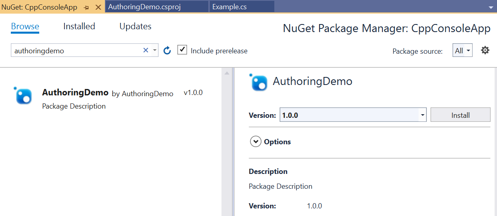

# Walkthrough&mdash;Create a C#/WinRT component, and consume it from C++/WinRT

C#/WinRT enables developers using .NET to author their own Windows Runtime components in C# using a class library project. Authored components can be consumed in native desktop applications as a package reference or as a project reference with a few modifications.

This walkthrough demonstrates how to create a simple Windows Runtime component using C#/WinRT, distribute the component as a NuGet package, and consume the component from a C++/WinRT console application. For the full sample that provides the code for this article, see the [C#/WinRT authoring sample](https://github.com/microsoft/CsWinRT/tree/master/src/Samples/AuthoringDemo). For more details about authoring, see [Authoring components](https://github.com/microsoft/CsWinRT/blob/master/docs/authoring.md).

For a walkthrough on authoring WinUI controls with C#/WinRT specifically for use in Windows App SDK applications, refer to the article [Walkthrough: Author a C# component with WinUI 3 controls and consume from a C++ Windows App SDK application](./create-winrt-component-winui-cswinrt.md)

## Prerequisites

This walkthrough requires the following tools and components:

- [Visual Studio 2022](/visualstudio/releases/2022/release-notes)
- [.NET 6.0 SDK](https://dotnet.microsoft.com/download/dotnet) or later
- [C++/WinRT VSIX](https://marketplace.visualstudio.com/items?itemName=CppWinRTTeam.cppwinrt101804264) for C++/WinRT project templates

## Create a simple Windows Runtime Component using C#/WinRT

Begin by creating a new project in Visual Studio. Select the **Class Library** project template, and name the project **AuthoringDemo**. You'll need to make the following additions and modifications to the project:

1. Update the `TargetFramework` in the **AuthoringDemo.csproj** file and add the following elements to the `PropertyGroup`:

    ```xml
    <PropertyGroup>
        <TargetFramework>net6.0-windows10.0.19041.0</TargetFramework>
        <Platforms>x64</Platforms>
    </PropertyGroup>
    ```

    To access Windows Runtime types, you need to set a specific Windows SDK version in the TFM. For more details on the supported version, see [.NET 6 and later: Use the TFM option](/windows/apps/desktop/modernize/desktop-to-uwp-enhance#net-6-use-the-target-framework-moniker-option).

2. Install the [Microsoft.Windows.CsWinRT](https://www.nuget.org/packages/Microsoft.Windows.CsWinRT/) NuGet package in your project.

    a. In Solution Explorer, right click on the project node and select **Manage NuGet Packages**.

    b. Search for the **Microsoft.Windows.CsWinRT** NuGet package and install the latest version. This walkthrough uses C#/WinRT version 1.4.1.

3. Add a new `PropertyGroup` element that sets the `CsWinRTComponent` property. This specifies that your project is a Windows Runtime component so that a `.winmd` file is generated when you build the project.

    ```xml
    <PropertyGroup>   
        <CsWinRTComponent>true</CsWinRTComponent>
    </PropertyGroup>
      ```

      For a full list of C#/WinRT project properties, refer to the [C#/WinRT NuGet documentation.](https://github.com/microsoft/CsWinRT/blob/master/nuget/readme.md)

4. You can author your runtime classes using library `.cs` class files. Right click on the `Class1.cs` file, and rename it to `Example.cs`. Add the following code to this file, which adds a public property and method to the runtime class. Remember to mark any classes you want to expose in the runtime component as `public`.

    ```csharp
    namespace AuthoringDemo
    {
        public sealed class Example
        {
            public int SampleProperty { get; set; }

            public static string SayHello()
            {
                return "Hello from your C# WinRT component";
            }
        }
    }
    ```

5. You can now build the project to generate the `.winmd` file for your component. Right-click on the project in **Solution Explorer**, and click **Build**. You'll see the generated `AuthoringDemo.winmd` file in your build output folder.

## Generate a NuGet package for the component

Most developers will want to distribute and share their Windows Runtime component as a NuGet package. Another option is to consume the component as a project reference. The following steps demonstrate how to package the **AuthoringDemo** component. When you generate the package, C#/WinRT configures the component and hosting assemblies in the package to enable consumption from native applications.

There are several ways to generate the NuGet package:

* If you want to generate a NuGet package every time you build the project, add the following property to the **AuthoringDemo** project file and then rebuild the project.

    ```xml
    <PropertyGroup>
        <GeneratePackageOnBuild>true</GeneratePackageOnBuild>
    </PropertyGroup>
    ```

* Alternatively, you can generate a NuGet package by right clicking the **AuthoringDemo** project in **Solution Explorer** and selecting **Pack**.

When you build the package, the **Build** window should indicate that the NuGet package `AuthoringDemo.1.0.0.nupkg` was successfully created. See [Create a package using the dotnet CLI](/nuget/create-packages/creating-a-package-dotnet-cli) for more details on NuGet package properties with the .NET CLI.

## Consume the component from a C++/WinRT app

C#/WinRT authored Windows Runtime components can be consumed from any Windows Runtime (WinRT)-compatible language. The following steps demonstrate how to call the authored component above in a C++/WinRT console application. 

> [!NOTE]
> Consuming a C#/WinRT component from C#/.NET apps is supported by both package reference or project reference. This scenario is equivalent to consuming any ordinary C# class library and does not involve WinRT activation in most cases. Starting with C#/WinRT 1.3.5, project references for C# consumers require .NET 6.

1. Add a new **C++/WinRT Console Application** project to your solution. Note that this project can also be part of a different solution if you choose so.

    a. In **Solution Explorer**, right click your solution node and click **Add** -> **New Project**.

    b. In the **Add New Project dialog box**, search for the **C++/WinRT Console Application** project template. Select the template and click **Next**.

    c. Name the new project **CppConsoleApp** and click **Create**.

2. Add a reference to the AuthoringDemo component, either as a NuGet package or a project reference.

    - **Option 1 (Package reference)**:  

        a. Right click the **CppConsoleApp** project and select **Manage NuGet packages**. You may need to configure your package sources to add a reference to the AuthoringDemo NuGet package. To do this, click the **Settings** icon in NuGet Package Manager and add a package source to the appropriate path.

        

        b. After configuring your package sources, search for the **AuthoringDemo** package and click **Install**.

        

    - **Option 2 (Project reference)**:
        
        a. Right click the **CppConsoleApp** project and select **Add** -> **Reference**. Under the **Projects** node, add a reference to the **AuthoringDemo** project.

3. To host the component, you will need to add a manifest file for activatable class registrations. For more details about managed component hosting, see [Managed component hosting](https://github.com/microsoft/CsWinRT/blob/master/docs/hosting.md).

    a. To add the manifest file, again right click on the project and choose **Add -> New Item**. Search for the **Text File** template and name it **CppConsoleApp.exe.manifest**. Paste the following contents, which specify the runtime classes using activatable class registration entries:

    ```xml
    <?xml version="1.0" encoding="utf-8"?>
    <assembly manifestVersion="1.0" xmlns="urn:schemas-microsoft-com:asm.v1">
        <assemblyIdentity version="1.0.0.0" name="CppConsoleApp"/>
        <file name="WinRT.Host.dll">
            <activatableClass
                name="AuthoringDemo.Example"
                threadingModel="both"
                xmlns="urn:schemas-microsoft-com:winrt.v1" />
        </file>
    </assembly>
    ```

    The application manifest file is required for apps that are not packaged. For packaged apps, the app consumer needs to register the activatable classes in their `Package.appxmanifest` package manifest file, as explained in [Walkthrough: Create a C# component with WinUI 3 controls and consume from a C++ Windows App SDK application](./create-winrt-component-winui-cswinrt.md).

    b. Modify the project to include the manifest file in the output when deploying the project. Click the **CppConsoleApp.exe.manifest** file in **Solution Explorer** and set the **Content** property to **True**. Here is an example of what this looks like.

     

5. Open **pch.h** under the project's Header Files, and add the following line of code to include your component.

    ```cpp
    #include <winrt/AuthoringDemo.h>
    ```

6. Open **main.cpp** under the project's Source Files, and replace it with the following contents.

    ```cpp
    #include "pch.h"
    #include "iostream"

    using namespace winrt;
    using namespace Windows::Foundation;

    int main()
    {
        init_apartment();

        AuthoringDemo::Example ex;
        ex.SampleProperty(42);
        std::wcout << ex.SampleProperty() << std::endl;
        std::wcout << ex.SayHello().c_str() << std::endl;
    }
    ```

7. Build and run the **CppConsoleApp** project. You should now see the output below.

    

## Related topics

- [Sample code](https://github.com/microsoft/CsWinRT/tree/master/src/Samples/AuthoringDemo)
- [Authoring components](https://github.com/microsoft/CsWinRT/blob/master/docs/authoring.md)
- [Managed component hosting](https://github.com/microsoft/CsWinRT/blob/master/docs/hosting.md)