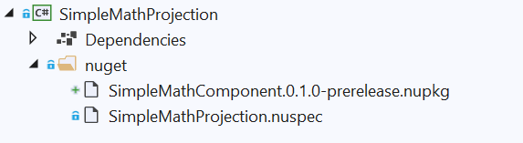

# Generate a C# projection from a C++/WinRT component, distribute as a NuGet for .NET apps

In this topic, we walk through using [C#/WinRT](/windows/uwp/csharp-winrt/) to generate a C# .NET projection (or interop) assembly from a C++/WinRT Windows Runtime component, and distribute it as a NuGet package for .NET applications.

In .NET 6 and later, consumption of Windows metadata (WinMD) files is no longer supported (see [Built-in support for WinRT is removed from .NET](/dotnet/core/compatibility/interop/5.0/built-in-support-for-winrt-removed)). Instead, the C#/WinRT tool can be used to generate a projection assembly for any WinMD file, which then enables consumption of WinRT components from .NET applications. A projection assembly is also known as an interop assembly. This walkthrough shows you how to do the following:

* Use the [C#/WinRT package](https://www.nuget.org/packages/Microsoft.Windows.CsWinRT/) to generate a C# projection from a C++/WinRT component.
* Distribute the component, along with the projection assembly, as a NuGet package.
* Consume the NuGet package from a .NET console application.

## Prerequisites

This walkthrough and the corresponding sample require the following tools and components:

* [Visual Studio 2022](https://visualstudio.microsoft.com/downloads/) (or Visual Studio 2019) with the Universal Windows Platform development workload installed. In **Installation Details** > **Universal Windows Platform development**, check the **C++ (v14x) Universal Windows Platform tools** option.
* [.NET 6.0 SDK](https://dotnet.microsoft.com/download/) or later.

**Visual Studio 2019** only. The [C++/WinRT VSIX extension](https://marketplace.visualstudio.com/items?itemName=CppWinRTTeam.cppwinrt101804264), which gives you C++/WinRT project templates in Visual Studio. The project templates are built in to Visual Studio 2022.

We'll be using Visual Studio 2022 and .NET 6 in this walkthrough.

> [!IMPORTANT]
> Also, you'll need to download or clone the sample code for this topic from the [C#/WinRT projection sample](https://github.com/microsoft/CsWinRT/tree/master/src/Samples/NetProjectionSample) on GitHub. Visit [CsWinRT](https://github.com/microsoft/CsWinRT), and click the green **Code** button to get the `git clone` url. Be sure to read the [README.md](https://github.com/microsoft/CsWinRT/blob/master/src/Samples/NetProjectionSample/README.md) file for the sample.

## Create a simple C++/WinRT Windows Runtime component

To follow this walkthrough, you must first have a C++/WinRT Windows Runtime component (WRC) from which to generate the C# projection assembly.

This walkthrough uses the **SimpleMathComponent** WRC from the [C#/WinRT projection sample](https://github.com/microsoft/CsWinRT/tree/master/src/Samples/NetProjectionSample) on GitHub, which you already downloaded or cloned. **SimpleMathComponent** was created from the **Windows Runtime Component (C++/WinRT)** Visual Studio project template (which comes with Visual Studio 2022, or with the [C++/WinRT VSIX extension](/windows/uwp/cpp-and-winrt-apis/intro-to-using-cpp-with-winrt#visual-studio-support-for-cwinrt-xaml-the-vsix-extension-and-the-nuget-package)).

To open the **SimpleMathComponent** project in Visual Studio, open the `\CsWinRT\src\Samples\NetProjectionSample\CppWinRTComponentProjectionSample.sln` file, which you'll find in your download or clone of the repo.

The code in this project provides the functionality for the basic math operations shown in the header file below.

```cpp
// SimpleMath.h
...
namespace winrt::SimpleMathComponent::implementation
{
    struct SimpleMath: SimpleMathT<SimpleMath>
    {
        SimpleMath() = default;
        double add(double firstNumber, double secondNumber);
        double subtract(double firstNumber, double secondNumber);
        double multiply(double firstNumber, double secondNumber);
        double divide(double firstNumber, double secondNumber);
    };
}
```

You can confirm that the **Windows Desktop Compatible** property is set to *Yes* for the **SimpleMathComponent** C++/WinRT Windows Runtime component project. To do that, in the project properties for **SimpleMathComponent**, under **Configuration Properties** > **General** > **Project Defaults**, set the property **Windows Desktop Compatible** to *Yes*. That ensures that the correct runtime binaries are loaded for consuming .NET desktop apps.


For more detailed steps about creating a C++/WinRT component and generating a WinMD file, see [Windows Runtime components with C++/WinRT](/windows/uwp/winrt-components/create-a-windows-runtime-component-in-cppwinrt).

> [!NOTE]
> If you're implementing [IInspectable::GetRuntimeClassName](/windows/win32/api/inspectable/nf-inspectable-iinspectable-getruntimeclassname) in your component, then it **must** return a valid WinRT class name. Because C#/WinRT uses the class name string for interop, an incorrect runtime class name will raise an **InvalidCastException**.

## Add a projection project to the component solution

First, with the **CppWinRTComponentProjectionSample** solution still open in Visual Studio, remove the **SimpleMathProjection** project from that solution. Then delete from your file system the **SimpleMathProjection** folder (or rename it if you prefer). Those steps are necessary so that you can follow this walkthrough step by step.

1. Add a new C# library project to your solution.
    
    1. In **Solution Explorer**, right-click your solution node and click **Add** > **New Project**. 
    2. In the **Add a new project** dialog box, type **Class Library** in the search box. Choose **C#** from the language list, and then choose **Windows** from the platform list. Choose the C# project template that's called simply **Class Library** (with no prefixes nor suffixes), and click **Next**.
    3. Name the new project *SimpleMathProjection*. The location should already be set to the same `\CsWinRT\src\Samples\NetProjectionSample` folder that the **SimpleMathComponent** folder is in; but confirm that. Then click **Next**.
    4. On the **Additional information** page, select **.NET 6.0 (Long-term support)**, and then choose **Create**.

2. Delete the stub **Class1.cs** file from the project.

3. Use the steps below to install the [C#/WinRT NuGet package](https://www.nuget.org/packages/Microsoft.Windows.CsWinRT).

    1. In **Solution Explorer**, right-click your **SimpleMathProjection** project and select **Manage NuGet Packages**.
    2. In the **Browse** tab, type or paste **Microsoft.Windows.CsWinRT** into  the search box, in search results select the item with the latest version, and then click **Install** to install the package into the **SimpleMathProjection** project.

4. Add to **SimpleMathProjection** a project reference to the **SimpleMathComponent** project. In **Solution Explorer**, right-click the **Dependencies** node under the **SimpleMathProjection** project node, select **Add Project Reference**, and select the **SimpleMathComponent** project > **OK**.

Don't try to build the project yet. We'll be doing that in a later step.

So far, your **Solution Explorer** should look similar to this (your version numbers will be different).


## Build projects out of source

For the **CppWinRTComponentProjectionSample** solution in the [C#/WinRT projection sample](https://github.com/microsoft/CsWinRT/tree/master/src/Samples/NetProjectionSample) (which you downloaded or cloned from GitHub, and now have open), the build output location is configured with the **Directory.Build.props** file to build *out of source*. That means that files from the build output are generated outside of the source folder. We recommend that you build out of source when you use the C#/WinRT tool. That prevents the C# compiler from inadvertently picking up all *\*.cs* files under the project root directory, which can cause duplicate type errors (for example when compiling for multiple configurations and/or platforms).

Even though this is already configured for the **CppWinRTComponentProjectionSample** solution, follow the steps below to get practice in doing the configuration for yourself.

To configure your solution to build out of source:

1. With the **CppWinRTComponentProjectionSample** solution still open, right-click on the solution node, and select **Add** > **New Item**. Select the **XML File** item, and name it **Directory.Build.props** (without a `.xml` extension). Click **Yes** to overwrite the existing file.

2. Replace the contents of **Directory.Build.props** with the configuration below.

   ```xml
   <Project>
     <PropertyGroup>
       <BuildOutDir>$([MSBuild]::NormalizeDirectory('$(SolutionDir)', '_build', '$(Platform)', '$(Configuration)'))</BuildOutDir>
       <OutDir>$([MSBuild]::NormalizeDirectory('$(BuildOutDir)', '$(MSBuildProjectName)', 'bin'))</OutDir>
       <IntDir>$([MSBuild]::NormalizeDirectory('$(BuildOutDir)', '$(MSBuildProjectName)', 'obj'))</IntDir>
     </PropertyGroup>
   </Project>
   ```

3. Save and close the **Directory.Build.props** file.

## Edit the project file to execute C#/WinRT

Before you can invoke the `cswinrt.exe` tool to generate the projection assembly, you must first edit the project file to specify a few project properties.

1. In **Solution Explorer**, double-click the **SimpleMathProjection** node to open the project file in the editor.

2. Update the `TargetFramework` element to target a specific Windows SDK version. This adds assembly dependencies that are necessary for the interop and projection support. This sample targets the Windows SDK version **net6.0-windows10.0.19041.0** (also known as Windows 10, version 2004). Set the `Platform` element to **AnyCPU** so that the resulting projection assembly can be referenced from any app architecture. To allow referencing applications to support earlier Windows SDK versions, you can also set the `TargetPlatformMinimumVersion` property.

    ```xml
    <PropertyGroup>
      <TargetFramework>net6.0-windows10.0.19041.0</TargetFramework>
      <!-- Set Platform to AnyCPU to allow consumption of the projection assembly from any architecture. -->
      <Platform>AnyCPU</Platform>
    </PropertyGroup>
    ```

    > [!NOTE]
    > For this walkthrough and the related sample code, the solution is built for **x64** and **Release**. Note that the **SimpleMathProjection** project is configured to build for AnyCPU for all solution architecture configurations.

3. Add a second `PropertyGroup` element (immediately after the first) that sets several C#/WinRT properties.

    ```xml
    <PropertyGroup>
      <CsWinRTIncludes>SimpleMathComponent</CsWinRTIncludes>
      <CsWinRTGeneratedFilesDir>$(OutDir)</CsWinRTGeneratedFilesDir>
    </PropertyGroup>
    ```

    Here are some details about the settings in this example:

    - The `CsWinRTIncludes` property specifies which namespaces to project.
    - The `CsWinRTGeneratedFilesDir` property sets the output directory in which the projection source files are generated. This property is set to `OutDir`, defined in **Directory.Build.props** from the section above.

4. Save and close the **SimpleMathProjection.csproj** file, and click to **Reload projects** if necessary.

## Create a NuGet package with the projection

To distribute the projection assembly for .NET application developers, you can automatically create a NuGet package when building the solution by adding some additional project properties. For .NET targets, the NuGet package needs to include the projection assembly and the implementation assembly from the component.

1. Use the steps below to add a NuGet spec (`.nuspec`) file to the **SimpleMathProjection** project.

    1. In **Solution Explorer**, right-click the **SimpleMathProjection** node, choose **Add** > **New Folder**, and name the folder **nuget**. 
    2. Right-click the **nuget** folder, choose **Add** > **New Item**, choose **XML file**, and name it **SimpleMathProjection.nuspec**. 

2. In **Solution Explorer**, double-click the **SimpleMathProjection** node to open the project file in the editor. Add the following property group to the now-open **SimpleMathProjection.csproj** (immediately after the two existing `PropertyGroup` elements) to automatically generate the package. These properties specify the `NuspecFile` and the directory to generate the NuGet package.

    ```xml
    <PropertyGroup>
      <GeneratedNugetDir>.\nuget\</GeneratedNugetDir>
      <NuspecFile>$(GeneratedNugetDir)SimpleMathProjection.nuspec</NuspecFile>
      <OutputPath>$(GeneratedNugetDir)</OutputPath>
      <GeneratePackageOnBuild>true</GeneratePackageOnBuild>
    </PropertyGroup>
    ```

    > [!NOTE]
    > If you prefer generating a package separately, then you can also choose to run the `nuget.exe` tool from the command line. For more information about creating a NuGet package, see [Create a package using the nuget.exe CLI](/nuget/create-packages/creating-a-package).

3. Open the **SimpleMathProjection.nuspec** file to edit the package creation properties, and paste the following code. The snippet below is an example NuGet spec for distributing **SimpleMathComponent** to multiple target frameworks. Note that projection assembly, **SimpleMathProjection.dll**, is specified instead of **SimpleMathComponent.winmd** for the target `lib\net6.0-windows10.0.19041.0\SimpleMathProjection.dll`. This behavior is new in .NET 6 and later, and is enabled by C#/WinRT. The implementation assembly, `SimpleMathComponent.dll`, must also be distributed, and will be loaded at runtime.

    ```xml
    <?xml version="1.0" encoding="utf-8"?>
    <package xmlns="http://schemas.microsoft.com/packaging/2012/06/nuspec.xsd">
      <metadata>
        <id>SimpleMathComponent</id>
        <version>0.1.0-prerelease</version>
        <authors>Contoso Math Inc.</authors>
        <description>A simple component with basic math operations</description>
        <dependencies>
          <group targetFramework="net6.0-windows10.0.19041.0" />
          <group targetFramework=".NETCoreApp3.0" />
          <group targetFramework="UAP10.0" />
          <group targetFramework=".NETFramework4.6" />
        </dependencies>
      </metadata>
      <files>
        <!--Support .NET 6, .NET Core 3, UAP, .NET Framework 4.6, C++ -->
        <!--Architecture-neutral assemblies-->
        <file src="..\..\_build\AnyCPU\Release\SimpleMathProjection\bin\SimpleMathProjection.dll" target="lib\net6.0-windows10.0.19041.0\SimpleMathProjection.dll" />
        <file src="..\..\_build\x64\Release\SimpleMathComponent\bin\SimpleMathComponent\SimpleMathComponent.winmd" target="lib\netcoreapp3.0\SimpleMathComponent.winmd" />
        <file src="..\..\_build\x64\Release\SimpleMathComponent\bin\SimpleMathComponent\SimpleMathComponent.winmd" target="lib\uap10.0\SimpleMathComponent.winmd" />
        <file src="..\..\_build\x64\Release\SimpleMathComponent\bin\SimpleMathComponent\SimpleMathComponent.winmd" target="lib\net46\SimpleMathComponent.winmd" />
        <!--Architecture-specific implementation DLLs should be copied into RID-relative folders-->
        <file src="..\..\_build\x64\Release\SimpleMathComponent\bin\SimpleMathComponent\SimpleMathComponent.dll" target="runtimes\win10-x64\native\SimpleMathComponent.dll" />
        <!--To support x86 and Arm64, build SimpleMathComponent for those other architectures and uncomment the entries below.-->
        <!--<file src="..\..\_build\Win32\Release\SimpleMathComponent\bin\SimpleMathComponent\SimpleMathComponent.dll" target="runtimes\win10-x86\native\SimpleMathComponent.dll" />-->
        <!--<file src="..\..\_build\arm64\Release\SimpleMathComponent\bin\SimpleMathComponent\SimpleMathComponent.dll" target="runtimes\win10-arm64\native\SimpleMathComponent.dll" />-->
      </files>
    </package>
    ```

    > [!NOTE]
    > **SimpleMathComponent.dll**, the implementation assembly for the component, is architecture-specific. If you're supporting other platforms (for example, x86 or Arm64), then you must first build **SimpleMathComponent** for the desired platforms, and add these assembly files to the appropriate [RID-relative folder](/nuget/create-packages/supporting-multiple-target-frameworks#architecture-specific-folders). The projection assembly **SimpleMathProjection.dll** and the component **SimpleMathComponent.winmd** are both architecture-neutral.

4. Save and close the files you just edited.

## Build the solution to generate the projection and NuGet package

Before building the solution, make sure to check the **Configuration Manager** settings in Visual Studio, under **Build** > **Configuration Manager**. For this walkthrough, set the **Configuration** to **Release** and **Platform** to **x64** for the solution.

At this point you can now build the solution. Right-click on your solution node and select **Build Solution**. This will first build the **SimpleMathComponent** project, and then the **SimpleMathProjection** project. The component WinMD and implementation assembly (**SimpleMathComponent.winmd** and **SimpleMathComponent.dll**), the projection source files, and the projection assembly (**SimpleMathProjection.dll**), will all be generated under the **_build** output directory. You'll also be able to see the generated NuGet package, **SimpleMathComponent0.1.0-prerelease.nupkg**, under the **\SimpleMathProjection\nuget** folder.

> [!IMPORTANT]
> If any of the files mentioned above are not generated, then build the solution a second time. You might also need to close and reopen the solution before rebuilding.

You might need to close and reopen the solution for the `.nupkg` to appear in Visual Studio as illustrated (or just select and then deselect **Show All Files**).



## Reference the NuGet package in a C# .NET 6 console application

To consume **SimpleMathComponent** from a .NET project, you can simply add to a new .NET project a reference to the **SimpleMathComponent0.1.0-prerelease.nupkg** NuGet package that we created in the previous section. The following steps demonstrate how to do that by creating a simple Console app in a separate solution.

1. Use the steps below to create a new solution containing a C# **Console App** project (creating this project in a new solution allows you to restore the **SimpleMathComponent** NuGet package independently).

    > [!IMPORTANT]
    > We'll be creating this new **Console App** project inside the `\CsWinRT\src\Samples\NetProjectionSample` folder, which you'll find in your downloaded or clone of the [C#/WinRT projection sample](https://github.com/microsoft/CsWinRT/tree/master/src/Samples/NetProjectionSample).

    1. In a new instance of Visual Studio, select **File** > **New** > **Project**.
    2. In the **Create a new project** dialog box, search for the **Console App** project template. Choose the C# project template that's called simply **Console App** (with no prefixes nor suffixes), and click **Next**. If you're using Visual Studio 2019, then the project template is **Console Application**.
    3. Name the new project **SampleConsoleApp**, set its location to the same `\CsWinRT\src\Samples\NetProjectionSample` folder that the **SimpleMathComponent** and **SimpleMathProjection** folders are in, and click **Next**.
    4. On the **Additional information** page, select **.NET 6.0 (Long-term support)**, and then choose **Create**.

2. In **Solution Explorer**, double-click the **SampleConsoleApp** node to open the **SampleConsoleApp.csproj** project file, and edit the `TargetFramework` and `Platform` properties so that they look as shown in the following listing. Add the `Platform` element if it's not there.

    ```xml
    <PropertyGroup>
      <OutputType>Exe</OutputType>
      <TargetFramework>net6.0-windows10.0.19041.0</TargetFramework>
      <Platform>x64</Platform>
    </PropertyGroup>
    ```

3. With the **SampleConsoleApp.csproj** project file still open, we'll next add to the **SampleConsoleApp** project a reference to the **SimpleMathComponent** NuGet package. To restore the **SimpleMathComponent** NuGet when building the project, you can use the `RestoreSources` property with the path to the **nuget** folder in your component solution. Copy the following configuration, and paste it into **SampleConsoleApp.csproj** (inside the `Project` element).

    ```xml
    <PropertyGroup>
      <RestoreSources>
        https://api.nuget.org/v3/index.json;
        ../SimpleMathProjection/nuget
      </RestoreSources>
    </PropertyGroup>

    <ItemGroup>
      <PackageReference Include="SimpleMathComponent" Version="0.1.0-prerelease" />
    </ItemGroup>
    ```

    > [!IMPORTANT]
    > The `RestoreSources` path for the **SimpleMathComponent** package shown above is set to `../SimpleMathProjection/nuget`. That path is correct provided that you followed the steps in this walkthrough, so that the **SimpleMathComponent** and **SampleConsoleApp** projects are both in the same folder (the `NetProjectionSample` folder, in this case). If you've done something different, then you'll need to adjust that path accordingly. Alternatively, you can [add a local NuGet package feed](/nuget/consume-packages/install-use-packages-visual-studio#package-sources) to your solution.

4. Edit the **Program.cs** file to use the functionality provided by **SimpleMathComponent**.

    ```csharp
    var x = new SimpleMathComponent.SimpleMath();
    Console.WriteLine("Adding 5.5 + 6.5 ...");
    Console.WriteLine(x.add(5.5, 6.5).ToString());
    ```

5. Save and close the files you just edited, and build and run the console app. You should see the output below.

    

## Known issues

- When building the projection project, you might see an error like: *Error MSB3271 There was a mismatch between the processor architecture of the project being built "MSIL" and the processor architecture, "x86", of the implementation file "..\SimpleMathComponent.dll" for "..\SimpleMathComponent.winmd". This mismatch may cause runtime failures. Please consider changing the targeted processor architecture of your project through the Configuration Manager so as to align the processor architectures between your project and implementation file, or choose a winmd file with an implementation file that has a processor architecture which matches the targeted processor architecture of your project.*
    To work around this error, add the following property to your C# library project file:
    ```xml
    <PropertyGroup>
        <!-- Workaround for MSB3271 error on processor architecture mismatch -->
        <ResolveAssemblyWarnOrErrorOnTargetArchitectureMismatch>None</ResolveAssemblyWarnOrErrorOnTargetArchitectureMismatch>
    </PropertyGroup>
    ```

## Further considerations

The C# projection (or interop) assembly that we showed how to create in this topic is quite simple&mdash;it doesn't have dependencies on other components. But to generate a C# projection for a C++/WinRT component that has references to Windows App SDK types, in the projection project you'd need to add a reference to the Windows App SDK NuGet package. If any such references are missing, then you'll see errors such as "Type \<T\> could not be found".

Another thing that we do in this topic is to distribute the projection as a NuGet package. That *is* currently necessary.

## Resources

- [Full code sample for this walkthrough](https://github.com/microsoft/CsWinRT/tree/master/src/Samples/NetProjectionSample)
- [C#/WinRT NuGet documentation](https://github.com/microsoft/CsWinRT/blob/master/nuget/readme.md)
- [NuGet.exe documentation](/nuget/create-packages/creating-a-package)
