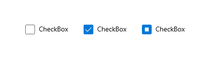
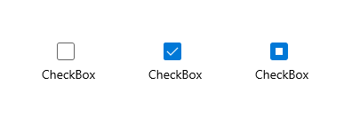

# Control templates

You can customize a control's visual structure and visual behavior by creating a control template in the XAML framework. Controls have many properties, such as [**Background**](/windows/windows-app-sdk/api/winrt/microsoft.ui.xaml.controls.control.background), [**Foreground**](/windows/windows-app-sdk/api/winrt/microsoft.ui.xaml.controls.control.foreground), and [**FontFamily**](/windows/windows-app-sdk/api/winrt/microsoft.ui.xaml.controls.control.fontfamily), that you can set to specify different aspects of the control's appearance. But the changes that you can make by setting these properties are limited. You can specify additional customizations by creating a template using the [**ControlTemplate**](/windows/windows-app-sdk/api/winrt/microsoft.ui.xaml.Controls.ControlTemplate) class. Here, we show you how to create a **ControlTemplate** to customize the appearance of a [**CheckBox**](/windows/windows-app-sdk/api/winrt/microsoft.ui.xaml.Controls.CheckBox) control.

> **Important APIs**: [**ControlTemplate class**](/windows/windows-app-sdk/api/winrt/microsoft.ui.xaml.Controls.ControlTemplate), [**Control.Template property**](/windows/windows-app-sdk/api/winrt/microsoft.ui.xaml.controls.control.template)

## Custom control template example

By default, a [**CheckBox**](/windows/windows-app-sdk/api/winrt/microsoft.ui.xaml.Controls.CheckBox) control puts its content (the string or object next to the **CheckBox**) to the right of the selection box, and a check mark indicates that a user selected the **CheckBox**. These characteristics represent the visual structure and visual behavior of the **CheckBox**.

Here's a [**CheckBox**](/windows/windows-app-sdk/api/winrt/microsoft.ui.xaml.Controls.CheckBox) using the default [**ControlTemplate**](/windows/windows-app-sdk/api/winrt/microsoft.ui.xaml.Controls.ControlTemplate) shown in the `Unchecked`, `Checked`, and `Indeterminate` states.



You can change these characteristics by creating a [**ControlTemplate**](/windows/windows-app-sdk/api/winrt/microsoft.ui.xaml.Controls.ControlTemplate) for the [**CheckBox**](/windows/windows-app-sdk/api/winrt/microsoft.ui.xaml.Controls.CheckBox). For example, if you want the content of the check box to be below the selection box, and you want to use an **X** to indicate that a user selected the check box. You specify these characteristics in the **ControlTemplate** of the **CheckBox**.

To use a custom template with a control, assign the [**ControlTemplate**](/windows/windows-app-sdk/api/winrt/microsoft.ui.xaml.Controls.ControlTemplate) to the [**Template**](/windows/windows-app-sdk/api/winrt/microsoft.ui.xaml.controls.control.template) property of the control. Here's a [**CheckBox**](/windows/windows-app-sdk/api/winrt/microsoft.ui.xaml.Controls.CheckBox) using a **ControlTemplate** called `CheckBoxTemplate1`. We show the Extensible Application Markup Language (XAML) for the **ControlTemplate** in the next section.

```XAML
<CheckBox Content="CheckBox" Template="{StaticResource CheckBoxTemplate1}" IsThreeState="True" Margin="20"/>
```

Here's how this [**CheckBox**](/windows/windows-app-sdk/api/winrt/microsoft.ui.xaml.Controls.CheckBox) looks in the `Unchecked`, `Checked`, and `Indeterminate` states after we apply our template.



## Specify the visual structure of a control

When you create a [**ControlTemplate**](/windows/windows-app-sdk/api/winrt/microsoft.ui.xaml.Controls.ControlTemplate), you combine [**FrameworkElement**](/windows/windows-app-sdk/api/winrt/microsoft.ui.xaml.FrameworkElement) objects to build a single control. A **ControlTemplate** must have only one **FrameworkElement** as its root element. The root element usually contains other **FrameworkElement** objects. The combination of objects makes up the control's visual structure.

This XAML creates a [**ControlTemplate**](/windows/windows-app-sdk/api/winrt/microsoft.ui.xaml.Controls.ControlTemplate) for a [**CheckBox**](/windows/windows-app-sdk/api/winrt/microsoft.ui.xaml.Controls.CheckBox) that specifies that the content of the control is below the selection box. The root element is a [**Border**](/windows/windows-app-sdk/api/winrt/microsoft.ui.xaml.Controls.Border). The example specifies a [**Path**](/windows/windows-app-sdk/api/winrt/microsoft.ui.xaml.Shapes.Path) to create an **X** that indicates that a user selected the **CheckBox**, and an [**Ellipse**](/windows/windows-app-sdk/api/winrt/microsoft.ui.xaml.Shapes.Ellipse) that indicates an indeterminate state. Note that the [**Opacity**](/windows/windows-app-sdk/api/winrt/microsoft.ui.xaml.UIElement.Opacity) is set to 0 on the **Path** and the **Ellipse** so that by default, neither appear.

A [TemplateBinding](templatebinding-markup-extension.md) is a special binding that links the value of a property in a control template to the value of some other exposed property on the templated control. TemplateBinding can only be used within a ControlTemplate definition in XAML. See [TemplateBinding markup extension](templatebinding-markup-extension.md) for more info.

> [!NOTE]
> Starting with Windows 10, version 1809 ([SDK 17763](https://developer.microsoft.com/windows/downloads/windows-10-sdk)), you can use [**x:Bind**](x-bind-markup-extension.md) markup extensions in places you use [TemplateBinding](/windows/apps/develop/platform/xaml/templatebinding-markup-extension). See [TemplateBinding markup extension](templatebinding-markup-extension.md) for more info.

```XAML
<ControlTemplate x:Key="CheckBoxTemplate1" TargetType="CheckBox">
    <Border BorderBrush="{TemplateBinding BorderBrush}"
            BorderThickness="{TemplateBinding BorderThickness}"
            Background="{TemplateBinding Background}">
        <Grid>
            <Grid.RowDefinitions>
                <RowDefinition Height="*"/>
                <RowDefinition Height="25"/>
            </Grid.RowDefinitions>
            <Rectangle x:Name="NormalRectangle" Fill="Transparent" Height="20" Width="20"
                       Stroke="{ThemeResource SystemControlForegroundBaseMediumHighBrush}"
                       StrokeThickness="{ThemeResource CheckBoxBorderThemeThickness}"
                       UseLayoutRounding="False"/>
            <!-- Create an X to indicate that the CheckBox is selected. -->
            <Path x:Name="CheckGlyph"
                  Data="M103,240 L111,240 119,248 127,240 135,240 123,252 135,264 127,264 119,257 111,264 103,264 114,252 z"
                  Fill="{ThemeResource CheckBoxForegroundThemeBrush}"
                  FlowDirection="LeftToRight"
                  Height="14" Width="16" Opacity="0" Stretch="Fill"/>
            <Ellipse x:Name="IndeterminateGlyph"
                     Fill="{ThemeResource CheckBoxForegroundThemeBrush}"
                     Height="8" Width="8" Opacity="0" UseLayoutRounding="False" />
            <ContentPresenter x:Name="ContentPresenter"
                              ContentTemplate="{TemplateBinding ContentTemplate}"
                              Content="{TemplateBinding Content}"
                              Margin="{TemplateBinding Padding}" Grid.Row="1"
                              HorizontalAlignment="Center"
                              VerticalAlignment="{TemplateBinding VerticalContentAlignment}"/>
        </Grid>
    </Border>
</ControlTemplate>
```

## Specify the visual behavior of a control

A visual behavior specifies the appearance of a control when it is in a certain state. The [**CheckBox**](/windows/windows-app-sdk/api/winrt/microsoft.ui.xaml.Controls.CheckBox) control has 3 check states: `Checked`, `Unchecked`, and `Indeterminate`. The value of the [**IsChecked**](/windows/windows-app-sdk/api/winrt/microsoft.ui.xaml.controls.primitives.togglebutton.ischecked) property determines the state of the **CheckBox**, and its state determines what appears in the box.

This table lists the possible values of [**IsChecked**](/windows/windows-app-sdk/api/winrt/microsoft.ui.xaml.controls.primitives.togglebutton.ischecked), the corresponding states of the [**CheckBox**](/windows/windows-app-sdk/api/winrt/microsoft.ui.xaml.Controls.CheckBox), and the appearance of the **CheckBox**.

| **IsChecked** value | **CheckBox** state | **CheckBox** appearance |
|---------------------|--------------------|-------------------------|
| **true**            | `Checked`          | Contains an "X".        |
| **false**           | `Unchecked`        | Empty.                  |
| **null**            | `Indeterminate`    | Contains a circle.      |


You specify the appearance of a control when it is in a certain state by using [**VisualState**](/windows/windows-app-sdk/api/winrt/microsoft.ui.xaml.VisualState) objects. A **VisualState** contains a [**Setter**](/windows/windows-app-sdk/api/winrt/microsoft.ui.xaml.Setter) or [**Storyboard**](/windows/windows-app-sdk/api/winrt/microsoft.ui.xaml.Media.Animation.BeginStoryboard) that changes the appearance of the elements in the [**ControlTemplate**](/windows/windows-app-sdk/api/winrt/microsoft.ui.xaml.Controls.ControlTemplate). When the control enters the state that the [**VisualState.Name**](/windows/windows-app-sdk/api/winrt/microsoft.ui.xaml.visualstate.name) property specifies, the property changes in the **Setter** or [**Storyboard**](/windows/windows-app-sdk/api/winrt/microsoft.ui.xaml.Media.Animation.Storyboard) are applied. When the control exits the state, the changes are removed. You add **VisualState** objects to [**VisualStateGroup**](/windows/windows-app-sdk/api/winrt/microsoft.ui.xaml.VisualStateGroup) objects. You add **VisualStateGroup** objects to the [**VisualStateManager.VisualStateGroups**](/windows/windows-app-sdk/api/winrt/microsoft.ui.xaml.visualstatemanager) attached property, which you set on the root [**FrameworkElement**](/windows/windows-app-sdk/api/winrt/microsoft.ui.xaml.FrameworkElement) of the **ControlTemplate**.

This XAML shows the [**VisualState**](/windows/windows-app-sdk/api/winrt/microsoft.ui.xaml.VisualState) objects for the `Checked`, `Unchecked`, and `Indeterminate` states. The example sets the [**VisualStateManager.VisualStateGroups**](/windows/windows-app-sdk/api/winrt/microsoft.ui.xaml.visualstatemanager) attached property on the [**Border**](/windows/windows-app-sdk/api/winrt/microsoft.ui.xaml.Controls.Border), which is the root element of the [**ControlTemplate**](/windows/windows-app-sdk/api/winrt/microsoft.ui.xaml.Controls.ControlTemplate). The `Checked` **VisualState** specifies that the [**Opacity**](/windows/windows-app-sdk/api/winrt/microsoft.ui.xaml.UIElement.Opacity) of the [**Path**](/windows/windows-app-sdk/api/winrt/microsoft.ui.xaml.Shapes.Path) named `CheckGlyph` (which we show in the previous example) is 1. The `Indeterminate` **VisualState** specifies that the **Opacity** of the [**Ellipse**](/windows/windows-app-sdk/api/winrt/microsoft.ui.xaml.Shapes.Ellipse) named `IndeterminateGlyph` is 1. The `Unchecked` **VisualState** has no [**Setter**](/windows/windows-app-sdk/api/winrt/microsoft.ui.xaml.Setter) or [**Storyboard**](/windows/windows-app-sdk/api/winrt/microsoft.ui.xaml.Media.Animation.Storyboard), so the [**CheckBox**](/windows/windows-app-sdk/api/winrt/microsoft.ui.xaml.Controls.CheckBox) returns to its default appearance.

```XAML
<ControlTemplate x:Key="CheckBoxTemplate1" TargetType="CheckBox">
    <Border BorderBrush="{TemplateBinding BorderBrush}"
            BorderThickness="{TemplateBinding BorderThickness}"
            Background="{TemplateBinding Background}">

        <VisualStateManager.VisualStateGroups>
            <VisualStateGroup x:Name="CheckStates">
                <VisualState x:Name="Checked">
                    <VisualState.Setters>
                        <Setter Target="CheckGlyph.Opacity" Value="1"/>
                    </VisualState.Setters>
                    <!-- This Storyboard is equivalent to the Setter. -->
                    <!--<Storyboard>
                        <DoubleAnimation Duration="0" To="1"
                         Storyboard.TargetName="CheckGlyph" Storyboard.TargetProperty="Opacity"/>
                    </Storyboard>-->
                </VisualState>
                <VisualState x:Name="Unchecked"/>
                <VisualState x:Name="Indeterminate">
                    <VisualState.Setters>
                        <Setter Target="IndeterminateGlyph.Opacity" Value="1"/>
                    </VisualState.Setters>
                    <!-- This Storyboard is equivalent to the Setter. -->
                    <!--<Storyboard>
                        <DoubleAnimation Duration="0" To="1"
                         Storyboard.TargetName="IndeterminateGlyph" Storyboard.TargetProperty="Opacity"/>
                    </Storyboard>-->
                </VisualState>
            </VisualStateGroup>
        </VisualStateManager.VisualStateGroups>

        <Grid>
            <Grid.RowDefinitions>
                <RowDefinition Height="*"/>
                <RowDefinition Height="25"/>
            </Grid.RowDefinitions>
            <Rectangle x:Name="NormalRectangle" Fill="Transparent" Height="20" Width="20"
                       Stroke="{ThemeResource SystemControlForegroundBaseMediumHighBrush}"
                       StrokeThickness="{ThemeResource CheckBoxBorderThemeThickness}"
                       UseLayoutRounding="False"/>
            <!-- Create an X to indicate that the CheckBox is selected. -->
            <Path x:Name="CheckGlyph"
                  Data="M103,240 L111,240 119,248 127,240 135,240 123,252 135,264 127,264 119,257 111,264 103,264 114,252 z"
                  Fill="{ThemeResource CheckBoxForegroundThemeBrush}"
                  FlowDirection="LeftToRight"
                  Height="14" Width="16" Opacity="0" Stretch="Fill"/>
            <Ellipse x:Name="IndeterminateGlyph"
                     Fill="{ThemeResource CheckBoxForegroundThemeBrush}"
                     Height="8" Width="8" Opacity="0" UseLayoutRounding="False" />
            <ContentPresenter x:Name="ContentPresenter"
                              ContentTemplate="{TemplateBinding ContentTemplate}"
                              Content="{TemplateBinding Content}"
                              Margin="{TemplateBinding Padding}" Grid.Row="1"
                              HorizontalAlignment="Center"
                              VerticalAlignment="{TemplateBinding VerticalContentAlignment}"/>
        </Grid>
    </Border>
</ControlTemplate>
```

To better understand how [**VisualState**](/windows/windows-app-sdk/api/winrt/microsoft.ui.xaml.VisualState) objects work, consider what happens when the [**CheckBox**](/windows/windows-app-sdk/api/winrt/microsoft.ui.xaml.Controls.CheckBox) goes from the `Unchecked` state to the `Checked` state, then to the `Indeterminate` state, and then back to the `Unchecked` state. Here are the transitions.

| State transition | What happens | CheckBox appearance when the transition completes |
| ---------------- | ------------ | ------------------------------------------------- |
| From `Unchecked` to `Checked`.       | The [**Setter**](/windows/windows-app-sdk/api/winrt/microsoft.ui.xaml.Setter) value of the `Checked` [**VisualState**](/windows/windows-app-sdk/api/winrt/microsoft.ui.xaml.VisualState) is applied, so the [**Opacity**](/windows/windows-app-sdk/api/winrt/microsoft.ui.xaml.UIElement.Opacity) of `CheckGlyph` is 1.                                                                                                                                                          | An X is displayed.                                |
| From `Checked` to `Indeterminate`.   | The [**Setter**](/windows/windows-app-sdk/api/winrt/microsoft.ui.xaml.Setter) value of the `Indeterminate` [**VisualState**](/windows/windows-app-sdk/api/winrt/microsoft.ui.xaml.VisualState) is applied, so the [**Opacity**](/windows/windows-app-sdk/api/winrt/microsoft.ui.xaml.UIElement.Opacity) of `IndeterminateGlyph` is 1. The **Setter** value of the `Checked` **VisualState** is removed, so the [**Opacity**](/windows/windows-app-sdk/api/winrt/microsoft.ui.xaml.media.brush.opacity) of `CheckGlyph` is 0. | A circle is displayed.                            |
| From `Indeterminate` to `Unchecked`. | The [**Setter**](/windows/windows-app-sdk/api/winrt/microsoft.ui.xaml.Setter) value of the `Indeterminate` [**VisualState**](/windows/windows-app-sdk/api/winrt/microsoft.ui.xaml.VisualState) is removed, so the [**Opacity**](/windows/windows-app-sdk/api/winrt/microsoft.ui.xaml.UIElement.Opacity) of `IndeterminateGlyph` is 0.                                                                                                                                           | Nothing is displayed.                             |

 For more info about how to create visual states for controls, and in particular how to use the [**Storyboard**](/windows/windows-app-sdk/api/winrt/microsoft.ui.xaml.Media.Animation.Storyboard) class and the animation types, see [Storyboarded animations for visual states](/previous-versions/windows/apps/jj819808(v=win.10)).

## Use tools to work with themes easily

A fast way to apply themes to your controls is to right-click on a control on the Microsoft Visual Studio **Document Outline** and select **Edit Theme** or **Edit Style** (depending on the control you are right-clicking on). You can then apply an existing theme by selecting **Apply Resource** or define a new one by selecting **Create Empty**.

## Controls and accessibility

When you create a new template for a control, in addition to possibly changing the control's behavior and visual appearance, you might also be changing how the control represents itself to accessibility frameworks. The Windows app supports the Microsoft UI Automation framework for accessibility. All of the default controls and their templates have support for common UI Automation control types and patterns that are appropriate for the control's purpose and function. These control types and patterns are interpreted by UI Automation clients such as assistive technologies, and this enables a control to be accessible as a part of a larger accessible app UI.

To separate the basic control logic and also to satisfy some of the architectural requirements of UI Automation, control classes include their accessibility support in a separate class, an automation peer. The automation peers sometimes have interactions with the control templates because the peers expect certain named parts to exist in the templates, so that functionality such as enabling assistive technologies to invoke actions of buttons is possible.

When you create a completely new custom control, you sometimes also will want to create a new automation peer to go along with it. For more info, see [Custom automation peers](../../../design/accessibility/custom-automation-peers.md).

## Learn more about a control's default template

The topics that document the styles and templates for XAML controls show you excerpts of the same starting XAML you'd see if you used the **Edit Theme** or **Edit Style** techniques explained previously. Each topic lists the names of the visual states, the theme resources used, and the full XAML for the style that contains the template. The topics can be useful guidance if you've already started modifying a template and want to see what the original template looked like, or to verify that your new template has all of the required named visual states.

## Theme resources in control templates

For some of the attributes in the XAML examples, you may have noticed resource references that use the [{ThemeResource} markup extension](themeresource-markup-extension.md). This is a technique that enables a single control template to use resources that can be different values depending on which theme is currently active. This is particularly important for brushes and colors, because the main purpose of the themes is to enable users to choose whether they want a dark, light, or high contrast theme applied to the system overall. Apps that use the XAML resource system can use a resource set that's appropriate for that theme, so that the theme choices in an app's UI are reflective of the user's system-wide theme choice.

## Get the sample code

* [WinUI Gallery sample](https://github.com/Microsoft/WinUI-Gallery)
* [Custom text edit control sample](https://github.com/Microsoft/Windows-universal-samples/tree/master/Samples/CustomEditControl)
