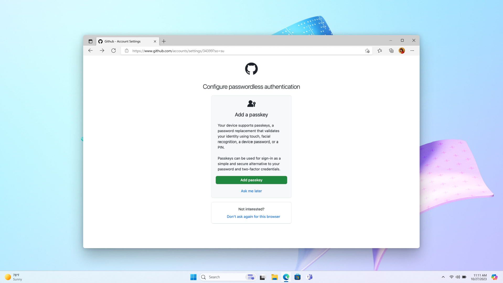
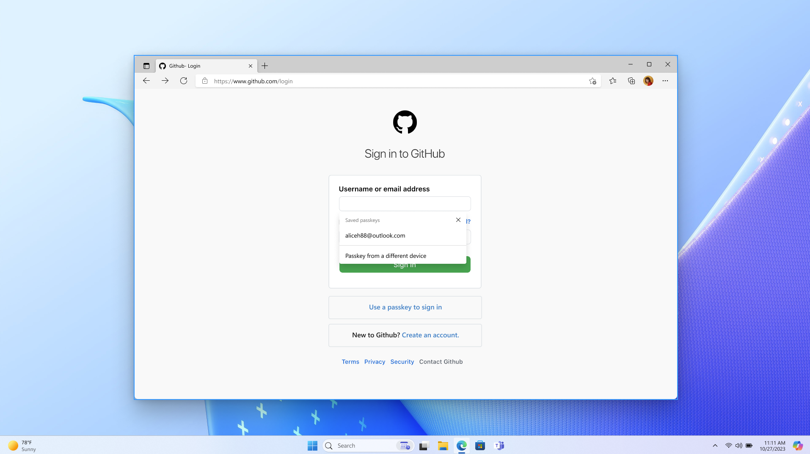
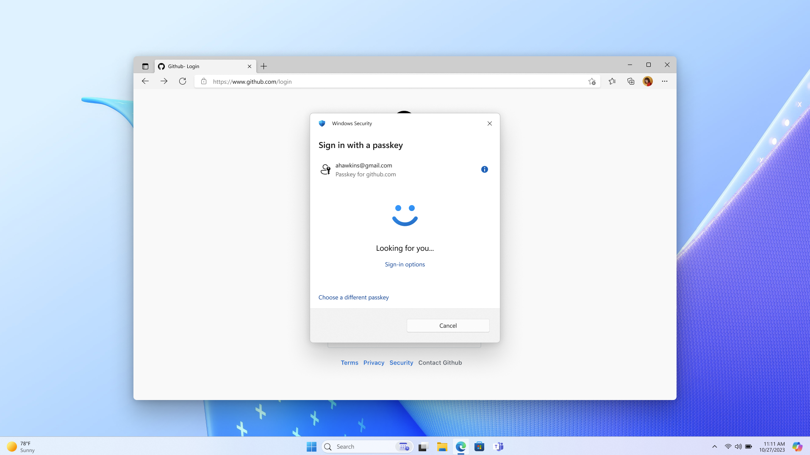
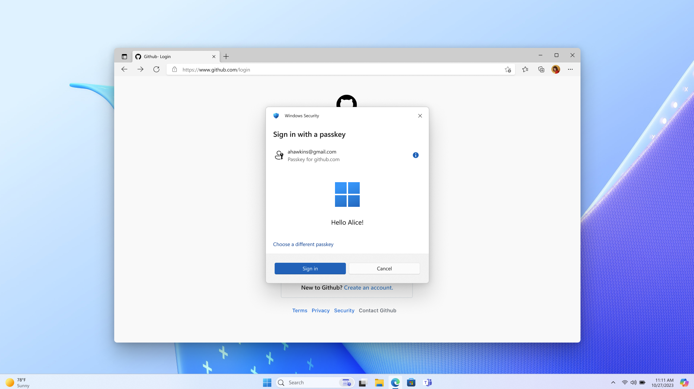

# Design guidelines for passkeys

There are 14 design patterns for passkeys. You can get started with two essential patterns, and then add optional patterns to your passkeys deployment based on your unique business needs.

## Essential patterns

The two essential (foundational) patterns are that:

* A user needs first to *create* a passkey (and view/manage it),
* and then the user can *sign in* with it.

Every rollout of passkeys should make use of these patterns.

### Pattern 1: Create, view, and manage passkeys in account settings

* If a passkey doesn't exist for the current user, then display the passkey creation prompt, like this:

  

### Pattern 2: Sign in with a passkey

* Enable autofill by adding `autocomplete="webauthn"` to your **username** input field.
* Support graceful fallback to other sign-in methods. Allow users to enter some different credential (not a passkey) to sign in or to create an account.
* Research explored users' success and satisfaction with: a dedicated "Sign in with a passkey" link, buttons, and autofill. Testing indicated that autofill ensured the highest success for people to sign in with a passkey.

#### Step 2.1: Login page

#### Step 2.2: Passkey sign-in prompt with lock screen

#### Step 2.3: Login success with Windows Hello

## UI text, research, and rollout

Here are some user-tested button labels and phrases. Copy and edit them to suit your needs.

   **With passkeys, you don’t need to remember complex passwords.**

   **What are passkeys?**
   Passkeys are encrypted digital keys you create using your fingerprint, face, or screen lock.

   **Where are passkeys saved?**
   Passkeys are saved in your password manager, so you can sign in on other devices.

Research indicates that your users will appreciate the option to create a passkey for their account *at any point* within the account settings workflow. Candidates described an account settings UI as an intuitive and useful place to proactively learn about and update their authentication settings.

The research also indicates that users seek to understand the nature and value of passkeys. Vague or technical explanations often confuse them and lead them to abandon creating a passkey. Familiar biometric iconography, and brief messaging that compares passkeys to known technologies, is most effective at providing the right level of information. For users who already have a passkey, the passkey card(s) afford them an unmistakable object in the interface that they later visualize and then find in your account settings UI. They use that to get actionable information about the passkey.

On your homepage, we recommend that you offer one affordance for both sign-in and account creation. Research indicates that the action of creating an account is more discoverable that way, rather than surfacing the account creation option *after* the user has signed in. Also, some users report that occasionally they're uncertain whether they have an account&mdash;so a multipurpose button serves their needs.

### Rollout

Passkeys might require specific hardware or software support on users' devices. Ensure that users are aware of the compatibility requirements for using passkeys, and provide guidance on compatible devices and browsers including Windows and Edge.

In the context of native mobile apps, signing in with a passkey is different from the biometric sign-in experience that has existed for many years. Signing in with a passkey requires an additional tap.

As for security, an implementation might gracefully fall back to an email OTP. The graceful fallback option that you choose should match your unique goals for security and business. So plan your UI and UX accordingly.

For service providers, you might choose a phased rollout where initially users can create passkeys only from their account settings. Then, as you gather data about the passkey sign-in experiences unique to your users' needs, you can increase the number of places where a passkey can be created, including during account creation. And you should develop a communication plan to educate users about the availability of passkeys, and their benefits. To reach users effectively, you might leverage several communication channels (in-app notifications, email, and online help resources) that align with your unique goals.

## Optional patterns

For info about optional patterns, see [Optional patterns](https://fidoalliance.org/design-guidelines/patterns/).

## Next steps

Next, see [Use cases for passkeys](./use-cases.md).

## Further info

* [Intro to passkeys](./intro.md)
* [Passkeys.dev](https://passkeys.dev/)
* [Get Started on Your Passwordless Journey](https://fidoalliance.org/implement-passkeys-overview/) on the FIDO Alliance website
