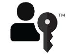

# Intro to passkeys

Learn about simpler, stronger, passwordless sign-ins. Passkeys can use your fingerprint or other biometric to log you into your websites and apps, just like unlocking your device.

Passkeys&mdash;based on Fast IDentity Online (FIDO) standards&mdash;are a replacement for passwords. Using a passkey to sign in to websites and apps across your devices is faster, easier, and more secure. Unlike a password, a passkey is always strong and phishing-resistant.

Some aspects of passkeys:
* Simplify account registration for apps and websites.
* Are easy to use.
* Work across most of your devices.
* And even work on other devices in physical proximity.​

## Why passkeys?

The motivation for using passkeys is, initially, an acknowledgment of the following considerations related to passwords.

Some aspects of passwords:
* They're knowledge-based.
* Can be difficult to use and to remember.
* Can be easy to phish, harvest, and replay (a very high percentage of organizations experience phishing attacks each year).
* Are a root cause of the vast majority of data breaches.

And also consider:
* There's a labor cost involved in each password reset.
* Nearly all users have a large number of online accounts.
* Most passwords are reused.

So passkeys are the answer to those issues. Passkeys address the security problems, and they're suitable for large-scale use by consumers.

Passkey protocols don't provide information that can be used by different online services to collaborate and track a user across the services. Biometric information, if used, never leaves the user's device. With passkeys, there are no shared secrets.

## Passkeys optimize access and usability for authentication

Your organization can deploy passkeys across a variety of use cases, including users signing in to your Windows apps, and users authenticating themselves to your websites. Passkeys enable users to access their sign-in credentials on many of their devices. Device-bound passkeys are bound to a FIDO security key or platform.

## How do users use passkeys?

A relying party (RP)&mdash;such as a website&mdash;that wants to use passkeys first sets up a credential with you. So a user can first get a passkey from the website (instead of or in addition to a password), and then subsequently when the user wants to sign in, they can approve the use of their passkey for that site.

When a user signs in to an app or to a website by using a passkey, they approve the sign-in with the same biometric or PIN that they use to unlock the device (phone, computer, or security key). The app or website can use that mechanism instead of the traditional username and password. For example, if your passkey is stored with Windows Hello, then you can use your face, fingerprint, or PIN that you used with Windows Hello, to approve the use of that passkey.

The workflow is described in more detail in [Implement passkeys](./implement.md) and in [Design guidelines for passkeys](./design.md).

## The benefits

Here's what that means for:

* **User experience**. The user experience (UX) will be familiar and consistent across many of your users' devices&mdash;a simple verification of their fingerprint or face, or a device PIN. The same simple action that consumers take multiple times each day to unlock their devices.
* **Security**. Passkeys are based on FIDO Authentication, which is proven to be resistant to threats of phishing, credential stuffing, and other remote attacks. Also, service providers can offer passkeys without needing passwords as an alternative sign-in or account recovery method.

Passkeys reduce the risk of phishing, and eliminate credential reuse. They also help to speed up sign-ins, improve service delivery, and lower costs. Faster, more secure, and more successful sign-ins means less breach risk, more transactions, better service delivery, and fewer credential resets and helpdesk calls for account recovery.

## The FIDO passkey logo

Look for the FIDO passkey logo on sites that allow you to use passkeys instead of passwords. If you're a service provider interested in using this logo, then visit [FIDO Trademark and Service Mark Usage Agreement for Websites](https://fidoalliance.org/get-the-passkey-icon/) to agree to terms, and to download the logo files.

## Next steps

Next, see [Implement passkeys](./implement.md).

## Further info

* [Implement passkeys](./implement.md)
* [Passkeys](https://fidoalliance.org/passkeys/) on the FIDO Alliance website
* [Sign In with a Passkey](https://fidoalliance.org/design-guidelines/patterns/sign-in-with-a-passkey/) on the FIDO Alliance website
