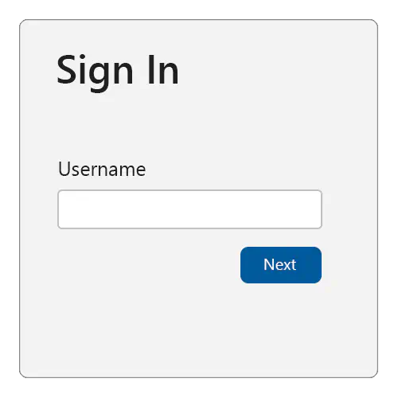
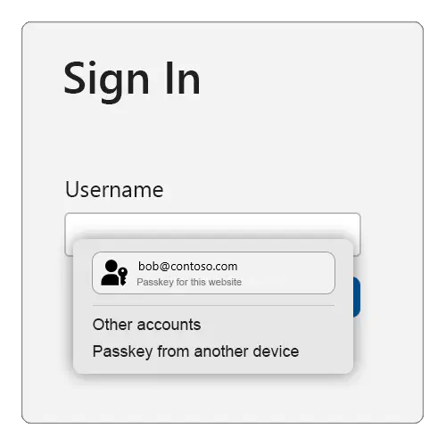
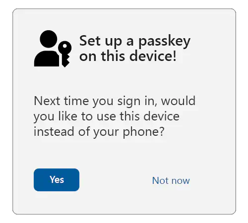
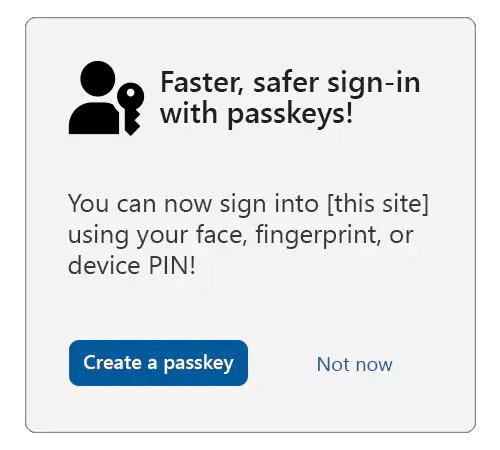
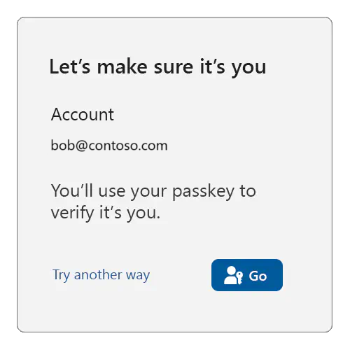
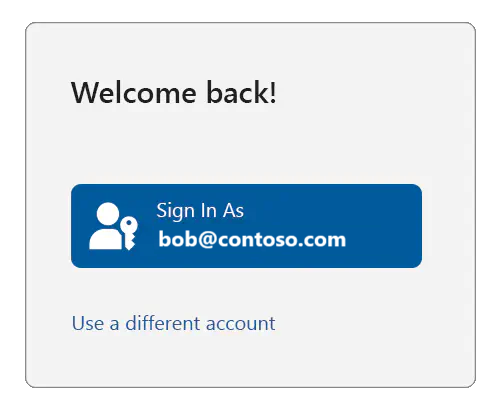
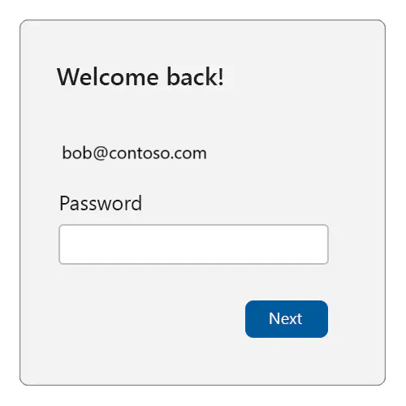
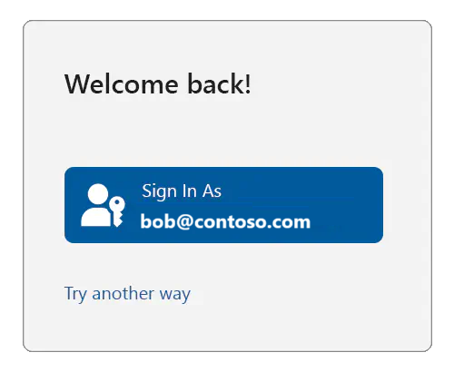

# Use cases for passkeys

This topic describes some use cases for passkeys.

## Use case 1: Bootstrapping

Bootstrapping an account on the web.

### 1.1: Authenticating the user

This section applies when the relying party (RP) doesn't yet know who is controlling the client device. There's no browser artifact available to the RP (such as a cookie or a credential ID in local storage), although for now we assume that the user has an existing account with the RP.

To bootstrap an account, serve the user a sign-in page.

Begin by asking the user for their account identifier; typically a username or email address.



To support the autofill UI for passkeys, make sure to:

1. Add the `username` and `webauthn` value to any existing autocomplete annotations on the **username** input field.

  ```html
  <div>
    <label for="username">Username:</label>
    <input name="username" id="loginform.username"
           autocomplete="username webauthn">
  </div>
  ```

2. On page load, use an `if` statement to check to see whether autofill UI (conditional mediation) is available, then call `navigator.credentials.get()` with `mediation: "conditional"` and `userVerification: "preferred"`.

  ```javascript
    <script>
      (async () => {
        if (
        typeof window.PublicKeyCredential !== 'undefined'
        && typeof window.PublicKeyCredential.isConditionalMediationAvailable === 'function'
        ) {
          const available = await PublicKeyCredential.isConditionalMediationAvailable();

        if (available) {
            try {
              // Retrieve authentication options for `navigator.credentials.get()`
              // from your server.
              const authOptions = await getAuthenticationOptions();
        // This call to `navigator.credentials.get()` is "set and forget."
        // The Promise will resolve only if the user successfully interacts
        // with the browser's autofill UI to select a passkey.
        const webAuthnResponse = await navigator.credentials.get({
            mediation: "conditional",
        publicKey: {
            ...authOptions,
            // See note about userVerification below.
            userVerification: "preferred",
                }
              });
        // Send the response to your server for verification, and
        // authenticate the user if the response is valid.
        await verifyAutoFillResponse(webAuthnResponse);
            } catch (err) {
            console.error('Error with conditional UI:', err);
            }
          }
        }
      })();
    </script>
  ```

The above will cause the following to happen:

* Retrieve the authentication options from your server. Return at least a random `challenge` and `rpId` to be associated with this authentication request.
* When the user interacts with your **username** field, the browser and platform will check whether a passkey exists (in the platform authenticator) that can be used with the relying party.
* If that *is* the case, then the passkey will be presented to the user as an option to choose (along with other credentials that can be auto-filled, such as usernames stored in the browser's password manager). The browser/platform might render a UI similar to the one shown below. Although, the exact look and feel varies from one platform or form factor to another:



* If the user selects the passkey, then the platform UI will guide the user through an (often biometrics-based) user verification check.
* If the user successfully passes the user verification, then the `navigator.credentials.get()` call succeeds and returns a WebAuthn response.
* If the user selects a credential other than a passkey, then the browser/platform chooses a different appropriate action (such as auto-filling the username), and the `navigator.credentials.get()` call doesn't resolve.
* If the user selects the "Passkey from another device" option (the exact text will vary slightly by platform), then the browser/platform will guide the user through using a FIDO2 security key or the Cross-Device Authentication (CDA) flow to use a passkey from their smartphone or tablet to deliver a WebAuthn response to the `navigator.credentials.get()` call.
* Send the WebAuthn response to your server for verification and additional security checks. If all checks succeed, then begin an authenticated session for this user.

This is why this is called the *conditional UI* (or, more commonly, the *autofill UI*) mode of WebAuthn&mdash;the platform authenticator UI that guides the user through the verification, or through using their phone, is shown only if the user has a passkey on this device (or chooses the "another device" option).

As you can see, in this mode the `navigator.credentials.get()` call either succeeds, or it doesn't because it never resolves. If it does succeed, then the result of the call will reveal both a user id and a signed WebAuthn assertion, which the relying party (RP) will use to authenticate the user.

If the call doesn't succeed, then you should perform a *legacy* user authentication. You'll obtain a username from this first page, and in subsequent pages you then serve appropriate further login challenges (such as passwords, responding to SMS challenges, etc.) to the user. Those might include *account recovery* steps in case the user has forgotten their password, or is otherwise not able to pass the regular login challenges. Once the user has passed all the login challenges, they're considered authenticated and signed in.

When the user doesn't already have an account with the relying party (RP), you'll usually give the user the option on the sign-in page to create an account. If the user chooses that option, then you'll collect the necessary information from them to open a new account. If they successfully open a new account, then they're also considered authenticated and signed-in.

Once the user is signed in, it might be time to set up a new passkey for them. Do that for any of the following cases:
* The user bootstrapped their account on the device by passing non-passkey login challenges (such as using a password).
* The user just created a new account at the relying party (RP), and they're considered signed in because of that.
* The user was using a passkey, but they used a different device from the one they're currently using (by selecting "another device" shown in the example above). This can be confirmed by inspecting the **authenticatorAttachment** attribute in the returned **PublicKeyCredential** object.

### 1.2: Cross-device authentication

If the user used a passkey from another device (such as a phone, tablet, or FIDO2 security key), then the **authenticatorAttachment** property in the authentication response (**getAssertion**) will have the value `cross-platform`.

In that scenario, offer the user the choice to create a passkey on their local device. That will result in a more seamless user experience in the future, because the user won't be required to use their other device.



### 1.3: A note about user verification

This guidance sets **userVerification** to `preferred`, meaning that user verification will be attempted when possible.

Some devices, such as desktop computers and older laptops, might not have biometric sensors. On those devices, if **userVerification** is set to `required`, then the user might be asked to enter their system login password for each sign in using a passkey. And that can be frustrating for them.

When `preferred` is used, some platform authenticators will always require a user verification check when the device has biometric sensors, but might skip user verification on devices without them.

The user verification result (conveyed in authenticator data flags) will reflect the actual user verification result, and should always be validated against your requirements on the server.

### 1.4: Opt the user in to passkeys

First, verify that the user is sufficiently strongly authenticated using other login methods, including multi-factor authentication.

Second, ensure that the user's device and operating system (OS) combo supports passkeys by calling:

```javascript
PublicKeyCredential.isUserVerifyingPlatformAuthenticatorAvailable()
```

If passkeys are supported, then that will return `true`. If they aren't supported, then it will return `false`, and you should abort the passkey enrollment flow.

Serve an opt-in or "upsell" modal/interstitial or page to the user offering them to create a passkey:



> [!TIP]
> In order to ensure that the user is giving fully informed consent, consider showing (or linking to) longer descriptions explaining that all users who are able to unlock the current device will be able to access the account at the relying party (RP).

If the user consents, then call `navigator.credentials.create()` with the options shown in the example below:

```javascript
navigator.credentials.create({
  publicKey: {
    rp: {
      // User-friendly name of your service.
      name: "Passkeys Developer",
      // Relying party (RP) identifier (hostname/FQDN).
      id: passkeys.contoso"
    },

    user: {
      // Persistent, unique identifier for the user account in your backend.
      id: Uint8Array.from("0525bc79-5a63-4e47-b7d1-597e25f5caba", c => c.charCodeAt(0)),
      // User-friendly identifier often displayed to the user (for example, email address).
      name: "amanda@contoso.com",
      // Human-readable display name, sometimes displayed by the client.
      displayName: "Amanda Brady"
    },
    // The challenge is a buffer of cryptographically random bytes generated on your backend,
    // and should be tightly bound to the current user session.
    challenge: Uint8Array.from("XZJscsUqtBH7ZB90t2g0EbZTZYlbSRK6lq7zlN2lJKuoYMnp7Qo2OLzD7xawL3s", c => c.charCodeAt(0)),
    pubKeyCredParams: [
      // An array of objects describing what public key types are acceptable to a server.
      {
        "type": "public-key",
        "alg": -7 // EC P256
      },
      {
        "type": "public-key",
        "alg": -257 // RSA
      }
    ],
    excludeCredentials: [
      // Array of credential IDs for existing passkeys tied to the user account.
      // This avoids creating a new passkey in an authenticator that already has 
      // a passkey tied to the user account.
      {
        // Example only.
        type: "public-key",
        id: new Uint8Array([21, 31, 56, ...]).buffer
      },
      {
        // Example only.
        type: "public-key",
        id: new Uint8Array([21, 31, 56, ...]).buffer
      }
    ],
    authenticatorSelection: {
      // Tells the authenticator to create a passkey.
      residentKey: "required",
      // Tells the client/authenticator to request user verification where possible;
      // for example, a biometric or a device PIN.
      userVerification: "preferred"
    },
    "extensions": {
      // Returns details about the passkey.
      "credProps": true
    }
  }
})
```

> [!NOTE]
> We recommend that most relying parties (RPs) not specify the attestation conveyance parameter `attestation` (thus defaulting to none), or instead explicitly use the value `indirect`. That guarantees the most streamlined user experience (platforms are likely to obtain consent from the user for other types of attestation conveyances, which likely results in a larger fraction of unsuccessful credential creations due to users canceling the creation).

When the WebAuthn call resolves, send the response to your server, and associate the returned public key and credential ID with the previously authenticated user account.

## Use case 2: Reauthentication

Using passkeys for a reauthentication might be necessary for any of the following reasons:

* The user signed out, and now wants to sign in again.
* The user session expired due to inactivity, and the user wants to sign in again.
* The user is about to perform a sensitive action, and needs to re-confirm control over the user session.

To reauthenticate the user in each of these situations, you'll use passkeys that you set up in the previous use case. The WebAuthn API call is the same in all three cases, but the UI treatment that you provide is slightly different. Since the particular account is specified by you, the platform won't prompt the user to select a different account on your service.

### 2.1: Sensitive actions

Let's look at the UI for the third reason first&mdash;when it's time to reauthenticate for a sensitive action, check whether you have a credential ID for at least one passkey for the user.

If no such credential ID is available, then serve a traditional login challenge suitable for reauthentication, for example:


> [!TIP]
> We recommend that on this login challenge page, users can't change their account identifier. Also, the login challenge should be something that an unauthorized user of the device can't pass.

If, on the other hand, you *do* find at least one passkey credential ID for the user, then you can use passkeys for reauthentication:



When the user is ready (in the above example, when they click on the "Go" button), call `navigator.credentials.get()`, passing in all the user's passkey credential IDs:

```javascript
navigator.credentials.get({
  publicKey: {
    challenge: ...,
    rpId: ...,
     allowCredentials: [{
      type: "public-key",      
      id: new UInt8Array([21, 31, 56, ...]).buffer,
    }, {
      type: "public-key",
      id: new UInt8Array([21, 31, 56, ...]).buffer,
    }, {
      ...
    }],
    // see note below
    userVerification: "preferred", 
  }
});
```

> [!NOTE]
> Be sure to read the guidance around userVerification from the previous use case.

If the user instead clicks on "Try another way", then you should offer them other sign-in methods (password, etc.) to reauthenticate them (assuming that the user has such other sign-in methods available to them).

### 2.2: Expired sessions and logout

Now we'll examine the case where the reauthentication is triggered because the user logged themself out, or the relying party (RP) expired the user's session. To facilitate that, the RP would have to keep some form of user session state reminding them of the account that was formerly signed in, even when they consider the user signed-out (that could be achieved using browser artifacts such as cookies or local storage).

> [!NOTE]
> A relying party (RP) might choose to treat signing out as a comprehensive action, and thus delete all references to the user's identity. Such an RP should treat a subsequent sign-in like an account bootstrap, and repeat the steps explained previously.

You, as the RP, might then serve a sign-in page like this:



If the user clicks on "Use a different account", then you should enter an account bootstrap flow&mdash;as explained for the previous use case&mdash;repeating the steps there, where the platform will let the user select which account they want to use.

> [!NOTE]
> In that case, you should also give the user the ability to completely remove the suggested account from being listed on the sign-in page.

But if the user clicks the "Sign In As" button, then check whether you have at least one passkey credential ID associated with the user. If no credential ID is available, then serve a traditional login challenge suitable for reauthentication, for example:



If, on the other hand, you *do* find at least one passkey credential ID for the user, then you can use passkeys for reauthentication:



When the user is ready (in the above example, when they click on the "Go" button), call `navigator.credentials.get()`, exactly as already shown (that is, by passing in all the user's passkey credential IDs).

If the user instead clicks on "Try another way", then you should offer them other sign-in methods (password, etc.) to reauthenticate them (assuming that the user has such other sign-in methods available to them).

## Next steps

Next, see [Tools and libraries for passkeys](./tools-libraries.md).

## Further info

* [Intro to passkeys](./intro.md)
* [Passkeys.dev](https://passkeys.dev/)
* [Get Started on Your Passwordless Journey](https://fidoalliance.org/implement-passkeys-overview/) on the FIDO Alliance website
