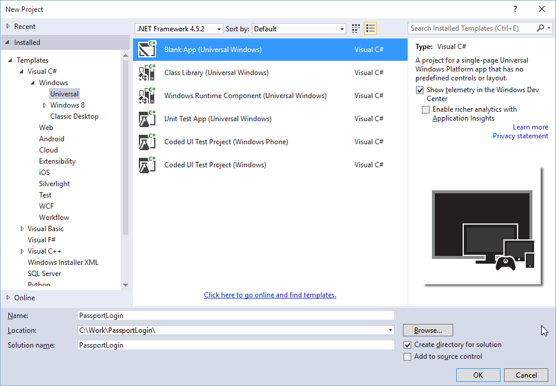
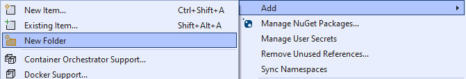
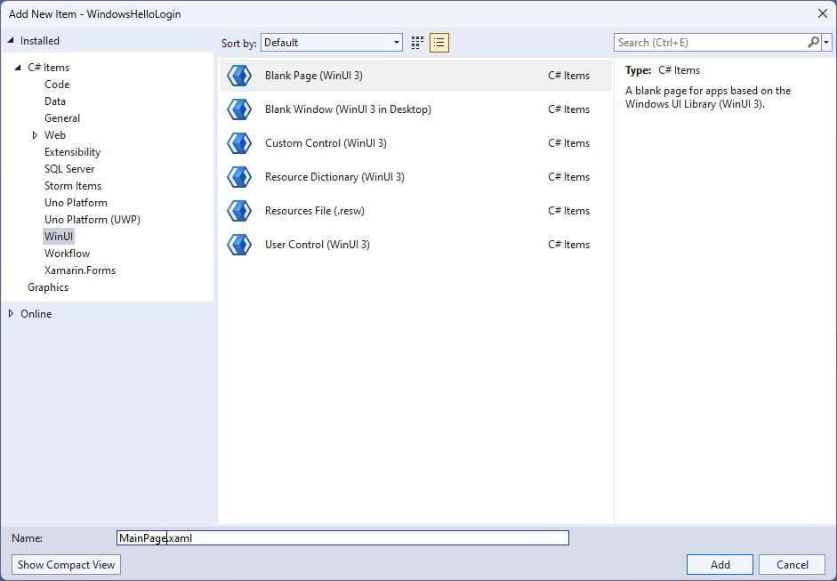
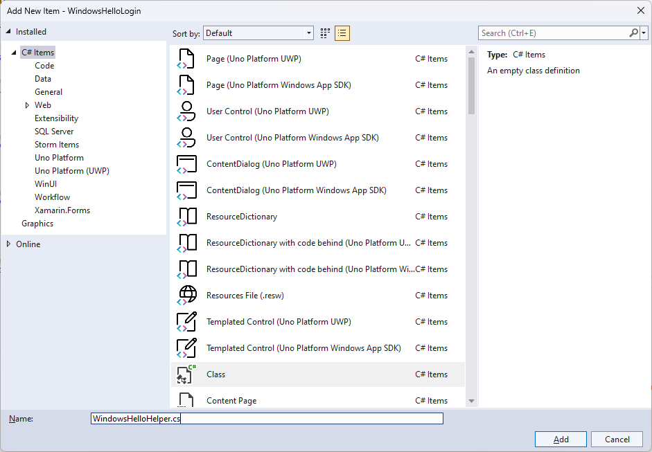
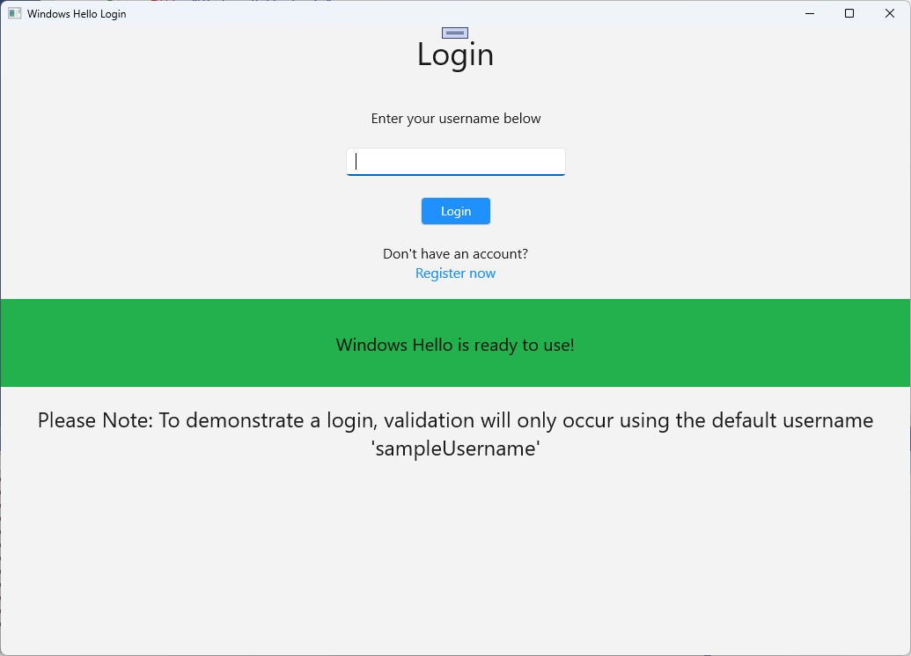
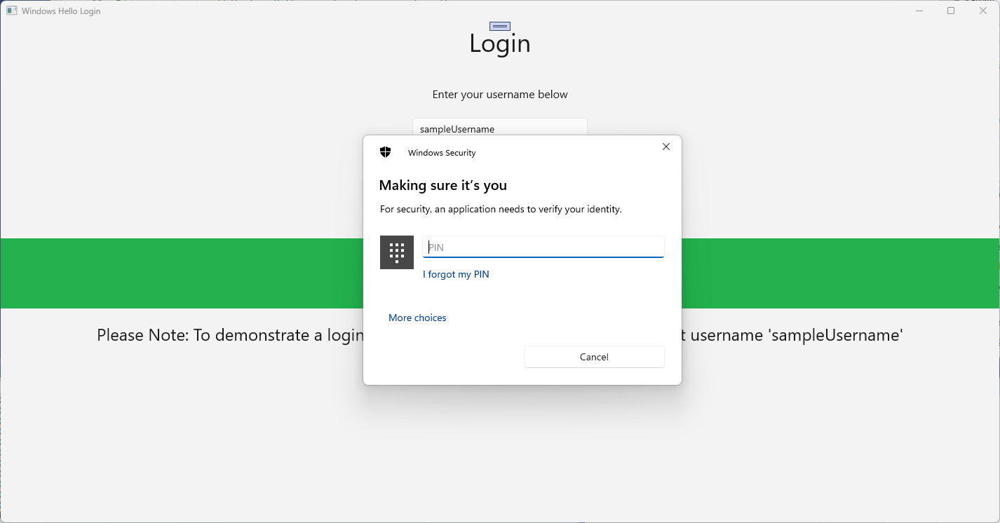
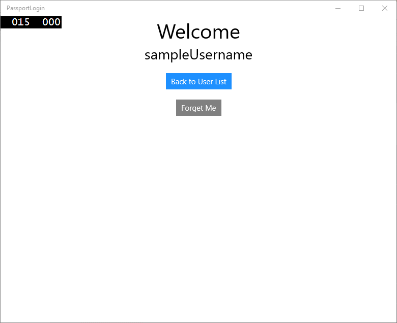
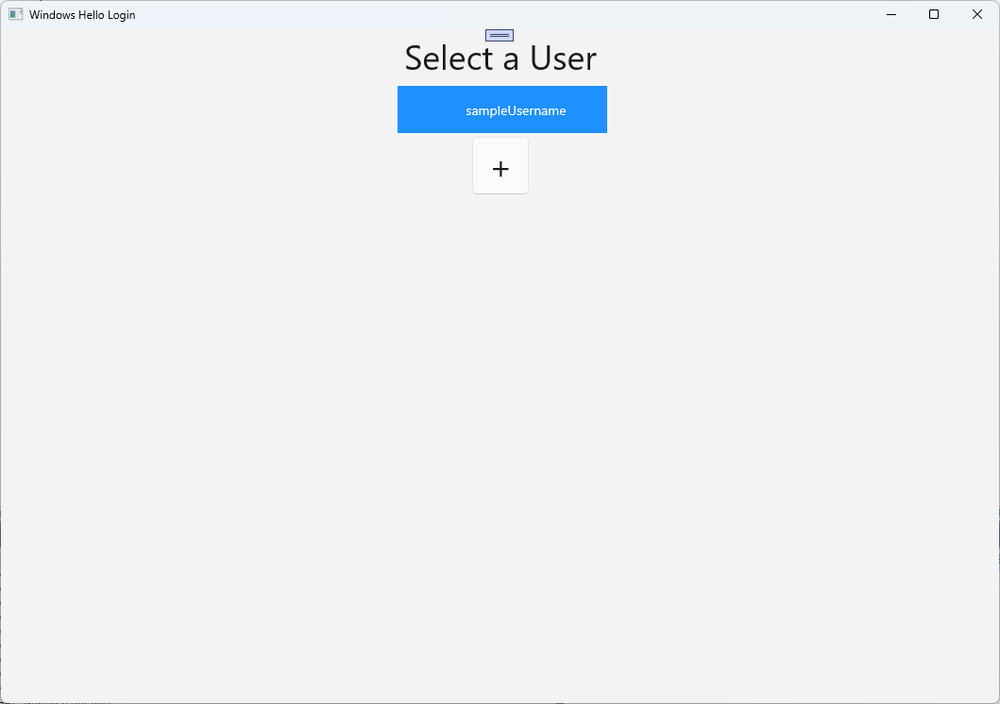
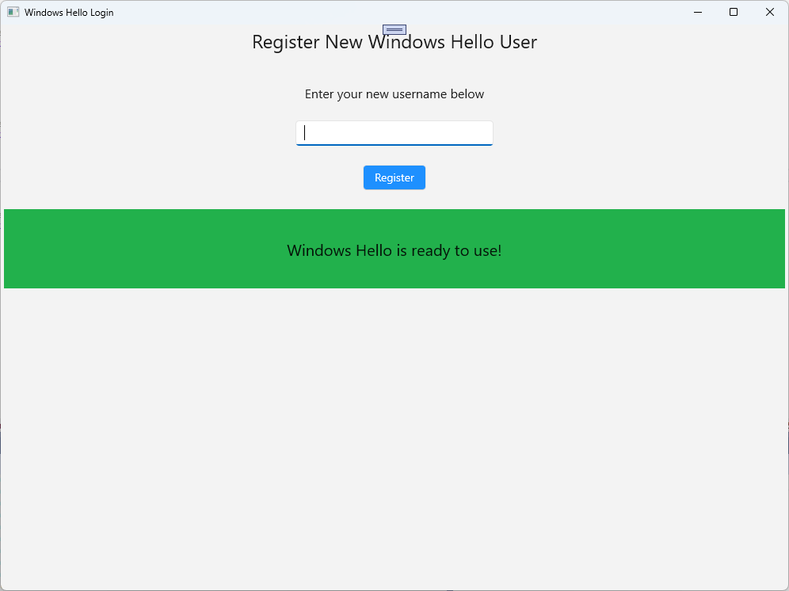

# Create a Windows Hello login app

This is the first part of a complete walkthrough on how to create a packaged Windows app that uses Windows Hello as an alternative to traditional username and password authentication systems. In this case, the app is a WinUI app, but the same approach can be used with any packaged Windows app, including WPF and Windows Forms apps. The app uses a username for sign-in and creates a Hello key for each account. These accounts will be protected by the PIN that is set up in Windows Settings on configuration of Windows Hello.

This walkthrough is split into two parts: building the app and connecting the backend service. When you're finished with this article, continue on to Part 2: [Windows Hello login service](windows-hello-auth-service.md).

Before you begin, you should read the [Windows Hello](windows-hello.md) overview for a general understanding of how Windows Hello works.

## Get started

In order to build this project, you'll need some experience with C#, and XAML. You'll also need to be using Visual Studio 2022 on a Windows 10 or Windows 11 machine. See [Get started with WinUI](/windows/apps/get-started/start-here) for complete instructions on setting up your development environment.

- In Visual Studio, select **File** > **New** > **Project**.
- In the **New Project** dialog's drop-down filters, select **C#/C++**, **Windows**, and **WinUI**, respectively.
- Choose **Blank App, Packaged (WinUI 3 in Desktop)** and name your application "WindowsHelloLogin".
- Build and Run the new application (F5), you should see a blank window shown on the screen. Close the application.



## Exercise 1: Login with Windows Hello

In this exercise you will learn how to check if Windows Hello is setup on the machine, and how to sign into an account using Windows Hello.

- In the new project create a new folder in the solution called "Views". This folder will contain the pages that will be navigated to in this sample. Right-click the project in **Solution Explorer**, select **Add** > **New Folder**, then rename the folder to **Views**.

    

- Open MainWindow.xaml and replace the `Window` contents with an empty `StackPanel` or `Grid` control. We will be implementing page navigation and navigating to a new page when the **MainWindow** is loaded, so we don't need any content in the **MainWindow**.
- Add a `Title` property to **MainWindow** in the XAML. The attribute should look like this: `Title="Windows Hello Login"`.
- Remove the myButton_Click event handler from MainWindow.xaml.cs to avoid any compilation errors. This event handler is not needed for this sample.
- Right-click the new **Views** folder, select **Add** > **New Item** and select the **Blank Page** template. Name this page "MainPage.xaml".

    

- Open the App.xaml.cs file and update the **OnLaunched** handler to implement page navigation for the app. You'll also need to add a **RootFrame_NavigationFailed** handler method to deal with any errors that occur while loading pages.

    ```cs
    protected override void OnLaunched(Microsoft.UI.Xaml.LaunchActivatedEventArgs args)
    {
        m_window = new MainWindow();
        var rootFrame = new Frame();
        rootFrame.NavigationFailed += RootFrame_NavigationFailed;
        rootFrame.Navigate(typeof(MainPage), args);
        m_window.Content = rootFrame;
        m_window.Activate();
    }

    private void RootFrame_NavigationFailed(object sender, NavigationFailedEventArgs e)
    {
        throw new Exception($"Error loading page {e.SourcePageType.FullName}");
    }
    ```

- You'll also need to add four using statements to the top of the App.xaml.cs file to resolve compilation errors in the code.

    ```cs
    using Microsoft.UI.Xaml.Controls;
    using Microsoft.UI.Xaml.Navigation;
    using System;
    using WindowsHelloLogin.Views;
    ```

- Right-click the new **Views** folder, select **Add** > **New Item** and select the **Blank Page** template. Name this page "Login.xaml".
- To define the user interface for the new login page, add the following XAML. This XAML defines a `StackPanel` to align the following children:

  - A `TextBlock` that will contain a title.
  - A `TextBlock` for error messages.
  - A `TextBox` for the username to be input.
  - A `Button` to navigate to a register page.
  - A `TextBlock` to contain the status of Windows Hello.
  - A `TextBlock` to explain the Login page, as there is no backend or configured users yet.

    ```xml
    <Grid>
      <StackPanel>
        <TextBlock Text="Login" FontSize="36" Margin="4" TextAlignment="Center"/>
        <TextBlock x:Name="ErrorMessage" Text="" FontSize="20" Margin="4" Foreground="Red" TextAlignment="Center"/>
        <TextBlock Text="Enter your username below" Margin="0,0,0,20"
                   TextWrapping="Wrap" Width="300"
                   TextAlignment="Center" VerticalAlignment="Center" FontSize="16"/>
        <TextBox x:Name="UsernameTextBox" Margin="4" Width="250"/>
        <Button x:Name="LoginButton" Content="Login" Background="DodgerBlue" Foreground="White"
                Click="LoginButton_Click" Width="80" HorizontalAlignment="Center" Margin="0,20"/>
        <TextBlock Text="Don't have an account?"
                   TextAlignment="Center" VerticalAlignment="Center" FontSize="16"/>
        <TextBlock x:Name="RegisterButtonTextBlock" Text="Register now"
                   PointerPressed="RegisterButtonTextBlock_OnPointerPressed"
                   Foreground="DodgerBlue"
                   TextAlignment="Center" VerticalAlignment="Center" FontSize="16"/>
        <Border x:Name="WindowsHelloStatus" Background="#22B14C"
                Margin="0,20" Height="100" >
          <TextBlock x:Name="WindowsHelloStatusText" Text="Windows Hello is ready to use!"
                     Margin="4" TextAlignment="Center" VerticalAlignment="Center" FontSize="20"/>
        </Border>
        <TextBlock x:Name="LoginExplanation" FontSize="24" TextAlignment="Center" TextWrapping="Wrap" 
                   Text="Please Note: To demonstrate a login, validation will only occur using the default username 'sampleUsername'"/>
      </StackPanel>
    </Grid>
    ```

- A few methods need to be added to the code-behind file to get the solution building. Either press F7 or use the **Solution Explorer** to edit the Login.xaml.cs file. Add in the following two event methods to handle the **Login** and **Register** events. For now these methods will set the `ErrorMessage.Text` to an empty string. Be sure to include the following using statements. They will be needed for the next steps.

    ```cs
    using Microsoft.UI.Xaml;
    using Microsoft.UI.Xaml.Controls;
    using Microsoft.UI.Xaml.Input;
    using Microsoft.UI.Xaml.Media;
    using Microsoft.UI.Xaml.Navigation;
    using System;

    namespace WindowsHelloLogin.Views
    {
        public sealed partial class Login : Page
        {
            public Login()
            {
                this.InitializeComponent();
            }
            private void LoginButton_Click(object sender, RoutedEventArgs e)
            {
                ErrorMessage.Text = "";
            }
            private void RegisterButtonTextBlock_OnPointerPressed(object sender, PointerRoutedEventArgs e)
            {
                ErrorMessage.Text = "";
            }
        }
    }
    ```

- In order to render the **Login** page, edit the **MainPage** code to navigate to the **Login** page when the **MainPage** is loaded. Open the MainPage.xaml.cs file. In **Solution Explorer**, double-click on MainPage.xaml.cs. If you can’t find this click the little arrow next to MainPage.xaml to show the code-behind file. Create a **Loaded** event handler method that will navigate to the **Login** page.

    ```cs
    namespace WindowsHelloLogin.Views
    {
        public sealed partial class MainPage : Page
        {
            public MainPage()
            {
                this.InitializeComponent();
                Loaded += MainPage_Loaded;
            }
    
            private void MainPage_Loaded(object sender, RoutedEventArgs e)
            {
                Frame.Navigate(typeof(Login));
            }
        }
    }
    ```

- In the **Login** page, you need to handle the `OnNavigatedTo` event to validate if Windows Hello is available on the current machine. In Login.xaml.cs, implement the following code. You'll notice that the WindowsHelloHelper object indicates that there's an error. That's because we haven't created this helper class yet.

    ```cs
    public sealed partial class Login : Page
    {
        public Login()
        {
            this.InitializeComponent();
        }
     
        protected override async void OnNavigatedTo(NavigationEventArgs e)
        {
            // Check if Windows Hello is set up and available on this machine
            if (await WindowsHelloHelper.WindowsHelloAvailableCheckAsync())
            {
            }
            else
            {
                // Windows Hello isn't set up, so inform the user
                WindowsHelloStatus.Background = new SolidColorBrush(Windows.UI.Color.FromArgb(255, 50, 170, 207));
                WindowsHelloStatusText.Text = $"Windows Hello is not set up!{Environment.NewLine}Please go to Windows Settings and set up a PIN to use it.";
                LoginButton.IsEnabled = false;
            }
        }
    }
    ```

- To create the WindowsHelloHelper class, right-click the **WindowsHelloLogin** project and click **Add** > **New Folder**. Name this folder **Utils**.
- Right click the **Utils** folder and select **Add** > **Class**. Name this new class "WindowsHelloHelper.cs".

    

- Change the scope of the **WindowsHelloHelper** class to be `public static`, then add the following method that to inform the user if Windows Hello is ready to be used or not. You will need to add the required namespaces.

    ```cs
    using System;
    using System.Diagnostics;
    using System.Threading.Tasks;
    using Windows.Security.Credentials;
     
    namespace WindowsHelloLogin.Utils
    {
        public static class WindowsHelloHelper
        {
            /// <summary>
            /// Checks to see if Windows Hello is ready to be used.
            /// 
            /// Windows Hello has dependencies on:
            ///     1. Having a connected Microsoft Account
            ///     2. Having a Windows PIN set up for that account on the local machine
            /// </summary>
            public static async Task<bool> WindowsHelloAvailableCheckAsync()
            {
                bool keyCredentialAvailable = await KeyCredentialManager.IsSupportedAsync();
                if (keyCredentialAvailable == false)
                {
                    // Key credential is not enabled yet as user 
                    // needs to connect to a Microsoft Account and select a PIN in the connecting flow.
                    Debug.WriteLine("Windows Hello is not set up!\nPlease go to Windows Settings and set up a PIN to use it.");
                    return false;
                }
     
                return true;
            }
        }
    }
    ```

- In Login.xaml.cs, add a reference to the `WindowsHelloLogin.Utils` namespace. This will resolve the error in the `OnNavigatedTo` method.

    ```cs
    using WindowsHelloLogin.Utils;
    ```

- Build and run the application. You will be navigated to the login page and the Windows Hello banner will indicate to you if Windows Hello is ready to be used. You should see either the green or blue banner indicating the Windows Hello status on your machine.

    

- The next thing you need to do is build the logic for signing in. Create a new folder in the project named "Models".
- In the **Models** folder, create a new class called "Account.cs". This class will act as your account model. As this is a sample project, it will only contain a username. Change the class scope to `public` and add the `Username` property.

    ```cs
    namespace WindowsHelloLogin.Models
    {
        public class Account
        {
            public string Username { get; set; }
        }
    }
    ```

- The app needs a way to handle accounts. For this hands on lab, as there is no server or database, a list of users are saved and loaded locally. Right-click the **Utils** folder and add a new class named "AccountHelper.cs". Change the class scope to be `public static`. The **AccountHelper** is a static class that contains all the necessary methods to save and load the list of accounts locally. Saving and loading works by using an **XmlSerializer**. You also need to remember the file that was saved and where you saved it.

    ```cs
    using System;
    using System.Collections.Generic;
    using System.IO;
    using System.Text;
    using System.Threading.Tasks;
    using System.Xml.Serialization;
    using Windows.Storage;
    using WindowsHelloLogin.Models;

    namespace WindowsHelloLogin.Utils
    {
        public static class AccountHelper
        {
            // In the real world this would not be needed as there would be a server implemented that would host a user account database.
            // For this tutorial we will just be storing accounts locally.
            private const string USER_ACCOUNT_LIST_FILE_NAME = "accountlist.txt";
            private static string _accountListPath = Path.Combine(ApplicationData.Current.LocalFolder.Path, USER_ACCOUNT_LIST_FILE_NAME);
            public static List<Account> AccountList = [];
     
            /// <summary>
            /// Create and save a useraccount list file. (Updating the old one)
            /// </summary>
            private static async void SaveAccountListAsync()
            {
                string accountsXml = SerializeAccountListToXml();
     
                if (File.Exists(_accountListPath))
                {
                    StorageFile accountsFile = await StorageFile.GetFileFromPathAsync(_accountListPath);
                    await FileIO.WriteTextAsync(accountsFile, accountsXml);
                }
                else
                {
                    StorageFile accountsFile = await ApplicationData.Current.LocalFolder.CreateFileAsync(USER_ACCOUNT_LIST_FILE_NAME);
                    await FileIO.WriteTextAsync(accountsFile, accountsXml);
                }
            }
     
            /// <summary>
            /// Gets the useraccount list file and deserializes it from XML to a list of useraccount objects.
            /// </summary>
            /// <returns>List of useraccount objects</returns>
            public static async Task<List<Account>> LoadAccountListAsync()
            {
                if (File.Exists(_accountListPath))
                {
                    StorageFile accountsFile = await StorageFile.GetFileFromPathAsync(_accountListPath);
     
                    string accountsXml = await FileIO.ReadTextAsync(accountsFile);
                    DeserializeXmlToAccountList(accountsXml);
                }
     
                return AccountList;
            }
     
            /// <summary>
            /// Uses the local list of accounts and returns an XML formatted string representing the list
            /// </summary>
            /// <returns>XML formatted list of accounts</returns>
            public static string SerializeAccountListToXml()
            {
                var xmlizer = new XmlSerializer(typeof(List<Account>));
                var writer = new StringWriter();
                xmlizer.Serialize(writer, AccountList);
     
                return writer.ToString();
            }
     
            /// <summary>
            /// Takes an XML formatted string representing a list of accounts and returns a list object of accounts
            /// </summary>
            /// <param name="listAsXml">XML formatted list of accounts</param>
            /// <returns>List object of accounts</returns>
            public static List<Account> DeserializeXmlToAccountList(string listAsXml)
            {
                var xmlizer = new XmlSerializer(typeof(List<Account>));
                TextReader textreader = new StreamReader(new MemoryStream(Encoding.UTF8.GetBytes(listAsXml)));
     
                return AccountList = (xmlizer.Deserialize(textreader)) as List<Account>;
            }
        }
    }
    ```

- Next, implement a way to add and remove an account from the local list of accounts. These actions will each save the list. The final method that you'll need for this hands-on lab is a validation method. As there is no authorization server or database of users, this will validate against a single user which is hard-coded. These methods should be added to the **AccountHelper** class.

    ```cs
    public static Account AddAccount(string username)
    {
        // Create a new account with the username
        var account = new Account() { Username = username };
        // Add it to the local list of accounts
        AccountList.Add(account);
        // SaveAccountList and return the account
        SaveAccountListAsync();
        return account;
    }

    public static void RemoveAccount(Account account)
    {
        // Remove the account from the accounts list
        AccountList.Remove(account);
        // Re save the updated list
        SaveAccountListAsync();
    }

    public static bool ValidateAccountCredentials(string username)
    {
        // In the real world, this method would call the server to authenticate that the account exists and is valid.
        // However, for this tutorial, we'll just have an existing sample user that's named "sampleUsername".
        // If the username is null or does not match "sampleUsername" validation will fail. 
        // In this case, the user should register a new Windows Hello user.

        if (string.IsNullOrEmpty(username))
        {
            return false;
        }

        if (!string.Equals(username, "sampleUsername"))
        {
            return false;
        }

        return true;
    }
    ```

- The next thing you need to do is handle a sign in request from the user. In Login.xaml.cs, create a new private variable that will hold the current account logging in. Then add a new method named **SignInWindowsHelloAsync**. This will validate the account credentials using the **AccountHelper.ValidateAccountCredentials** method. This method will return a **Boolean** value if the entered user name is the same as the hard coded string value you configured in the previous step. The hard-coded value for this sample is "sampleUsername".

    ```cs
    using WindowsHelloLogin.Models;
    using WindowsHelloLogin.Utils;
    using System.Diagnostics;
    using System.Threading.Tasks;
     
    namespace WindowsHelloLogin.Views
    {
        public sealed partial class Login : Page
        {
            private Account _account;
     
            public Login()
            {
                this.InitializeComponent();
            }
     
            protected override async void OnNavigatedTo(NavigationEventArgs e)
            {
                // Check if Windows Hello is set up and available on this machine
                if (await WindowsHelloHelper.WindowsHelloAvailableCheckAsync())
                {
                }
                else
                {
                    // Windows Hello is not set up, so inform the user
                    WindowsHelloStatus.Background = new SolidColorBrush(Windows.UI.Color.FromArgb(255, 50, 170, 207));
                    WindowsHelloStatusText.Text = "Windows Hello is not set up!\nPlease go to Windows Settings and set up a PIN to use it.";
                    LoginButton.IsEnabled = false;
                }
            }
     
            private async void LoginButton_Click(object sender, RoutedEventArgs e)
            {
                ErrorMessage.Text = "";
                await SignInWindowsHelloAsync();
            }
     
            private void RegisterButtonTextBlock_OnPointerPressed(object sender, PointerRoutedEventArgs e)
            {
                ErrorMessage.Text = "";
            }
     
            private async Task SignInWindowsHelloAsync()
            {
                if (AccountHelper.ValidateAccountCredentials(UsernameTextBox.Text))
                {
                    // Create and add a new local account
                    _account = AccountHelper.AddAccount(UsernameTextBox.Text);
                    Debug.WriteLine("Successfully signed in with traditional credentials and created local account instance!");
     
                    //if (await WindowsHelloHelper.CreateWindowsHelloKeyAsync(UsernameTextBox.Text))
                    //{
                    //    Debug.WriteLine("Successfully signed in with Windows Hello!");
                    //}
                }
                else
                {
                    ErrorMessage.Text = "Invalid Credentials";
                }
            }
        }
    }
    ```

- You may have noticed the commented code that was referencing a method in **WindowsHelloHelper**. In WindowsHelloHelper.cs, add a new method named **CreateWindowsHelloKeyAsync**. This method uses the Windows Hello API in the [KeyCredentialManager](/uwp/api/Windows.Security.Credentials.KeyCredentialManager). Calling [RequestCreateAsync](/previous-versions/windows/dn973048(v=win.10)) will create a Windows Hello key that is specific to the *accountId* and the local machine. Please note the comments in the switch statement if you are interested in implementing this in a real world scenario.

    ```cs
    /// <summary>
    /// Creates a Windows Hello key on the machine using the account ID provided.
    /// </summary>
    /// <param name="accountId">The account ID associated with the account that we are enrolling into Windows Hello</param>
    /// <returns>Boolean indicating if creating the Windows Hello key succeeded</returns>
    public static async Task<bool> CreateWindowsHelloKeyAsync(string accountId)
    {
        KeyCredentialRetrievalResult keyCreationResult = await KeyCredentialManager.RequestCreateAsync(accountId, KeyCredentialCreationOption.ReplaceExisting);

        switch (keyCreationResult.Status)
        {
            case KeyCredentialStatus.Success:
                Debug.WriteLine("Successfully created key");

                // In the real world, authentication would take place on a server.
                // So, every time a user migrates or creates a new Windows Hello
                // account, details should be pushed to the server.
                // The details that would be pushed to the server include:
                // The public key, keyAttestation (if available), 
                // certificate chain for attestation endorsement key (if available),  
                // status code of key attestation result: keyAttestationIncluded or 
                // keyAttestationCanBeRetrievedLater and keyAttestationRetryType.
                // As this sample has no concept of a server, it will be skipped for now.
                // For information on how to do this, refer to the second sample.

                // For this sample, just return true
                return true;
            case KeyCredentialStatus.UserCanceled:
                Debug.WriteLine("User cancelled sign-in process.");
                break;
            case KeyCredentialStatus.NotFound:
                // User needs to set up Windows Hello
                Debug.WriteLine("Windows Hello is not set up!\nPlease go to Windows Settings and set up a PIN to use it.");
                break;
            default:
                break;
        }

        return false;
    }
    ```

- Now that you have created the **CreateWindowsHelloKeyAsync** method, return to the Login.xaml.cs file and uncomment the code inside the SignInWindowsHelloAsync method.

    ```cs
    private async void SignInWindowsHelloAsync()
    {
        if (AccountHelper.ValidateAccountCredentials(UsernameTextBox.Text))
        {
            //Create and add a new local account
            _account = AccountHelper.AddAccount(UsernameTextBox.Text);
            Debug.WriteLine("Successfully signed in with traditional credentials and created local account instance!");

            if (await WindowsHelloHelper.CreateWindowsHelloKeyAsync(UsernameTextBox.Text))
            {
                Debug.WriteLine("Successfully signed in with Windows Hello!");
            }
        }
        else
        {
            ErrorMessage.Text = "Invalid Credentials";
        }
    }
    ```

- Build and run the application. You will be taken to the Login page. Enter the user name as "sampleUsername" and click login. You will be prompted with a Windows Hello prompt asking you to enter your PIN. Upon entering your PIN correctly, the **CreateWindowsHelloKeyAsync** method will be able to create a Windows Hello key. Monitor the output windows to see if the messages indicating success are shown.

    

## Exercise 2: Welcome and User Selection Pages

In this exercise, you will continue from the previous exercise. When a user successfully logs in, they should be taken to a welcome page where they can sign out or delete their account. As Windows Hello creates a key for every machine, a user selection screen can be created, which displays all users that have been signed in on that machine. A user can then select one of these accounts and go directly to the welcome screen without needed to re-enter a password as they have already authenticated to access the machine.

- In the **Views** folder add a new blank page named "Welcome.xaml". Add the following XAML to complete the user interface for the page. This will display a title, the logged in username, and two buttons. One of the buttons will navigate back to a user list (that you will create later), and the other button will handle forgetting this user.

    ```xml
    <Grid>
      <StackPanel>
        <TextBlock x:Name="Title" Text="Welcome" FontSize="40" TextAlignment="Center"/>
        <TextBlock x:Name="UserNameText" FontSize="28" TextAlignment="Center"/>

        <Button x:Name="BackToUserListButton" Content="Back to User List" Click="Button_Restart_Click"
                HorizontalAlignment="Center" Margin="0,20" Foreground="White" Background="DodgerBlue"/>

        <Button x:Name="ForgetButton" Content="Forget Me" Click="Button_Forget_User_Click"
                Foreground="White"
                Background="Gray"
                HorizontalAlignment="Center"/>
      </StackPanel>
    </Grid>
    ```

- In the Welcome.xaml.cs code-behind file, add a new private variable that will hold the account that is logged in. You will need to implement a method to override the `OnNavigateTo` event, this will store the account passed to the **Welcome** page. You will also need to implement the `Click` event for the two buttons defined in the XAML. You will need to add using statements for the `WindowsHelloLogin.Models` and `WindowsHelloLogin.Utils` namespaces.

    ```cs
    using WindowsHelloLogin.Models;
    using WindowsHelloLogin.Utils;
    using System.Diagnostics;
     
    namespace WindowsHelloLogin.Views
    {
        public sealed partial class Welcome : Page
        {
            private Account _activeAccount;
     
            public Welcome()
            {
                InitializeComponent();
            }
     
            protected override void OnNavigatedTo(NavigationEventArgs e)
            {
                _activeAccount = (Account)e.Parameter;
                if (_activeAccount != null)
                {
                    UserNameText.Text = _activeAccount.Username;
                }
            }
     
            private void Button_Restart_Click(object sender, RoutedEventArgs e)
            {
            }
     
            private void Button_Forget_User_Click(object sender, RoutedEventArgs e)
            {
                // Remove the account from Windows Hello
                // WindowsHelloHelper.RemoveWindowsHelloAccountAsync(_activeAccount);
     
                // Remove it from the local accounts list and re-save the updated list
                AccountHelper.RemoveAccount(_activeAccount);
     
                Debug.WriteLine($"User {_activeAccount.Username} deleted.");
            }
        }
    }
    ```

- You may have noticed a line commented out in the `Button_Forget_User_Click` event handler. The account is being removed from your local list but currently there is no way to be removed from Windows Hello. You need to implement a new method in WindowsHelloHelper.cs that will handle removing a Windows Hello user. This method will use other Windows Hello APIs to open and delete the account. In the real world, when you delete an account the server or database should be notified so the user database remains valid. You will need a using statement referencing the `WindowsHelloLogin.Models` namespace.

    ```cs
    using WindowsHelloLogin.Models;

    /// <summary>
    /// Function to be called when user requests deleting their account.
    /// Checks the KeyCredentialManager to see if there is a Windows Hello
    /// account for the current user.
    /// It then deletes the local key associated with the account.
    /// </summary>
    public static async void RemoveWindowsHelloAccountAsync(Account account)
    {
        // Open the account with Windows Hello
        KeyCredentialRetrievalResult keyOpenResult = await KeyCredentialManager.OpenAsync(account.Username);

        if (keyOpenResult.Status == KeyCredentialStatus.Success)
        {
            // In the real world you would send key information to server to unregister
            //for example, RemoveWindowsHelloAccountOnServer(account);
        }

        // Then delete the account from the machine's list of Windows Hello accounts
        await KeyCredentialManager.DeleteAsync(account.Username);
    }
    ```

- Back in Welcome.xaml.cs, uncomment the line that calls **RemoveWindowsHelloAccountAsync**.

    ```cs
    private void Button_Forget_User_Click(object sender, RoutedEventArgs e)
    {
        // Remove it from Windows Hello
        WindowsHelloHelper.RemoveWindowsHelloAccountAsync(_activeAccount);
     
        // Remove it from the local accounts list and re-save the updated list
        AccountHelper.RemoveAccount(_activeAccount);
     
        Debug.WriteLine($"User {_activeAccount.Username} deleted.");
    }
    ```

- In the **SignInWindowsHelloAsync** method (in Login.xaml.cs), once the **CreateWindowsHelloKeyAsync** is successful, it should navigate to the **Welcome** page and pass the **Account**.

    ```cs
    private async void SignInWindowsHelloAsync()
    {
        if (AccountHelper.ValidateAccountCredentials(UsernameTextBox.Text))
        {
            // Create and add a new local account
            _account = AccountHelper.AddAccount(UsernameTextBox.Text);
            Debug.WriteLine("Successfully signed in with traditional credentials and created local account instance!");

            if (await WindowsHelloHelper.CreateWindowsHelloKeyAsync(UsernameTextBox.Text))
            {
                Debug.WriteLine("Successfully signed in with Windows Hello!");
                Frame.Navigate(typeof(Welcome), _account);
            }
        }
        else
        {
            ErrorMessage.Text = "Invalid Credentials";
        }
    }
    ```

- Build and run the application. Login with "sampleUsername" and click **Login**. Enter your PIN and if successful you should be navigated to the **Welcome** screen. Try clicking **Forget User** and monitor Visual Studio's **Output** window to see if the user was deleted. Notice that when the user is deleted, you remain on the **Welcome** page. You'll need to create a user selection page to which the app can navigate.

    

- In the **Views** folder, create a new blank page named "UserSelection.xaml" and add the following XAML to define the user interface. This page will contain a [ListView](/windows/windows-app-sdk/api/winrt/microsoft.ui.xaml.controls.listview) that displays all the users in the local accounts list, and a `Button` that will navigate to the **Login** page to allow the user to add another account.

    ```xml
    <Grid>
      <StackPanel>
        <TextBlock x:Name="Title" Text="Select a User" FontSize="36" Margin="4" TextAlignment="Center" HorizontalAlignment="Center"/>

        <ListView x:Name="UserListView" Margin="4" MaxHeight="200" MinWidth="250" Width="250" HorizontalAlignment="Center">
          <ListView.ItemTemplate>
            <DataTemplate>
              <Grid Background="DodgerBlue" Height="50" Width="250" HorizontalAlignment="Stretch" VerticalAlignment="Stretch">
                <TextBlock Text="{Binding Username}" HorizontalAlignment="Center" TextAlignment="Center" VerticalAlignment="Center" Foreground="White"/>
              </Grid>
            </DataTemplate>
          </ListView.ItemTemplate>
        </ListView>

        <Button x:Name="AddUserButton" Content="+" FontSize="36" Width="60" Click="AddUserButton_Click" HorizontalAlignment="Center"/>
      </StackPanel>
    </Grid>
    ```

- In UserSelection.xaml.cs, implement the `Loaded` method that will navigate to the **Login** page if there are no accounts in the local list. Also implement the `SelectionChanged` event for the `ListView` and a `Click` event for the `Button`.

    ```cs
    using System.Diagnostics;
    using WindowsHelloLogin.Models;
    using WindowsHelloLogin.Utils;

    namespace WindowsHelloLogin.Views
    {
        public sealed partial class UserSelection : Page
        {
            public UserSelection()
            {
                InitializeComponent();
                Loaded += UserSelection_Loaded;
            }

            private void UserSelection_Loaded(object sender, RoutedEventArgs e)
            {
                if (AccountHelper.AccountList.Count == 0)
                {
                    // If there are no accounts, navigate to the Login page
                    Frame.Navigate(typeof(Login));
                }


                UserListView.ItemsSource = AccountHelper.AccountList;
                UserListView.SelectionChanged += UserSelectionChanged;
            }

            /// <summary>
            /// Function called when an account is selected in the list of accounts
            /// Navigates to the Login page and passes the chosen account
            /// </summary>
            private void UserSelectionChanged(object sender, RoutedEventArgs e)
            {
                if (((ListView)sender).SelectedValue != null)
                {
                    Account account = (Account)((ListView)sender).SelectedValue;
                    if (account != null)
                    {
                        Debug.WriteLine($"Account {account.Username} selected!");
                    }
                    Frame.Navigate(typeof(Login), account);
                }
            }

            /// <summary>
            /// Function called when the "+" button is clicked to add a new user.
            /// Navigates to the Login page with nothing filled out
            /// </summary>
            private void AddUserButton_Click(object sender, RoutedEventArgs e)
            {
                Frame.Navigate(typeof(Login));
            }
        }
    }
    ```

- There are a few places in the app where you want to navigate to the **UserSelection** page. In MainPage.xaml.cs, you should navigate to the **UserSelection** page instead of the **Login** page. While you are in the loaded event in **MainPage**, you will need to load the accounts list so the **UserSelection** page can check if there are any accounts. This will require changing the `Loaded` method to be async and also adding a using statement for the `WindowsHelloLogin.Utils` namespace.

    ```cs
    using WindowsHelloLogin.Utils;

    private async void MainPage_Loaded(object sender, RoutedEventArgs e)
    {
        // Load the local account list before navigating to the UserSelection page
        await AccountHelper.LoadAccountListAsync();
        Frame.Navigate(typeof(UserSelection));
    }
    ```

- Next, the app will need navigate to the **UserSelection** page from the **Welcome** page. In both `Click` events, you should navigate back to the **UserSelection** page.

    ```cs
    private void Button_Restart_Click(object sender, RoutedEventArgs e)
    {
        Frame.Navigate(typeof(UserSelection));
    }

    private void Button_Forget_User_Click(object sender, RoutedEventArgs e)
    {
        // Remove it from Windows Hello
        WindowsHelloHelper.RemoveWindowsHelloAccountAsync(_activeAccount);

        // Remove it from the local accounts list and re-save the updated list
        AccountHelper.RemoveAccount(_activeAccount);

        Debug.WriteLine($"User {_activeAccount.Username} deleted.");

        // Navigate back to UserSelection page.
        Frame.Navigate(typeof(UserSelection));
    }
    ```

- In the **Login** page, you need code to log in to the account selected from the list in the **UserSelection** page. In the `OnNavigatedTo` event, store the account passed during navigation. Start by adding a new private variable that will identify if the account is an existing account. Then handle the `OnNavigatedTo` event.

    ```cs
    namespace WindowsHelloLogin.Views
    {
        public sealed partial class Login : Page
        {
            private Account _account;
            private bool _isExistingAccount;

            public Login()
            {
                InitializeComponent();
            }

            /// <summary>
            /// Function called when this frame is navigated to.
            /// Checks to see if Windows Hello is available and if an account was passed in.
            /// If an account was passed in set the "_isExistingAccount" flag to true and set the _account.
            /// </summary>
            protected override async void OnNavigatedTo(NavigationEventArgs e)
            {
                // Check Windows Hello is set up and available on this machine
                if (await WindowsHelloHelper.WindowsHelloAvailableCheckAsync())
                {
                    if (e.Parameter != null)
                    {
                        _isExistingAccount = true;
                        // Set the account to the existing account being passed in
                        _account = (Account)e.Parameter;
                        UsernameTextBox.Text = _account.Username;
                        await SignInWindowsHelloAsync();
                    }
                }
                else
                {
                    // Windows Hello is not set up, so inform the user
                    WindowsHelloStatus.Background = new SolidColorBrush(Windows.UI.Color.FromArgb(255, 50, 170, 207));
                    WindowsHelloStatusText.Text = $"Windows Hello is not set up!{Environment.NewLine}Please go to Windows Settings and set up a PIN to use it.";
                    LoginButton.IsEnabled = false;
                }
            }
        }
    }
    ```

- The **SignInWindowsHelloAsync** method will need to be updated to sign in to the selected account. The **WindowsHelloHelper** will need another method to open the account with Windows Hello, as the account already has an account key created for it. Implement the new method in WindowsHelloHelper.cs to sign in an existing user with Windows Hello. For information on each part of the code, please read through the code comments.

    ```cs
    /// <summary>
    /// Attempts to sign a message using the account key on the system for the accountId passed.
    /// </summary>
    /// <returns>Boolean representing if creating the Windows Hello authentication message succeeded</returns>
    public static async Task<bool> GetWindowsHelloAuthenticationMessageAsync(Account account)
    {
        KeyCredentialRetrievalResult openKeyResult = await KeyCredentialManager.OpenAsync(account.Username);
        // Calling OpenAsync will allow the user access to what is available in the app and will not require user credentials again.
        // If you wanted to force the user to sign in again you can use the following:
        // var consentResult = await Windows.Security.Credentials.UI.UserConsentVerifier.RequestVerificationAsync(account.Username);
        // This will ask for the either the password of the currently signed in Microsoft Account or the PIN used for Windows Hello.

        if (openKeyResult.Status == KeyCredentialStatus.Success)
        {
            // If OpenAsync has succeeded, the next thing to think about is whether the client application requires access to backend services.
            // If it does here you would request a challenge from the server. The client would sign this challenge and the server
            // would check the signed challenge. If it is correct, it would allow the user access to the backend.
            // You would likely make a new method called RequestSignAsync to handle all this.
            // For example, RequestSignAsync(openKeyResult);
            // Refer to the second Windows Hello sample for information on how to do this.

            // For this sample, there is not concept of a server implemented so just return true.
            return true;
        }
        else if (openKeyResult.Status == KeyCredentialStatus.NotFound)
        {
            // If the account is not found at this stage. It could be one of two errors. 
            // 1. Windows Hello has been disabled
            // 2. Windows Hello has been disabled and re-enabled cause the Windows Hello Key to change.
            // Calling CreateWindowsHelloKeyAsync and passing through the account will attempt to replace the existing Windows Hello Key for that account.
            // If the error really is that Windows Hello is disabled then the CreateWindowsHelloKeyAsync method will output that error.
            if (await CreateWindowsHelloKeyAsync(account.Username))
            {
                // If the Hello Key was again successfully created, Windows Hello has just been reset.
                // Now that the Hello Key has been reset for the account retry sign in.
                return await GetWindowsHelloAuthenticationMessageAsync(account);
            }
        }

        // Can't use Windows Hello right now, try again later
        return false;
    }
    ```

- Update the **SignInWindowsHelloAsync** method in Login.xaml.cs to handle the existing account. This will use the new method in the WindowsHelloHelper.cs. If successful the account will be signed in and the user navigated to the **Welcome** page.

    ```cs
    private async Task SignInWindowsHelloAsync()
    {
        if (_isExistingAccount)
        {
            if (await WindowsHelloHelper.GetWindowsHelloAuthenticationMessageAsync(_account))
            {
                Frame.Navigate(typeof(Welcome), _account);
            }
        }
        else if (AccountHelper.ValidateAccountCredentials(UsernameTextBox.Text))
        {
            //Create and add a new local account
            _account = AccountHelper.AddAccount(UsernameTextBox.Text);
            Debug.WriteLine("Successfully signed in with traditional credentials and created local account instance!");

            if (await WindowsHelloHelper.CreateWindowsHelloKeyAsync(UsernameTextBox.Text))
            {
                Debug.WriteLine("Successfully signed in with Windows Hello!");
                Frame.Navigate(typeof(Welcome), _account);
            }
        }
        else
        {
            ErrorMessage.Text = "Invalid Credentials";
        }
    }
    ```

- Build and run the application. Login with "sampleUsername". Type in your PIN and if successful you will be navigated to the **Welcome** page. Click back to user list. You should now see a user in the list. If you click on this, WindowsHello enables you to sign back in without having to re-enter any passwords etc.

    

## Exercise 3: Registering a new Windows Hello user

In this exercise, you create a new page that can create a new account with Windows Hello. This works similarly to how the **Login** page works. The **Login** page is implemented for an existing user that is migrating to use Windows Hello. A **WindowsHelloRegister** page will create Windows Hello registration for a new user.

- In the **Views** folder, create a new blank page named "WindowsHelloRegister.xaml". In the XAML add in the following to setup the user interface. The interface on this page is similar to the **Login** page.

    ```xml
    <Grid>
      <StackPanel>
        <TextBlock x:Name="Title" Text="Register New Windows Hello User" FontSize="24" Margin="4" TextAlignment="Center"/>

        <TextBlock x:Name="ErrorMessage" Text="" FontSize="20" Margin="4" Foreground="Red" TextAlignment="Center"/>

        <TextBlock Text="Enter your new username below" Margin="0,0,0,20"
                   TextWrapping="Wrap" Width="300"
                   TextAlignment="Center" VerticalAlignment="Center" FontSize="16"/>

        <TextBox x:Name="UsernameTextBox" Margin="4" Width="250"/>

        <Button x:Name="RegisterButton" Content="Register" Background="DodgerBlue" Foreground="White"
                Click="RegisterButton_Click_Async" Width="80" HorizontalAlignment="Center" Margin="0,20"/>

        <Border x:Name="WindowsHelloStatus" Background="#22B14C" Margin="4" Height="100">
          <TextBlock x:Name="WindowsHelloStatusText" Text="Windows Hello is ready to use!" FontSize="20"
                     Margin="4" TextAlignment="Center" VerticalAlignment="Center"/>
        </Border>
      </StackPanel>
    </Grid>
    ```

- In the WindowsHelloRegister.xaml.cs code-behind file, implement a private `Account` variable and a `Click` event for the register button. This will add a new local account and create a Windows Hello key.

    ```cs
    using Microsoft.UI.Xaml.Controls;
    using Microsoft.UI.Xaml;
    using WindowsHelloLogin.Models;
    using WindowsHelloLogin.Utils;

    namespace WindowsHelloLogin.Views
    {
        public sealed partial class WindowsHelloRegister : Page
        {
            private Account _account;

            public WindowsHelloRegister()
            {
                InitializeComponent();
            }

            private async void RegisterButton_Click_Async(object sender, RoutedEventArgs e)
            {
                ErrorMessage.Text = "";

                // In the real world, you would validate the entered credentials and information before 
                // allowing a user to register a new account. 
                // For this sample, we'll skip that step and just register an account if the username is not null.

                if (!string.IsNullOrEmpty(UsernameTextBox.Text))
                {
                    // Register a new account
                    _account = AccountHelper.AddAccount(UsernameTextBox.Text);
                    // Register new account with Windows Hello
                    await WindowsHelloHelper.CreateWindowsHelloKeyAsync(_account.Username);
                    // Navigate to the Welcome page. 
                    Frame.Navigate(typeof(Welcome), _account);
                }
                else
                {
                    ErrorMessage.Text = "Please enter a username";
                }
            }
        }
    }
    ```

- You need to navigate to this page from the **Login** page when register is clicked.

    ```cs
    private void RegisterButtonTextBlock_OnPointerPressed(object sender, PointerRoutedEventArgs e)
    {
        ErrorMessage.Text = "";
        Frame.Navigate(typeof(WindowsHelloRegister));
    }
    ```

- Build and run the application. Try to register a new user. Then return to the user list and validate that you can select that user and login.

    

In this lab, you have learned the essential skills needed to use the new Windows Hello API to authenticate existing users and create accounts for new users. With this new knowledge, you can start removing the need for users to remember passwords for your application, yet remain confident that your applications remain protected by user authentication. Windows uses Windows Hello's new authentication technology to support its biometrics login options.

## Related topics

- [Windows Hello](windows-hello.md)
- [Windows Hello login service](windows-hello-auth-service.md)
