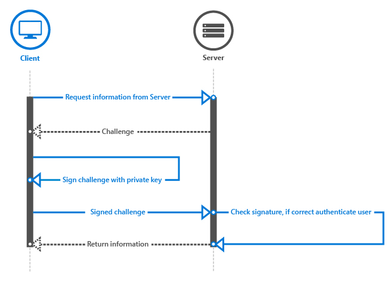

# Windows Hello

This article describes the Windows Hello technology that ships as part of Windows and discusses how developers can implement this technology to protect their Windows apps and backend services. It highlights specific capabilities of these technologies that help mitigate threats that arise from using conventional credentials and provides guidance about designing and deploying these technologies as part of a Windows client rollout.

> [!NOTE]
> This article focuses on app development. For information on the architecture and implementation details of Windows Hello, see [Plan a Windows Hello for Business deployment](/windows/security/identity-protection/hello-for-business/deploy/).

For a step-by-step walkthrough on creating a WinUI app using Windows Hello and the backing authentication service, see the [Windows Hello login app](windows-hello-login.md) and [Windows Hello login service](windows-hello-auth-service.md) articles.

## Introduction

A fundamental assumption about information security is that a system can identify who is using it. Identifying a user allows the system to decide whether the user is identified appropriately (a process known as authentication), and then decide what a properly authenticated user should be able to do (authorization). The overwhelming majority of computer systems deployed throughout the world depend on user credentials for making authentication and authorization decisions, which means that these systems depend on reusable, user-created passwords as the basis for their security. The oft-cited maxim that authentication can involve "something you know, something you have, or something you are" neatly highlights the issue: a reusable password is an authentication factor all by itself, so anyone who knows the password can impersonate the user who owns it.

### Problems with traditional credentials

Ever since the mid-1960s, when Fernando Corbató and his team at the Massachusetts Institute of Technology championed the introduction of the password, users and administrators have had to deal with the use of passwords for user authentication and authorization. Over time, the state of the art for password storage and use has advanced somewhat (with secure hashing and salting, for example), but we are still faced with two problems. Passwords are easy to clone and they are easy to steal. In addition, implementation faults may render them insecure, and users have a hard time balancing convenience and security.

#### Credential theft

The biggest risk of passwords is simple: an attacker can steal them easily. Every place a password is entered, processed, or stored is vulnerable. For example, an attacker can steal a collection of passwords or hashes from an authentication server by eavesdropping on network traffic to an application server, by implanting malware in an application or on a device, by logging user keystrokes on a device, or by watching to see which characters a user types. These are just the most common attack methods.

Another related risk is that of credential replay, in which an attacker captures a valid credential by eavesdropping on an insecure network, and then replays it later to impersonate a valid user. Most authentication protocols (including Kerberos and OAuth) protect against replay attacks by including a time stamp in the credential exchange process, but that tactic only protects the token that the authentication system issues, not the password that the user provides to get the ticket in the first place.

#### Credential reuse

The common approach of using an email address as the username makes a bad problem worse. An attacker who successfully recovers a username–password pair from a compromised system can then try that same pair on other systems. This tactic works surprisingly often to allow attackers to springboard from a compromised system into other systems. The use of email addresses as usernames leads to additional problems that we will explore later in this guide.

### Solving credential problems

Solving the problems that passwords pose is tricky. Tightening password policies alone will not do it; users may just recycle, share, or write down passwords. Although user education is critical for authentication security, education alone does not eliminate the problem either.

Windows Hello replaces passwords with strong two-factor authentication (2FA) by verifying existing credentials and by creating a device-specific credential that a biometric or PIN-based user gesture protects.

## What is Windows Hello?

Windows Hello is the name Microsoft has given to the new biometric sign-in system built into Windows. Because it is built directly into the operating system, Windows Hello allows face or fingerprint identification to unlock users’ devices. Authentication happens when the user supplies his or her unique biometric identifier to access the device-specific credentials, which means that an attacker who steals the device can’t log on to it unless that attacker has the PIN. The Windows secure credential store protects biometric data on the device. By using Windows Hello to unlock a device, the authorized user gains access to all of his or her Windows experience, apps, data, websites, and services.

The Windows Hello authenticator is known as a Hello. A Hello is unique to the combination of an individual device and a specific user. It does not roam across devices, is not shared with a server or calling app, and cannot easily be extracted from a device. If multiple users share a device, each user needs to set up his or her own account. Every account gets a unique Hello for that device. You can think of a Hello as a token you can use to unlock (or release) a stored credential. The Hello itself does not authenticate you to an app or service, but it releases credentials that can. In other words, the Hello is not a user credential but it is a second factor for the authenticating process.

### Windows Hello authentication

Windows Hello provides a robust way for a device to recognize an individual user, which addresses the first part of the path between a user and a requested service or data item. After the device has recognized the user, it still must authenticate the user before determining whether to grant access to a requested resource. Windows Hello provides strong 2FA that is fully integrated into Windows and replaces reusable passwords with the combination of a specific device, and a biometric gesture or PIN.

Windows Hello is not just a replacement for traditional 2FA systems, though. It is conceptually similar to smart cards: authentication is performed by using cryptographic primitives instead of string comparisons, and the user’s key material is secure inside tamper-resistant hardware. Windows Hello does not require the extra infrastructure components required for smart card deployment, either. In particular, you do not need a Public Key Infrastructure (PKI) to manage certificates, if you do not currently have one. Windows Hello combines the major advantages of smart cards—deployment flexibility for virtual smart cards and robust security for physical smart cards—without any of their drawbacks.

### How Windows Hello works

When the user sets up Windows Hello on his or her machine, it generates a new public–private key pair on the device. The [trusted platform module](/windows/keep-secure/trusted-platform-module-overview) (TPM) generates and protects this private key. If the device does not have a TPM chip, the private key is encrypted and protected by software. In addition TPM-enabled devices generate a block of data that can be used to attest that a key is bound to TPM. This attestation information can be used in your solution to decide if the user is granted a different authorization level for example.

To enable Windows Hello on a device, the user must have either their Microsoft Entra ID account or Microsoft Account connected in Windows settings.

#### How keys are protected

Any time key material is generated, it must be protected against attack. The most robust way to do this is through specialized hardware. There is a long history of using hardware security modules (HSMs) to generate, store, and process keys for security-critical applications. Smart cards are a special type of HSM, as are devices that are compliant with the Trusted Computing Group TPM standard. Wherever possible, the Windows Hello implementation takes advantage of onboard TPM hardware to generate, store, and process keys. However, Windows Hello and Windows Hello for Work do not require an onboard TPM.

Whenever feasible, Microsoft recommends the use of TPM hardware. The TPM protects against a variety of known and potential attacks, including PIN brute-force attacks. The TPM provides an additional layer of protection after an account lockout as well. When the TPM has locked the key material, the user must reset the PIN. Resetting the PIN means that all keys and certificates encrypted with the old key material will be removed.

#### Authentication

When a user wants to access protected key material, the authentication process begins with the user entering a PIN or biometric gesture to unlock the device, a process sometimes called "releasing the key".

An application can never use the keys from another application, nor can someone ever use the keys from another user. These keys are used to sign requests that are sent to the identity provider or IDP, seeking access to specified resources. Applications can use specific APIs to request operations that require key material for particular actions. Access through these APIs does require explicit validation through a user gesture, and the key material is not exposed to the requesting application. Rather, the application asks for a specific action like signing a piece of data, and the Windows Hello layer handles the actual work and returns the results.

### Getting ready to implement Windows Hello

Now that we have a basic understanding of how Windows Hello works, let us take a look at how to implement them in our own applications.

There are different scenarios we can implement using Windows Hello. For example, just logging on to your app on a device. The other common scenario would be to authenticate against a service. Instead of using a logon name and password, you will be using Windows Hello. In the following sections, we will discuss implementing a couple of different scenarios, including how to authenticate against your services with Windows Hello, and how to convert from an existing username/password system to a Windows Hello system.

## Implementing Windows Hello

In this section, we begin with a greenfield scenario with no existing authentication system, and we explain how to implement Windows Hello.

The next section covers how to migrate from an existing username/password system. However, even if that section interests you more, you may want to look through this one to get a basic understanding of the process and the code required.

### Enrolling new users

We begin with a brand new service that will use Windows Hello, and a hypothetical new user who is ready to sign up on a new device.

The first step is to verify that the user is able to use Windows Hello. The app verifies user settings and machine capabilities to make sure it can create user ID keys. If the app determines the user has not yet enabled Windows Hello, it prompts the user to set this up before using the app.

To enable Windows Hello, the user just needs to set up a PIN in Windows settings, unless the user set it up during the Out of Box Experience (OOBE).

The following lines of code show a simple way to check if the user is set up for Windows Hello.

```csharp
var keyCredentialAvailable = await KeyCredentialManager.IsSupportedAsync();
if (!keyCredentialAvailable)
{
    // User didn't set up PIN yet
    return;
}
```

The next step is to ask the user for information to sign up with your service. You may choose to ask the user for first name, last name, email address, and a unique username. You could use the email address as the unique identifier; it is up to you.

In this scenario, we use the email address as the unique identifier for the user. Once the user signs up, you should consider sending a validation email to ensure the address is valid. This gives you a mechanism to reset the account if necessary.

If the user has set up his or her PIN, the app creates the user’s [KeyCredential](/uwp/api/Windows.Security.Credentials.KeyCredential). The app also gets the optional key attestation information to acquire cryptographic proof that the key is generated on the TPM. The generated public key, and optionally the attestation, is sent to the backend server to register the device being used. Every key pair generated on every device will be unique.

The code to create the [KeyCredential](/uwp/api/Windows.Security.Credentials.KeyCredential) looks like this:

```csharp
var keyCreationResult = await KeyCredentialManager.RequestCreateAsync(
    AccountId, KeyCredentialCreationOption.ReplaceExisting);
```

The [RequestCreateAsync](/previous-versions/windows/dn973048(v=win.10)) is the call that creates the public and private key. If the device has the right TPM chip, the APIs will request the TPM chip to create the private and public key and store the result; if there is no TPM chip available, the OS will create the key pair in code. There is no way for the app to access the created private keys directly. Part of the creation of the key pairs is also the resulting Attestation information. (See the next section for more information about attestation.)

After the key pair and attestation information are created on the device, the public key, the optional attestation information, and the unique identifier (such as the email address) need to be sent to the backend registration service and stored in the backend.

To allow the user to access the app on multiple devices, the backend service needs to be able to store multiple keys for the same user. Because every key is unique for every device, we will store all these keys connected to the same user. A device identifier is used to help optimize the server part when authenticating users. We talk about this in more detail in the next section.

A sample database schema to store this information at the backend might look like this:


The registration logic might look like this:


The registration information you collect may of course include a lot more identifying information than we include in this simple scenario. For example, if your app accesses a secured service such as one for banking, you would need to request proof of identity and other things as part of the sign-up process. Once all the conditions are met, the public key of this user will be stored in the backend and used to validate the next time the user uses the service.

```csharp
using System;
using System.Runtime;
using System.Threading.Tasks;
using Windows.Storage.Streams;
using Windows.Security.Credentials;

static async void RegisterUser(string AccountId)
{
    var keyCredentialAvailable = await KeyCredentialManager.IsSupportedAsync();
    if (!keyCredentialAvailable)
    {
        // The user didn't set up a PIN yet
        return;
    }

    var keyCreationResult = await KeyCredentialManager.RequestCreateAsync(AccountId, KeyCredentialCreationOption.ReplaceExisting);
    if (keyCreationResult.Status == KeyCredentialStatus.Success)
    {
        var userKey = keyCreationResult.Credential;
        var publicKey = userKey.RetrievePublicKey();
        var keyAttestationResult = await userKey.GetAttestationAsync();
        IBuffer keyAttestation = null;
        IBuffer certificateChain = null;
        bool keyAttestationIncluded = false;
        bool keyAttestationCanBeRetrievedLater = false;

        keyAttestationResult = await userKey.GetAttestationAsync();
        KeyCredentialAttestationStatus keyAttestationRetryType = 0;

        switch (keyAttestationResult.Status)
        {
            case KeyCredentialAttestationStatus.Success:
                keyAttestationIncluded = true;
                keyAttestation = keyAttestationResult.AttestationBuffer;
                certificateChain = keyAttestationResult.CertificateChainBuffer;
                break;
            case KeyCredentialAttestationStatus.TemporaryFailure:
                keyAttestationRetryType = KeyCredentialAttestationStatus.TemporaryFailure;
                keyAttestationCanBeRetrievedLater = true;
                break;
            case KeyCredentialAttestationStatus.NotSupported:
                keyAttestationRetryType = KeyCredentialAttestationStatus.NotSupported;
                keyAttestationCanBeRetrievedLater = true;
                break;
        }
    }
    else if (keyCreationResult.Status == KeyCredentialStatus.UserCanceled ||
        keyCreationResult.Status == KeyCredentialStatus.UserPrefersPassword)
    {
        // Show error message to the user to get confirmation that user
        // does not want to enroll.
    }
}
```

#### Attestation

When creating the key pair, there is also an option to request the attestation information, which is generated by the TPM chip. This optional information can be sent to the server as part of the sign-up process. TPM key attestation is a protocol that cryptographically proves that a key is TPM-bound. This type of attestation can be used to guarantee that a certain cryptographic operation occurred in the TPM of a particular computer.

When it receives the generated RSA key, the attestation statement, and the AIK certificate, the server verifies the following conditions:

- The AIK certificate signature is valid.
- The AIK certificate chains up to a trusted root.
- The AIK certificate and its chain is enabled for EKU OID "2.23.133.8.3" (friendly name is "Attestation Identity Key Certificate").
- The AIK certificate is time valid.
- All issuing CA certificates in the chain are time-valid and not revoked.
- The attestation statement is formed correctly.
- The signature on [KeyAttestation](/uwp/api/Windows.Security.Cryptography.Certificates.KeyAttestationHelper) blob uses an AIK public key.
- The public key included in the [KeyAttestation](/uwp/api/Windows.Security.Cryptography.Certificates.KeyAttestationHelper) blob matches the public RSA key that client sent alongside the attestation statement.

Your app might assign the user a different authorization level, depending on these conditions. For instance, if one of these checks fail, it might not enroll the user or it might limit what the user can do.

### Logging on with Windows Hello

Once the user is enrolled in your system, he or she can use the app. Depending on the scenario, you can ask users to authenticate before they can start using the app or just ask them to authenticate once they start using your backend services.

### Force the user to sign in again

For some scenarios, you may want the user to prove he or she is the person who is currently signed in, before accessing the app or sometimes before performing a certain action inside of your app. For example, before a banking app sends the transfer money command to the server, you want to make sure it is the user, rather than someone who found a logged-in device, attempting to perform a transaction. You can force the user to sign in again in your app by using the [UserConsentVerifier](/uwp/api/Windows.Security.Credentials.UI.UserConsentVerifier) class. The following line of code will force the user to enter their credentials.

The following line of code will force the user to enter their credentials.

```csharp
UserConsentVerificationResult consentResult = await UserConsentVerifier.RequestVerificationAsync("userMessage");
if (consentResult.Equals(UserConsentVerificationResult.Verified))
{
    // continue
}
```

You can also use the challenge response mechanism from the server, which requires a user to enter his or her PIN code or biometric credentials. It depends on the scenario you as a developer need to implement. This mechanism is described in the following section.

### Authentication at the backend

When the app attempts to access a protected backend service, the service sends a challenge to the app. The app uses the private key from the user to sign the challenge and sends it back to the server. Since the server has stored the public key for that user, it uses standard crypto APIs to make sure the message was indeed signed with the correct private key. On the client, the signing is done by the Windows Hello APIs; the developer will never have access to any user’s private key.

In addition to checking the keys, the service can also check the key attestation and discern if there are any limitations invoked on how the keys are stored on the device. For example, when the device uses TPM to protect the keys, it is more secure than devices storing the keys without TPM. The backend logic could decide, for example, that the user is only allowed to transfer a certain amount of money when no TPM is used to reduce the risks.

Attestation is only available for devices with a TPM chip that’s version 2.0 or later. Therefore, you need to take into account that this information might not be available on every device.

The client workflow might look like the following chart:


When the app calls the service on the backend, the server sends a challenge. The challenge is signed with the following code:

```csharp
var openKeyResult = await KeyCredentialManager.OpenAsync(AccountId);

if (openKeyResult.Status == KeyCredentialStatus.Success)
{
    var userKey = openKeyResult.Credential;
    var publicKey = userKey.RetrievePublicKey();
    var signResult = await userKey.RequestSignAsync(message);

    if (signResult.Status == KeyCredentialStatus.Success)
    {
        return signResult.Result;
    }
    else if (signResult.Status == KeyCredentialStatus.UserPrefersPassword)
    {

    }
}
```

The first line, [KeyCredentialManager.OpenAsync](/uwp/api/windows.security.credentials.keycredentialmanager.openasync), will ask Windows to open the key handle. If that's successful, you can sign the challenge message with the [KeyCredential.RequestSignAsync](/uwp/api/windows.security.credentials.keycredential.requestsignasync) method, causing Windows to request the user’s PIN or biometrics through Windows Hello. At no time will the developer have access to the private key of the user. This is all kept secure through the APIs.

The APIs request Windows to sign the challenge with the private key. The system then asks the user for a PIN code or a configured biometric logon. When the correct information is entered, the system can ask the TPM chip to perform the cryptographic functions and sign the challenge. (Or use the fallback software solution, if no TPM is available). The client must send the signed challenge back to the server.

A basic challenge–response flow is shown in this sequence diagram:



Next, the server must validate the signature. When you request the public key and send it to the server to use for future validation, it is in an ASN.1-encoded publicKeyInfo blob. If you examine the [Windows Hello code sample on GitHub](https://github.com/Microsoft/Windows-universal-samples/tree/master/Samples/MicrosoftPassport), you will see that there are helper classes to wrap Crypt32 functions to translate the ASN.1-encoded blob to a CNG blob, which is more commonly used. The blob contains the public key algorithm, which is RSA, and the RSA public key.

In the sample, the reason we convert the ASN.1-encoded blob to a CNG blob is so that it can be used with [CNG](/windows/win32/SecCNG/cng-portal) and the BCrypt API. If you look up the CNG blob, it will point you to the related [BCRYPT_KEY_BLOB structure](/windows/win32/api/bcrypt/ns-bcrypt-bcrypt_key_blob). This API surface can be used for authentication and encryption in Windows applications. ASN.1 is a documented standard for communicating data structures that can be serialized, and it's commonly used in public key cryptography and with certificates. That's why the public key information is returned in this manner. The public key is an RSA key; and that's the algorithm that Windows Hello uses when it signs data.

Once you have the CNG blob, you need to validate the signed challenge against the public key of the user. Since everyone uses his or her own system or backend technology, there is no generic way to implement this logic. We are using SHA256 as the hash algorithm and Pkcs1 for SignaturePadding, so make sure that’s what you use when you validate the signed response from the client. Again, refer to the sample for a way to do it on your server in .NET 4.6, but in general it will look something like this:

```csharp
using (RSACng pubKey = new RSACng(publicKey))
{
    retval = pubKey.VerifyData(originalChallenge, responseSignature, HashAlgorithmName.SHA256, RSASignaturePadding.Pkcs1);
}
```

We read the stored public key, which is an RSA key. We validate the signed challenge message with the public key and if this checks out, we authorize the user. If the user is authenticated, the app can call the backend services as normal.

The complete code might look something like the following:

```csharp
using System;
using System.Runtime;
using System.Threading.Tasks;
using Windows.Storage.Streams;
using Windows.Security.Cryptography;
using Windows.Security.Cryptography.Core;
using Windows.Security.Credentials;

static async Task<IBuffer> GetAuthenticationMessageAsync(IBuffer message, String AccountId)
{
    var openKeyResult = await KeyCredentialManager.OpenAsync(AccountId);

    if (openKeyResult.Status == KeyCredentialStatus.Success)
    {
        var userKey = openKeyResult.Credential;
        var publicKey = userKey.RetrievePublicKey();
        var signResult = await userKey.RequestSignAsync(message);
        if (signResult.Status == KeyCredentialStatus.Success)
        {
            return signResult.Result;
        }
        else if (signResult.Status == KeyCredentialStatus.UserCanceled)
        {
            // Launch app-specific flow to handle the scenario 
            return null;
        }
    }
    else if (openKeyResult.Status == KeyCredentialStatus.NotFound)
    {
        // PIN reset has occurred somewhere else and key is lost.
        // Repeat key registration
        return null;
    }
    else
    {
        // Show custom UI because unknown error has happened.
        return null;
    }
}
```

Implementing the correct challenge–response mechanism is outside the scope of this document, but this topic is something that requires attention in order to successfully create a secure mechanism to prevent things like replay attacks or man-in-the-middle attacks.

### Enrolling another device

It's common for users to have multiple devices with the same apps installed today. How does this work when using Windows Hello with multiple devices?

When using Windows Hello, every device will create a unique private and public key set. This means that if you want a user to be able to use multiple devices, your backend must be able to store multiple public keys from this user. Refer to the database diagram in the [Enrolling new users](#enrolling-new-users) section for an example of the table structure.

Registering another device is nearly the same as registering a user for the first time. You still need to ensure that the user registering for this new device is really the user they claim to be. You can do so with any two-factor authentication mechanism that is used today. There are several ways to accomplish this in a secure way. It all depends on your scenario.

For example, if you still use login name and password you can use that to authenticate the user and ask them to use one of their verification methods like SMS or email. If you don’t have a login name and password, you can also use one of the already registered devices and send a notification to the app on that device. The MSA authenticator app is an example of this. In short, you should use a common 2FA mechanism to register extra devices for the user.

The code to register the new device is exactly the same as registering the user for the first time (from within the app).

```csharp
var keyCreationResult = await KeyCredentialManager.RequestCreateAsync(
    AccountId, KeyCredentialCreationOption.ReplaceExisting);
```

To make it easier for the user to recognize which devices are registered, you can choose to send the device name or another identifier as part of the registration. This is also useful, for example, if you want to implement a service on your backend where users can unregister devices when a device is lost.

### Using multiple accounts in your app

In addition to supporting multiple devices for a single account, it is also common to support multiple accounts in a single app. For example, maybe you are connecting to multiple Twitter accounts from within your app. With Windows Hello, you can create multiple key pairs and support multiple accounts inside your app.

One way of doing this is keeping the username or unique identifier described in the previous section on isolated storage. Therefore, every time you create a new account, you store the account ID in isolated storage.

In the app UI, you allow the user to either choose one of the previously created accounts or sign up with a new one. The flow of creating a new account is the same as described before. Choosing an account is a matter of listing the stored accounts on the screen. Once the user selects an account, use the account ID to log on the user in your app:

```csharp
var openKeyResult = await KeyCredentialManager.OpenAsync(AccountId);
```

The rest of the flow is the same as described earlier. To be clear, all these accounts are protected by the same PIN or biometric gesture since in this scenario they are being used on a single device with the same Windows Account.

## Migrating an Existing System to Windows Hello

In this short section, we will address an existing packaged app and backend system that uses a database that stores the username and hashed password. These apps collect credentials from the user when the app starts and use them when the backend system returns the authentication challenge.

Here, we will describe what pieces need to be changed or replaced to make Windows Hello work.

We have already described most of the techniques in the earlier sections. Adding Windows Hello to your existing system involves adding a couple of different flows in the registration and authentication part of your code.

One approach is to let the user choose when to upgrade. After the user logs on to the app and you detect that the app and OS are capable of supporting Windows Hello, you can ask the user if he or she wants to upgrade credentials to use this modern and more secure system. You can use the following code to check whether the user is capable of using Windows Hello.

```csharp
var keyCredentialAvailable = await KeyCredentialManager.IsSupportedAsync();
```

The UI might look something like this:


If the user elects to start using Windows Hello, you create the [KeyCredential](/uwp/api/Windows.Security.Credentials.KeyCredential) described before. The backend registration server adds the public key and optional attestation statement to the database. Because the user is already authenticated with username and password, the server can link the new credentials to the current user information in the database. The database model could be the same as the example described earlier.

If the app was able to create the users [KeyCredential](/uwp/api/Windows.Security.Credentials.KeyCredential), it stores the user ID in isolated storage so the user can pick this account from the list once the app is started again. From this point on, the flow exactly follows the examples described in earlier sections.

The final step in migrating to a full Windows Hello scenario is disabling the logon name and password option in the app and removing the stored hashed passwords from your database.

## Summary

Windows introduces a higher level of security that is also simple to put into practice. Windows Hello provides a new biometric sign-in system that recognizes the user and actively defeats efforts to circumvent proper identification. It can then deliver multiple layers of keys and certificates that can never be revealed or used outside the trusted platform module. In addition, a further layer of security is available through the optional use of attestation identity keys and certificates.

As a developer, you can use this guidance on design and deployment of these technologies to easily add secure authentication to your packaged Windows app rollouts to protect apps and backend services. The code required is minimal and easy to understand. Windows handles the heavy lifting.

Flexible implementation options allow Windows Hello to replace or work alongside your existing authentication system. The deployment experience is painless and economical. No additional infrastructure is needed to deploy Windows security. With Microsoft Hello built in to the operating system, Windows offers the most secure solution to the authentication problems facing the modern developer.

Mission accomplished! You just made the Internet a safer place!

## Additional resources

### Articles and sample code

- [Windows Hello overview](https://www.microsoft.com/windows/tips/windows-hello)
- [Plan a Windows Hello for Business deployment](/windows/security/identity-protection/hello-for-business/deploy/)
- [Windows Hello UWP code sample on GitHub](https://github.com/Microsoft/Windows-universal-samples/tree/master/Samples/MicrosoftPassport)

### Terminology

| Term | Definition |
| ---- | ---------- |
| AIK | An attestation identity key is used to provide such a cryptographic proof (TPM key attestation) by signing the properties of the non-migratable key and providing the properties and signature to the relying party for verification. The resulting signature is called an “attestation statement.” Since the signature is created using the AIK private key—which can only be used in the TPM that created it—the relying party can trust that the attested key is truly non-migratable and cannot be used outside that TPM. |
| AIK Certificate | An AIK certificate is used to attest to the presence of an AIK within a TPM. It is also used to attest that other keys certified by the AIK originated from that particular TPM. |
| IDP | An IDP is an identity provider. An example is the IDP build by Microsoft for Microsoft Accounts. Every time an application needs to authenticate with an MSA, it can call the MSA IDP. |
| PKI | Public key infrastructure is commonly used to point to an environment hosted by an organization itself and being responsible for creating keys, revoking keys, etc. |
| TPM | The trusted platform module can be used to create cryptographic public/private key pairs in such a way that the private key can never be revealed or used outside the TPM (that is, the key is non-migratable). |
| TPM Key Attestation | A protocol that cryptographically proves that a key is TPM-bound. This type of attestation can be used to guarantee that a certain cryptographic operation occurred in the TPM of a particular computer |

## Related topics

- [Windows Hello login app](windows-hello-login.md)
- [Windows Hello login service](windows-hello-auth-service.md)
