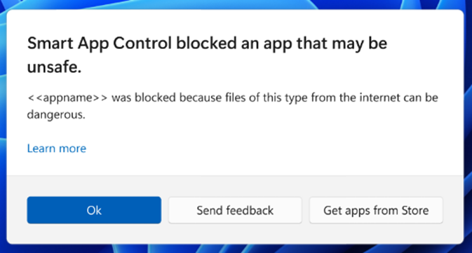

# Test your app's signature with Smart App Control

Before distributing your signed app to users, test your app's signature against Smart App Control. To match the configurations your app will be run in, test your app in a variety of Smart App Control configurations, including both evaluation and enforcement modes.

## Enable or disable Smart App Control

### Enable Smart App Control on your device

Go to **Settings** > **Windows Security** > **App and Browser Control**. 

Set Smart App Control to either **On** (enforcement mode) or **Evaluation** (evaluation mode).

If you cannot select either **On** or **Evaluation**, try [Resetting your device](/windows-hardware/service/desktop/resetting-the-pc).

### Disable Smart App Control on your device

To disable Smart App Control on your device, go to **Settings** > **Windows Security** > **App and Browser Control**. Select **Off**.

> [!IMPORTANT]
> Disabling Smart App Control is a one-way operation. Once disabled, Smart App Control cannot be re-enabled without resetting your device.

## Set Smart App Control's enforcement mode

Smart App Control starts in evaluation mode.  While Smart App Control is in evaluation mode, it will learn if it can help protect users without causing too much user friction. If Smart App Control determines the user can benefit from its enhanced security, it will automatically be turned on.  Otherwise, it will automatically be turned off.  While in evaluation mode, a user can manually turn on Smart App Control in the Windows Security App. 

### Enforcement mode

Go to **Settings** > **Windows Security** > **App and Browser Control**. Select **On** to put Smart App Control into enforcement mode mode.

### Evaluation mode

Once Smart App Control is in Enforcement mode, it cannot be reset to evaluation mode from the Settings app. To re-enter evaluation mode, execute the following steps:

1. Open a command prompt with administrator priviliges and execute the command: `manage-bde -protectors c: -disable -rebootcount 2'.
2. Reboot into the boot menu by launching **Settings** and selecting Recovery > Recovery Options > Advanced Startup > Restart now.
3. At the advanced boot menu, select Troubleshoot > Advanced > Command Prompt. A recovery command prompt will open.
    > [!NOTE]
    > The recovery command prompt opens the recovery drive `X:` by default. This does not indicate your system drive has changed. Your system drive is still associated with its usual drive letter (usually `C:`).
4. Execute the following commands:
    - `reg load HKLM\foo c:\windows\system32\config\system`
    - `reg add hklm\foo\controlset001\control\ci\policy /v VerifiedAndReputablePolicyState /t REG_DWORD /d 2 /f`
    - `reg add hklm\foo\controlset001\control\ci\protected /v VerifiedAndReputablePolicyStateMinValueSeen /t REG_DWORD /d 2 /f`
    - `reg unload hklm\foo`
9. Restart the computer.

If you followed these steps correctly, Smart App Control will be in Evaluation Mode.

### Verify Smart App Control's current mode

You can verify Smart App Control's current mode by opening a command prompt and executing the following command:

`citool.exe -lp`

Smart App Control is in **evaluation mode** if the value of `Friendly Name` is `VerifiedAndReputableDesktopEvaluation` and the value of `Is Currently Enforced` is `true'.

Smart App Control is in **enforcement mode** if the value of `Friendly Name` is `VerifiedAndReputableDesktop` and the value of `Is Currently Enforced` is `true'.

## Test your app

You should test your app in both evaluation mode and enforcement mode. 

> [!NOTE]
> WHY?

### Testing in enforcement mode

When Smart App Control runs in enforcement mode, it will display a [Toast Notification](/windows/apps/design/shell/tiles-and-notifications/toast-notifications-overview) whenever it prevents an app or binary from executing. This makes it easy to test your app; simply attempt to run the app and see if it runs or not.

### Testing in evaluation mode

Smart App Control is silent when running in evaluation mode. To see if your app would have been blocked if Smart App Control were running in enforcement mode, you must review the Smart App Control logs. Smart App Control logs can be found in the Windows Event Viewer, under **Application and Services Logs** > **Microsoft** > **Windows** > **CodeIntegrity** > **Operational**.   

Smart App Control logs evaluation mode events with event ID 3076, and enforcement mode events with event ID 3077.

> [!NOTE]
> The Word doc indicates there's a Partner Center toggle that must be completed before events will be logged. The link in the document did not work for me. Is that something a user will have to do?

## Windows Defender and Smart App Control

When Smart App Control is turned on or in evaluation mode, the Defender client goes into passive mode in the presence of another anti-virus. Passive mode supports Smart App Control’s reputation retrieval from Microsoft’s Application Intelligence service, but it does not cover active monitoring of the device. Third-party anti-virus is responsible for all active monitoring activities. The performance impact of passive mode on the device is minimal. 
