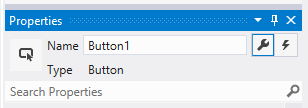
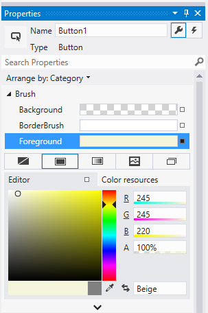
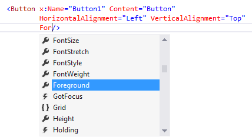
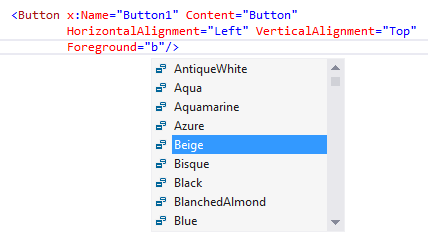
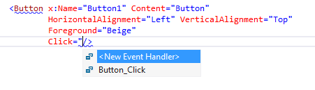

# Intro to controls and events

In Windows app development, a *control* is a UI element that displays content or enables interaction. You create the UI for your app by using controls such as buttons, text boxes, and combo boxes to display data and get user input.

> **Important APIs**: [Microsoft.UI.Xaml.Controls namespace](/windows/windows-app-sdk/api/winrt/microsoft.ui.xaml.controls)

A *pattern* is a recipe for modifying a control or combining several controls to make something new. For example, the [list/details](../../../design/controls/list-details.md) pattern is a way that you can use a [SplitView](../../../design/controls/split-view.md) control for app navigation.

In many cases, you can use a control as-is. But XAML controls separate function from structure and appearance, so you can make various levels of modification to make them fit your needs. You can use [XAML styles](../../platform/xaml/xaml-styles.md) and [control templates](../../platform/xaml/xaml-control-templates.md) to modify a control.

In this section, we provide guidance for each of the XAML controls you can use to build your app UI. To start, this article shows you how to add controls to your app. There are 3 key steps to using controls to your app:

- Add a control to your app UI.
- Set properties on the control, such as width, height, or foreground color.
- Add code to the control's event handlers so that it does something.

## Add a control
You can add a control to an app in several ways:

- Add the control to the XAML markup in the Visual Studio XAML editor.
- Add the control in code. Controls that you add in code are visible when the app runs, but are not visible in the Visual Studio XAML designer.

In Visual Studio, when you add and manipulate controls in your app, you can use many of the program's features, including the Toolbox, XAML editor, and the Properties window.

The Visual Studio Toolbox displays many of the controls that you can use in your app. To add a control to your app, double-click it in the Toolbox. For example, when you double-click the TextBox control, this XAML is added to the XAML view.

```xaml
<TextBox HorizontalAlignment="Left" Text="TextBox" VerticalAlignment="Top"/>
```

## Set the name of a control

To work with a control in code, you set its [x:Name](/windows/apps/develop/platform/xaml/x-name-attribute) attribute and reference it by name in your code. You can set the name in the Visual Studio Properties window or in XAML. Here's how to set the name of the currently selected control by using the Name text box at the top of the Properties window.

To name a control
1. Select the element to name.
2. In the Properties panel, type a name into the Name text box.
3. Press Enter to commit the name.



Here's how to set the name of a control in the XAML editor by adding the x:Name attribute.

```xaml
<Button x:Name="Button1" Content="Button"/>
```

## Set the control properties

You use properties to specify the appearance, content, and other attributes of controls. When you add a control using a design tool, some properties that control size, position, and content might be set for you by Visual Studio.

You can set control properties in in XAML, or in code. For example, to change the foreground color for a Button, you set the control's Foreground property. This illustration shows how to set the Foreground property by using the color picker in the Properties window.



Here's how to set the Foreground property in the XAML editor. Notice the Visual Studio IntelliSense window that opens to help you with the syntax.





Here's the resulting XAML after you set the Foreground property.

```xaml
<Button x:Name="Button1" Content="Button"
        HorizontalAlignment="Left" VerticalAlignment="Top"
        Foreground="Beige"/>
```

Here's how to set the Foreground property in code.

```csharp
Button1.Foreground = new SolidColorBrush(Microsoft.UI.Colors.Beige);
```
```cppwinrt
Button1().Foreground(Media::SolidColorBrush(Windows::UI::Colors::Beige()));
```

## Create an event handler

Every control exposes events that let you respond to user actions or other changes in your app. A Button, for example, raises a `Click` event when a user clicks it. To respond to that event, you write an *event handler*—a method that runs when the event is raised. You can wire up an event handler in the Properties window, in XAML, or in code-behind. For more info about events, see [Events and routed events overview](/windows/apps/develop/platform/xaml/events-and-routed-events-overview).

### Event handler parameters

Every event handler receives two parameters:

- **`sender`** – A reference to the object that raised the event. It's typed as **Object**, so you typically cast it to a more specific type (such as `Button`) when you need to inspect or change the sender's state. Cast to whatever type is safe based on where the handler is attached.
- **`e`** (or **`args`**) – The event data, which carries information specific to the event.

The following example handles the `Click` event of a Button named `Button1`. When the button is clicked, its foreground color is set to blue.

```csharp
private void Button_Click(object sender, RoutedEventArgs e)
{
    Button b = (Button)sender;
    b.Foreground = new SolidColorBrush(Microsoft.UI.Colors.Blue);
}
```
```cppwinrt
#MainPage.h
struct MainPage : MainPageT<MainPage>
    {
        MainPage();
        ...
        void Button1_Click(winrt::Windows::Foundation::IInspectable const& sender, winrt::Microsoft::UI::Xaml::RoutedEventArgs const& e);
    };

#MainPage.cpp
void MainPage::Button1_Click(winrt::Windows::Foundation::IInspectable const& sender, winrt::Microsoft::UI::Xaml::RoutedEventArgs const& e)
    {
        auto b{ sender.as<winrt::Microsoft::UI::Xaml::Controls::Button>() };
        b.Foreground(Media::SolidColorBrush(Windows::UI::Colors::Blue()));
    }
```

### Associate an event handler in XAML

In the XAML editor, start typing the event name you want to handle. Visual Studio opens an IntelliSense window as you type. Double-click `<New Event Handler>` to create a handler with the default name, or select an existing handler from the list.



This example associates a `Click` event with a handler named `Button_Click` in XAML:

```xaml
<Button Name="Button1" Content="Button" Click="Button_Click"/>
```

### Associate an event handler in code

You can also wire up the handler entirely in code-behind:

```csharp
Button1.Click += new RoutedEventHandler(Button_Click);
```
```cppwinrt
Button1().Click({ this, &MainPage::Button1_Click });
```

## Related topics

- [Index of controls by function](../../../design/controls/index.md)
- [Microsoft.UI.Xaml.Controls namespace](/windows/windows-app-sdk/api/winrt/microsoft.ui.xaml.controls)
- [Layout](../../../design/layout/index.md)
- [Style](../../../design/style/index.md)
- [Usability](../../../design/usability/index.md)
