# Controls for Windows apps

Controls are the UI elements that make up your Windows app—buttons, text fields, lists, pickers, and more. A *control* displays content or lets users interact with your app. A *pattern* combines multiple controls into a reusable recipe for common scenarios like forms or list-detail layouts.

Windows provides over 45 ready-to-use controls, all built on the [Fluent Design System](https://developer.microsoft.com/fluentui#/). From simple toggles to rich data views like grid and list, these controls help you build interfaces that are visually polished, accessible, and responsive across devices.

Browse the articles in this section for design guidance, code examples, and best practices for each control and pattern.

## Getting started

To learn how to add controls to your app and wire up event handlers, see [Add controls and handle events](controls-and-events-intro.md). To customize control appearance with reusable XAML styles, see [Styling controls](../../platform/xaml/xaml-styles.md).

## Controls

The following table lists the Windows app controls available in WinUI, with links to their documentation.

### Basic input

| Image | Control | Description |
|---|---|---|
|  | [Buttons](buttons.md) | A control that responds to user input and raises a Click event. Includes button, drop-down button, split button, toggle button, and more. |
|  | [Check boxes](checkbox.md) | A control that a user can select or clear. |
|  | [Combo boxes](combo-box.md) | A drop-down list of items a user can select from. |
| 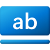 | [Hyperlinks](hyperlinks.md) | A button that appears as hyperlink text, and can navigate to a URI or handle a Click event. |
|  | [Radio buttons](radio-button.md) | A control that allows a user to select a single option from a group of options. |
|  | [Rating control](rating.md) | Rate something 1 to 5 stars. |
| 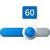 | [Sliders](slider.md) | A control that lets the user select from a range of values by moving a Thumb control along a track. |
|  | [Toggle switches](toggles.md) | A switch that can be toggled between 2 states. |

### Collections

| Image | Control | Description |
|---|---|---|
| 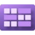 | [Items view](itemsview.md) | A control that presents a collection of items using various layouts. |
| 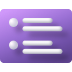 | [List view and grid view](listview-and-gridview.md) | Controls that present a collection of items in a vertical list or in rows and columns. |
|  | [Flip view](flipview.md) | Presents a collection of items that the user can flip through, one item at a time. |
| 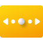 | [Pips pager](pipspager.md) | A control to let the user navigate through a paginated collection when the page numbers do not need to be visually known. |
| 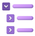 | [Tree view](tree-view.md) | A hierarchical list pattern with expanding and collapsing nodes that contain nested items. |
|  | [Items repeater](items-repeater.md) | A flexible, primitive control for data-driven layouts. |
|  | [Swipe](swipe.md) | Touch gesture for quick menu actions on items. |
| 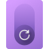 | [Pull-to-refresh](pull-to-refresh.md) | Provides the ability to pull on a collection of items in a list/grid to refresh the contents of the collection. |

### Dialogs and flyouts

| Image | Control | Description |
|---|---|---|
| 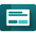 | [Dialogs](dialogs-and-flyouts/dialogs.md) | A dialog box that can be customized to contain any XAML content. |
|  | [Flyouts](dialogs-and-flyouts/flyouts.md) | Shows contextual information and enables user interaction. |
| 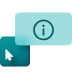 | [Teaching tip](dialogs-and-flyouts/teaching-tip.md) | A content-rich flyout for guiding users and enabling teaching moments. |

### Forms

| Image | Control | Description |
|---|---|---|
| | [Forms](forms.md) | A pattern for collecting and submitting user input using a combination of input controls and labels. |

### Media, graphics, and shapes

| Image | Control | Description |
|---|---|---|
| 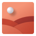 | [Icons](icons.md) | Represent icon controls that use different image types as content. |
| 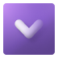 | [Animated icons](animated-icon.md) | An element that displays and controls an icon that animates when the user interacts with the control. |
|  | [Images and image brushes](images-imagebrushes.md) | A control to display image content. |
|  | [Media playback](media-playback.md) | A control to display video and image content. |
| 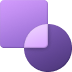 | [Shapes](shapes.md) | Draw shapes such as ellipses, rectangles, and polygons. |

> [!NOTE]
> **Inking controls (InkCanvas, InkToolbar):** These UWP controls are not available in the stable WinUI 3 channel. `InkCanvas` is available as an experimental API (introduced in Windows App SDK 2.0 Experimental 1). For current status and alternatives, see [Known control gaps](/windows/apps/windows-app-sdk/migrate-to-windows-app-sdk/what-is-supported#known-control-gaps).

### Menus and toolbars

| Image | Control | Description |
|---|---|---|
| 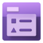 | [Menus and context menus](menus-and-context-menus.md) | Shows a contextual list of simple commands or options. |
| 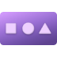 | [Command bar](command-bar.md) | A toolbar for displaying application-specific commands that handles layout and resizing of its contents. |
| 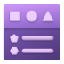 | [Command bar flyout](command-bar-flyout.md) | A mini-toolbar displaying proactive commands, and an optional menu of commands. |
| 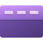 | [Menu flyout and menu bar](menus.md) | A classic menu, allowing the display of MenuItems containing MenuFlyoutItems. |

### Navigation

| Image | Control | Description |
|---|---|---|
| 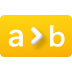 | [Breadcrumb bar](breadcrumbbar.md) | Shows the trail of navigation taken to the current location. |
| | [List/details](list-details.md) | A pattern that displays a list of items alongside the details of the currently selected item. |
| 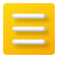 | [Navigation view](navigationview.md) | Common vertical layout for top-level areas of your app via a collapsible navigation menu. |
| 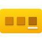 | [Pivot](pivot.md) | Presents information from different sources in a tabbed view. |
|  | [Selector bar](selector-bar.md) | Presents information from a small set of different sources. The user can pick one of them. |
| 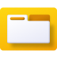 | [Tab view](tab-view.md) | A control that displays a collection of tabs that can be used to display several documents. |

### People

| Image | Control | Description |
|---|---|---|
|  | [Person picture](person-picture.md) | Displays the picture of a person/contact. |

### Pickers

| Image | Control | Description |
|---|---|---|
| 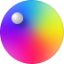 | [Color picker](color-picker.md) | A control that displays a selectable color spectrum. |
|  | [Calendar date picker](calendar-date-picker.md) | A control that lets users pick a date value using a calendar. |
| 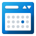 | [Calendar view](calendar-view.md) | A control that presents a calendar for a user to choose a date from. |
| 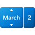 | [Date picker](date-picker.md) | A control that lets a user pick a date value. |
| 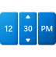 | [Time picker](time-picker.md) | A configurable control that lets a user pick a time value. |

### Scrolling and layout

| Image | Control | Description |
|---|---|---|
| 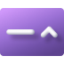 | [Expander](expander.md) | A container with a header that can be expanded to show a body with more content. |
| 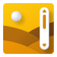 | [Scrolling and panning controls](scroll-controls.md) | A container control that lets the user pan and zoom its content. |
| 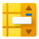 | [Annotated scrollbar](annotated-scrollbar.md) | A control that extends a regular vertical scrollbar's functionality for an easy navigation through large collections. |
| 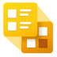 | [Semantic zoom](semantic-zoom.md) | Lets the user zoom between two different views of a collection, making it easier to navigate through large collections of items. |
| 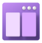 | [Split view](split-view.md) | A container that has 2 content areas, with multiple display options for the pane. |
|  | [Two-pane view](two-pane-view.md) | A control with two content areas that span the available space, either side-by-side or top-bottom. |

### Status and information

| Image | Control | Description |
|---|---|---|
| 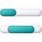 | [Progress](progress-controls.md) | Shows the app's progress on a task using a progress bar or progress ring. |
| 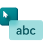 | [Tooltip](tooltips.md) | Displays information for an element in a pop-up window. |
|  | [Info bar](infobar.md) | An inline message to display app-wide status change information. |
|  | [Info badge](info-badge.md) | A non-intrusive UI to display notifications or bring focus to an area. |

### Text

| Image | Control | Description |
|---|---|---|
| 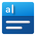 | [Auto-suggest box](auto-suggest-box.md) | A control to provide suggestions as a user is typing. |
|  | [Text block](text-block.md) | A lightweight control for displaying small amounts of text. |
|  | [Rich text block](rich-text-block.md) | A control that displays formatted text, hyperlinks, inline images, and other rich content. |
|  | [Text box](text-box.md) | A single-line or multi-line plain text field. |
|  | [Rich edit box](rich-edit-box.md) | A rich text editing control that supports formatted text, hyperlinks, and other rich content. |
| 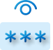 | [Password box](password-box.md) | A control for entering passwords. |
|  | [Number box](number-box.md) | A text control used for numeric input and evaluation of algebraic equations. |
| | [Labels](labels.md) | Guidance for adding accessible labels to input controls. |

### Title bar

| Image | Control | Description |
|---|---|---|
| 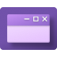 | [Title bar](title-bar.md) | Customize the title bar of your app window. |

## WinUI 3 Gallery

The **WinUI 3 Gallery** app is the best way to explore these controls hands-on. It provides interactive demos of most WinUI controls, features, and Fluent Design patterns—making it an ideal companion to this documentation. Install it to try controls in real time and link directly from individual control pages.

> [!div class="checklist"]
>
> - Get the [**WinUI 3 Gallery**](https://apps.microsoft.com/detail/9P3JFPWWDZRC) from the Microsoft Store.
> - Get the source code from [GitHub](https://github.com/Microsoft/WinUI-Gallery).

## Additional controls and resources

The [**Windows Community Toolkit**](https://github.com/CommunityToolkit/Windows) is a collection of helpers, extensions, and additional UI controls that complement the built-in WinUI controls. It's community-driven and maintained by Microsoft, covering common scenarios like advanced layouts, converters, and animations.

For early access to experimental controls and features, check out [**Windows Community Toolkit Labs**](https://github.com/CommunityToolkit/Labs-Windows), where new components are developed and tested before graduating to the main toolkit.
