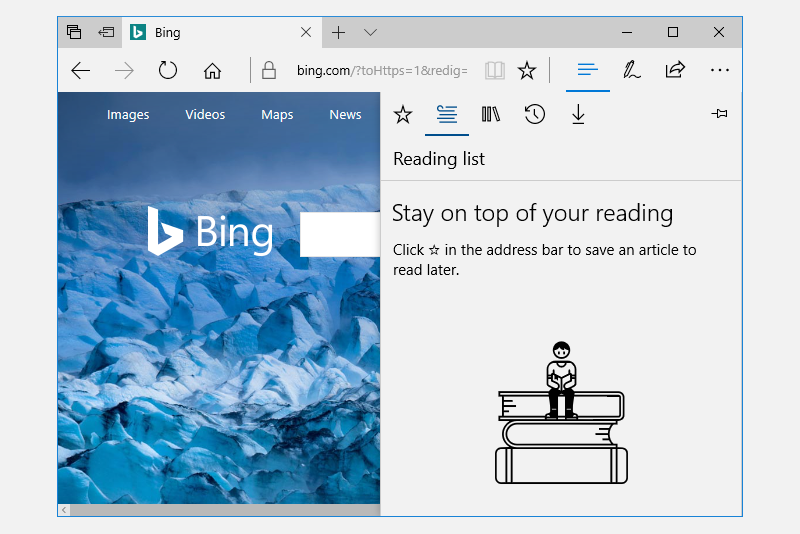

# Split view control

A split view control has an expandable/collapsible pane and a content area.

> **Important APIs**: [SplitView class](/windows/windows-app-sdk/api/winrt/microsoft.UI.Xaml.Controls.SplitView)

Here is an example of the Microsoft Edge app using SplitView to show its Hub.




 A split view's content area is always visible. The pane can expand and collapse or remain in an open state, and can present itself from either the left side or right side of an app window. The pane has four modes:

-   **Overlay**

    The pane is hidden until opened. When open, the pane overlays the content area.

-   **Inline**

    The pane is always visible and doesn't overlay the content area. The pane and content areas divide the available screen real estate.

-   **CompactOverlay**

    A narrow portion of the pane is always visible in this mode, which is just wide enough to show icons. The default closed pane width is 48px, which can be modified with `CompactPaneLength`. If the pane is opened, it will overlay the content area.

-   **CompactInline**

    A narrow portion of the pane is always visible in this mode, which is just wide enough to show icons. The default closed pane width is 48px, which can be modified with `CompactPaneLength`. If the pane is opened, it will reduce the space available for content, pushing the content out of its way.

## Is this the right control?

The split view control can be used to create any "drawer" experience where users can open and close the supplemental pane. For example, you can use SplitView to build the [list/details](list-details.md) pattern.

If you'd like to build a navigation menu with an expand/collapse button and a list of navigation items, then use the [NavigationView](navigationview.md) control.

## Create a split view

Here's a SplitView control with an open Pane appearing inline next to the Content.
```xaml
<SplitView IsPaneOpen="True"
           DisplayMode="Inline"
           OpenPaneLength="296">
    <SplitView.Pane>
        <TextBlock Text="Pane"
                   FontSize="24"
                   VerticalAlignment="Center"
                   HorizontalAlignment="Center"/>
    </SplitView.Pane>

    <Grid>
        <TextBlock Text="Content"
                   FontSize="24"
                   VerticalAlignment="Center"
                   HorizontalAlignment="Center"/>
    </Grid>
</SplitView>
```

## Get the sample code

> [!div class="nextstepaction"]
> [Open the WinUI 3 Gallery app and see SplitView in action](winui3gallery://item/SplitView)

[!INCLUDE [winui-3-gallery](../../../../includes/winui-3-gallery.md)]

## Related topics
- [Nav pane pattern](navigationview.md)
- [List view](lists.md)
- [List/details](list-details.md)