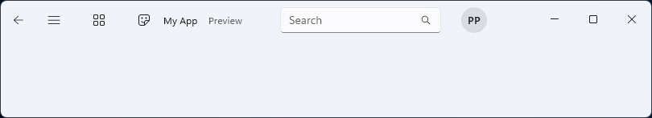
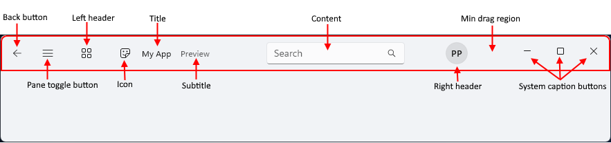

# Title bar

The TitleBar control provides a simplified way to create a custom title bar for your app. The title bar is a fundamental component of a Windows app's user interface that identifies the app via its icon and title, houses the system caption buttons that let a user close, maximize, minimize, and restore the window, and lets a user drag the window around the screen.

You can use a custom title bar to better integrate the title bar area with your app UI. The title bar can be customized to match the app's visual style using Mica theming. It can include other relevant information, such as a document title or the current state (e.g., “Editing,” “Viewing,” etc.). It can also host other WinUI 3 controls, like AutoSuggestBox and PersonPicture, providing a cohesive user experience for your app.



## Is this the right control?

Use the TitleBar control when you want to integrate the title bar area with your app UI using customizations such as subtitles, [Mica](../../../design/style/mica.md) theming, and integrations with WinUI controls.

## Anatomy

By default, the title bar shows only the system caption buttons. Other parts of the title bar are shown or hidden depending on associated property settings.

The title bar is divided into these areas:



- **Back button:** [IsBackButtonEnabled](/windows/windows-app-sdk/api/winrt/microsoft.ui.xaml.controls.titlebar.isbackbuttonenabled), [IsBackButtonVisible](/windows/windows-app-sdk/api/winrt/microsoft.ui.xaml.controls.titlebar.isbackbuttonvisible), [BackRequested](/windows/windows-app-sdk/api/winrt/microsoft.ui.xaml.controls.titlebar.backrequested) - A built-in back button for navigation.
- **Pane toggle button:** [IsPaneToggleButtonVisible](/windows/windows-app-sdk/api/winrt/microsoft.ui.xaml.controls.titlebar.ispanetogglebuttonvisible), [PaneToggleRequested](/windows/windows-app-sdk/api/winrt/microsoft.ui.xaml.controls.titlebar.panetogglerequested) - This button is intended to be used in conjunction with the NavigationView control.
- **Left header:** [LeftHeader](/windows/windows-app-sdk/api/winrt/microsoft.ui.xaml.controls.titlebar.leftheader)
- **Icon:** [IconSource](/windows/windows-app-sdk/api/winrt/microsoft.ui.xaml.controls.titlebar.iconsource)
- **Title:** [Title](/windows/windows-app-sdk/api/winrt/microsoft.ui.xaml.controls.titlebar.title)
- **Subtitle:** [Subtitle](/windows/windows-app-sdk/api/winrt/microsoft.ui.xaml.controls.titlebar.subtitle)
- **Content:** [Content](/windows/windows-app-sdk/api/winrt/microsoft.ui.xaml.controls.titlebar.content)
- **Right header:** [RightHeader](/windows/windows-app-sdk/api/winrt/microsoft.ui.xaml.controls.titlebar.rightheader)
- **Min drag region:** This area is reserved next to the system caption buttons so that the user always has a place to grab the window for dragging.
- **System caption buttons:** These buttons are not part of the TitleBar control - it simply allocates space where the caption buttons appear, depending on RTL or LTR settings. Caption buttons and customizations are handled by the [AppWindowTitleBar](/windows/windows-app-sdk/api/winrt/microsoft.ui.windowing.appwindowtitlebar).

The layout is reversed when the [FlowDirection](/windows/windows-app-sdk/api/winrt/microsoft.ui.xaml.frameworkelement.flowdirection) is **RightToLeft**.

## Create a title bar

> [!div class="checklist"]
>
> - **Important APIs:** [TitleBar class](/windows/windows-app-sdk/api/winrt/microsoft.ui.xaml.controls.titlebar), [Title property](/windows/windows-app-sdk/api/winrt/microsoft.ui.xaml.controls.titlebar.title)

> [!div class="nextstepaction"]
> [Open the WinUI 3 Gallery app and see the TitleBar in action](winui3gallery://item/TitleBar)

[!INCLUDE [winui-3-gallery](../../../../includes/winui-3-gallery.md)]

This example creates a simple title bar that replaces the system title bar. It has a title, icon, and Mica theming.

```xaml
<Window
    ...  >
    <Window.SystemBackdrop>
        <MicaBackdrop Kind="Base"/>
    </Window.SystemBackdrop>

    <Grid>
        <Grid.RowDefinitions>
            <RowDefinition Height="Auto" />
            <RowDefinition Height="*" />
        </Grid.RowDefinitions>

        <TitleBar x:Name="SimpleTitleBar"
                  Title="My App">
            <TitleBar.IconSource>
                <FontIconSource Glyph="&#xF4AA;"/>
            </TitleBar.IconSource>
        </TitleBar>

        <!-- App content -->
        <Frame x:Name="RootFrame" Grid.Row="1"/>
    </Grid>
</Window>
```

```csharp
public MainWindow()
{
    this.InitializeComponent();

    // Hides the default system title bar.
    ExtendsContentIntoTitleBar = true;
    // Replace system title bar with the WinUI TitleBar control. 
    SetTitleBar(SimpleTitleBar); 
}

```

## Integration with NavigationView

The [Navigation view](../../../design/controls/navigationview.md) has a built-in back button and pane toggle button. Fluent Design guidance recommends that these controls be placed in the title bar when a custom title bar is used.

This example demonstrates how to integrate the TitleBar control with a NavigationView control by hiding the back button and pane toggle button in the navigation view and using the corresponding buttons on the title bar instead.

```xaml
<Grid>
    <Grid.RowDefinitions>
        <RowDefinition Height="Auto" />
        <RowDefinition Height="*" />
    </Grid.RowDefinitions>

    <TitleBar Title="My App"
              IsBackButtonVisible="True"
              IsBackButtonEnabled="{x:Bind RootFrame.CanGoBack, Mode=OneWay}"
              BackRequested="TitleBar_BackRequested"
              IsPaneToggleButtonVisible="True"
              PaneToggleRequested="TitleBar_PaneToggleRequested">
    </TitleBar>

    <NavigationView x:Name="RootNavigationView" Grid.Row="1"
                    IsBackButtonVisible="Collapsed"
                    IsPaneToggleButtonVisible="False">
        <Frame x:Name="RootFrame" />
    </NavigationView>
</Grid>
```

```csharp
private void TitleBar_BackRequested(TitleBar sender, object args)
{
    if (RootFrame.CanGoBack)
    {
        RootFrame.GoBack();
    }
}

private void TitleBar_PaneToggleRequested(TitleBar sender, object args)
{
    RootNavigationView.IsPaneOpen = !RootNavigationView.IsPaneOpen;
}

```

## Related articles

- [Title bar (design)](../../../design/basics/titlebar-design.md)
- [Title bar customization](../../title-bar.md)
- [TitleBar class](/windows/windows-app-sdk/api/winrt/microsoft.ui.xaml.controls.titlebar)
