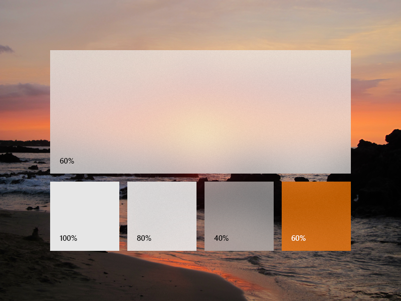
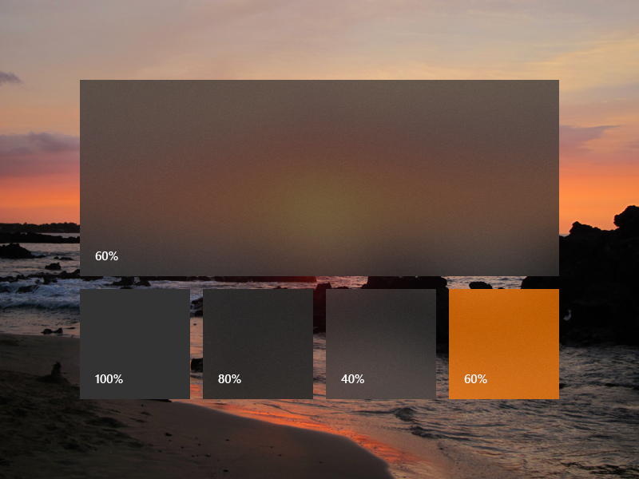
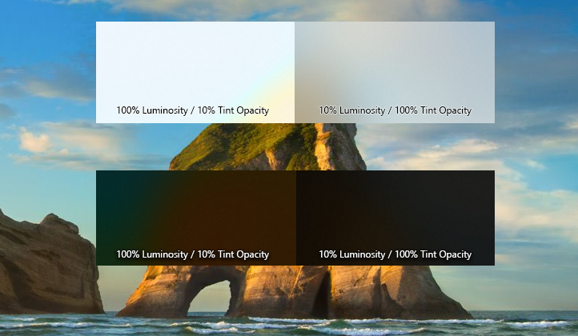

# In-app acrylic

You can apply in-app acrylic to your app's surfaces using a XAML [AcrylicBrush](/windows/windows-app-sdk/api/winrt/microsoft.ui.xaml.media.acrylicbrush) or predefined `AcrylicBrush` theme resources.

> [!NOTE]
> In WinUI 3, `AcrylicBrush` provides **in-app acrylic only** — it applies a blur and tint to XAML content within the app window, not to the desktop or content behind the window. The UWP `BackgroundSource` property (which enabled a `HostBackdrop` mode for window-level acrylic) is not available in WinUI 3. For window-level acrylic that shows the desktop through your app's window, set `Window.SystemBackdrop` to a [DesktopAcrylicBackdrop](system-backdrops.md). To apply a system backdrop material (Mica or Acrylic from the OS compositor) to a specific UI element rather than a whole window, use [SystemBackdropElement](system-backdrops.md#apply-a-system-backdrop-to-any-xaml-element).

> [!div class="nextstepaction"]
> [Open the WinUI Gallery app and see Acrylic in action](winui3gallery://item/Acrylic)

WinUI includes a collection of brush theme resources that respect the app's theme and fall back to solid colors as needed. To paint a specific surface, apply one of the theme resources to element backgrounds just as you would apply any other brush resource.

```xaml
<Grid Background="{ThemeResource AcrylicInAppFillColorDefaultBrush}">
```

> [!NOTE]
> You can view these resources in the [AcrylicBrush theme resources file, in the microsoft-ui-xaml GitHub repo](https://github.com/microsoft/microsoft-ui-xaml/blob/6aed8d97fdecfe9b19d70c36bd1dacd9c6add7c1/dev/Materials/Acrylic/AcrylicBrush_19h1_themeresources.xaml#L11).

## Custom acrylic brush

You may choose to add a color tint to your app's acrylic to show branding or provide visual balance with other elements on the page. To show color rather than grayscale, you need to define your own acrylic brushes using the following properties.

- **TintColor**: the color/tint overlay layer.
- **TintOpacity**: the opacity of the tint layer.
- **TintLuminosityOpacity**: controls the amount of saturation that is allowed through the acrylic surface from the background.
- **FallbackColor**: the solid color that replaces acrylic when the effect cannot be rendered — for example, in Battery Saver mode, when the user turns off *Transparency effects* in Settings > Personalization > Colors, or on low-end hardware.







To add an acrylic brush, define the three resources for dark, light, and high contrast themes. In high contrast, we recommend that you use a [SolidColorBrush](/windows/windows-app-sdk/api/winrt/microsoft.ui.xaml.media.solidcolorbrush) with the same `x:Key` as the dark/light AcrylicBrush.

> [!NOTE]
> If you don't specify a `TintLuminosityOpacity` value, the system will automatically adjust its value based on your TintColor and TintOpacity.

```xaml
<ResourceDictionary.ThemeDictionaries>
    <ResourceDictionary x:Key="Default">
        <AcrylicBrush x:Key="MyAcrylicBrush"
            TintColor="#FFFF0000"
            TintOpacity="0.8"
            TintLuminosityOpacity="0.5"
            FallbackColor="#FF7F0000"/>
    </ResourceDictionary>

    <ResourceDictionary x:Key="HighContrast">
        <SolidColorBrush x:Key="MyAcrylicBrush"
            Color="{ThemeResource SystemColorWindowColor}"/>
    </ResourceDictionary>

    <ResourceDictionary x:Key="Light">
        <AcrylicBrush x:Key="MyAcrylicBrush"
            TintColor="#FFFF0000"
            TintOpacity="0.8"
            TintLuminosityOpacity="0.5"
            FallbackColor="#FFFF7F7F"/>
    </ResourceDictionary>
</ResourceDictionary.ThemeDictionaries>
```

The following sample shows how to declare an AcrylicBrush in code.

```csharp
AcrylicBrush myBrush = new AcrylicBrush();
myBrush.TintColor = Color.FromArgb(255, 202, 24, 37);
myBrush.FallbackColor = Color.FromArgb(255, 202, 24, 37);
myBrush.TintOpacity = 0.6;

grid.Background = myBrush;
```

## Related articles

- [Materials overview](materials.md)
- [System backdrops (Mica/Acrylic)](system-backdrops.md)
- [Materials in Windows 11 design guidance](../../design/signature-experiences/materials.md)
- [Acrylic design guidance](../../design/style/acrylic.md)
- [WinUI Gallery — Acrylic sample (GitHub)](https://github.com/microsoft/WinUI-Gallery/tree/main/WinUIGallery/Samples/Acrylic)
