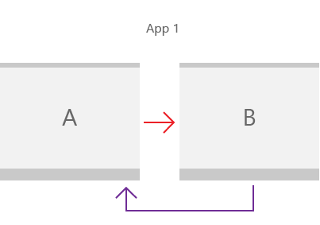

# Tutorial: Implement navigation between two pages

Learn how to use a frame and pages to enable basic peer-to-peer navigation in your app.



Almost every app requires navigation between pages. Even a simple app with a single content page will typically have a settings page that requires navigation. In this article, we walk through the basics of adding a XAML `Page` to your app, and using a `Frame` to navigate between pages.

> [!div class="checklist"]
>
> - **Applies to**: Windows App SDK/WinUI3
> - **Important APIs**: [Microsoft.UI.Xaml.Controls.Frame](/windows/windows-app-sdk/api/winrt/microsoft.ui.xaml.controls.frame) class, [Microsoft.UI.Xaml.Controls.Page](/windows/windows-app-sdk/api/winrt/microsoft.ui.xaml.controls.page) class, [Microsoft.UI.Xaml.Navigation](/windows/windows-app-sdk/api/winrt/microsoft.ui.xaml.navigation) namespace

## 1. Create a blank app
To create a blank app in Visual Studio:

1. To set up your development computer, see [Start developing Windows apps](../../../get-started/start-here.md).
1. From the Microsoft Visual Studio start window, select **Create a new project**, OR, on the Visual Studio menu, choose **File** > **New** > **Project**.
1. In the **Create a new project** dialog's drop-down filters, select **C#** or **C++**, **Windows**, and **WinUI**, respectively.
1. Select the **WinUI Blank App (Packaged)** project template, and click **Next**. That template creates a desktop app with a WinUI-based user interface.
1. In the **Project name** box, enter `BasicNavigation`, and click **Create**.
1. To run the program, choose **Debug** > **Start Debugging** from the menu, or press F5. Build and run your solution on your development computer to confirm that the app runs without errors. A blank page is displayed.
1. To stop debugging and return to Visual Studio, exit the app, or click **Stop Debugging** from the menu.
1. Remove any example code that's included in the template from the `MainWindow.xaml` and `MainWindow` code-behind files.

## 2. Use a Frame to navigate between pages

When your app has multiple pages, you use a [Frame](/windows/windows-app-sdk/api/winrt/microsoft.ui.xaml.controls.frame) to navigate between them. The `Frame` class supports various navigation methods such as [Navigate](/windows/windows-app-sdk/api/winrt/microsoft.ui.xaml.controls.frame.navigate), [GoBack](/windows/windows-app-sdk/api/winrt/microsoft.ui.xaml.controls.frame.goback), and [GoForward](/windows/windows-app-sdk/api/winrt/microsoft.ui.xaml.controls.frame.goforward), and properties such as [BackStack](/windows/windows-app-sdk/api/winrt/microsoft.ui.xaml.controls.frame.backstack), [ForwardStack](/windows/windows-app-sdk/api/winrt/microsoft.ui.xaml.controls.frame.forwardstack), and [BackStackDepth](/windows/windows-app-sdk/api/winrt/microsoft.ui.xaml.controls.frame.backstackdepth).

When you create a new Windows App SDK project in Visual Studio, the project template creates a `MainWindow` class (of type [Microsoft.UI.Xaml.Window](/windows/windows-app-sdk/api/winrt/microsoft.ui.xaml.window)). However, it doesn't create a [Frame](/windows/windows-app-sdk/api/winrt/microsoft.ui.xaml.controls.frame) or [Page](/windows/windows-app-sdk/api/winrt/microsoft.ui.xaml.controls.page) and doesn't provide any navigation code.

To enable navigation between pages, add a `Frame` as the root element of `MainWindow`. You can do that in the [Application.OnLaunched](/windows/windows-app-sdk/api/winrt/microsoft.ui.xaml.application.onlaunched) method override in the `App.xaml` code-behind file. Open the `App` code-behind file, update the `OnLaunched` override, and handle the [NavigationFailed](/windows/windows-app-sdk/api/winrt/microsoft.ui.xaml.controls.frame.navigationfailed) event as shown here.

```csharp
// App.xaml.cs

protected override void OnLaunched(Microsoft.UI.Xaml.LaunchActivatedEventArgs args)
{
    m_window = new MainWindow();

    // Create a Frame to act as the navigation context and navigate to the first page
    Frame rootFrame = new Frame();
    rootFrame.NavigationFailed += OnNavigationFailed;
    // Navigate to the first page, configuring the new page
    // by passing required information as a navigation parameter
    rootFrame.Navigate(typeof(MainPage), args.Arguments);

    // Place the frame in the current Window
    m_window.Content = rootFrame;
    // Ensure the MainWindow is active
    m_window.Activate();
}

void OnNavigationFailed(object sender, NavigationFailedEventArgs e)
{
    throw new Exception("Failed to load Page " + e.SourcePageType.FullName);
}
```

```cppwinrt
// App.xaml.h

// Add after OnLaunched declaration.
void OnNavigationFailed(IInspectable const&, Microsoft::UI::Xaml::Navigation::NavigationFailedEventArgs const&);

///////////////
// App.xaml.cpp

void App::OnLaunched(LaunchActivatedEventArgs const& e)
{
    window = make<MainWindow>();
    Frame rootFrame = Frame();
    rootFrame.NavigationFailed({ this, &App::OnNavigationFailed });
    rootFrame.Navigate(xaml_typename<BasicNavigation::MainPage>(), box_value(e.Arguments()));
    window.Content(rootFrame);
    window.Activate();
}

void App::OnNavigationFailed(IInspectable const&, NavigationFailedEventArgs const& e)
{
    throw hresult_error(E_FAIL, hstring(L"Failed to load Page ") + e.SourcePageType().Name);
}
```

> [!NOTE]
> For apps with more complex navigation, you will typically use a [NavigationView](/windows/windows-app-sdk/api/winrt/microsoft.ui.xaml.controls.navigationview) as the root of MainWindow, and place a `Frame` as the content of the navigation view. For more info, see [Navigation view](../controls/navigationview.md).

The [Navigate](/windows/windows-app-sdk/api/winrt/microsoft.ui.xaml.controls.frame.navigate) method is used to display content in this `Frame`. Here, `MainPage.xaml` is passed to the `Navigate` method, so the method loads `MainPage` in the `Frame`.

If the navigation to the app's initial window fails, a `NavigationFailed` event occurs, and this code throws an exception in the event handler.

## 3. Add basic pages

The **Blank App** template doesn't create multiple app pages for you. Before you can navigate between pages, you need to add some pages to your app.

To add a new item to your app:

1. In **Solution Explorer**, right-click the `BasicNavigation` project node to open the context menu.
1. Choose **Add** > **New Item** from the context menu.
1. In the **Add New Item** dialog box, select the **WinUI** node in the left pane, then choose **Blank Page** in the middle pane.
1. In the **Name** box, enter `MainPage` and press the **Add** button.
1. Repeat steps 1-4 to add the second page, but in the **Name** box, enter `Page2`.

Now, these files should be listed as part of your `BasicNavigation` project.

<table>
<thead>
<tr class="header">
<th align="left">C#</th>
<th align="left">C++</th>
</tr>
</thead>
<tbody>
<tr class="odd">
<td><ul>
<li>MainPage.xaml</li>
<li>MainPage.xaml.cs</li>
<li>Page2.xaml</li>
<li>Page2.xaml.cs</li>
</ul></td>
<td><ul>
<li>MainPage.xaml</li>
<li>MainPage.xaml.cpp</li>
<li>MainPage.xaml.h</li>
<li>Page2.xaml</li>
<li>Page2.xaml.cpp</li>
<li>Page2.xaml.h
</li>
</ul></td>
</tr>
</tbody>
</table>

> [!IMPORTANT]
> **For C++ projects**, you must add a `#include` directive in the header file of each page that references another page. For the inter-page navigation example presented here, **MainPage.xaml.h** file contains `#include "Page2.xaml.h"`, in turn, **Page2.xaml.h** contains `#include "MainPage.xaml.h"`.
>
> C++ page templates also include an example `Button` and click handler code that you will need to remove from the XAML and code-behind files for the page.

### Add content to the pages

In `MainPage.xaml`, replace the existing page content with the following content:

```xaml
<Grid>
    <TextBlock x:Name="pageTitle" Text="Main Page"
               Margin="16" Style="{StaticResource TitleTextBlockStyle}"/>
    <HyperlinkButton Content="Click to go to page 2"
                     Click="HyperlinkButton_Click"
                     HorizontalAlignment="Center"/>
</Grid>
```

This XAML adds:

- A [TextBlock](/windows/windows-app-sdk/api/winrt/microsoft.ui.xaml.controls.textblock) element named `pageTitle` with its [Text](/windows/windows-app-sdk/api/winrt/microsoft.ui.xaml.controls.textblock.text) property set to `Main Page` as a child element of the root [Grid](/windows/windows-app-sdk/api/winrt/microsoft.ui.xaml.controls.Grid).
- A [HyperlinkButton](/windows/windows-app-sdk/api/winrt/microsoft.ui.xaml.controls.hyperlinkbutton) element that is used to navigate to the next page as a child element of the root [Grid](/windows/windows-app-sdk/api/winrt/microsoft.ui.xaml.controls.grid).

In the `MainPage` code-behind file, add the following code to handle the `Click` event of the [HyperlinkButton](/windows/windows-app-sdk/api/winrt/microsoft.ui.xaml.controls.hyperlinkbutton) you added to enable navigation to `Page2.xaml`.

```csharp
// MainPage.xaml.cs

private void HyperlinkButton_Click(object sender, RoutedEventArgs e)
{
    Frame.Navigate(typeof(Page2));
}
```

```cppwinrt
// pch.h
// Add this include in pch.h to support winrt::xaml_typename

#include <winrt/Microsoft.UI.Xaml.Interop.h>

////////////////////
// MainPage.xaml.h

void HyperlinkButton_Click(winrt::Windows::Foundation::IInspectable const& sender, winrt::Microsoft::UI::Xaml::RoutedEventArgs const& e);

////////////////////
// MainPage.xaml.cpp

void winrt::BasicNavigation::implementation::MainPage::HyperlinkButton_Click(winrt::Windows::Foundation::IInspectable const& sender, winrt::Microsoft::UI::Xaml::RoutedEventArgs const& e)
{
    Frame().Navigate(winrt::xaml_typename<BasicNavigation::Page2>());
}
```

`MainPage` is a subclass of the [Page](/windows/windows-app-sdk/api/winrt/microsoft.ui.xaml.controls.page) class. The `Page` class has a read-only [Frame](/windows/windows-app-sdk/api/winrt/microsoft.ui.xaml.controls.page.frame) property that gets the `Frame` containing the `Page`. When the `Click` event handler of the `HyperlinkButton` in `MainPage` calls `Frame.Navigate(typeof(Page2))`, the `Frame` displays the content of `Page2.xaml`.

Whenever a page is loaded into the frame, that page is added as a [PageStackEntry](/windows/windows-app-sdk/api/winrt/microsoft.ui.xaml.navigation.pagestackentry) to the [BackStack](/windows/windows-app-sdk/api/winrt/microsoft.ui.xaml.controls.frame.backstack) or [ForwardStack](/windows/windows-app-sdk/api/winrt/microsoft.ui.xaml.controls.frame.forwardstack) of the [Frame](/windows/windows-app-sdk/api/winrt/microsoft.ui.xaml.controls.page.frame), allowing for [history and backwards navigation](navigation-history-and-backwards-navigation.md).

Now, do the same in `Page2.xaml`. Replace the existing page content with the following content:

```xaml
<Grid>
    <TextBlock x:Name="pageTitle" Text="Page 2"
               Margin="16" Style="{StaticResource TitleTextBlockStyle}"/>
    <HyperlinkButton Content="Click to go to main page"
                     Click="HyperlinkButton_Click"
                     HorizontalAlignment="Center"/>
</Grid>
```

In the `Page2` code-behind file, add the following code to handle the `Click` event of the [HyperlinkButton](/windows/windows-app-sdk/api/winrt/microsoft.ui.xaml.controls.hyperlinkbutton) to navigate to `MainPage.xaml`.

```csharp
// Page2.xaml.cs

private void HyperlinkButton_Click(object sender, RoutedEventArgs e)
{
    Frame.Navigate(typeof(MainPage));
}
```

```cppwinrt
// Page2.xaml.h

void HyperlinkButton_Click(winrt::Windows::Foundation::IInspectable const& sender, winrt::Microsoft::UI::Xaml::RoutedEventArgs const& e);

/////////////////
// Page2.xaml.cpp

void winrt::BasicNavigation::implementation::Page2::HyperlinkButton_Click(winrt::Windows::Foundation::IInspectable const& sender, winrt::Microsoft::UI::Xaml::RoutedEventArgs const& e)
{
    Frame().Navigate(winrt::xaml_typename<BasicNavigation::MainPage>());
}
```

Build and run the app. Click the link that says "Click to go to page 2". The second page that says "Page 2" at the top should be loaded and displayed in the frame. Now click the link on Page 2 to go back to Main Page.

## 4. Pass information between pages

Your app now navigates between two pages, but it really doesn't do anything interesting yet. Often, when an app has multiple pages, the pages need to share information. Now you'll pass some information from the first page to the second page.

In `MainPage.xaml`, replace the `HyperlinkButton` you added earlier with the following [StackPanel](/windows/windows-app-sdk/api/winrt/microsoft.ui.xaml.controls.StackPanel). This adds a [TextBlock](/windows/windows-app-sdk/api/winrt/microsoft.ui.xaml.controls.TextBlock) label and a [TextBox](/windows/windows-app-sdk/api/winrt/microsoft.ui.xaml.controls.TextBox) `name` for entering a text string.

```xaml
<StackPanel VerticalAlignment="Center">
    <TextBlock HorizontalAlignment="Center" Text="Enter your name"/>
    <TextBox HorizontalAlignment="Center" Width="200" x:Name="name"/>
    <HyperlinkButton Content="Click to go to page 2"
                              Click="HyperlinkButton_Click"
                              HorizontalAlignment="Center"/>
</StackPanel>
```

Now you'll use the second overload of the `Navigate` method and pass the text from the text box as the second parameter. Here's the signature of this `Navigate` overload:

```csharp
public bool Navigate(System.Type sourcePageType, object parameter);
```

```cppwinrt
bool Navigate(TypeName const& sourcePageType, IInspectable const& parameter);
```

In the `HyperlinkButton_Click` event handler of the `MainPage` code-behind file, add a second parameter to the `Navigate` method that references the `Text` property of the `name` text box.

```csharp
// MainPage.xaml.cs

private void HyperlinkButton_Click(object sender, RoutedEventArgs e)
{
    Frame.Navigate(typeof(Page2), name.Text);
}
```

```cppwinrt
// MainPage.xaml.cpp

void winrt::BasicNavigation::implementation::MainPage::HyperlinkButton_Click(winrt::Windows::Foundation::IInspectable const& sender, winrt::Microsoft::UI::Xaml::RoutedEventArgs const& e)
{ 
    Frame().Navigate(xaml_typename<BasicNavigation::Page2>(), winrt::box_value(name().Text()));
}
```

In `Page2.xaml`, replace the `HyperlinkButton` you added earlier with the following `StackPanel`. This adds a [TextBlock](/windows/windows-app-sdk/api/winrt/microsoft.ui.xaml.controls.TextBlock) for displaying the text string passed from `MainPage`.

```xaml
<StackPanel VerticalAlignment="Center">
    <TextBlock HorizontalAlignment="Center" x:Name="greeting"/>
    <HyperlinkButton Content="Click to go to page 1"
                     Click="HyperlinkButton_Click"
                     HorizontalAlignment="Center"/>
</StackPanel>
```

In the `Page2` code-behind file, add the following code to override the `OnNavigatedTo` method:

```csharp
// Page2.xaml.cs

protected override void OnNavigatedTo(NavigationEventArgs e)
{
    if (e.Parameter is string && !string.IsNullOrWhiteSpace((string)e.Parameter))
    {
        greeting.Text = $"Hello, {e.Parameter.ToString()}";
    }
    else
    {
        greeting.Text = "Hello!";
    }
    base.OnNavigatedTo(e);
}
```

```cppwinrt
// Page2.xaml.h

void Page2::OnNavigatedTo(Microsoft::UI::Xaml::Navigation::NavigationEventArgs const& e)
{
	auto propertyValue{ e.Parameter().as<Windows::Foundation::IPropertyValue>() };
	if (propertyValue.Type() == Windows::Foundation::PropertyType::String)
	{
		auto name{ winrt::unbox_value<winrt::hstring>(e.Parameter()) };
		if (!name.empty())
		{
			greeting().Text(L"Hello, " + name);
			__super::OnNavigatedTo(e);
			return;
		}
	}
	greeting().Text(L"Hello!");
	__super::OnNavigatedTo(e);
}
```

Run the app, type your name in the text box, and then click the link that says `Click to go to page 2`.

When the `Click` event of the `HyperlinkButton` in `MainPage` calls `Frame.Navigate(typeof(Page2), name.Text)`, the `name.Text` property is passed to `Page2`, and the value from the event data is used for the message displayed on the page.

## 5. Cache a page

Page content and state is not cached by default, so if you'd like to cache information, you must enable it in each page of your app.

In our basic peer-to-peer example, when you click the `Click to go to page 1` link on `Page2`, the `TextBox` (and any other field) on `MainPage` is set to its default state. One way to work around this is to use the [NavigationCacheMode](/windows/windows-app-sdk/api/winrt/microsoft.ui.xaml.controls.page.navigationcachemode) property to specify that a page be added to the frame's page cache.

By default, a new page instance is created with its default values every time navigation occurs. In `MainPage.xaml`, set `NavigationCacheMode` to `Enabled` (in the opening `Page` tag) to cache the page and retain all content and state values for the page until the page cache for the frame is exceeded. Set [NavigationCacheMode](/windows/windows-app-sdk/api/winrt/microsoft.ui.xaml.controls.page.navigationcachemode) to [Required](/windows/windows-app-sdk/api/winrt/microsoft.ui.xaml.navigation.navigationcachemode) if you want to ignore [CacheSize](/windows/windows-app-sdk/api/winrt/microsoft.ui.xaml.controls.frame.cachesize) limits, which specify the number of pages in the navigation history that can be cached for the frame. However, keep in mind that cache size limits might be crucial, depending on the memory limits of a device.

```xaml
<Page
    x:Class="BasicNavigation.MainPage"
    ...
    mc:Ignorable="d"
    NavigationCacheMode="Enabled">
```

Now, when you click back to main page, the name you entered in the text box is still there.

## 6. Customize page transition animations

By default, each page is animated into the frame when navigation occurs. The default animation is an "entrance" animation that causes the page to slide up from the bottom of the window. However, you can choose different animation options that better suit the navigation of your app. For example, you can use a "drill in" animation to give the feeling that the user is going deeper into your app, or a horizontal slide animation to give the feeling that two pages are peers. For more info, see [Page transitions](../../motion/page-transitions.md).

These animations are represented by sub-classes of [NavigationTransitionInfo](/windows/windows-app-sdk/api/winrt/microsoft.ui.xaml.media.animation.navigationtransitioninfo). To specify the animation to use for a page transition, you'll use the third overload of the `Navigate` method and pass a `NavigationTransitionInfo` sub-class as the third parameter (`infoOverride`). Here's the signature of this `Navigate` overload:

```csharp
public bool Navigate(System.Type sourcePageType, 
                     object parameter,
                     NavigationTransitionInfo infoOverride);
```

```cppwinrt
bool Navigate(TypeName const& sourcePageType, 
              IInspectable const& parameter, 
              NavigationTransitionInfo const& infoOverride);
```

In the `HyperlinkButton_Click` event handler of the `MainPage` code-behind file, add a third parameter to the `Navigate` method that sets the `infoOverride` parameter to a [SlideNavigationTransitionInfo](/windows/windows-app-sdk/api/winrt/microsoft.ui.xaml.media.animation.slidenavigationtransitioninfo) with its [Effect](/windows/windows-app-sdk/api/winrt/microsoft.ui.xaml.media.animation.slidenavigationtransitioninfo.effect) property set to [FromRight](/windows/windows-app-sdk/api/winrt/microsoft.ui.xaml.media.animation.slidenavigationtransitioneffect).

```csharp
// MainPage.xaml.cs

private void HyperlinkButton_Click(object sender, RoutedEventArgs e)
{
    Frame.Navigate(typeof(Page2), 
                   name.Text,
                   new SlideNavigationTransitionInfo() 
                       { Effect = SlideNavigationTransitionEffect.FromRight});
}
```

```cppwinrt
// pch.h

#include <winrt/Microsoft.UI.Xaml.Media.Animation.h>

////////////////////
// MainPage.xaml.cpp

using namespace winrt::Microsoft::UI::Xaml::Media::Animation;

// ...

void winrt::BasicNavigation::implementation::MainPage::HyperlinkButton_Click(winrt::Windows::Foundation::IInspectable const& sender, winrt::Microsoft::UI::Xaml::RoutedEventArgs const& e)
{   
    // Create the slide transition and set the transition effect to FromRight.
    SlideNavigationTransitionInfo slideEffect = SlideNavigationTransitionInfo();
    slideEffect.Effect(SlideNavigationTransitionEffect(SlideNavigationTransitionEffect::FromRight));
    Frame().Navigate(winrt::xaml_typename<BasicNavigation::Page2>(),
        		     winrt::box_value(name().Text()),
                     slideEffect);
}
```

In the `HyperlinkButton_Click` event handler of the `Page2` code-behind file, set the `infoOverride` parameter to a [SlideNavigationTransitionInfo](/windows/windows-app-sdk/api/winrt/microsoft.ui.xaml.media.animation.slidenavigationtransitioninfo) with its [Effect](/windows/windows-app-sdk/api/winrt/microsoft.ui.xaml.media.animation.slidenavigationtransitioninfo.effect) property set to [FromLeft](/windows/windows-app-sdk/api/winrt/microsoft.ui.xaml.media.animation.slidenavigationtransitioneffect).


```csharp
// Page2.xaml.cs

private void HyperlinkButton_Click(object sender, RoutedEventArgs e)
{
    Frame.Navigate(typeof(MainPage),
                   null,
                   new SlideNavigationTransitionInfo() 
                       { Effect = SlideNavigationTransitionEffect.FromLeft});
}
```

```cppwinrt
// Page2.xaml.cpp

using namespace winrt::Microsoft::UI::Xaml::Media::Animation;

// ...

void winrt::BasicNavigation::implementation::Page2::HyperlinkButton_Click(winrt::Windows::Foundation::IInspectable const& sender, winrt::Microsoft::UI::Xaml::RoutedEventArgs const& e)
{   
    // Create the slide transition and set the transition effect to FromLeft.
    SlideNavigationTransitionInfo slideEffect = SlideNavigationTransitionInfo();
    slideEffect.Effect(SlideNavigationTransitionEffect(SlideNavigationTransitionEffect::FromLeft));
    Frame().Navigate(winrt::xaml_typename<BasicNavigation::MainPage>(),
                     nullptr,
                     slideEffect);
}
```

Now, when you navigate between pages, the pages slide left and right, which provides a more natural feeling for this transition and reinforces the connection between the pages.

## Related articles

- [Navigation design basics for Windows apps](../../../design/basics/navigation-basics.md)
- [Navigation view](../controls/navigationview.md)
- [Navigation history and backwards navigation](navigation-history-and-backwards-navigation.md)
