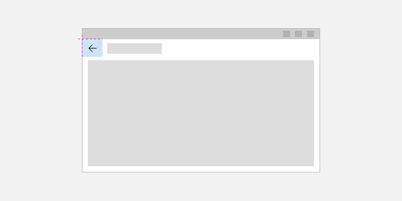
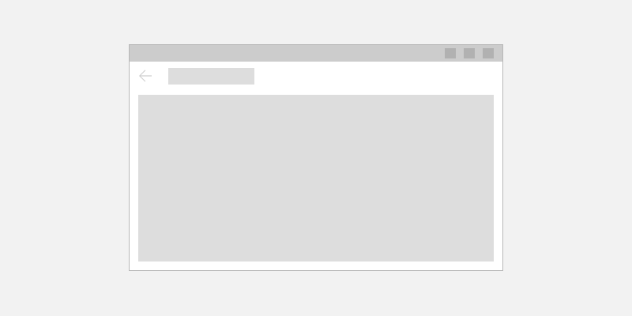

# Navigation history and backwards navigation for Windows apps

> [!div class="checklist"]
>
> - **Applies to**: Windows App SDK/WinUI3
> - **Important APIs**: [Frame](/windows/windows-app-sdk/api/winrt/microsoft.ui.xaml.controls.frame) class, [Page](/windows/windows-app-sdk/api/winrt/microsoft.ui.xaml.controls.page) class, [Frame.GoBack](/windows/windows-app-sdk/api/winrt/microsoft.ui.xaml.controls.frame.goback) method

To implement backwards navigation in your app, place a back button at the top left corner of your app's UI. The user expects the back button to navigate to the previous location in the app's navigation history. By default, the [Frame](/windows/windows-app-sdk/api/winrt/microsoft.ui.xaml.controls.frame) control records navigation actions in its [BackStack](/windows/windows-app-sdk/api/winrt/microsoft.ui.xaml.controls.frame.backstack) and [ForwardStack](/windows/windows-app-sdk/api/winrt/microsoft.ui.xaml.controls.frame.forwardstack). However, you can modify which navigation actions are added to the navigation history.

> [!NOTE]
>For most apps that have multiple pages, we recommend that you use the [NavigationView](../controls/navigationview.md) control to provide the navigation framework for your app. It adapts to a variety of screen sizes and supports both _top_ and _left_ navigation styles. If your app uses the `NavigationView` control, then you can use [NavigationView's built-in back button](../controls/navigationview.md#backwards-navigation).
>
> The guidelines and examples in this article should be used when you implement navigation without using the `NavigationView` control. If you use `NavigationView`, this information provides useful background knowledge, but you should use the specific guidance and examples in the [NavigationView](../controls/navigationview.md) article

## Back button

We recommend that you place the back button in the upper left corner of your app. If you [customize the title bar](../../title-bar.md), place the back button in the title bar. See [Title bar design > Back button](/windows/apps/design/basics/titlebar-design#back-button) for more info.

If you use the [TitleBar](../controls/title-bar.md) control to create a custom title bar, use the built-in back button. Set [IsBackButtonVisible](/windows/windows-app-sdk/api/winrt/microsoft.ui.xaml.controls.titlebar.isbackbuttonvisible) to `true`, set [IsBackButtonEnabled](/windows/windows-app-sdk/api/winrt/microsoft.ui.xaml.controls.titlebar.isbackbuttonenabled) as needed, and handle the [BackRequested](/windows/windows-app-sdk/api/winrt/microsoft.ui.xaml.controls.titlebar.backrequested) event to navigate.

To create a stand-alone back button, use the [Button](../controls/buttons.md) control with the `TitleBarBackButtonStyle` resource, and place the button at the top left hand corner of your app's UI (for details, see the XAML code examples below).



```xaml
<Page>
    <Grid>
        <Grid.RowDefinitions>
            <RowDefinition Height="Auto"/>
            <RowDefinition Height="*"/>
        </Grid.RowDefinitions>

        <Button x:Name="BackButton"
                Click="BackButton_Click"
                Style="{StaticResource TitleBarBackButtonStyle}"
                IsEnabled="{x:Bind Frame.CanGoBack, Mode=OneWay}" 
                ToolTipService.ToolTip="Back"/>

    </Grid>
</Page>
```

If your app has a top [CommandBar](../controls/command-bar.md), place the `Button` control in the `CommandBar.Content` area.

```xaml
<Page>
    <Grid>
        <Grid.RowDefinitions>
            <RowDefinition Height="Auto"/>
            <RowDefinition Height="*"/>
        </Grid.RowDefinitions>
        
        <CommandBar>
            <CommandBar.Content>
                <Button x:Name="BackButton"
                        Click="BackButton_Click"
                        Style="{StaticResource TitleBarBackButtonStyle}"
                        IsEnabled="{x:Bind Frame.CanGoBack, Mode=OneWay}" 
                        ToolTipService.ToolTip="Back"/>
            </CommandBar.Content>
        
            <AppBarButton Icon="Delete" Label="Delete"/>
            <AppBarButton Icon="Save" Label="Save"/>
        </CommandBar>
    </Grid>
</Page>
```

In order to minimize UI elements moving around in your app, show a disabled back button when there is nothing in the backstack (`IsEnabled="{x:Bind Frame.CanGoBack, Mode=OneWay}"`). However, if you expect your app will never have a backstack, you don't need to display the back button at all.



## Back navigation

This section demonstrates code to handle back navigation. Typical sources of a back navigation request are the [TitleBar.BackRequested](/windows/windows-app-sdk/api/winrt/microsoft.ui.xaml.controls.titlebar.backrequested) event, [NavigationView.BackRequested](/windows/windows-app-sdk/api/winrt/microsoft.ui.xaml.controls.navigationview.backrequested) event, or back button [Click](/windows/windows-app-sdk/api/winrt/microsoft.ui.xaml.controls.primitives.buttonbase.click) event.

This example code demonstrates how to implement backwards navigation behavior with a back button. The code responds to the Button [Click](/windows/windows-app-sdk/api/winrt/microsoft.ui.xaml.controls.primitives.buttonbase.click) event to navigate.

If you use the back button in a `NavigationView` or `TitleBar` control, you can put the frame navigation code directly in the event handler method without needing to duplicate it for each page. However, if you create a back button in the content of your app pages, you would need to duplicate the frame navigation code in each page's code-behind file. To avoid duplication, you can put the navigation related code in the `App` class in the `App.xaml.*` code-behind page and then call it from anywhere in your app, as shown here.

> [!IMPORTANT]
> You need to update the existing code for `m_window` in the `App` class to create a public static property for `Window` as shown here in the last lines of code. See [Change Window.Current to App.Window](/windows/apps/windows-app-sdk/migrate-to-windows-app-sdk/guides/winui3#change-windowsuixamlwindowcurrent-to-appwindow) for more info.

```csharp
// MainPage.xaml.cs
private void BackButton_Click(object sender, RoutedEventArgs e)
{
    App.TryGoBack();
}

// App.xaml.cs
//
// Add this method to the App class.
public static bool TryGoBack()
{
    Frame rootFrame = Window.Content as Frame;
    if (rootFrame.CanGoBack)
    {
        rootFrame.GoBack();
        return true;
    }
    return false;
}

public static Window Window { get { return m_window; } }
private static Window m_window;

```

```cppwinrt
// MainPage.h
namespace winrt::AppName::implementation
{
    struct MainPage : MainPageT<MainPage>
    {
        MainPage();
 
        void MainPage::BackButton_Click(IInspectable const&, RoutedEventArgs const&)
        {
            App::TryGoBack();
        }
    };
}

// App.xaml.h
using namespace winrt;
using namespace Windows::UI::Xaml::Controls;

struct App : AppT<App>
{
    App();

    static winrt::Microsoft::UI::Xaml::Window Window() { return window; };

    // ...

    // Perform back navigation if possible.
    static bool TryGoBack()
    {
        Frame rootFrame{ nullptr };
        auto content = App::Window().Content();
        if (content)
        {
            rootFrame = content.try_as<Frame>();
            if (rootFrame.CanGoBack())
            {
                rootFrame.GoBack();
                return true;
            }
        }
        return false;
    }

private:
    static winrt::Microsoft::UI::Xaml::Window window;
};

// App.xaml.cpp
winrt::Microsoft::UI::Xaml::Window App::window{ nullptr };

```

## Related articles

- [Navigation basics](../../../design/basics/navigation-basics.md)
- [Implement basic navigation](navigate-between-two-pages.md)
