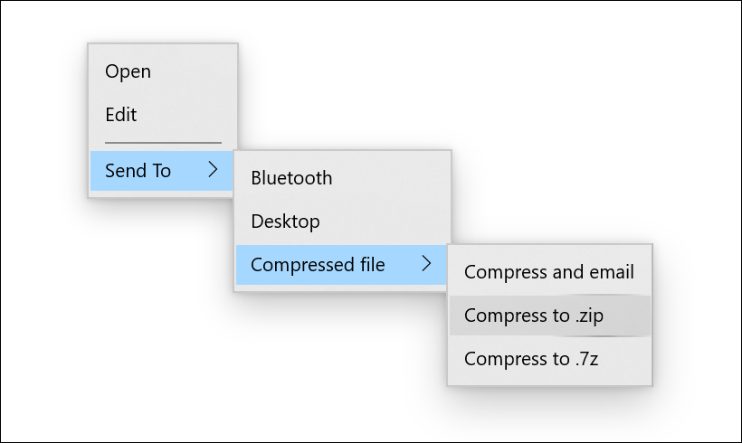
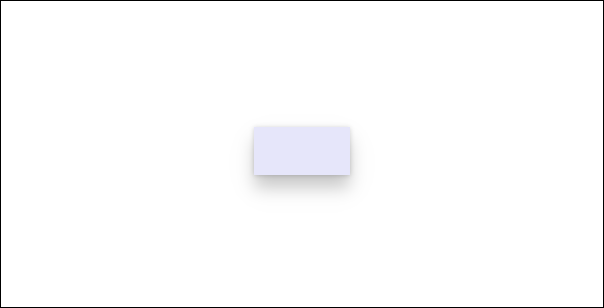
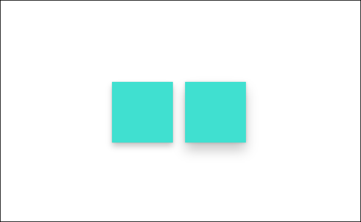

# Shadows in Windows apps

Windows apps use shadows to express depth and add visual hierarchy. Shadows help create the appearance of [elevation](../../design/signature-experiences/layering.md), guiding the user's focus to the most important elements in your UI.

Shadow is one way a user perceives elevation. Light above an elevated object creates a shadow on the surface below. The higher the object, the larger and softer the shadow becomes. Elevated objects in your UI don't need to have shadows, but they help create the appearance of elevation.

In Windows apps, shadows should be used in a purposeful rather than aesthetic manner. Using too many shadows will decrease or eliminate the ability of the shadow to focus the user.

If you use standard controls, shadows are already incorporated into your UI. However, you can manually include shadows in your UI by using either the [ThemeShadow](/windows/windows-app-sdk/api/winrt/microsoft.ui.xaml.media.themeshadow) or the [DropShadow](/windows/windows-app-sdk/api/winrt/microsoft.ui.composition.dropshadow) APIs.

## ThemeShadow

The [ThemeShadow](/windows/windows-app-sdk/api/winrt/microsoft.ui.xaml.media.themeshadow) type can be applied to any XAML element to draw shadows appropriately based on x, y, z coordinates.

- It applies shadows to elements based on z-depth value, emulating depth.
- It keeps shadows consistent throughout and across applications thanks to built in shadow aesthetics.

Here is how ThemeShadow has been implemented on a MenuFlyout. MenuFlyout has a built in shadow with a depth of 32px applied to the main menu and all nested menus.



> [!div class="nextstepaction"]
> [Open the WinUI Gallery app and see ThemeShadow in action](winui3gallery://item/ThemeShadow)


### ThemeShadow in common controls

The following common controls will automatically use ThemeShadow to cast shadows from 32px depth unless otherwise specified:

- [Context menu](controls/menus.md), [Command bar](controls/command-bar.md), [Command bar flyout](controls/command-bar-flyout.md), [MenuBar](controls/menus.md#create-a-menu-bar)
- [Dialogs and flyouts](controls/dialogs-and-flyouts/index.md) (Dialog at 128px)
- [NavigationView](controls/navigationview.md)
- [ComboBox](controls/combo-box.md), [DropDownButton, SplitButton, ToggleSplitButton](controls/buttons.md)
- [TeachingTip](controls/dialogs-and-flyouts/teaching-tip.md)
- [AutoSuggestBox](controls/auto-suggest-box.md)
- [Calendar/Date/Time pickers](controls/date-and-time.md)
- [Tooltip](controls/tooltips.md) (16px)
- [Number Box](controls/number-box.md)
- [TabView](controls/tab-view.md)
- [Media transport control](controls/media-playback.md#media-transport-controls), [InkToolbar](controls/inking-controls.md)
- [BreadcrumbBar](controls/breadcrumbbar.md)
- [Connected animation](../motion/connected-animation.md)

### ThemeShadow in Popups

It is often the case that your app's UI uses a popup for scenarios where you need user's attention and quick action. These are great examples when shadow should be used to help create hierarchy in your app's UI.

ThemeShadow automatically casts shadows when applied to any XAML element in a [Popup](/windows/windows-app-sdk/api/winrt/microsoft.ui.xaml.controls.primitives.popup). It will cast shadows on the app background content behind it and any other open Popups below it.

To use ThemeShadow with Popups, use the `Shadow` property to apply a ThemeShadow to a XAML element. Then, elevate the element from other elements behind it, for example by using the z component of the `Translation` property.
For most Popup UI, the recommended default elevation relative to the app background content is 32 effective pixels.

This example shows a Rectangle in a Popup casting a shadow onto the app background content and any other Popups behind it:

```xaml
<Popup>
    <Rectangle x:Name="PopupRectangle" Fill="Lavender" Height="48" Width="96">
        <Rectangle.Shadow>
            <ThemeShadow />
        </Rectangle.Shadow>
    </Rectangle>
</Popup>
```

```csharp
// Elevate the rectangle by 32px
PopupRectangle.Translation += new Vector3(0, 0, 32);
```



### Disabling default ThemeShadow on custom Flyout controls

Controls based on [Flyout](/windows/windows-app-sdk/api/winrt/microsoft.ui.xaml.controls.flyout), [DatePickerFlyout](/windows/windows-app-sdk/api/winrt/microsoft.ui.xaml.controls.datepickerflyout), [MenuFlyout](/windows/windows-app-sdk/api/winrt/microsoft.ui.xaml.controls.menuflyout) or [TimePickerFlyout](/windows/windows-app-sdk/api/winrt/microsoft.ui.xaml.controls.timepickerflyout) automatically use ThemeShadow to cast a shadow.

If the default shadow doesn't look correct on your control's content then you can disable it by setting the [IsDefaultShadowEnabled](/windows/windows-app-sdk/api/winrt/microsoft.ui.xaml.controls.flyoutpresenter.isdefaultshadowenabled) property to `false` on the associated FlyoutPresenter:

```xaml
<Flyout>
    <Flyout.FlyoutPresenterStyle>
        <Style TargetType="FlyoutPresenter">
            <Setter Property="IsDefaultShadowEnabled" Value="False" />
        </Style>
    </Flyout.FlyoutPresenterStyle>
</Flyout>
```

### ThemeShadow in other elements

> [!NOTE]
> Starting with Windows 11, if the app targets the Windows SDK version 22000 or later, the `Receivers` collection is ignored. However there will be no errors and the shadow continues to function.

In general we encourage you to think carefully about your use of shadow and limit its use to cases where it introduces meaningful visual hierarchy. However, we do provide a way to cast a shadow from any UI element in case you have advanced scenarios that necessitate it.

To cast a shadow from a XAML element that isn't in a Popup, you must explicitly specify the other elements that can receive the shadow in the `ThemeShadow.Receivers` collection. Receivers cannot be an ancestor of the caster in the visual tree.

This example shows two Rectangles that cast shadows onto a Grid behind them:

```xaml
<Grid>
    <Grid.Resources>
        <ThemeShadow x:Name="SharedShadow" />
    </Grid.Resources>

    <Grid x:Name="BackgroundGrid" Background="{ThemeResource ApplicationPageBackgroundThemeBrush}" />

    <Rectangle x:Name="Rectangle1" Height="100" Width="100" Fill="Turquoise" Shadow="{StaticResource SharedShadow}" />

    <Rectangle x:Name="Rectangle2" Height="100" Width="100" Fill="Turquoise" Shadow="{StaticResource SharedShadow}" />
</Grid>
```

```csharp
/// Add BackgroundGrid as a shadow receiver and elevate the casting buttons above it
SharedShadow.Receivers.Add(BackgroundGrid);

Rectangle1.Translation += new Vector3(0, 0, 16);
Rectangle2.Translation += new Vector3(120, 0, 32);
```



## Drop shadow

DropShadow does not provide built in shadow values and you need to specify them yourself. For example implementations, see the [DropShadow](/windows/windows-app-sdk/api/winrt/microsoft.ui.composition.dropshadow) class.

> [!TIP]
> Starting with Windows 11, if the app targets the Windows SDK version 22000 or later, ThemeShadow will behave like a drop shadow. If you are using DropShadow, you might consider using ThemeShadow instead.

## Which shadow should I use?

| Property | ThemeShadow | DropShadow |
| - | - | - |
| **Min SDK** | SDK 18362 | SDK 14393 |
| **Adaptability** | Yes | No |
| **Customization** | No | Yes |
| **Light source** | None | None |
| **Supported in 3D environments** | Yes (_While it works in a 3D environment, the shadows are emulated._) | No |

- Keep in mind that the purpose of shadow is to provide meaningful hierarchy, not as a simple visual treatment.
- Generally, we recommend using ThemeShadow, which provides consistent shadow values.
- For concerns about performance, limit the number of shadows, use other visual treatment, or use DropShadow.
- If you have more advanced scenarios to achieve visual hierarchy, consider using other visual treatment (for example, color). If shadow is needed, then use DropShadow.

## Related articles

- [Elevation and layering in Windows](../../design/signature-experiences/layering.md)
- [Materials (Acrylic / Mica)](system-backdrops.md)
