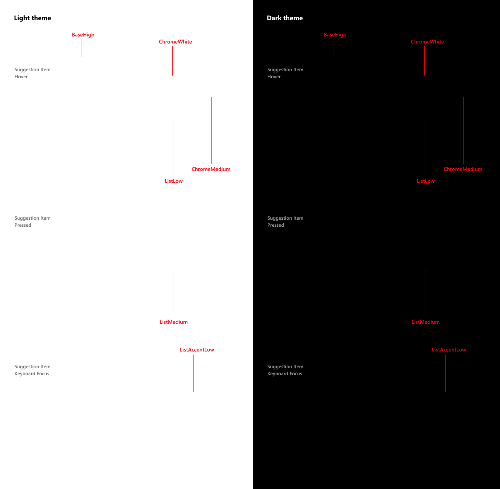
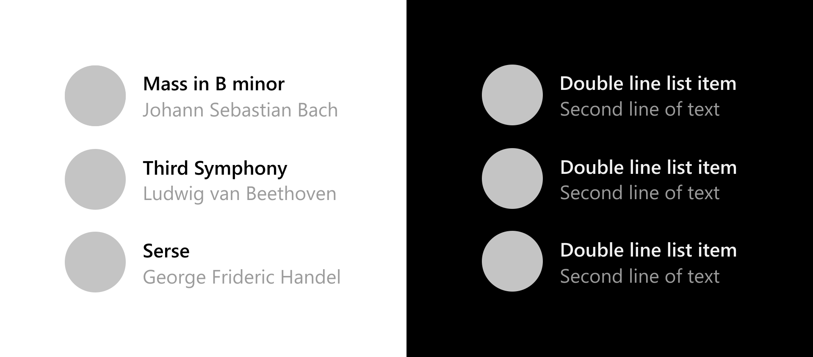
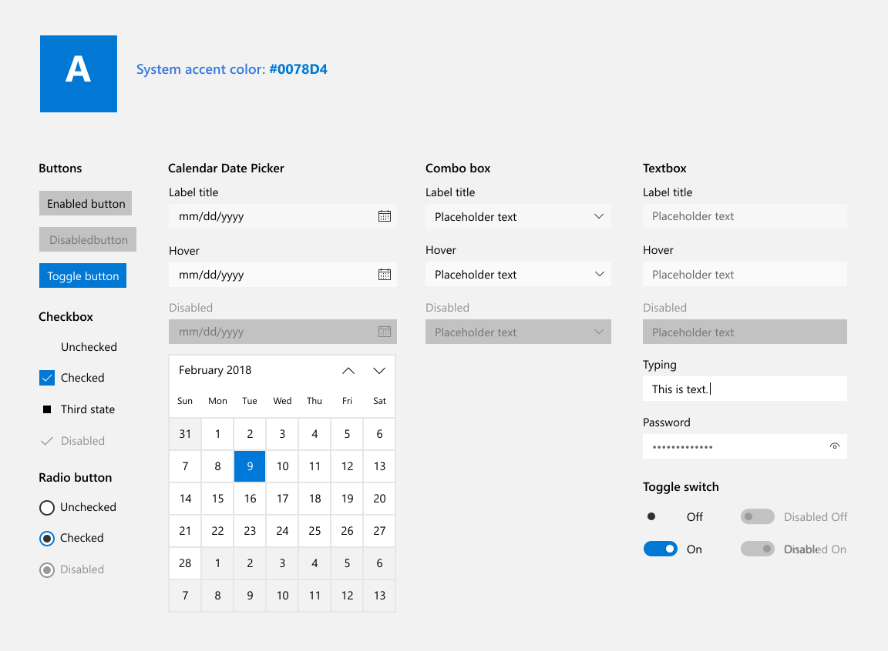
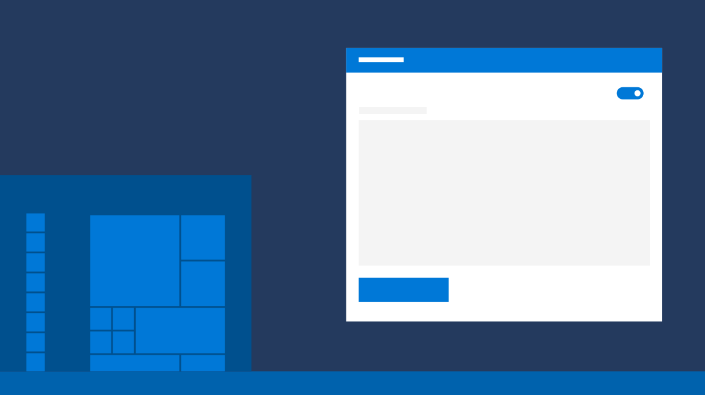
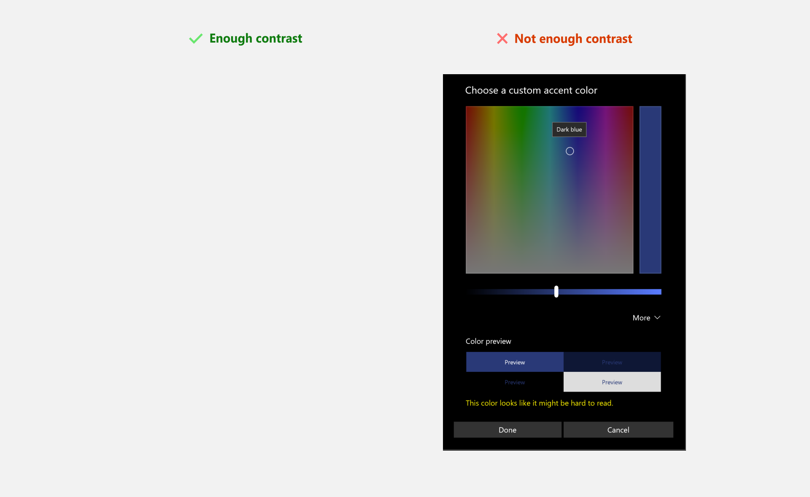
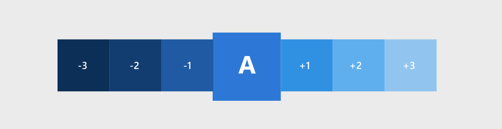
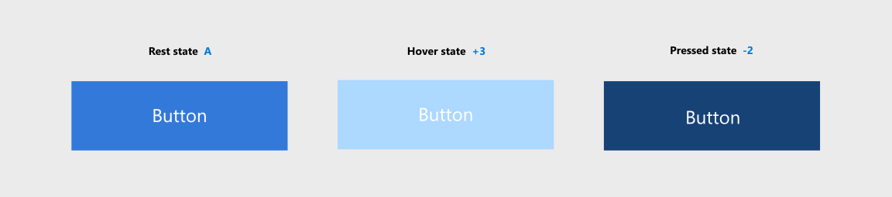
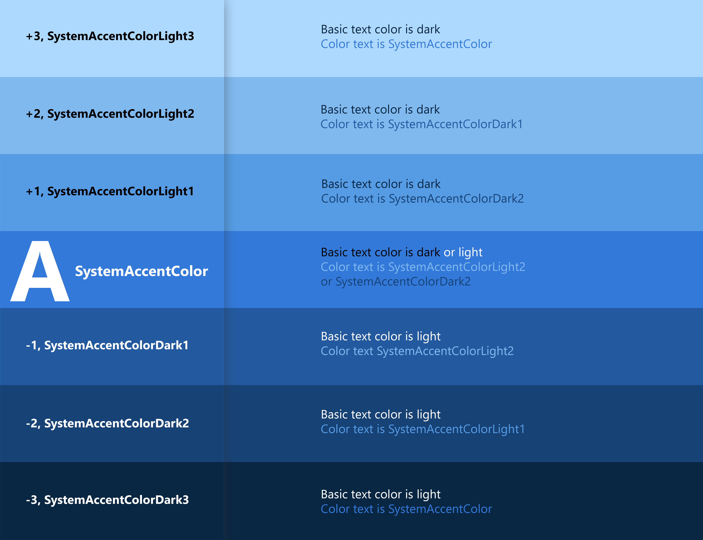

# Theming in Windows apps

Windows apps support light and dark themes, and you can customize how your app responds to the user's theme preference. This article covers how to change themes, use theme brushes, customize accent colors, and work with the color API.

For design guidance on using color effectively, see [Color in Windows](../../design/signature-experiences/color.md).

> [!div class="nextstepaction"]
> [Open the WinUI Gallery app and see Colors in action](winui3gallery://item/Color)

## Changing the theme

You can change themes by changing the **RequestedTheme** property in your `App.xaml` file.

```xaml
<Application
    x:Class="App9.App"
    xmlns="http://schemas.microsoft.com/winfx/2006/xaml/presentation"
    xmlns:x="http://schemas.microsoft.com/winfx/2006/xaml"
    xmlns:local="using:App9"
    RequestedTheme="Dark">
</Application>
```

Removing the **RequestedTheme** property means that your application will use the user's system settings.

Users can also select the [high contrast theme](../../design/accessibility/high-contrast-themes.md), which uses a small palette of contrasting colors that makes the interface easier to see. In that case, the system will override your RequestedTheme.

### Testing themes

If you don't request a theme for your app, make sure to test your app in both light and dark themes to ensure that your app will be legible in all conditions.

## Theme brushes

Common controls automatically use [theme brushes](../platform/xaml/xaml-theme-resources.md#the-xaml-color-ramp-and-theme-dependent-brushes) to adjust contrast for light and dark themes.

For example, here's an illustration of how the [AutoSuggestBox](../../design/controls/auto-suggest-box.md) uses theme brushes:



### Using theme brushes

:::row:::
    :::column:::
When creating templates for custom controls, use theme brushes rather than hard code color values. This way, your app can easily adapt to any theme.

For example, these [item templates for ListView](../../design/controls/item-templates-listview.md) demonstrate how to use theme brushes in a custom template.
    :::column-end:::
    :::column:::
 
    :::column-end:::
:::row-end:::

```xaml
<ListView ItemsSource="{x:Bind ViewModel.Recordings}">
    <ListView.ItemTemplate>
        <DataTemplate x:Name="DoubleLineDataTemplate" x:DataType="local:Recording">
            <StackPanel Orientation="Horizontal" Height="64" AutomationProperties.Name="{x:Bind CompositionName}">
                <Ellipse Height="48" Width="48" VerticalAlignment="Center">
                    <Ellipse.Fill>
                        <ImageBrush ImageSource="Placeholder.png"/>
                    </Ellipse.Fill>
                </Ellipse>
                <StackPanel Orientation="Vertical" VerticalAlignment="Center" Margin="12,0,0,0">
                    <TextBlock Text="{x:Bind CompositionName}" Style="{ThemeResource BodyStrongTextBlockStyle}" Foreground="{ThemeResource TextFillColorPrimaryBrush}" />
                    <TextBlock Text="{x:Bind ArtistName}" Style="{ThemeResource BodyTextBlockStyle}" Foreground="{ThemeResource TextFillColorTertiaryBrush}"/>
                </StackPanel>
            </StackPanel>
        </DataTemplate>
    </ListView.ItemTemplate>
</ListView>
```

For more information about how to use theme brushes in your app, see [Theme Resources](../platform/xaml/xaml-theme-resources.md).

## Accent colors

Common controls use an accent color to convey state information. By default, the accent color is the `SystemAccentColor` that users select in their Settings. However, you can also customize your app's accent color to reflect your brand.



:::row:::
    :::column:::


    :::column-end:::
    :::column:::


    :::column-end:::
:::row-end:::

### Overriding the accent color

To change your app's accent color, place the following code in `app.xaml`.

```xaml
<Application.Resources>
    <ResourceDictionary>
        <Color x:Key="SystemAccentColor">#107C10</Color>
    </ResourceDictionary>
</Application.Resources>
```

### Choosing an accent color

If you select a custom accent color for your app, please make sure that text and backgrounds that use the accent color have sufficient contrast for optimal readability. To test contrast, you can use the color picker tool in Windows Settings, or you can use these [online contrast tools](https://www.w3.org/TR/WCAG20-TECHS/G18.html#G18-resources).



## Accent color palette

An accent color algorithm in the Windows shell generates light and dark shades of the accent color.



These shades can be accessed as [theme resources](../platform/xaml/xaml-theme-resources.md):

- `SystemAccentColorLight3`
- `SystemAccentColorLight2`
- `SystemAccentColorLight1`
- `SystemAccentColorDark1`
- `SystemAccentColorDark2`
- `SystemAccentColorDark3`

You can also access the accent color palette programmatically with the [**UISettings.GetColorValue**](/uwp/api/windows.ui.viewmanagement.uisettings.getcolorvalue) method and [**UIColorType**](/uwp/api/windows.ui.viewmanagement.uicolortype) enum.

You can use the accent color palette for color theming in your app. Below is an example of how you can use the accent color palette on a button.



```xaml
<Page.Resources>
    <ResourceDictionary>
        <ResourceDictionary.ThemeDictionaries>
            <ResourceDictionary x:Key="Light">
                <SolidColorBrush x:Key="ButtonBackground" Color="{ThemeResource SystemAccentColor}"/>
                <SolidColorBrush x:Key="ButtonBackgroundPointerOver" Color="{ThemeResource SystemAccentColorLight1}"/>
                <SolidColorBrush x:Key="ButtonBackgroundPressed" Color="{ThemeResource SystemAccentColorDark1}"/>
            </ResourceDictionary>
        </ResourceDictionary.ThemeDictionaries>
    </ResourceDictionary>
</Page.Resources>

<Button Content="Button"></Button>
```

When using colored text on a colored background, make sure there is enough contrast between text and background. By default, hyperlink or hypertext will use the accent color. If you apply variations of the accent color to the background, you should use a variation of the original accent color to optimize the contrast of colored text on a colored background.

The chart below illustrates an example of the various light/dark shades of accent color, and how colored type can be applied on a colored surface.



For more information about styling controls, see [XAML styles](../platform/xaml/xaml-styles.md).

## Color API

There are several APIs that can be used to add color to your application. First, the [**Colors**](/windows/windows-app-sdk/api/winrt/microsoft.ui.colors) class, which implements a large list of predefined colors. These can be accessed automatically with XAML properties. In the example below, we create a button and set the background and foreground color properties to members of the **Colors** class.

```xaml
<Button Background="MediumSlateBlue" Foreground="White">Button text</Button>
```

You can create your own colors from RGB or hex values using the [**Color**](/uwp/api/windows.ui.color) struct in XAML.

```xaml
<Color x:Key="LightBlue">#FF36C0FF</Color>
```

You can also create the same color in code by using the **FromArgb** method.

```csharp
Color LightBlue = Color.FromArgb(255,54,192,255);
```

```cppwinrt
Windows::UI::Color LightBlue = Windows::UI::ColorHelper::FromArgb(255,54,192,255);
```

The letters "Argb" stands for Alpha (opacity), Red, Green, and Blue, which are the four components of a color. Each argument can range from 0 to 255. You can choose to omit the first value, which will give you a default opacity of 255, or 100% opaque.

> [!Note]
> If you're using C++, you must create colors by using the [**ColorHelper**](/windows/windows-app-sdk/api/winrt/microsoft.ui.colorhelper) class.

The most common use for a **Color** is as an argument for a [**SolidColorBrush**](/windows/windows-app-sdk/api/winrt/microsoft.ui.xaml.media.solidcolorbrush), which can be used to paint UI elements a single solid color. These brushes are generally defined in a [**ResourceDictionary**](/windows/windows-app-sdk/api/winrt/microsoft.ui.xaml.resourcedictionary), so they can be reused for multiple elements.

```xaml
<ResourceDictionary>
    <SolidColorBrush x:Key="ButtonBackgroundBrush" Color="#FFFF4F67"/>
    <SolidColorBrush x:Key="ButtonForegroundBrush" Color="White"/>
</ResourceDictionary>
```

For more information on how to use brushes, see [XAML brushes](../platform/xaml/brushes.md).

## Related

- [Color in Windows](../../design/signature-experiences/color.md)
- [XAML Styles](../platform/xaml/xaml-styles.md)
- [XAML Theme Resources](../platform/xaml/xaml-theme-resources.md)
