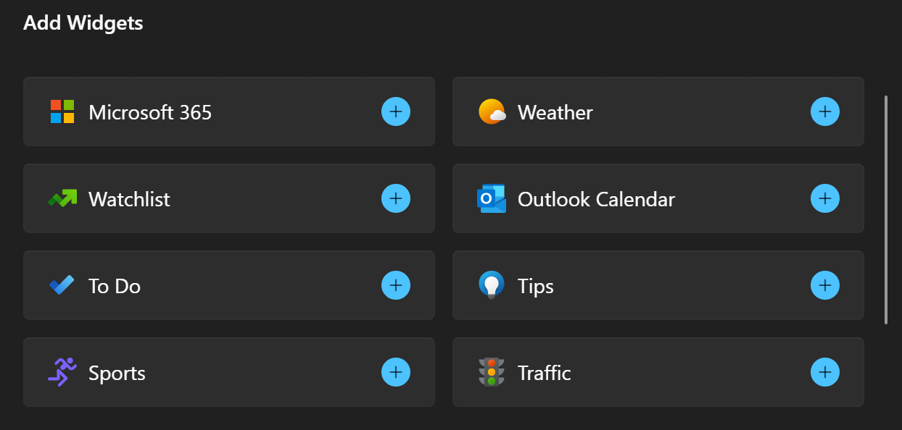

# Widget provider package manifest XML format

In order to be displayed in the widgets host, apps that support Windows widgets must register their widget provider with the system. For Win32 apps, only packaged apps are currently supported and widget providers specify their registration information in the app package manifest file. This article documents the XML format for widget registration. See the [Example](#example) section for a code listing of an example package manifest for a Win32 widget provider.

## App extension

The app package manifest file supports many different extensions and features for Windows apps. The app package manifest format is defined by a set of schemas that are documented in the [Package manifest schema reference](/uwp/schemas/appxpackage/uapmanifestschema/schema-root).  Widget providers declare their registration information within the [uap3:AppExtension](/uwp/schemas/appxpackage/uapmanifestschema/element-uap3-appextension-manual). The **Name** attribute of the extension must be set to "com.microsoft.windows.widgets".

Widget providers should include the [uap3:Properties](/uwp/schemas/appxpackage/uapmanifestschema/element-uap3-properties-manual) as the child of **uap3:AppExtension**. The package manifest schema does not enforce the structure of the **uap3:Properties** element other than requiring well-formed XML. The rest of this article describes the XML format that the Widget host expects in order to successfully register a widget provider.

```xml
<uap3:Extension Category="windows.appExtension">
  <uap3:AppExtension Name="com.microsoft.windows.widgets" DisplayName="WidgetTestApp" Id="ContosoWidgetApp" PublicFolder="Public">
    <uap3:Properties>
    <!-- Widget provider registration content goes here -->
    </uap3:Properties>
  </uap3:AppExtension>
</uap3:Extension>
```

## Element hierarchy


WidgetProvider

&nbsp;&nbsp;ProviderIcons

&nbsp;&nbsp;&nbsp;&nbsp;Icon

&nbsp;&nbsp;Activation

&nbsp;&nbsp;&nbsp;&nbsp;CreateInstance

&nbsp;&nbsp;&nbsp;&nbsp;ActivateApplication

&nbsp;&nbsp;Definitions

&nbsp;&nbsp;&nbsp;&nbsp;Definition

&nbsp;&nbsp;&nbsp;&nbsp;&nbsp;&nbsp;Capabilities

&nbsp;&nbsp;&nbsp;&nbsp;&nbsp;&nbsp;&nbsp;&nbsp;Capability

&nbsp;&nbsp;&nbsp;&nbsp;&nbsp;&nbsp;&nbsp;&nbsp;&nbsp;&nbsp;Size

&nbsp;&nbsp;&nbsp;&nbsp;&nbsp;&nbsp;ThemeResources

&nbsp;&nbsp;&nbsp;&nbsp;&nbsp;&nbsp;&nbsp;&nbsp;Icons

&nbsp;&nbsp;&nbsp;&nbsp;&nbsp;&nbsp;&nbsp;&nbsp;&nbsp;&nbsp;Icon

&nbsp;&nbsp;&nbsp;&nbsp;&nbsp;&nbsp;&nbsp;&nbsp;Screenshots

&nbsp;&nbsp;&nbsp;&nbsp;&nbsp;&nbsp;&nbsp;&nbsp;&nbsp;&nbsp;Screenshot

&nbsp;&nbsp;&nbsp;&nbsp;&nbsp;&nbsp;&nbsp;&nbsp;DarkMode

&nbsp;&nbsp;&nbsp;&nbsp;&nbsp;&nbsp;&nbsp;&nbsp;&nbsp;&nbsp;Icons

&nbsp;&nbsp;&nbsp;&nbsp;&nbsp;&nbsp;&nbsp;&nbsp;&nbsp;&nbsp;&nbsp;&nbsp;Icon

&nbsp;&nbsp;&nbsp;&nbsp;&nbsp;&nbsp;&nbsp;&nbsp;&nbsp;&nbsp;Screenshots

&nbsp;&nbsp;&nbsp;&nbsp;&nbsp;&nbsp;&nbsp;&nbsp;&nbsp;&nbsp;&nbsp;&nbsp;Screenshot

&nbsp;&nbsp;&nbsp;&nbsp;&nbsp;&nbsp;&nbsp;&nbsp;LightMode

&nbsp;&nbsp;&nbsp;&nbsp;&nbsp;&nbsp;&nbsp;&nbsp;&nbsp;&nbsp;Icons

&nbsp;&nbsp;&nbsp;&nbsp;&nbsp;&nbsp;&nbsp;&nbsp;&nbsp;&nbsp;&nbsp;&nbsp;Icon

&nbsp;&nbsp;&nbsp;&nbsp;&nbsp;&nbsp;&nbsp;&nbsp;&nbsp;&nbsp;Screenshots

&nbsp;&nbsp;&nbsp;&nbsp;&nbsp;&nbsp;&nbsp;&nbsp;&nbsp;&nbsp;&nbsp;&nbsp;Screenshot

## WidgetProvider

The root element of the widget provider registration information.



## WidgetProviderIcons

Specifies icons representing the widget provider app.

## Activation

Specifies activation information for the widget provider. If both **CreateInstance** and **ActivateApplication** are specified in the manifest, **CreateInstance** takes precedence.

## CreateInstance

**CreateInstance** should be specified for Win32-based widget providers that implement the **IWidgetProvider** interface. The system will activate the interface with a call to [CoCreateInstance](/windows/win32/api/combaseapi/nf-combaseapi-cocreateinstance). The **ClassId** attribute specifies the [CLSID](/windows/win32/com/com-class-objects-and-clsids) for the CreateInstance server that implements the **IWidgetProvider** interface. 

| Attribute | Type | Required | Description | Default value |
|---|---|---|---|---|
| **ClassId**| GUID | Yes | The CLSID for the CreateInstance server that implements the widget provider. | N/A |

## ActivateApplication

When **ActivateApplication** is specified, the widget provider is activated via the command line, with the arguments provided as [base64url encoded](https://datatracker.ietf.org/doc/html/rfc4648#section-5) JSON strings. It is recommended that widget providers use the **CreateInstance** activiation type. For information on the **ActivateApplication** command line format, see [Widget provider ActivateApplication protocol](widget-provider-activateapplication-protocol.md).

## Definitions

The container element for one or more widget registrations.

## Definition

Represents the registration for a single widget.

| Attribute | Type | Required | Description | Default value |
|---|---|---|---|---|
| **Id**| string | Yes | An ID that identifies the widget. This value is also displayed in the navigation bar of the widget picker. Widget provider implementations use this string to determine or specify which of the app's widgets is being referenced for each operation. This string must be unique for all widgets defined within the app manifest file.  | N/A |
| **DisplayName** | string | Yes | The name of the widget that is displayed on the widgets host. | N/A |
| **Description** | string | Yes | Short description of the widget. | N/A |
| **AllowMultiple** | boolean | No | Set to false if only one instance of this widget is supported. This attribute is optional and the default value is true. | true |
| **IsCustomizable** | boolean | No | Set to true if your app supports customization. This causes the **Customize widget** button to be displayed in the widget's ellipsis menu. | true |

## Capablities

Optional. Specifies capabilities for a single widget. If no capabilities are declared, one capability specifying a "large" size is added by default.

## Capability

Specifies a capability for a widget.

## Size

Specifies supported sizes for the associated widget.

| Attribute | Type | Required | Description | Default value |
|---|---|---|---|---|
| **Name**| string | Yes | Specifies a supported size for a widget. The value must be one of the following: "small", "medium", "large" | N/A |

## ThemeResources

Specifies theme resources for a widget.

## Icons

A container element for one or more **Icon** elements.

## Icon

Required. Specifies an icon that is displayed in the attribution area of the widget.

| Attribute | Type | Required | Description | Default value |
|---|---|---|---|---|
| **Path**| string | Yes | The package-relative path to an icon image file. | N/A |

## Screenshots

Required. Specifies one or more screenshots of the widget.

## Screenshot

Required. Specifies a screenshot for a widget. This screenshot is shown in the widgets host in the **Add Widgets dialog** when the user is selecting widgets to add to the widgets host. If you provide a screenshot for the optional **DarkMode** or **LightMode** elements listed below, then the widgets host will use the screenshot that matches the current device theme. If you don't provide a screenshot for the the current device theme, the image provided in this **Screenshot** element will be used. For information about the design requirements for screenshot images and the naming conventions for localized screenshots, see [Integrate with the widget picker](../../design/widgets/widgets-picker-integration.md).

> [!NOTE]
> The widget screenshots are not displayed on the widgets board's add widgets dialog in the current preview release..

| Attribute | Type | Required | Description | Default value |
|---|---|---|---|---|
| **Path**| string | Yes | The package-relative path to a screenshot image file. | N/A |
| **DisplayAltText**| string | No | The alt-text for the image, for accessibility. | N/A |

## DarkMode

Optional. Specifies theme resources for when dark mode is active on the device. If you specify one or more screenshot images in the optional **DarkMode** element, the widgets host will select these screenshots when the device is in dark mode. If you don't provide a dark mode image, the widgets host will use the required, top-level **Screenshot** element described above. For information about the design requirements for screenshot images and the naming conventions for localized screenshots, see [Integrate with the widget picker](../../design/widgets/widgets-picker-integration.md).

## LightMode

Optional. Specifies theme resources for when light mode is active on the device. If you provide one or more screenshot images in the optional **LightMode** element, the widgets host will select these screenshots when the device is in light mode. If you don't provide a light mode image, the widgets host will use the required, top-level **Screenshot** element described above. For information about the design requirements for screenshot images and the naming conventions for localized screenshots, see [Integrate with the widget picker](../../design/widgets/widgets-picker-integration.md).

## Example

The following code example illustrates the usage of the widget package manifest XML format.

```xml
<uap3:Extension Category="windows.appExtension">
  <uap3:AppExtension Name="com.microsoft.windows.widgets" DisplayName="Widget Test App" Id="ContosoWidgetApp" PublicFolder="Public">
    <uap3:Properties>
      <WidgetProvider>
        <ProviderIcons>
            <Icon Path="Images\StoreIcon.png" />
        </ProviderIcons>
        <Activation>
          <!-- App exports COM interface which implements IWidgetProvider -->
          <CreateInstance ClassId="XXXXXXXX-XXXX-XXXX-XXXX-D3397A3FF15C" />
        </Activation>
        <Definitions>
          <Definition
            Id="Weather_Widget"
            DisplayName="Microsoft Weather Widget"
            Description="Weather Widget Description"
            AllowMultiple="true">
            <Capabilities>
              <Capability>
                 <Size Name="small" />
              </Capability>
              <Capability>
                 <Size Name="medium" />
              </Capability>
              <Capability>
                 <Size Name="large" />
              </Capability>
            </Capabilities>

            <ThemeResources>
              <Icons>
                <Icon Path="Assets\icon.png" />
                <Icon Path="Assets\icon.gif" />
              </Icons>
              <Screenshots>
                <Screenshot Path="Assets\background.png" DisplayAltText ="For accessibility"/>
              </Screenshots>

              <!-- DarkMode and LightMode are optional -->
              <DarkMode>
                <Icons>
                  <Icon Path="Assets\dark.png" />
                </Icons>
                <Screenshots>
                  <Screenshot Path="Assets\darkBackground.png" DisplayAltText ="For accessibility"/>
                </Screenshots>
              </DarkMode>

              <LightMode>
                <Icons>
                  <Icon Path="Assets\light.png" />
                </Icons>
                <Screenshots>
                  <Screenshot Path="Assets\lightBackground.png"/>
                </Screenshots>
              </LightMode>
            </ThemeResources>
          </Definition>
        </Definitions>
      </WidgetProvider>
    </uap3:Properties>
  </uap3:AppExtension>
</uap3:Extension>

```
