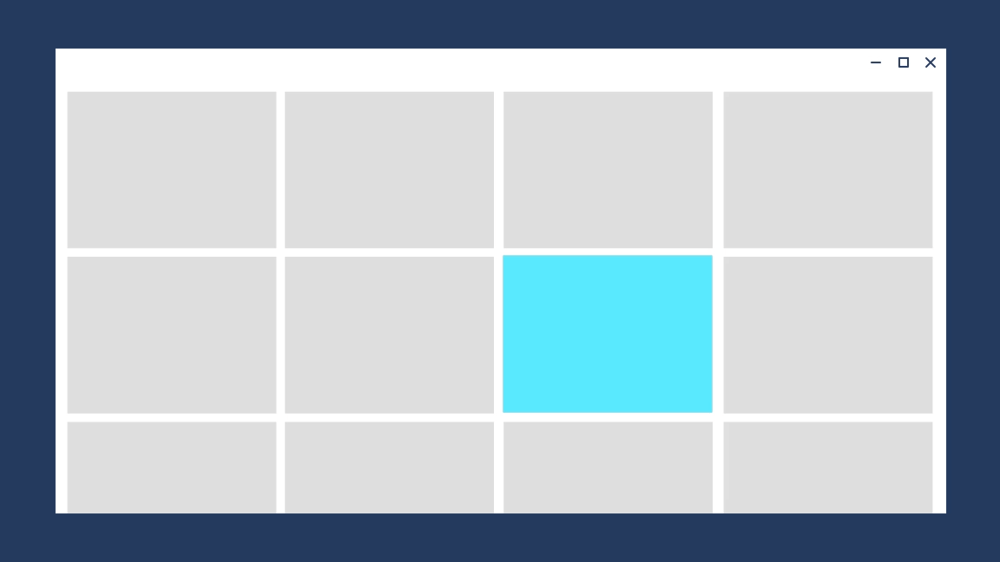

# The Fluent Design System for Windows app creators


## Introduction

The Fluent Design System is our system for creating adaptive, empathetic, and beautiful user interfaces.

## Principles

**Adaptive: Fluent experiences feel natural on each device**

Fluent experiences adapt to the environment. A Fluent experience feels comfortable on a tablet, a desktop PC, and an Xbox—it even works great on a Mixed Reality headset. And when you add more hardware, like an additional monitor for your PC, a Fluent experience takes advantage of it.

**Empathetic: Fluent experiences are intuitive and powerful**

Fluent experiences adjust to behavior and intent&mdash;they understand and anticipate what’s needed. They unite people and ideas, whether they’re on opposite sides of the globe or standing right next to each other.

**Beautiful: Fluent experiences are engaging and immersive**

By incorporating elements of the physical world, a Fluent experience taps into something fundamental. It uses light, shadow, motion, depth, and texture to organize information in a way that feels intuitive and instinctual.


## Applying Fluent Design to your app with UWP


Our design guidelines explain how to apply Fluent Design principles to apps. What type of apps? While many of our guidelines can be applied to any platform, we created UWP (the Universal Windows Platform) to support Fluent Design.

Fluent Design features are built into UWP. Some of these features&mdash;such as effective pixels and the universal input system&mdash;are automatic. You don't have to write any extra code to take advantage of them. Other features, like acrylic, are optional; you add them to your app by writing code to include them.

> We're bringing UWP controls to the desktop so that you can enhance the look, feel, and functionality of your existing WPF or Windows applications with Fluent Design features. To learn more, see [Host UWP controls in WPF and Windows Forms applications](/windows/uwp/xaml-platform/xaml-host-controls).

<!-- To apply Fluent Design to your app, follow our guidelines and use UWP (Universal Windows Platform) you can use UWP UI features combined with best practices for creating apps that perform beautifully on all types of Windows-powered devices. -->

In addition to design guidance, our Fluent Design articles also show you how to write the code that makes your designs happen. UWP uses XAML, a markup-based language that makes it easier to create user interfaces. Here's an example:

```xaml
<Grid BorderBrush="Blue" BorderThickness="4">
    <TextBox Text="Design with XAML" Margin="20" Padding="16,24"/>
</Grid>
```


> If you're new to UWP development, check out our [Get started with UWP page](/windows/uwp/get-started).

## Find a natural fit

How do you make an app feel natural on a variety of devices? By making it feel as though it were designed with each specific device in mind. A UI layout that adapts to different screen sizes so there's no wasted space (but no crowding either) makes an experience feel natural, as though it were designed for that device.

:::row:::
    :::column:::
        
    :::column-end:::
	:::column span="2":::
**Design for the right breakpoints**

Instead of designing for every individual screen size, focusing on a few key widths (also called "breakpoints") can greatly simplify your designs and code while still making your app look great on small to large screens.

[Learn about screen sizes and breakpoints](/windows/uwp/design/layout/screen-sizes-and-breakpoints-for-responsive-design)
    :::column-end:::
:::row-end:::

:::row:::
    :::column:::
        
    :::column-end:::
	:::column span="2":::
**Create a responsive layout**

For an app to feel natural, it should adapt its layout to different screen sizes and devices. You can use automatic sizing, layout panels, visual states, and even separate UI definitions in XAML to create a responsive UI.

[Learn about responsive design](/windows/uwp/design/layout/responsive-design)
    :::column-end:::
:::row-end:::

:::row:::
    :::column:::
        
    :::column-end:::
	:::column span="2":::
**Design for a spectrum of devices**

UWP apps can run on a wide variety of Windows-powered devices. It's helpful to understand which devices are available, what they're made for, and how users interact with them.

[Learn about UWP devices](/windows/uwp/design/devices/)
:::row-end:::

:::row:::
    :::column:::
        
    :::column-end:::
	:::column span="2":::
**Optimize for the right input**

UWP apps automatically support common mouse, keyboard, pen, and touch interactions. There's nothing extra you have to do. But, if you'd like to, you can enhance your app with optimized support for specific inputs, like pen and the Surface Dial.

[Learn about inputs and interactions](/windows/uwp/design/input/input-primer)
:::row-end:::

## Make it intuitive

An experience feels intuitive when it behaves the way the user expects it to. By using established controls and patterns and taking advantage of platform support for accessibility and globalization, you create an effortless experience that helps users be more productive.

Demonstrating empathy is about doing the right thing at the right time.

Fluent experiences use controls and patterns consistently, so they behave in ways the user has learned to expect. Fluent experiences are accessible to people with a wide range of physical abilities, and incorporate globalization features so people around the world can use them.

:::row:::
    :::column:::
        
    :::column-end:::
	:::column span="2":::
**Provide the right navigation**

Create an effortless experience by using the right app structure and navigation components.

[Learn about navigation](/windows/uwp/design/basics/navigation-basics/)
:::row-end:::

:::row:::
    :::column:::
        
    :::column-end:::
	:::column span="2":::
**Be interactive**

Buttons, command bars, keyboard shortcuts, and context menus enable users to interact with your app; they're the tools that change a static experience into something dynamic.

[Learn about commanding](/windows/uwp/design/basics/commanding-basics/)
:::row-end:::

:::row:::
    :::column:::
        
    :::column-end:::
	:::column span="2":::
**Use the right control for the job**

Controls are the building blocks of the user interface; using the right control helps you create a user interface that behaves the way users expect it to. UWP provides more than 45 controls, ranging from simple buttons to powerful data controls.

[Learn about UWP controls](/windows/uwp/design/controls-and-patterns/)
:::row-end:::

:::row:::
    :::column:::
        
    :::column-end:::
	:::column span="2":::
**Be inclusive**
A well-designed app is accessible to people with disabilities. With some extra coding, you can share your app with people around the world.

[Learn about Usability](/windows/uwp/design/usability/)
:::row-end:::

## Be engaging and immersive

Fluent Design isn't about flashy effects. It incorporates physical effects that truly enhance the user experience, because they emulate experiences that our brains are programmed to process efficiently.

## Use light

Light has a way of drawing our attention. It creates atmosphere and a sense of place, and it’s a practical tool to illuminate information.

Add light to your UWP app:

:::row:::
    :::column:::
        
    :::column-end:::
	:::column span="2":::
**Reveal highlight**

[Reveal highlight](/windows/uwp/design/style/reveal) uses light to make interactive elements stand out. Light illuminates the elements the user can interact with, revealing hidden borders. Reveal is automatically enabled on some controls, such as list view and grid view. You can enable it on other controls by applying our predefined Reveal highlight styles.
:::row-end:::

:::row:::
    :::column:::
        
    :::column-end:::
	:::column span="2":::
**Reveal focus**

[Reveal focus](/windows/uwp/design/style/reveal-focus) uses light to call attention to the element that currently has input focus.
:::row-end:::

## Create a sense of depth

We live in a three-dimensional world. By purposefully incorporating depth into the UI, we transform a flat, 2-D interface into something more&mdash;something that efficiently presents information and concepts by creating a visual hierarchy. It reinvents how things relate to each other within a layered, physical environment

Add depth to your UWP app:

:::row:::
    :::column:::
        
    :::column-end:::
	:::column span="2":::
**Parallax**

[Parallax](/windows/uwp/design/motion/parallax) creates the illusion of depth by making items in the foreground appear to move more quickly than items in the background.
:::row-end:::

## Incorporate motion

Think of motion design like a movie. Seamless transitions keep you focused on the story, and bring experiences to life. We can invite those feelings into our designs, leading people from one task to the next with cinematic ease.

Add motion to your UWP app:

:::row:::
    :::column:::
        
    :::column-end:::
	:::column span="2":::
**Connected animations**

[Connected animations](/windows/uwp/design/motion/connected-animation) help the user maintain context by creating a seamless transition between scenes.
:::row-end:::

## Build it with the right material

The things that surround us in the real world are sensory and invigorating. They bend, stretch, bounce, shatter, and glide. Those material qualities translate to digital environments, making people want to reach out and touch our designs.

Add material to your UWP app:

:::row:::
    :::column:::
        
    :::column-end:::
	:::column span="2":::
**Acrylic**

[Acrylic](/windows/uwp/design/style/acrylic) is a translucent material that lets the user see layers of content, establishing a hierarchy of UI elements.
:::row-end:::

## Design toolkits and code samples

Want to get started creating your own apps with Fluent Design? Our toolkits for Adobe XD, Adobe Illustrator, Adobe Photoshop, Framer, and Sketch will help jumpstart your designs, and our samples will help get you coding faster.

:::row:::
    :::column:::
        
    :::column-end:::
	:::column span="2":::
**Design toolkits and samples page**

Check out our [Design toolkits and samples page](/windows/uwp/design/downloads/)
:::row-end:::


