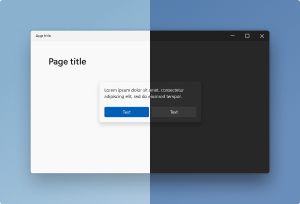
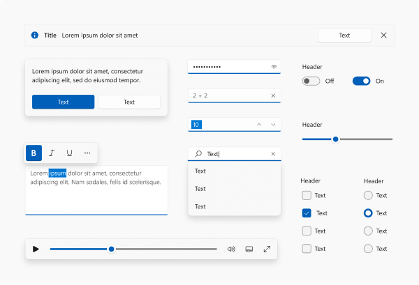
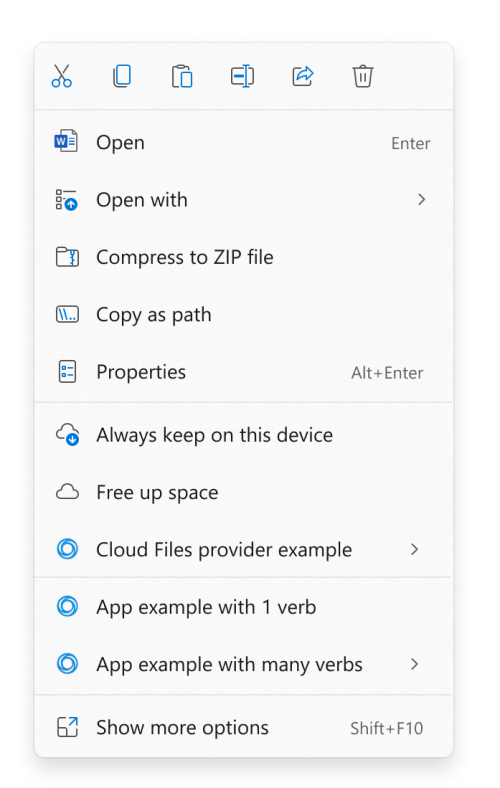
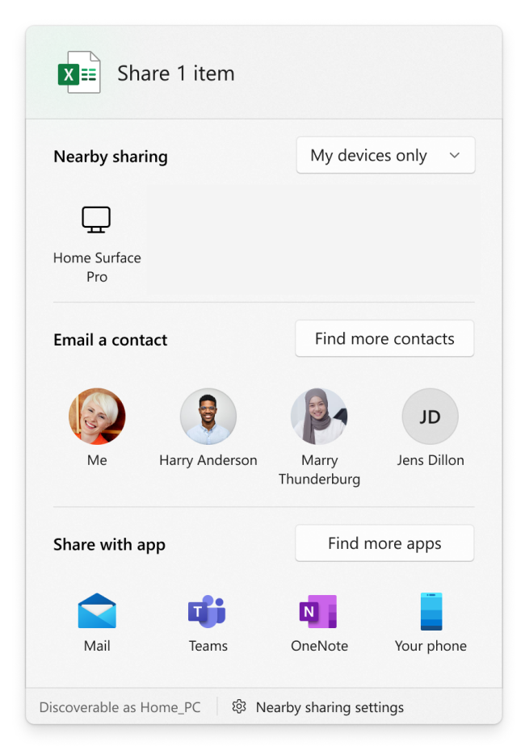
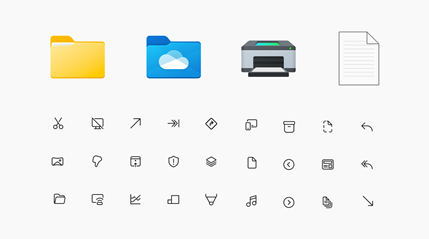
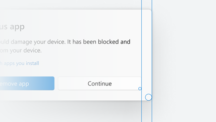

# Windows application development - Best practices

The best practices in this article help you build great Windows apps that reach and delight about 1.5 billion diverse PC users around the world. This article is divided into the following sections:

1. **[User experience](#user-experience-ux)**: Guidance in this section helps you improve the look, feel, and usability of your apps.
1. **[Performance and fundamentals](#performance-and-fundamentals)**: Guidance in this section helps you improve your app's performance and resource utilization.
1. **[Operating system / hardware optimization](#operating-system-and-hardware-optimization)**: Guidance in this section helps you optimize your packaging and distribution for a variety of hardware configurations.
1. **[Application discovery and management](#application-discovery-and-management)**: Guidance in this section makes it easier for users to discover, install, update, and uninstall your app.
1. **[Accessibility](#accessibility)**: Guidance in this section helps you build accessible and inclusive experiences.
1. **[Security and privacy](#security-and-privacy)**: Guidance in this section helps you mitigate security risks and meet your users' privacy needs.

## User experience (UX)

Windows 11 offers a visual evolution of the Windows operating system that improves the look, feel, and usability of Windows. Studies show that users have high expectations for Windows apps:

- They expect Windows apps to work with a complete range of inputs.
- They expect design and interaction patterns that look and feel native on current and future devices.
- They expect support for modern windowing workflows and shell integration points.

When applications adhere to Windows styles and standard Windows behaviors, users don't have to re-learn interaction patterns. This consistency makes it much easier for users to use your app. An app that looks great can create a great first impression, but an app that's also easy to use and helps the user accomplish their goals creates a great lasting impression.

Windows 11 is built on the [Windows 11 design principles](../design/signature-experiences/design-principles.md). Following these guidelines as you build your apps helps you meet your customers' expectations of a great app experience. When thinking about incorporating the latest and recommended Windows application UI/UX patterns into your Windows applications, focus on these five areas:

- Layout
- UI interaction
- Visual style
- Window behavior
- Shell integration points

[WinUI](../winui/index.md) provides built-in support for many of these experiences and styles through its common controls. If you can't use WinUI, consider emulating the styles demonstrated in our [design toolkits](https://aka.ms/WinUI/3.0-figma-toolkit) and [WinUI 3 Gallery](https://apps.microsoft.com/detail/9P3JFPWWDZRC).

### Layout

Windows applications run on a variety of configurations that match users' needs. Test your application's panes and pages across a variety of dimensions, devices, window sizes, DPI settings, and scale settings. Your application should work as expected even when resized down to small dimensions.

#### DPI awareness
  
WinUI applications automatically scale for each display that they're running on. Other Windows programming technologies (Win32, WinForms, WPF, and so on) don't automatically handle per-monitor DPI scaling. Without extra work to support per-monitor DPI scaling for these technologies, applications might appear blurry or incorrectly sized. For more information, see [High DPI Desktop Application Development on Windows](/windows/win32/hidpi/high-dpi-desktop-application-development-on-windows).

#### Responsive layout
  
Use [responsive design techniques](../design/layout/responsive-design.md) to optimize your app pages for different window sizes. Follow the [guidelines for panning or scrolling](../design/input/guidelines-for-panning.md) to ensure that users can always access your content, no matter how small the app window gets.

### UI interaction

Windows users can choose from a wide variety of input devices to interact with your application, and Windows has specific system experiences that people are accustomed to using. When your application adheres to these experiences, your users can use your application reliably. When your app doesn't follow these conventions, users might find it confusing or frustrating.

#### On-object commanding

Use [on-object commanding](../design/controls/collection-commanding.md#creating-context-menus) such as [context menus](../design/controls/menus-and-context-menus.md), [swipe commands](../design/controls/swipe.md), and [keyboard shortcuts](../design/input/keyboard-accelerators.md). Windows 11 improves the behavior of the right-click context menu, so if your app creates context menus, refer to the latest [context menu](#context-menus) integration guidance. WinUI text controls automatically expose cut, copy, and paste commands, but other controls might need extra work to support these commands.

#### Text interaction

Whenever there's text in an application, users expect that they can select and copy it. If the text is editable, they expect that they can cut and paste, as well. By providing consistent shortcuts to users, you let them complete their tasks more efficiently. Ensure that users can perform these actions by using keyboard, mouse or trackpad, touch, and pen.

#### Panning and scrolling

It's uncommon for an application's UI to fit entirely inside a single page that doesn't need to scroll. Even if there are only a few UI elements, users can freely resize the app window and cause some UI elements to be hidden. Ensure that your application's UI properly supports scrolling and panning (using keyboard, mouse or trackpad, touch, and pen) to let users access any UI elements that might move out of the visible window area.

### Visual style

Windows 11 is built on the [Windows 11 design principles](../design/signature-experiences/design-principles.md): Effortless, Calm, Personal, Familiar, and Complete + Coherent. Experiences that follow these principles bring great user experiences on Windows.

#### Materials: Acrylic and Mica

[Acrylic](../design/style/acrylic.md) and [Mica](../design/style/mica.md) are visual [materials](../design/signature-experiences/materials.md) that give interactive UI controls a distinct "occluded" visual style. 

- Use [Acrylic](../design/style/acrylic.md) to apply a semi-transparent style to transient surfaces like context menus, flyouts, and other elements that users can light-dismiss.
- Use [Mica](../design/style/mica.md) to add a subtle adaptive tint to long-lived UI surfaces.

Mica is a very performant material that is meant to be used on long-lived UI surfaces like TitleBar to communicate the active or inactive state of the app. Mica is a texture that creates visual delight while saving battery life.

- Mica is to be used on the base layer of the app's UI to communicate the active state of the app; it falls back to a solid color when the app does not have focus. Thus, we recommend use of Mica on the TitleBar's background.
- Some controls, like NavigationView, already come built with the default behavior.
- When an app that uses Mica runs in Windows 10 or down-level, it will degrade gracefully (Mica will fallback to a solid color).
- Mica is to be used on long-lived surfaces, unlike Acrylic, which is to be used on transient surfaces.
- If you are using Acrylic material, follow the existing [Acrylic guidance](../design/style/acrylic.md) as we have updated the colors to be more vibrant.

[Mica guidance](../design/style/mica.md), [Acrylic guidance](../design/style/acrylic.md)

#### Dark and Light themes

Dark and Light themes give users a way to adapt your app to their visual preferences. Windows 11 updates the color tones to be softer on the eyes by avoiding pure white and black, which makes the colors much more delightful.

WinUI supports switching between Dark and Light themes by default (see [XAML theme resources](../develop/platform/xaml/xaml-theme-resources.md)). For Win32 apps, see [Support Dark and Light themes in Win32 apps](../desktop/modernize/ui/apply-windows-themes.md). (The title bar in Win32 apps doesn't automatically adapt to the Dark theme. Be sure to follow the [title bar guidance](../desktop/modernize/ui/apply-windows-themes.md#enable-a-dark-mode-title-bar-for-win32-applications) in the article).

#### Refreshed UI elements

Windows 11 brings beautiful UI innovations to the Windows operating system that you can leverage in your apps. [Windows 11 geometry](../design/signature-experiences/geometry.md) supports modern app experiences. Progressively rounded corners, nested elements, and consistent gutters combine to create a soft, calm, and approachable effect that emphasizes unity of purpose and ease of use.

The visual and behavioral changes are built in to [WinUI](../winui/index.md). Use WinUI where you can to take advantage of the work that the Windows development team already did. If you can't use WinUI, consider emulating the styles demonstrated in the [design toolkits](https://www.aka.ms/WinUI/3.0-figma-toolkit) and [WinUI 3 Gallery](https://apps.microsoft.com/detail/9P3JFPWWDZRC).

[Common controls](../develop/ui/controls/index.md) are one way that you can utilize these updates immediately. Use the latest common controls whenever possible to get the benefits of compatibility and accessibility for free. And these common controls are more cost effective than building your own custom controls when you factor in maintenance and testing costs.

#### Context menu extensions and Share targets

A context menu is a shortcut menu that the user invokes with a right-click or tap and hold action to reveal a menu of commands relevant to the context of the control the user is interacting with. Users expect the appearance and behavior of context menus to be coherent across Windows. Use platform-provided context menus whenever possible to keep them consistent with the rest of the system.

Windows 11 refines the behavior of the contextual file operations in the right-click context menu of File Explorer and the Share dialog. If your app creates context menus or defines share targets, you may need to make some changes to ensure that these work well with Windows 11.

##### Context menus

For Windows 11, we improved the behavior of the context menu in File Explorer in several ways:

- Common commands, such as **Cut**, **Copy**, **Paste**, and **Delete**, have been moved to the top of the menu.
- **Open** and **Open with** are now grouped together.
- App extensions are grouped together below Shell verbs. Apps with more than one verb are grouped into a flyout with app attribution.
- [Cloud files provider apps](/windows/win32/cfapi/build-a-cloud-file-sync-engine) are placed next to the Shell commands to hydrate or dehydrate files.
- The older context menu from Windows 10 (along with lesser-used commands from the older context menu) is still available via the **Show more options** item at the bottom of the menu. **Shift** + **F10** or the keyboard menu key will also load the Windows 10 context menu.

If your app defines a context menu extension, the following requirements must be met for the extension to appear in the new Windows 11 context menu. Otherwise, your app's context menu extension will appear in the older context menu available via the **Show more options** item.

- Your context menu extension must be implemented by using the [**IExplorerCommand**](/windows/win32/api/shobjidl_core/nn-shobjidl_core-iexplorercommand) interface. Context menu extensions that implement [**IContextMenu**](/windows/win32/api/shobjidl_core/nn-shobjidl_core-icontextmenu) will appear in the older context menu instead.
- Your app must be a *packaged app* so that it has package identity at runtime. See [Features that require package identity](../desktop/modernize/modernize-packaged-apps.md) for some options for packaging your app.

##### Share dialog

For Windows 11, we improved the behavior of the Share dialog in several ways.  

- Discoverability settings for nearby sharing are now at the top of the dialog and more settings are available at the bottom.
- All apps can now participate in the Share dialog as targets, including unpackaged desktop apps and PWAs that are installed through Microsoft Edge.
  - A previously unpackaged desktop app can participate as a target in the Share dialog if you package it with external location (see [Grant package identity by packaging with external location](../desktop/modernize/grant-identity-to-nonpackaged-apps.md)). For sample code that demonstrates how to do that, see the [PackageWithExternalLocation](https://github.com/microsoft/AppModelSamples/tree/master/Samples/PackageWithExternalLocation) sample app.
  - A PWA can participate in the Share dialog if it implements the [Web Share Target API](/microsoft-edge/progressive-web-apps-chromium/webappmanifests#identify-your-app-as-a-share-target).

#### Iconography and typography

Windows 11 has [updated icons ("Segoe Fluent Icons")](../design/signature-experiences/iconography.md), improved support for [animated icons](../design/controls/animated-icon.md), and a [new UI font ("Segoe UI Variable")](../design/signature-experiences/typography.md). Use these new icons and font whenever possible to be coherent on Windows 11. The new font brings much softer geometry and makes the text much more legible.

- New icons called "Segoe Fluent Icons" are introduced for monoline icons. Controls in WinUI 2.6 and greater use the new icons and typography automatically.
- File type icons are updated. If your app is using icons in `imageres.dll` or `shell32.dll`, then icons will be updated automatically. Otherwise, a manual style update might be needed.
- App icons - Follow the latest guidance for [Icons in Windows apps](../develop/ui/controls/icons.md) used in places like launchers on Start and TaskBar.
- Animated icons - Lottie animation support was added to WinUI and we recommend using [AnimatedIcon](../develop/ui/controls/animated-icon.md) functionality to animate your icons in a meaningful way. Just as with other stylistic changes, you will need WinUI 2.6 or greater.
- Custom experiences written in XAML that specify `Segoe UI` in code, should instead specify `Segoe UI Variable`.

> [!NOTE]
> When an app that uses the new font runs in Windows 10 or down-level, it will fallback to use the old font and degrade gracefully.

### Window behavior and style

Applications run in a frame that Windows provides. Users expect the built-in Windows look and behaviors to be consistent across app windows. To ensure that your app looks and functions as users expect on Windows 11, consider supporting the features listed here.

#### Title bar and caption buttons

Users interact with the title bar and caption buttons (minimize, maximize, close) to resize, move, and close app windows. A consistent experience helps people use your application smoothly. See [Windows app title bar](../design/basics/titlebar-design.md) to learn about title bar and caption button design for Windows.  

You can use the Windows App SDK APIs to [integrate app content with the title bar](../develop/title-bar.md) in WinUI, .NET, WinForms, and WPF apps.

#### Snap Layout
  
Window snapping is greatly enhanced in Windows 11, and the Snap Layout menu is a new feature that helps users discover and use the power of window snapping. Use the Snap Layout menu to test your app in different Snap Layouts and ensure your app supports different snap sizes, like 1/2, 1/3, and 1/4 screen.

Snap layouts are easily accessible by hovering the mouse over a window's maximize button or pressing Win + Z. After invoking the menu that shows the available layouts, users can click on a zone in a layout to snap a window to that particular zone and then use Snap Assist to finish building an entire layout of windows. Snap layouts are tailored to the current screen size and orientation, including support for three side-by-side windows on large landscape screens and top/bottom stacked windows on portrait screens.

Most apps will automatically support the menu with snap layouts, but in some cases you might need to do a little work to get them:

- Allow the system to draw your border and shadow.
- If you need to draw your own border and shadow:
  - Use our APIs to have the platform draw and implement the caption buttons. See [Support snap layouts for desktop apps on Windows 11](../desktop/modernize/ui/apply-snap-layout-menu.md).

You will get these features automatically if you use Windows App SDK windowing to:

  - Configure the style of your window using the pre-defined templates.
  - Customize the title bar of your windows.

#### Rounded corners

We rounded the corners of window borders in Windows 11. Our user research team found that rounded geometry psychologically provides a feeling of safety and makes the app's UI much easier to scan. This makes users feel less intimidated and the app feel more engaging. The amount of rounding was also carefully chosen. We worked across the company and user research to balance between feeling professional and being softer and more inviting.

In most cases, your app's window has rounded corners by default on Windows 11. If you customize your app window and don't have rounded corners, see [Apply rounded corners in desktop apps for Windows 11](../desktop/modernize/ui/apply-rounded-corners.md) for some things you can do. You should also avoid customizing window borders and shadows, which can prevent the system from rounding the window corners.

### Shell integration points

Windows shell integration lets users benefit from your app even when it's not running in the foreground or visible on-screen. When your app integrates well with Windows, it becomes part of the user's workflow with other apps and helps create a seamless experience.

#### Toast notifications

[Toast notifications](../develop/notifications/app-notifications/app-notifications-ux-guidance.md) are the Windows notifications that appear at the bottom of the user's screen and in the Notification Center.

  - Personalize, make actionable, and ensure notifications are useful to your users. Give your users what they want, not what you want them to know.
  - Avoid noisy notifications. Too many interruptions from your app lead to users turning off this critical communication channel for your app.
  - Respond to the user's intent. Selecting a notification should launch your app in the notification's context. The only exception to this guideline is when the user selects a button on your notification that's attached to a background task, such as a quick reply.
  - Provide a consistent Notification Center experience. Keep Notification Center tidy by clearing out old notifications.

  For more information about toast notifications, see [Notifications design basics](../develop/notifications/app-notifications/app-notifications-ux-guidance.md).

## Performance and fundamentals

Windows users expect Windows apps to exhibit great performance and fundamentals. As you design and build your app, keep in mind optimizing for memory usage, power consumption, responsiveness, reliability, and the impact on long-term sustainability. Allocating time to test and measure your application's fundamentals and performance ensures that your users have a first-class experience.

Following the best practices in this section helps you meet your customers' expectations across these criteria.

- [Minimize application memory usage](../performance/disk-memory.md):
  - Reduce foreground memory usage.
  - Minimize background work.
  - Release resources while in the background.
  - Ensure your application doesn't leak memory.

- [Make efficient use of the disk footprint](../performance/disk-memory.md#efficiently-use-disk-space):
  - Enable "pay for play" for optional functionality.
  - Ensure any caches are sized efficiently.
  - Implement new experiences in a disk-efficient manner.
  - Optimize individual binary sizes where possible.

- [Improve power consumption and battery life by minimizing background work](../performance/power.md):
  - Don't wake the CPU or use system resources while in the background.

- [Improve the responsiveness of your app's launch and key interactions](../performance/responsive.md):
  - Define your key interaction scenarios and add ETW events to measure.
  - Set goals based on the interaction class associated with user expectations.

For more information, see the [Performance and fundamentals overview](../performance/index.md). This article answers questions such as "What is application performance and why is it important?" and "What tools can I use to measure Windows application performance?" It also links to case studies, related blogs, support communities, and information on how performance engineering intersects with sustainability by reducing the impact your application has on our planet.

## Operating system and hardware optimization

You can build, package, and deliver Windows apps in many ways. The best practices in this section help you optimize these aspects of your application across hardware configurations.

People run Windows across conventional devices as well as an increasingly diverse, modern range of devices. Devices today come not only with x86/x64-based, but also Arm-based, architectures; not only with mouse and keyboard but also touch screens, touchpads, and pens; with cameras, GPS, and sensors like gyroscopes; and with graphics and neural processing chipsets that enable not only amazing visuals but also hardware-accelerated artificial intelligence (AI). Customers expect apps to take advantage of the hardware (that they have paid for!) and be cognizant of the device form factor to give them an appropriately optimized experience.

- Support a variety of inputs and interactions - [Input and interactions overview](../develop/input/index.md)
- Achieve AI powered productivity with Win ML - [Introduction to Windows Machine Learning](/windows/ai/new-windows-ml/overview).
- Use AI models that run locally and power Microsoft Foundry on Windows features on Copilot+ PCs - [What is Windows ML?](/windows/ai/apis/).
- Use a variety of AI-powered features supported by Windows AI APIs in the Windows App SDK and machine learning (ML) models that run locally on Copilot+ PCs - [What are Windows AI APIs?](/windows/ai/apis/).

### MSIX app attach and Azure Virtual Desktop

To make your app run best in an enterprise environment, add support for MSIX app attach.

[MSIX app attach](/azure/virtual-desktop/what-is-app-attach) lets you deliver MSIX applications to both physical and virtual machines. It's made specifically for [Azure Virtual Desktop](/azure/virtual-desktop/overview) (AVD), a desktop and app virtualization service that runs on the cloud. Using MSIX app attach with AVD can help you improve sign-in times for users, and it can reduce infrastructure costs for your enterprise.  

### Windows on Arm

Windows can run on Arm devices. Arm PCs benefit from extended battery life and integrated support for mobile data networks. These PCs also provide great application compatibility and allow you to run your existing `x86` and `x64` applications unmodified.

For best performance, enable your apps to take full advantage of the energy-efficient Arm processor architecture by either building a full Arm version or by optimizing the parts of the codebase that benefit most from native performance. For more information on these techniques, see [Windows on Arm](/windows/uwp/porting/apps-on-arm) and [Arm64EC for Windows 11 apps on Arm](/windows/uwp/porting/arm64ec).

### Push notifications

[Push notifications](/azure/notification-hubs/notification-hubs-push-notification-overview) allow you to send information from your cloud service to your app in a performance-optimized way. Push notifications include raw notifications, badge notifications, and toast notifications sent from your cloud service.
- Use push notifications to wake up the app or client rather than always keeping it running to optimize performance on the user's device. See [Push notifications overview](../develop/notifications/push-notifications/index.md) for Windows App SDK guidance.
- Don't use notification channels to send advertisements.  
- Respect `retry-after` headers – this practice protects the service and ensures notification delivery success.
- Remove expired or revoked channels from the system. [Windows Push Notification Services](../develop/notifications/push-notifications/wns-overview.md) (WNS) doesn't process requests for expired or revoked channels.
- Avoid sudden, large bursts of requests to WNS. This pattern can lead to throttled responses.
- Utilize the `MS-CV` header. This header helps with end-to-end traceability and diagnostics.
- Have a back-up mechanism for when notifications don't work. 
- Use [Azure Notification Hubs](/azure/notification-hubs/notification-hubs-push-notification-overview) (ANH). ANH gives you access to engagement features like targeting audiences, scheduling notifications, and broadcasting notifications. If you're a Windows-only developer today, using ANH makes it easy for you to transition your notifications infrastructure to other platforms in the future.

## Application discovery and management

Reliable installation, update, and uninstallation experiences are important parts of a consistent, high-quality user experience. The following best practices help ensure that your application leaves a good impression when users discover and manage it:

### Application discovery

  - Listing your app on the [Microsoft Store](https://blogs.windows.com/windowsexperience/2021/06/24/building-a-new-open-microsoft-store-on-windows-11/) makes your app more discoverable for users.
  - If you host your app across multiple channels (for example, on a website and on the Microsoft Store), use a consistent application identity and update mechanism across all channels.
  - [Distribute your app through the Microsoft Store](../distribute-through-store/how-to-distribute-your-win32-app-through-microsoft-store.md) to make it more discoverable for users. Note that Windows users access Store apps through the Windows Package Manager [WinGet](../../package-manager/winget/index.md). If you don't publish to the Microsoft Store, you can still make your app easily discoverable in WinGet via the [WinGet repository](../../package-manager/package/index.md).

### Unpackaged app distribution

If full MSIX packaging isn't an option for your app, consider packaged with external location (which retains package identity while hosting binaries outside the package) or distributing as a fully unpackaged app. For unpackaged distribution, keep these best practices in mind:

  - Set `WindowsPackageType` to `None` in your project file. See [Distribute an unpackaged WinUI 3 app](../package-and-deploy/unpackage-winui-app.md) for setup steps and limitations.
  - Choose between framework-dependent and self-contained deployment. Framework-dependent reduces your app size but requires the Windows App SDK runtime on the user's machine. Self-contained bundles the runtime but increases disk footprint. See [Windows App SDK deployment overview](../package-and-deploy/deploy-overview.md).
  - For framework-dependent unpackaged apps, setting `WindowsPackageType` to `None` enables auto-initialization of the Windows App SDK runtime. For advanced scenarios that require explicit control over initialization, you can call the bootstrapper API directly. See [Deployment guide for unpackaged apps](../windows-app-sdk/deploy-unpackaged-apps.md).
  - Digitally sign all executables and DLLs. Without MSIX, there is no package signature to establish trust, so individual binary signatures are essential for Smart App Control and enterprise deployment.
  - Register for clean uninstall through **Apps > Installed Apps** in Settings. MSIX handles this automatically; unpackaged apps must manage their own registry entries and file cleanup.

### Installation and uninstallation

  - Support a per-user install. This support enables users to install more easily and avoid UAC prompts.
  - Ensure that your application's installation is error free, transparent, and thoughtful about its file management. Your application's installation shouldn't leave any temporary files behind.
  - Avoid requiring elevated permissions to install and requiring operating system reboots when possible.
  - Support silent installation. This support is important for app manageability in enterprise environments.
  - Ensure your app is listed in the **Apps** -> **Installed Apps** list.
  - Consider using MSIX to ensure that users experience a seamless installation, update, and uninstallation experience. MSIX automatically removes the app binaries and data. For information about how packaged apps handle files and registry entries, see [Understanding how packaged desktop apps run on Windows](/windows/msix/desktop/desktop-to-uwp-behind-the-scenes). 
  - For unpackaged apps, ensure that users can easily uninstall your application through the **Apps** -> **Installed Apps** list in Settings. When users uninstall your application, ensure that Start menu entries, files, directories, registry entries, and temporary files are also removed. Consider giving your users the option to preserve their data when they uninstall your application.  
  - Ensure that during uninstallation your app removes all binaries and application data. User-created content should be stored in locations like `Documents`, which users can retain even after the app is uninstalled.
  - Avoid installing or updating system binaries that might require a reboot.
  - Integrate with [RestartManager](/windows/win32/rstmgr/about-restart-manager) to save and restore state between OS updates.

### Updates

  - Support an update mechanism that allows your app to restart when it's convenient for the user. Consider using the Windows App SDK Restart APIs to manage app behavior for WinUI apps. 
  - Ensure that your update mechanism downloads only the essential changed components that need to be updated. This approach minimizes the required network bandwidth.  
  - Provide a way to update and repair your app. Consider MSIX, which automatically handles update repair. For more information, see [Auto-update and repair apps](/windows/msix/app-installer/auto-update-and-repair--overview).
  - Consider push notification-based updates or checking for available updates at app startup or at restart.

### Additional resources

  - [MSIX documentation](/windows/msix/)
  - [Windows Installer Best Practices](/windows/win32/msi/windows-installer-best-practices)

## Accessibility

Accessible Windows applications support rich and [inclusive experiences](https://www.microsoft.com/design/inclusive/) for as many people as possible. Inclusive design creates better products for everyone. To make sure your app is accessible and inclusive, consider what improved functionality and usability means in relation to:

- People with disabilities (both temporary and permanent).
- Personal preferences.
- Specific work styles.
- Situational constraints (such as shared work spaces, driving, cooking, glare, and so on).

In fact, the [World Health Organization](https://www.who.int/news-room/fact-sheets/detail/disability-and-health) defines disability not as a personal characteristic, but rather as a mismatched interaction between a person and the physical and digital world around them.

> ### Accessibility is good for both people and business
>
> **Accessibility is a responsibility**
>
> More than 1 billion people worldwide experience some form of disability. However, only one in 10 have access to the assistive technology needed to fully participate in our economies and societies. Typically, the unemployment rate for people with disabilities is twice that of people without a disability. And disabilities - whether situational, temporary, or permanent - can affect any of us at any time.
>
> **Accessibility is an opportunity**
>
> Inclusive organizations that embrace best practices for employing and supporting persons with disabilities in the workplace outperform their peers and do better at attracting and keeping top talent. Millennials, who are 75% of the global workforce, typically choose employers who reflect their values. Diversity and inclusion top that list.

### Incorporating accessibility

Incorporating accessibility into your Windows apps maximizes user engagement, increases product satisfaction, and encourages product loyalty. Proactively designing and implementing accessible experiences typically reduces development and maintenance costs over the long term.

Some common solutions include providing information in alternative formats (such as captions on a video) or enabling the use of assistive technologies (such as screen readers).

Applications designed with accessibility in mind are easier to maintain, update, and redesign. In addition to helping your app reach people with disabilities, factoring in accessibility can reduce the cost of maintaining your app.

For detailed guidance on building accessible Windows apps, see [Accessibility overview](../design/accessibility/accessibility-overview.md).

### Accessibility testing

**Accessibility Insights** is a powerful suite of tools for developers to test the accessibility of their apps and services. Use the following tools to test accessibility:

1. [Inspect in Accessibility Insights for Windows](https://accessibilityinsights.io/docs/windows/getstarted/inspect/). Inspect the accessibility tree to find low-hanging fruit like hints in labels, incorrect roles, and other problems.
1. [Event monitoring in Accessibility Insights for Windows · Accessibility Insights](https://accessibilityinsights.io/docs/en/windows/getstarted/eventmonitoring/). See [Supporting UI Automation Control Types](/windows/win32/winauto/uiauto-supportinguiautocontroltypes) for more info on event monitoring.
1. Run Accessibility Insights automated checks in your PRs or CI/CD. For more info, see [axe-pipelines-samples](https://github.com/microsoft/axe-pipelines-samples).
1. Fix all bugs you find, as they all have a direct impact on accessibility.

## Security and privacy

An insecure application can be an entry point that allows an attacker to perform malicious activities. Even if your app doesn't have security bugs, bad actors can use your app to initiate their attacks through phishing and other forms of social engineering that violate security and privacy boundaries. The best practices in this section help you mitigate risks related to security and user privacy.

### Enhanced security features in Windows

Windows is built on a foundation of security and privacy, and Windows 11 is designed to be the most secure version of Windows yet, and we're committed to helping you build secure apps that take advantage of the latest security features in Windows.

- Protect your Windows apps and backend services with Windows Hello biometric sign-in - [Windows Hello overview](/windows/apps/develop/security/windows-hello).
- Implement passkey sign-ins across online, enterprise, and government applications, and for payments - [Intro to passkeys](/windows/apps/develop/security/intro).
- Sign your apps with a digital certificate to ensure that [Smart App Control](https://support.microsoft.com/windows/app-browser-control-in-the-windows-security-app-8f68fb65-ebb4-3cfb-4bd7-ef0f376f3dc3#bkmk_smart-app-control) can verify the integrity of your app - [Introduction to code signing](/windows/win32/seccrypto/cryptography-tools#introduction-to-code-signing) and [Microsoft Trusted Root Program requirements](/security/trusted-root/program-requirements).

### Security guidelines

- Follow the [Security Development Lifecycle](https://www.microsoft.com/securityengineering/sdl/) for all development.
  - Threat modeling can help you avoid security flaws.
  - Using secure libraries, languages, and tools minimizes implementation flaws.
  - Secure defaults can prevent security problems caused by user error.
- Don't require administrative privileges to _install_ your app.
  - Ideally, your app should support both administrative installs and per-user installs.
  - Using [MSIX packaging](/windows/msix/packaging-tool/tool-overview) is one way to achieve this goal.
- [Don't require administrative privileges to _run_ your app.](/windows/win32/win7appqual/standard-user-analyzer--sua--tool-and-standard-user-analyzer-wizard--sua-wizard-)
  - If certain features need administrative privileges, [consider separating them](/windows/win32/secauthz/developing-applications-that-require-administrator-privilege) into their own processes to reduce the attack surface.
- Use languages with guaranteed memory safety, such as C#, JavaScript, or Rust, especially for risky code paths like parsing untrusted data.
- Use all security mitigations provided by your compiler and toolset (see [Security Features In Microsoft Visual C++](https://devblogs.microsoft.com/cppblog/security-features-in-microsoft-visual-c/) for Visual C++).
- Always use your chosen language or framework's standard libraries for cryptography and other security-sensitive code. _Don't try to build your own._
- Digitally sign all components of your application – not just the installer, but also the uninstaller (if you have one). Also sign all the EXE, DLL, and other executable files that make up your app.
  - Digital signatures enable the user to verify the authenticity of your app and allow Enterprise admins to secure their devices using [Windows Defender Application Control](/windows/security/threat-protection/windows-defender-application-control/wdac-and-applocker-overview).
  - Using MSIX packaging is one way to achieve this goal.
- Ensure all network communication is over a secure transport, such as SSL.
- Provide guardrails or other mitigations that can help protect users from accidentally performing harmful actions, even when coerced into doing so by attackers.
  - Simple "Are you sure you want to do _X_? _Yes / No_" dialogs are typically not effective, because users are conditioned to click "Yes."

Most modern apps collect and use a large amount of data – including personal data – for various reasons. Telemetry, product improvement, and monetization are three common reasons for using data, but users and regulators alike are becoming more sensitive to the privacy implications of these practices. They expect transparency and control over the data collected and used by apps. Use the following tips to help meet the privacy needs of your users.

### Privacy guidelines

#### Privacy Policy

An easily discoverable and understandable privacy notice increases user trust and confidence in your application. Ensure that your app provides an accurate Privacy Policy. Ideally, provide both a summary document written for a casual audience (your users) and a long-form legal policy (written for your lawyers).

Your privacy policy must:

- Inform users of the personal information accessed, collected, or transmitted by your product.
  - How that information is used, stored, and secured.
  - Indicate the types of parties to whom that information is disclosed.
- Describe the controls that users have over the use and sharing of their information and how they may access their information.
- Comply with applicable laws and regulations. Familiarize yourself with privacy regulations in the markets where your app is available. Ensure your app meets or exceeds any requirements for disclosure, usage rights, deletion requests, and other privacy concerns.
- Be kept up-to-date as you add new features and functionality to your product.

[Microsoft Privacy Statement](https://privacy.microsoft.com/privacystatement)

#### Data collection

- Collect the least amount of personal data needed to complete your app's experiences.
  - Don't collect data "just in case." Have a valid reason for collecting all data, such as to improve the customer's experience or to facilitate monetization.
- Always get the user's consent before collecting and storing personal data. Provide the user with an easy way to revert their decision in the future. Avoid "[dark patterns](https://www.reuters.com/legal/legalindustry/dark-patterns-new-frontier-privacy-regulation-2021-07-29/#:~:text=Some%20examples%20of%20dark%20pattern%20usage%20include)" such as making the "Yes" button larger or more prominent than the "No" button in a consent dialog.
  - Consult with applicable regulations to determine what specific disclosures and consent are required for specified kinds of data. For example, some regions may allow users to view, change, or delete the data you have stored about them.
- If you must transmit data over the network, always use secured connections, such as connections over TLS.
- Avoid storing personal data in a centralized location, such as a website. If you must store personal data, minimize the amount of data you store, store it only for as long as strictly necessary, and ensure it is securely encrypted.
- Verify that any third-party libraries or SDKs you use also have good privacy practices. This concern isn't limited to just advertising SDKs – any library that connects to the internet might impact the privacy of your app's users.

## Related articles

- [Create your first WinUI project](../winui/winui3/create-your-first-winui3-app.md)
- [Windows Developer FAQ](./windows-developer-faq.md)
