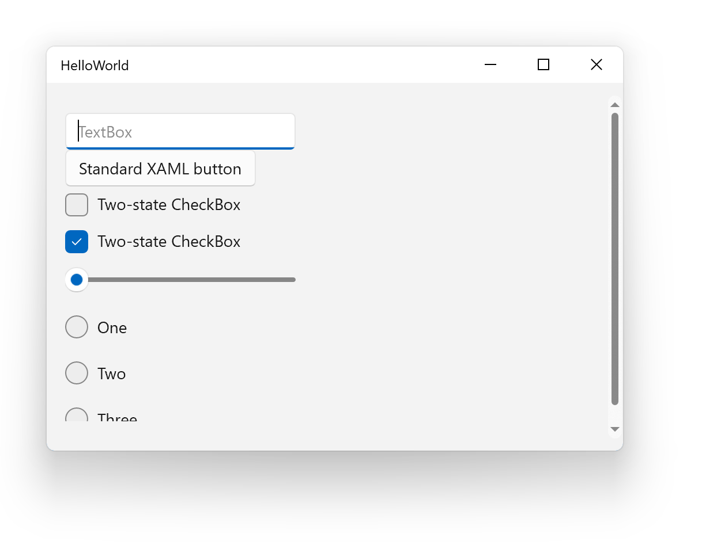

# Create a simple Windows 11 app

This article will walk you through the steps of creating a simple Windows 11 app so you can get started using the new visuals and features of Windows 11. The app we will build here is just a basic showcase of some of the controls that have been updated with new styles and animations.

> [!NOTE]
> To follow the instructions in this article to build a Windows 11 app, you need Windows Insider build 22000 (or later). Windows Insider build 22000 is an early preview release and therefore is subject to change between now and the official release. For more information, see [Getting started with the Windows Insider Program](https://insider.windows.com/getting-started).

## Set up your development environment

1. Install the latest Windows Insider build 22000.
1. Install Visual Studio 2019 version 16.10 or greater.

## Create an app from a project template

The example in this walkthrough will create a C# Universal Windows (UWP) app, but these steps will work with any of the UWP app project templates.

1. Launch Visual Studio and select **Create a New Project**.
1. In the language filter, select **C#**. Then, from the list of installed templates, select **Blank App (Universal Windows)** and click **Next**.
1. Fill in the name and location for your app and click **Create**.
1. For the target version, specify Windows Insider Preview (Build 22000) or higher.

## Add the WinUI 2.6 NuGet package to your app

To take advantage of the new look and feel of Windows 11, you will need to use the controls in the WinUI 2.6 library. (Note that WinUI 3.0 does not currently support the new visual styles.)

1. In **Solution Explorer** right click the project for your app and select **Manage NuGet Packages...**.
1. Select the **Browse** tab and type "WinUI" in the search box.
1. From the package list, select **Microsoft.UI.Xaml**.
1. In the details pane, confirm that the selected version is "2.6.1" or later and click **Install**.

## Update your app code

In the next steps, we'll modify the app source code to use the updated Windows 11 controls.

1. Open App.xaml and add the **Application.Resources** element as a child of the **Application** element the as shown. This gives you app access to the WinUI 2.6 theme resources.

    ```xaml
    <Application
        x:Class="TEST1.App"
        xmlns="http://schemas.microsoft.com/winfx/2006/xaml/presentation"
        xmlns:x="http://schemas.microsoft.com/winfx/2006/xaml"
        xmlns:local="using:TEST1">
        <Application.Resources>
            <XamlControlsResources xmlns="using:Microsoft.UI.Xaml.Controls" />
        </Application.Resources>
    </Application>
    ```

1. Open MainPage.xaml and add the following namespace definition to the `Page` element. This namespace allows us to access controls that are available in WinUI, `Microsoft.UI.Xaml.Controls`, but aren't included in the `Windows.UI.Xaml.Controls` namespace. In this example, this is needed to use the [RadioButtons](/windows/winui/api/microsoft.ui.xaml.controls.radiobuttons) control.

    ```xaml
    xmlns:muxc="using:Microsoft.UI.Xaml.Controls"
    ```

1. In MainPage.xaml, replace the empty `Grid` element with the following XAML code.

    ```xaml
    <Grid>
        <ScrollViewer Padding="16" Height="300">
            <StackPanel Orientation="Vertical" HorizontalAlignment="Left">
                <TextBox PlaceholderText="TextBox" Width="200" />
                <Button Content="Standard XAML button" />
                <CheckBox Content="Two-state CheckBox"/>
                <CheckBox Content="Two-state CheckBox" IsChecked="True"/>
                <Slider Width="200"/>
                <muxc:RadioButtons>
                    <x:String>One</x:String>
                    <x:String>Two</x:String>
                    <x:String>Three</x:String>
                </muxc:RadioButtons>
            </StackPanel>
        </ScrollViewer>
    </Grid>
    ```

## Run the Hello World app

Press F5 to build and run the app.



Notice how the controls on Windows 11 have a cleaner appearance. The [CheckBox](/windows/uwp/design/controls-and-patterns/checkbox) and [Slider](/windows/uwp/design/controls-and-patterns/slider) controls have new animations. For more information on building apps that look great on Windows 11, see [Top 10 things you can do to make your app great on Windows 11](make-apps-great-for-windows.md).
