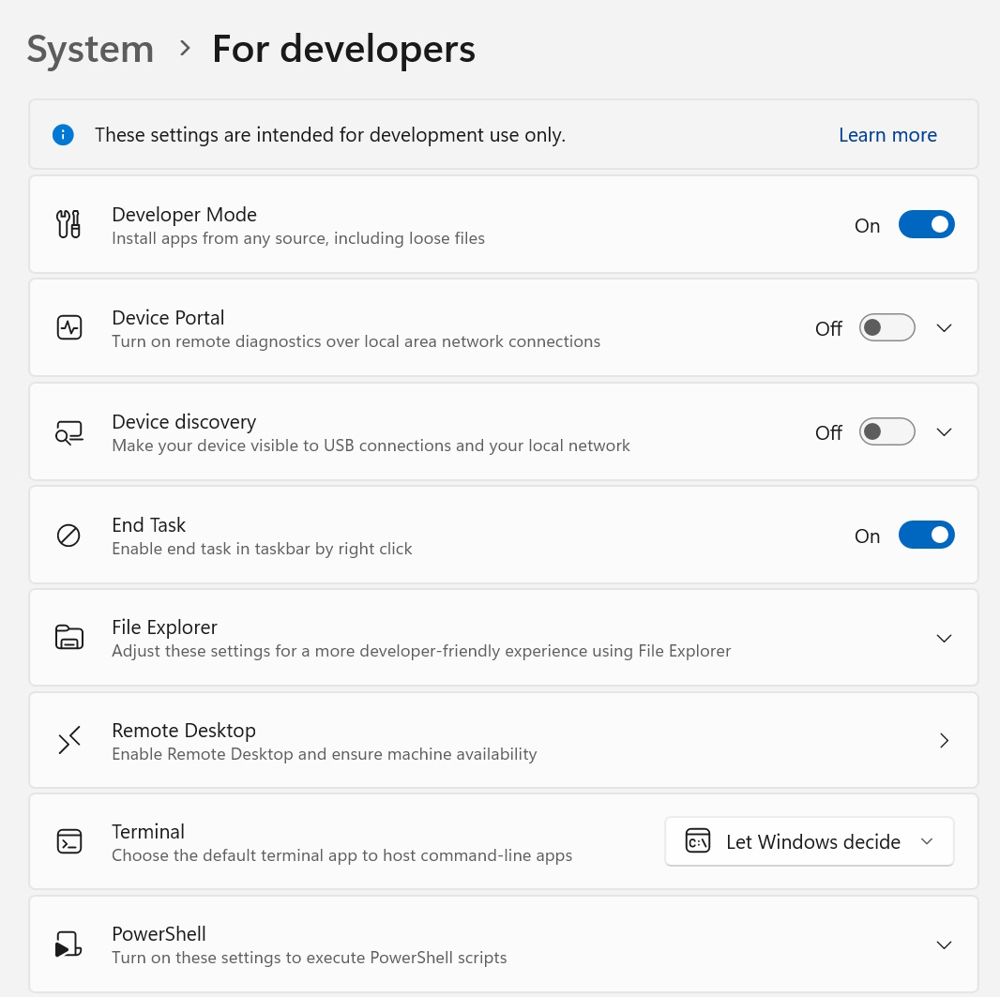
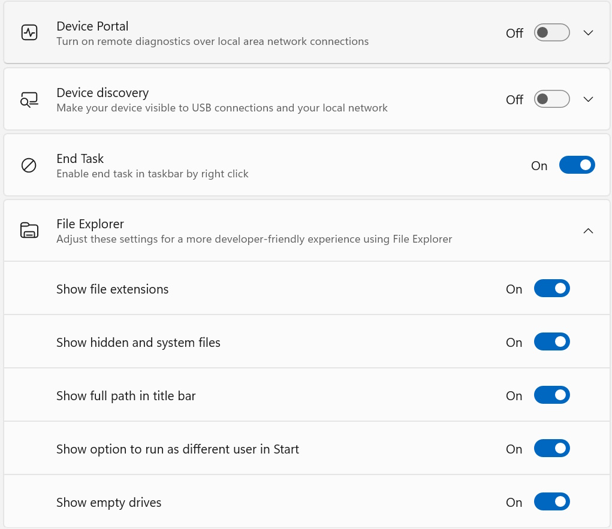

# Developer Mode features and debugging

If you're only interested in the basics of installing Developer Mode on your app, follow the instructions outlined in [enable your device for development](./enable-your-device-for-development.md) to get started. This article covers advanced features of Developer Mode, Developer Mode in previous versions of Windows 10, and debugging failures related to Developer Mode installations.

## Additional Developer Mode features

For each device family, additional developer features may be available. These features are only available when Developer Mode is enabled on the device (and may vary depending on the version of your OS).

This image shows developer features for Windows:



### Device Portal

To learn more about Device Portal, see [Windows Device Portal overview](/windows/uwp/debug-test-perf/device-portal).

For device-specific setup instructions, see:

- [Device Portal for desktop](/windows/uwp/debug-test-perf/device-portal-desktop)
- [Device Portal for HoloLens](/windows/mixed-reality/develop/advanced-concepts/using-the-windows-device-portal)
- [Device Portal for IoT](/windows/iot-core/manage-your-device/deviceportal)
- [Device Portal for Mobile](/windows/uwp/debug-test-perf/device-portal-mobile)
- [Device Portal for Xbox](/windows/uwp/xbox-apps/device-portal-xbox)

If you encounter problems enabling Developer Mode or Device Portal, see the [Known Issues forum](https://social.msdn.microsoft.com/Forums/en-US/home?forum=Win10SDKToolsIssues&sort=relevancedesc&brandIgnore=True&searchTerm=%22device+portal%22) to find workarounds for these issues, or visit [Failure to install the Developer Mode package](#failure-to-install-developer-mode-package) to learn which WSUS KBs to allow in order to unblock the Developer Mode package.

### SSH

SSH services are enabled when you enable Device Discovery on your device. This is used when your device is a remote deployment target for MSIX packaged applications. The names of the services are *SSH Server Broker* and *SSH Server Proxy*.

> [!NOTE]
> This is not Microsoft's OpenSSH implementation, which you can find on [GitHub](https://github.com/PowerShell/Win32-OpenSSH).

In order to take advantage of the SSH services, you can enable Device Discovery to allow pin pairing. If you intend to run another SSH service, you can set this up on a different port or turn off the Developer Mode SSH services. To turn off the SSH services, turn off Device Discovery.

SSH login is done via the *DevToolsUser* account, which accepts a password for authentication. This password is the PIN displayed on the device after pressing the Device Discovery **Pair** button, and it's only valid while the PIN is displayed. A SFTP subsystem is also enabled for manual management of the `DevelopmentFiles` folder where loose file deployments are installed from Visual Studio.

#### Caveats for SSH usage

The existing SSH server used in Windows is not yet protocol compliant. Using an SFTP or SSH client may require special configuration. In particular, the SFTP subsystem runs at version 3 or less, so any connecting client should be configured to expect an old server. The SSH server on older devices uses `ssh-dss` for public key authentication (which OpenSSH has deprecated). To connect to such devices, the SSH client must be manually configured to accept `ssh-dss`.

### Device Discovery

When you enable Device Discovery, you're allowing your device to be visible to other devices on the network through mDNS. This feature also allows you to get the SSH PIN for pairing to the device by pressing the **Pair** button exposed immediately after Device Discovery is enabled. This PIN prompt must be displayed on the screen in order to complete your first Visual Studio deployment targeting the device.


You should enable Device Discovery only if you intend to make the device a deployment target. For example, if you use Device Portal to deploy an app to a phone for testing, you need to enable Device Discovery on the phone, but not on your development PC.

### Optimizations for Windows Explorer, Remote Desktop, and PowerShell (desktop only)

On the desktop device family, the **For developers** settings page has shortcuts to settings you can use to optimize your PC for development tasks. The sliders let you enable or disable settings easily from this single location.



## Notes

In early versions of Windows 10 Mobile, a **Crash Dumps** option was present in the **Developer Settings** menu. This has been moved to [Device Portal](/windows/uwp/debug-test-perf/device-portal) so that it can be used remotely rather than exclusively on USB.

There are several tools you can use to deploy an app from a Windows 10 PC to a Windows 10 device. Both devices must be connected to the same subnet of the network (by a wired or wireless connection) or they must be connected by USB. Both of these options only install the app package (`.appx` or `.appxbundle`). They don't install certificates.

- Use the Windows Application Deployment (`WinAppDeployCmd`) tool. Learn more about the [WinAppDeployCmd tool](/windows/uwp/packaging/install-universal-windows-apps-with-the-winappdeploycmd-tool).
- You can use [Device Portal](/windows/uwp/debug-test-perf/device-portal) to deploy from your browser to a mobile device running Windows 10, Version 1511 or later. Use the [Apps](/windows/uwp/debug-test-perf/device-portal#apps-manager) page in Device Portal to upload an app package (`.appx`) and install it on the device.

## Failure to install Developer Mode package

Sometimes, due to network or administrative issues, Developer Mode won't install correctly. The Developer Mode package is required for remote deployment to this PC (using Device Portal from a browser or Device Discovery to enable SSH), but not for local development. Even if you encounter these issues, you can still deploy your app locally using Visual Studio (or from this device to another device).

See the [Known Issues forum](https://social.msdn.microsoft.com/Forums/en-US/home?forum=Win10SDKToolsIssues&sort=relevancedesc&brandIgnore=True&searchTerm=%22device+portal%22) to find workarounds for these issues (and others).

> [!NOTE]
> If Developer Mode doesn't install correctly, we encourage you to file a feedback request.
>
> 1. Install the [Feedback Hub app](https://apps.microsoft.com/store/detail/feedback-hub/9NBLGGH4R32N?hl=en-us&gl=us) (if you don't already have it) and open it.
> 2. Click **Add new feedback**.
> 3. Choose the **Developer Platform** category and the **Developer Mode** subcategory.
> 4. Fill out the fields (you may optionally attach a screenshot) and click **Submit**.
>
> Submitting feedback will help Microsoft resolve the issue you encountered.

### Failed to locate the package

> Developer Mode package couldn’t be located in Windows Update. Error Code 0x80004005. Learn more.

This error may occur due to a network connectivity problem, Enterprise settings, or the package may be missing.

To fix this issue:

1. Ensure that your computer is connected to the internet.
2. If you're on a domain-joined computer, speak to your network administrator. The Developer Mode package (like all Features on Demand) is blocked by default in WSUS 2.1. In order to unblock the Developer Mode package in the current and previous releases, the following KBs should be allowed in WSUS:

    - 4016509
    - 3180030
    - 3197985

3. Check for Windows updates in **Settings → Updates and Security → Windows Updates**.
4. Verify that the Windows Developer Mode package is present in **Settings → System → Apps & Features → Manage optional features → Add a feature**. If it's missing, Windows can't find the correct package for your computer.
5. After performing the above steps, *disable* and then *re-enable* Developer Mode to verify the fix.

### Failed to install the package

> Developer Mode package failed to install. Error code 0x80004005. Learn more.

This error may occur due to incompatibilities between your build of Windows and the Developer Mode package.

To fix this issue:

1. Check for Windows updates in the **Settings → Updates and Security → Windows Updates**.
2. Restart your computer to ensure all updates are applied.

## Use group policies or registry keys to enable a device

For most developers, you'll want to use the settings app to enable your device for debugging. In certain scenarios (such as automated tests) you can use other ways to enable your Windows desktop device for development.

> [!NOTE]
> These steps will not enable the SSH server or allow the device to be targeted for remote deployment and debugging.

You can use `gpedit.msc` to set the group policies to enable your device, unless you have *Windows 10 Home* or *Windows 11 Home*. If you do, you'll need to use regedit or PowerShell commands to set the registry keys directly to enable your device.

### Use gpedit to enable your device

1. Run `gpedit.msc`.

2. Go to **Local Computer Policy → Computer Configuration → Administrative Templates → Windows Components → App Package Deployment**.

3. Edit the following policies to enable sideloading:

    - Allow all trusted apps to install.

    OR

    Edit the following policies to enable both sideloading and Developer Mode:

    - Allow all trusted apps to install.
    - Allows development of UWP apps and installation from an *Integrated Development Environment (IDE)*.
    - Reboot your machine.

### Use regedit to enable your device

1. Run `regedit`.

2. To enable sideloading, set the value of this `DWORD` to `1`:

    `HKLM\SOFTWARE\Microsoft\Windows\CurrentVersion\AppModelUnlock\AllowAllTrustedApps`

    OR

    To enable developer mode, set the values of this `DWORD` to `1`:

    `HKLM\SOFTWARE\Microsoft\Windows\CurrentVersion\AppModelUnlock\AllowDevelopmentWithoutDevLicense`

### Use PowerShell to enable your device

1. Run PowerShell with administrator privileges.

2. To enable sideloading, run this command:

    ```powershell
    PS C:\WINDOWS\system32> reg add "HKEY_LOCAL_MACHINE\SOFTWARE\Microsoft\Windows\CurrentVersion\AppModelUnlock" /t REG_DWORD /f /v "AllowAllTrustedApps" /d "1"
    ```

    OR

    To enable developer mode, run this command:

    ```powershell
    PS C:\WINDOWS\system32> reg add "HKEY_LOCAL_MACHINE\SOFTWARE\Microsoft\Windows\CurrentVersion\AppModelUnlock" /t REG_DWORD /f /v "AllowDevelopmentWithoutDevLicense" /d "1"
    ```

## Upgrade your device from Windows 8.1 to Windows 10 or 11

When you create or sideload apps on your Windows 8.1 device, you have to install a developer license. If you upgrade your device from Windows 8.1 to Windows 10 or 11, this information remains. Run the following command to remove this information from your upgraded Windows device.

> [!NOTE]
> This step is not required if you upgrade directly from Windows 8.1 to Windows 10, Version 1511 or later.

### To unregister a developer license

1. Run PowerShell with administrator privileges.
2. Run this command:

    ```powershell
    unregister-windowsdeveloperlicense
    ```

After you unregister your license, you'll need to enable your device for development (as described in [this topic](./enable-your-device-for-development.md)) so that you can continue to develop on this device. If you don't, you may get an error when you debug your app (or if you try to create a package for it). Here's an example of this error:

> Error : DEP0700 : Registration of the app failed.