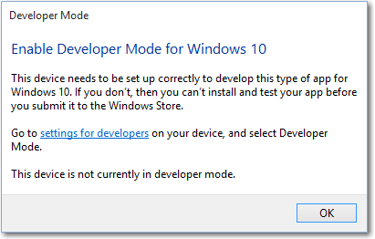

# Enable your device for development

## Activate Developer Mode, sideload apps and access other developer features

> [!IMPORTANT]
> If you're not creating your own applications on your PC, you don't need to enable Developer Mode. If you're trying to fix an issue with your computer, check out [Windows help](https://support.microsoft.com/hub/4338813/windows-help?os=windows-10). If you're developing for the first time, you'll also want to [get set up](../windows-app-sdk/set-up-your-development-environment.md) by downloading the tools you need.

If you are using your computer for ordinary day-to-day activities such as games, web browsing, email or Office apps, you do *not* need to activate Developer Mode and in fact, you shouldn't activate it. The rest of the information on this page won't matter to you, and you can safely get back to whatever it is you were doing. Thanks for stopping by!

However, if you are writing software with Visual Studio on a computer for first time, you *will* need to enable Developer Mode on both the development PC, and on any devices you'll use to test your code. Opening a UWP project when Developer Mode is not enabled will either open the **For developers** settings page, or cause this dialog to appear in Visual Studio:

When you see this dialog, click **settings for developers** to open the **For developers** settings page.

> [!NOTE]
> You can go to the **For developers** page at any time to enable or disable Developer Mode: simply enter "for developers" into the Cortana search box in the taskbar.

## Accessing settings for Developers

To enable Developer mode, or access other settings:

1.  From the **For developers** settings dialog, choose the level of access that you need.
2.  Read the disclaimer for the setting you chose, then click **Yes** to accept the change.

> [!NOTE]
> Enabling Developer mode requires administrator access. If your device is owned by an organization, this option might be disabled.

### Developer Mode features

Developer Mode replaces the Windows 8.1 requirements for a developer license.  In addition to sideloading, the Developer Mode setting enables debugging and additional deployment options. This includes starting an SSH service to allow this device to be deployed to. In order to stop this service, you have to disable Developer Mode.

When you enable Developer Mode on desktop, a package of features is installed that includes:
- Windows Device Portal. Device Portal is enabled and firewall rules are configured for it only when the **Enable Device Portal** option is turned on.
- Installs, and configures firewall rules for SSH services that allow remote installation of apps. Enabling **Device Discovery** will turn on the SSH server.

For more information on these features, or if you encounter difficulties in the installation process, check out [developer mode features and debugging](developer-mode-features-and-debugging.md).

## See Also

* [Sign up for Windows account](sign-up.md)
* [Developer mode features and debugging](developer-mode-features-and-debugging.md).