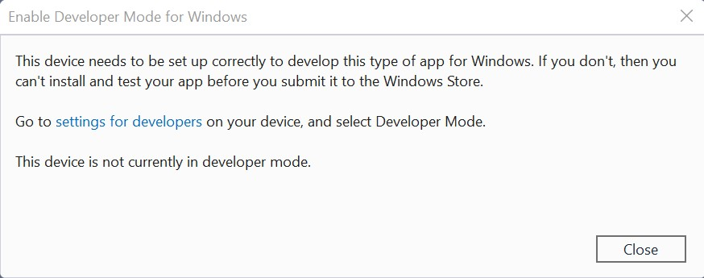
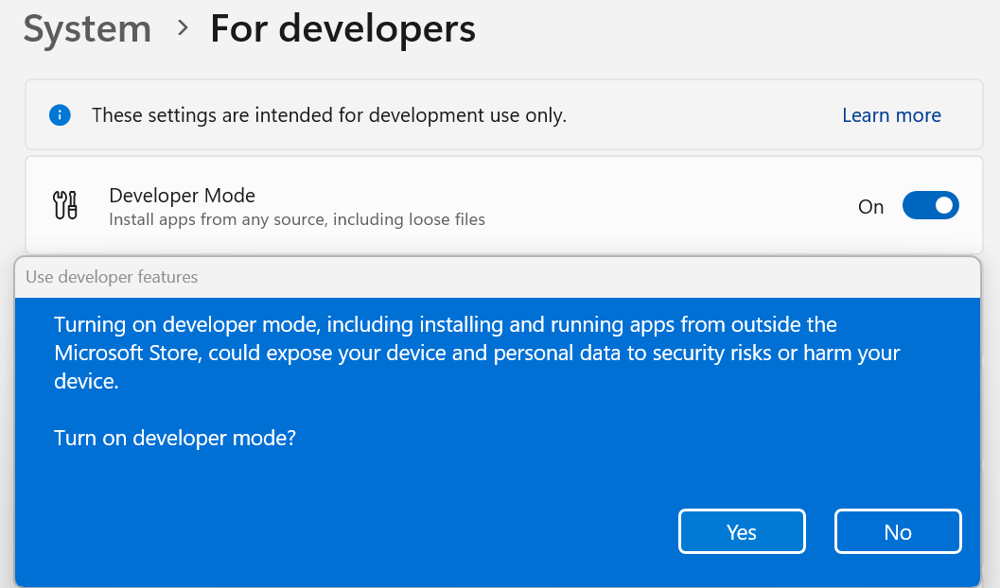

# Enable your device for development

> [!IMPORTANT]
> If you're not creating your own applications on your PC, you don't need to enable Developer Mode. If you're trying to fix an issue with your computer, check out [Windows help](/windows). If you're developing for the first time, you'll also want to [Install tools for the Windows App SDK](/windows/apps/windows-app-sdk/set-up-your-development-environment).

If you're using your computer for ordinary day-to-day activities (such as gaming, web browsing, email, or Office apps), you *don't* need to activate Developer Mode, and in fact, you shouldn't activate it. The rest of the information on this page won't matter to you, and you can safely get back to whatever you were doing. Thanks for stopping by!

However, if you're writing software with Visual Studio on a computer for the first time, you *will* need to enable Developer Mode on both the development PC and on any devices you'll use to test your code. Opening a Windows project when Developer Mode *isn't* enabled will either open the **For developers** settings page, or cause the following dialog to appear in Visual Studio:

If you see this dialog, select **settings for developers** to open the **For developers** settings page.

> [!NOTE]
> You can go to the **For developers** settings page at any time to *enable* or *disable* Developer Mode. Simply enter *for developers* into the search box in the taskbar.

## Activate Developer Mode

To enable Developer Mode, or access other settings:

1. Toggle the Developer Mode setting, at the top of the **For developers** page
2. Read the disclaimer for the setting you choose. Click **Yes** to accept the change.

> [!NOTE]
> Enabling Developer mode requires administrator access. If your device is owned by an organization, this option may be disabled.

### Developer Mode features

Developer Mode replaces the Windows 8.1 requirements for a developer license. In addition to sideloading, the Developer Mode setting enables debugging and additional deployment options. This includes starting an SSH service to allow deployment to this device. In order to stop this service, you need to disable Developer Mode.

When you enable Developer Mode on desktop, a package of features is installed, including:

- **Windows Device Portal**: Device Portal is only enabled (and firewall rules are only configured for it) when the **Enable Device Portal** option is turned on.
- Installs and configures firewall rules for SSH services that allow remote installation of apps. Enabling **Device Discovery** will turn on the SSH server.

For more information on these features (or if you encounter difficulties in the installation process) check out [Developer Mode features and debugging](./developer-mode-features-and-debugging.md).
