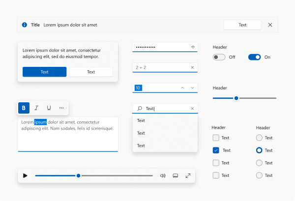
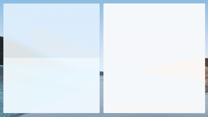
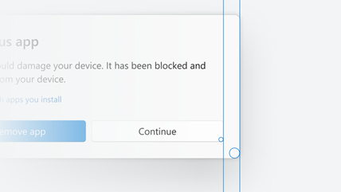
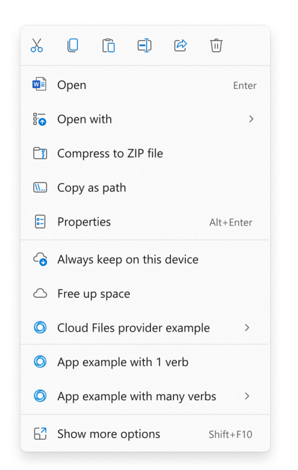
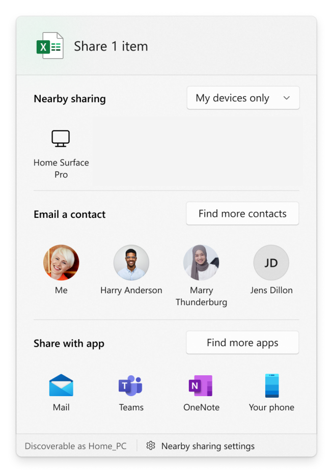
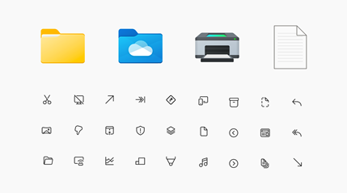

# Top 11 things you can do to make your app great on Windows 11

Windows 11 marks a visual evolution of the Windows operating system. As Windows moves forward, customers continue to set a higher bar for app experiences, too. We see these customer expectations manifest primarily in two areas: _app fundamentals_ and _user experience_.

- _App fundamentals_ - good performance on low-cost, highly mobile device form factors, and hassle-free app lifecycle and state rehydration/roaming.
- _User experience_ - the ability to work naturally with a complete range of inputs, design and interaction patterns that look and feel at home on current and future devices, and support for modern windowing workflows and shell integration points.

With entirely new visuals signaling change, [signature experiences](../design/signature-experiences/signature-experiences.md) that showcase the best of Windows and Microsoft together, and a completely new [Store](/windows/uwp/publish) with more apps, Windows 11 is positioned as the Windows for "what's next".

Great apps on Windows meet these customer expectations for app fundamentals and modern user experience, and we are investing in the native Windows platform to make it easier for your apps to achieve greatness through [WinUI](../winui/index.md), [MSIX](/windows/msix), and the [Windows App SDK](../windows-app-sdk/index.md) family of APIs. This document provides an overview what you need to do to make your app look and behave great so that users feel like your app was made for Windows 11.

Here are the top ~~10~~ 11 things you can do to make your app shine on Windows 11.

## 1. Test your app to be compatible with Windows 11

Users expect solid fundamentals from any app they install on their device. They expect the app to just work when they upgrade it or migrate to a new version of the operating system. Compatibility testing helps to make sure there is no difference in functionality for your apps after upgrade and helps increase customer satisfaction with a well-tested product.

[Test your app to be compatible with Windows 11](/windows/compatibility/windows-11/testing-guidelines)

Microsoft is committed to ensuring your apps work on the latest versions of our software and Windows 11 has been built with compatibility in mind. Our promise states that apps that worked on Windows 7/8.1/10 will work on Windows 11. If you experience any issues with your apps, Microsoft will help you identify the issue at no cost so that you can then fix the issue. Visit the [App Assure](/fasttrack/introduction) page and sign in to submit your request for assistance from a dedicated App Assure Manager.

Along with App Assure, we have enabled Windows 11 testing and validation on [Test Base](https://aka.ms/testbase), as part of our commitment to ensuring your apps work on the latest versions of our software. Test Base is an intelligent application validation service that allows software vendors and commercial customers to test their applications with a matrix of updates and environments in a Microsoft-managed Azure environment. With Test Base, you now have access to test your applications ahead of time and work with Microsoft to remediate issues before they impact your end users. 

See the [Test Base](https://aka.ms/testbase) page to sign up.

## 2. Have a discoverable and easy to understand privacy policy

An easily discoverable and understandable privacy notice increases user trust and confidence in your application.

Your privacy policy must:

- Inform users of the personal information accessed, collected, or transmitted by your product.
  - How that information is used, stored, and secured.
  - Indicate the types of parties to whom that information is disclosed.
- Describe the controls that users have over the use and sharing of their information and how they may access their information.
- Comply with applicable laws and regulations.
- Be kept up-to-date as you add new features and functionality to your product.

[Microsoft Privacy Statement](https://privacy.microsoft.com/privacystatement)

## 3. Make your app accessible and inclusive

Inclusive design creates better products for everyone. To make sure your app is accessible and inclusive, consider what improved functionality and usability means in relation to:

- People with disabilities (both temporary and permanent).
- Personal preferences.
- Specific work styles.
- Situational constraints (such as shared work spaces, driving, cooking, glare, and so on).

Some common solutions include providing information in alternative formats (such as captions on a video) or enabling the use of assistive technologies (such as screen readers).

Applications designed with accessibility in mind are easier to maintain, update, and redesign. In addition to helping your app reach people with disabilities, factoring in accessibility can reduce the cost of maintaining your app.

[Accessibility in Windows](../develop/accessibility.md)

## 4. Use the latest common controls

Windows 11 brings beautiful UI innovations to the Windows operating system that you can leverage in your apps. Common controls are one way that you can utilize these updates immediately. Use the latest common controls whenever possible to get the benefits of compatibility and accessibility for free. And these common controls are more cost effective than building your own custom controls when you factor in maintenance and testing costs.

### Desktop apps (Win32)
- Use [WinUI 3](../winui/winui3/index.md) in [Windows App SDK](../windows-app-sdk/index.md) 1.1 or greater to create a Win32 application that can leverage the modern common controls. 
- To evaluate the controls, check out the [WinUI 3 Gallery](https://github.com/Microsoft/WinUI-Gallery) (*main branch*).
- Win32 controls that use [UXTheme](/windows/win32/api/uxtheme/) will automatically get a "repaint" of the Light theme for select rejuvenated control visuals. Be sure to test for any issues. For those surfaces that do not get updated automatically, manually update the visuals so that they look coherent with the rest of the update, if possible.

### UWP apps

- If your app uses UWP XAML or WinUI, update to use [WinUI 2.6](../winui/winui2/index.md) or greater. WinUI provides new styles for both UWP XAML and WinUI controls, and the default styles have been updated with rejuvenated visuals and animation by default.
- See the documentation for a [list of supported controls](../design/controls/index.md#alphabetical-index).
- Use the [WinUI 2 Gallery](https://github.com/Microsoft/WinUI-Gallery) (*winui 2 branch*) to evaluate the controls.

### WebView and other platforms

- Individual WebView surfaces need to do work to adopt the style manually. We will not provide centralized styles, but the [design toolkits](https://aka.ms/WinUI/3.0-figma-toolkit) and WinUI 2 Gallery can be used to copy the styles.

## 5. Use the latest design materials (Acrylic and Mica)

We are introducing a new material called _Mica_ that lets the user's desktop background shine through your app. Mica is a very performant material that is meant to be used on long-lived UI surfaces like TitleBar to communicate the active or inactive state of the app. Mica is a texture that creates visual delight while saving battery life.

- Mica is to be used on the base layer of the app's UI to communicate the active state of the app; it falls back to a solid color when the app does not have focus. Thus, we recommend use of Mica on the TitleBar's background.
- Some controls, like NavigationView, already come built with the default behavior.
- When an app that uses Mica runs in Windows 10 or down-level, it will degrade gracefully (Mica will fallback to a solid color).
- Mica is to be used on long-lived surfaces, unlike Acrylic, which is to be used on transient surfaces.
- If you are using Acrylic material, follow the existing [Acrylic guidance](../design/style/acrylic.md) as we have updated the colors to be more vibrant.

[Mica guidance](../design/style/mica.md), [Acrylic guidance](../design/style/acrylic.md)

## 6. Use rounded corners for your windows and support snap layouts

App windows have new features like rounded corners and a menu with snap layouts that your app will automatically receive in most cases. If you've customized your window or title bar, you might need to do some work to make sure these new features are supported.

We rounded the corners of window borders in Windows 11. Our user research team found that rounded geometry psychologically provides a feeling of safety and makes the app's UI much easier to scan. This makes users feel less intimidated and the app feel more engaging. The amount of rounding was also carefully chosen. We worked across the company and user research to balance between feeling professional and being softer and more inviting.

Snap layouts are a new Windows 11 feature to help introduce users to the power of window snapping. Snap layouts are easily accessible by hovering the mouse over a window's maximize button or pressing Win + Z. After invoking the menu that shows the available layouts, users can click on a zone in a layout to snap a window to that particular zone and then use Snap Assist to finish building an entire layout of windows. Snap layouts are tailored to the current screen size and orientation, including support for three side-by-side windows on large landscape screens and top/bottom stacked windows on portrait screens.

- Most apps will automatically receive rounded corners and support for the menu with snap layouts, but in some cases you might need to do a little work to get them:
  - Allow the system to draw your border and shadow.
  -  If you need to draw your own border and shadow:
     - Call our rounding API to opt in. See [Apply rounded corners in desktop apps for Windows 11](../desktop/modernize/ui/apply-rounded-corners.md).
     - Use our APIs to have the platform draw and implement the caption buttons. See [Support snap layouts for desktop apps on Windows 11](../desktop/modernize/ui/apply-snap-layout-menu.md).
- You will get these features automatically if you use UWP or you adopt Windows App SDK windowing to:
  - Configure the style of your window using the pre-defined templates.
  - Customize the title bar of your windows.

## 7. Support Dark and Light themes

We support Light and Dark themes, which is a great way to let the user express their personality. We are updating the color tones to be softer on the eyes by avoiding pure white and black, which makes the colors much more delightful. Dark theme support is also a great to make your app more accessible and attractive for different types of users.

- The color palette of WinUI is being updated to feel lighter (use WinUI 2.6 or greater). If your apps have hardcoded custom colors, you may need to make updates to match the overall color theory, regardless of technology.
- If you are using [UXTheme](/windows/win32/api/uxtheme/) based Win32 surfaces, the Light theme will have rejuvenated controls (for example, rounded buttons). You should test your apps to validate that local styling does not override updated global defaults. (For Win32 apps, see [Support Dark and Light themes in Win32 apps](../desktop/modernize/ui/apply-windows-themes.md).)

## 8. Optimize your app's context menu extensions and Share targets

Windows 11 refines the behavior of the contextual file operations in the right-click context menu of File Explorer and the Share dialog. If your app creates context menus or defines share targets, you may need to make some changes to ensure that these work well with Windows 11.

#### Context menus

For Windows 11, we improved the behavior of the context menu in File Explorer in several ways:

- Common commands, such as **Cut**, **Copy**, **Paste**, and **Delete**, have been moved to the top of the menu.
- **Open** and **Open with** are now grouped together.
- App extensions are grouped together below Shell verbs. Apps with more than one verb are grouped into a flyout with app attribution.
- [Cloud files provider apps](/windows/win32/cfapi/build-a-cloud-file-sync-engine) are placed next to the Shell commands to hydrate or dehydrate files.
- The older context menu from Windows 10 (along with lesser-used commands from the older context menu) is still available via the **Show more options** item at the bottom of the menu. **Shift** + **F10** or the keyboard menu key will also load the Windows 10 context menu.

If your app defines a context menu extension, the following requirements must be met for the extension to appear in the new Windows 11 context menu. Otherwise, your app's context menu extension will appear in the older context menu available via the **Show more options** item.

* Your context menu extension must be implemented by using the [**IExplorerCommand**](/windows/win32/api/shobjidl_core/nn-shobjidl_core-iexplorercommand) interface. Context menu extensions that implement [**IContextMenu**](/windows/win32/api/shobjidl_core/nn-shobjidl_core-icontextmenu) will appear in the older context menu instead.
* Your app must be a *packaged app* so that it has package identity at runtime. See [Features that require package identity](../desktop/modernize/modernize-packaged-apps.md) for some options for packaging your app.

#### Share dialog

For Windows 11, we improved the behavior of the Share dialog in several ways.  

- Discoverability settings for nearby sharing are now at the top of the dialog and more settings are available at the bottom.
- All apps can now participate in the Share dialog as targets, including unpackaged desktop apps and PWAs that are installed through Microsoft Edge.
  - A previously unpackaged desktop app can participate as a target in the Share dialog if you package it with external location (see [Grant package identity by packaging with external location](../desktop/modernize/grant-identity-to-nonpackaged-apps.md)). For sample code that demonstrates how to do that, see the [SparsePackages](https://github.com/microsoft/AppModelSamples/tree/master/Samples/SparsePackages) sample app.
  - A PWA can participate in the Share dialog if it implements the [Web Share Target API](/microsoft-edge/progressive-web-apps-chromium/webappmanifests#identify-your-app-as-a-share-target).

## 9. Use beautiful Iconography & Typography

We have updated icons and a new UI font called "Segoe UI Variable". We recommend all apps switch to using these new icons and font to be coherent on Windows 11. The new font brings much softer geometry and makes the text much more legible.

- New icons called "Segoe Fluent Icons" are introduced for monoline icons. Controls in WinUI 2.6 and greater use the new icons and typography automatically.
- File type icons are updated. If your app is using icons in `imageres.dll` or `shell32.dll`, then icons will be updated automatically. Otherwise, a manual style update might be needed.
- App icons - Follow the latest [design guidance for app icons](../design/style/icons.md) used in places like launchers on Start and TaskBar.
- Animated icons - Lottie animation support was added to WinUI and we recommend using [AnimatedIcon](../design/controls/animated-icon.md) functionality to animate your icons in a meaningful way. Just as with other stylistic changes, you will need WinUI 2.6 or greater.
- Custom experiences written in XAML that specify `Segoe UI` in code, should instead specify `Segoe UI Variable`.

> [!NOTE]
> When an app that uses the new font runs in Windows 10 or down-level, it will fallback to use the old font and degrade gracefully.

## 10. Make use of the innovative features available in Windows

People run Windows across conventional devices as well as an increasingly diverse, modern range of devices. Devices today come not only with x86/x64-based, but also Arm-based, architectures; not only with mouse and keyboard but also touch screens, touchpads, and pens; with cameras, GPS, and sensors like gyroscopes; and with graphics chipsets that enable not only amazing visuals but also hardware-accelerated artificial intelligence (AI). Customers expect apps to take advantage of the hardware (that they have paid for!) and be cognizant of the device form factor to give them an appropriately optimized experience.

- Achieve AI powered productivity with Win ML - [Introduction to Windows Machine Learning](/windows/ai/windows-ml/).
- Utilize best practices for Notifications and content sharing - [Notifications (Design basics)](/windows/win32/uxguide/mess-notif).

## 11. Utilize the power of MSIX and Windows Store to package and distribute your application

Distribute your app wherever it makes sense for your business. Windows lets you distribute from your existing website, app management system, or the Windows Store.

- The Store lets you bring all of your Windows apps with no change, be it a native Windows app or a Progressive Web App (PWA). You can take your existing Windows app and list it on the store to drive app discovery. You choose whether you want to use the Store commerce and app distribution system, or use your existing systems. Either way, your app will be easily discoverable in the Windows Store.

  [Learn more about Windows Store](/windows/uwp/publish)

- Make sure your app supports auto-updates, is efficient to install, and is manageable via MSIX.

  Keeping customers up to date with the latest version of your application is key to customer retention and appreciation. MSIX allows your app to seamlessly install and keep up to date without having to run a separate app update process. You get complete control over how this happens and on what schedule.

  [What is MSIX?](/windows/msix/overview)

## Related articles

- [Windows Dev Center](https://developer.microsoft.com/windows/)
- [What's cool in Windows 11](https://developer.microsoft.com/windows/windows-for-developers/)