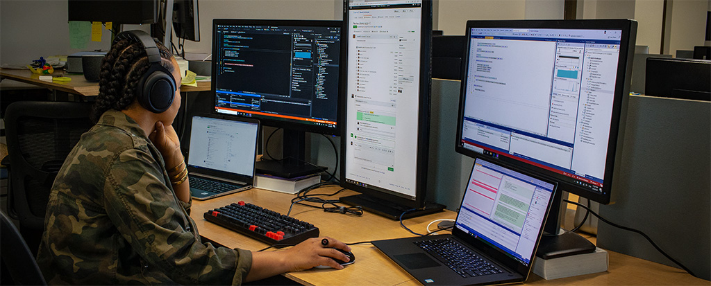

# Samples and resources

This page contains links to resources that can make you more efficient as you develop your apps for Windows. It includes sample apps and toolkits; code samples that demonstrate specific tasks, features, and API usage patterns; and tools to enhance your development environment.

## Sample gallery apps

[**WinUI 3 Gallery**](https://github.com/microsoft/WinUI-Gallery/tree/main)

The WinUI 3 Gallery app showcases all the XAML UI components in an interactive format. This app is the interactive companion to the [Fluent Design Guidelines](/windows/apps/design/) and has examples of WinUI 3 controls, features, and styles.

You can get the app from the [Microsoft Store](https://www.microsoft.com/store/productId/9P3JFPWWDZRC) or get the source code on GitHub at [microsoft/WinUI-Gallery](https://github.com/microsoft/WinUI-Gallery).

[**Input & Composition Gallery**](https://github.com/microsoft/WindowsCompositionSamples)

Use this sample app to browse through a collection of samples showing creative ways to customize and differentiate your app, then check out the accompanying code on GitHub to see how it was made. It showcases a variety of [Microsoft.UI.Composition](/windows/windows-app-sdk/api/winrt/microsoft.ui.composition) and [Microsoft.UI.Input](/windows/windows-app-sdk/api/winrt/microsoft.ui.input) APIs, the building blocks that make up the Fluent Design System.

You can get the app from the [Microsoft Store](https://apps.microsoft.com/detail/9N1H8CZHBPXB) or get the source code on GitHub at [microsoft/WindowsCompositionSamples](https://github.com/microsoft/WindowsCompositionSamples).

## Toolkits and helpers

[**Windows Community Toolkit**](https://github.com/CommunityToolkit/Windows)

The Windows Community Toolkit is a collection of helper functions, custom controls, and app services. It simplifies and demonstrates common developer tasks when building apps for Windows. See [Get started with the Windows Community Toolkit](/dotnet/communitytoolkit/windows/getting-started) for detailed information about using the toolkit.

You can get the _Windows Community Toolkit Gallery_ app from the [Microsoft Store](https://aka.ms/windowstoolkitapp) to see the controls in an actual app or get the source code on GitHub at [CommunityToolkit/Windows](https://github.com/CommunityToolkit/Windows).

[**Template Studio**](https://github.com/microsoft/TemplateStudio)

Template Studio for WinUI accelerates the creation of new WinUI apps using a wizard-based UI. It's available to create apps using C# and the [MVVM Toolkit](/dotnet/communitytoolkit/mvvm/).

You can get the extension from the [Visual Studio Marketplace](https://marketplace.visualstudio.com/items?itemName=TemplateStudio.TemplateStudioForWinUICs) or get the source code on GitHub at [microsoft/TemplateStudio](https://github.com/microsoft/TemplateStudio).

> [!IMPORTANT]
> Template Studio for WinUI only creates apps that use the [MVVM](/dotnet/communitytoolkit/mvvm/) design pattern. It does not support creating apps that use the standard code-behind pattern.

## Windows App SDK / WinUI 3 samples

The samples in this list demonstrate features from the Windows App SDK and WinUI 3. See our [Samples Browser](/samples/browse/) for a more extensive catalog of samples.

Most of the samples identified in this list contain Solution (`.sln`) files that can be opened in Visual Studio. Refer to each resource's `Readme` for additional instructions.

You can find these sample in the main Windows App SDK samples repository on GitHub at [microsoft/WindowsAppSDK-Samples](https://github.com/microsoft/WindowsAppSDK-Samples)

### Samples that demonstrate specific tasks

| Sample | Task |
|--|--|
| [Activation](https://github.com/microsoft/WindowsAppSDK-Samples/tree/main/Samples/AppLifecycle/Activation) | **Handle app activation kinds**. [App activiation APIs](../windows-app-sdk/applifecycle/applifecycle-rich-activation.md) control the way that your app handles activation kinds like `Launch`, `File`, and `Protocol`. |
| [App Instancing](https://github.com/microsoft/WindowsAppSDK-Samples/blob/main/Samples/AppLifecycle/Instancing) | **Determine application instancing behavior**. [App instancing APIs](../windows-app-sdk/applifecycle/applifecycle-instancing.md) control whether or not users can run multiple instances of your application at the same time. |
| [Power Notifications](https://github.com/microsoft/WindowsAppSDK-Samples/blob/main/Samples/AppLifecycle/StateNotifications) | **Use state notifications**. [State notifications](../windows-app-sdk/applifecycle/applifecycle-power.md) allow you to detect when the user's device enters specific states, such as low power mode. |
| [Restart](https://github.com/microsoft/WindowsAppSDK-Samples/blob/main/Samples/AppLifecycle/Restart) | **Programatically restart your app**. This sample makes use of the Windows App SDK [Restart APIs](../windows-app-sdk/applifecycle/applifecycle-restart.md). |
| [Resource Management](https://github.com/microsoft/WindowsAppSDK-Samples/blob/main/Samples/ResourceManagement) | **Tailor your app to the user and device settings**. [MRT Core resource management APIs](../windows-app-sdk/mrtcore/mrtcore-overview.md) allow you to adapt resource utilization to specific situations. |
| [Deployment Manager](https://github.com/microsoft/WindowsAppSDK-Samples/blob/main/Samples/DeploymentManager) | **[Call the Deployment API](../windows-app-sdk/deploy-packaged-apps.md#call-the-deployment-api)** to ensure that Windows application framework components are up to date. |
| [Installer](https://github.com/microsoft/WindowsAppSDK-Samples/tree/main/Samples/Installer) | **Launch the Windows App SDK installer** without using a console window. |
| [TextRendering with DWriteCore](https://github.com/microsoft/WindowsAppSDK-Samples/tree/main/Samples/TextRendering) | **Render text** using DWriteCore APIs. |
| [Unpackaged](https://github.com/microsoft/WindowsAppSDK-Samples/blob/main/Samples/Unpackaged) | **[Windows App SDK deployment guide for framework-dependent apps packaged with external location or unpackaged](../windows-app-sdk/deploy-unpackaged-apps.md)**, an alternative to packaged app deployment architecture. |
| [Dynamic Dependencies](https://github.com/microsoft/WindowsAppSDK-Samples/tree/main/DynamicDependenciesSample/DynamicDependencies) | Demonstrates the techniques shown in [Use the dynamic dependency API to reference MSIX packages at run time](../desktop/modernize/framework-packages/use-the-dynamic-dependency-api.md). |
| [Push Notifications](https://github.com/microsoft/WindowsAppSDK-Samples/blob/main/Samples/Notifications/Push) | **Add push notifications to your app**. [Push Notifications](../windows-app-sdk/notifications/push-notifications/push-quickstart.md) can be used to send device-native app notifications to users. |
| [App Notifications](https://github.com/microsoft/WindowsAppSDK-Samples/tree/main/Samples/Notifications/App) | **Add toast notifications to your app**. See [App Notifications](../windows-app-sdk/notifications/app-notifications/app-notifications-quickstart.md?tabs=cs) to learn more. |
| [Custom Controls](https://github.com/microsoft/WindowsAppSDK-Samples/tree/main/Samples/CustomControls) | **Add custom C#/WinRT controls to your app** using the patterns demonstrated in [Author Windows Runtime components with C#/WinRT](../develop/platform/csharp-winrt/authoring.md). |
| [Windowing](https://github.com/microsoft/WindowsAppSDK-Samples/tree/main/Samples/Windowing) | **Add windowing support to your app** to create/hide new windows, customize titlebars, and more. See [Manage App Windows](../windows-app-sdk/windowing/windowing-overview.md) to learn more. |

## Development environment

If you've completed the steps in [Get started with WinUI](), then you've already installed Visual Studio and enabled Developer Mode. These links provide more information about these tools to take you beyond the basics.

**Developer Mode**

Windows has a special mode for developers that adjusts security settings in order let you to run the apps you're working on. For more information, see [Enable your device for development](enable-your-device-for-development.md) and [Developer Mode features and debugging](developer-mode-features-and-debugging.md).

[**Visual Studio**](https://visualstudio.microsoft.com)

The preferred development tool of many Windows developers, Visual Studio will let you create projects for Windows, and many other platforms. It is a powerful IDE that can help you write, debug, and deploy your apps. For more information about the many things you can do with Visual Studio, see the [Visual Studio documentation](/visualstudio/windows).

[**Visual Studio Code**](https://code.visualstudio.com)

A highly extensible editor, Visual Studio Code can be customized to support almost any kind of development you can think of. It is a great choice for writing apps for Windows, and other platforms. For more information, see the [Visual Studio Code documentation](https://code.visualstudio.com/docs).

### Additional tools

These additional tools will help you [set up your development environment on Windows](/windows/dev-environment/).

:::row:::
   :::column:::
      [**Dev Home**](/windows/dev-home/)  Introduced with Windows 11, Dev Home is a dashboard that provides quick access to the tools you need to develop apps for Windows.
   :::column-end:::
   :::column:::
      [**Dev Drive**](/windows/dev-drive/) In order to speed up common development tasks, you can create a specially formatted drive (a Dev Drive) that is used to store your projects.
   :::column-end:::
:::row-end:::
:::row:::
   :::column span="":::
      [**Windows Terminal**](/windows/terminal/) Windows Terminal is a modern host application for the command-line shells you already love, like Command Prompt, PowerShell, and bash (via WSL).
   :::column-end:::
   :::column span="":::
      [**Windows Subsystem for Linux (WSL)**](/windows/wsl/install) WSL lets you run Linux distributions on Windows. This is a great way to use open source tools to develop apps for Windows.
   :::column-end:::
:::row-end:::

## Language documentation

Most WinUI apps are written in C# or C++. These guides contain articles, tutorials, and code samples to help you get started with these languages.

- [C# language documentation](/dotnet/csharp/)
- [C++ language documentation](/cpp/)
- [C++/WinRT language documentation](/windows/uwp/cpp-and-winrt-apis/)

## Next steps

Now is also a good time to create a developer account. Among other things, this will allow you to publish your apps to the Microsoft Store. Here is how you do that: [Create a developer account](/windows/apps/get-started/sign-up)

Also see:

- [Windows Application Development - Best Practices](best-practices.md)
- [Windows Developer FAQ](windows-developer-faq.yml)