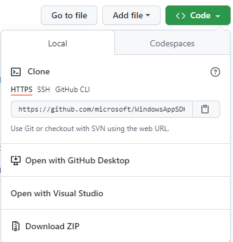

# Code samples for Windows app development

Windows app samples are available across multiple Github repositories, covering multiple different application types. The available samples demonstrate a range of Windows features, API use patterns, as well as end-to-end scenarios.

## List of Windows samples repos

The following table lists various Windows app samples repositories along with a description. Most of the repositories below include a collection of several samples demonstrating specific APIs and scenarios in the same technology area. Note that this is not a comprehensive list of available Windows samples. Many additional samples, including end-to-end and mini-app samples, can be found through the [samples browser](/samples/browse/).

| Samples Repository | Description |
|-------------|-------------|
| [Windows App SDK samples](https://github.com/microsoft/WindowsAppSDK-Samples) | Demonstrate API usage patterns for the Windows App SDK, the next evolution in the Windows app development platform. | 
| [WinUI Xaml Controls Gallery](https://github.com/microsoft/Xaml-Controls-Gallery) | Demonstrates all of the Xaml and Windows UI library controls available to make a Fluent Windows app. |
| [Windows classic samples](https://github.com/microsoft/Windows-classic-samples) | Demonstrate a wide range of desktop app scenarios, including Win32, WinRT, and .NET. |
| [Universal Windows Platform (UWP) app samples](https://github.com/microsoft/Windows-universal-samples) | Demonstrate WinRT API usage patterns for UWP. |
| [Desktop Bridge to UWP samples](https://github.com/Microsoft/DesktopBridgeToUWP-Samples) | Demonstrate the Desktop Conversion Extensions for converting classic desktop apps (such as Win32, Windows Forms, WPF) and games to UWP apps and games. |
| [DirectX 12 graphics samples](https://github.com/Microsoft/DirectX-Graphics-Samples) | Demonstrate how to build graphics intensive apps on Windows using DirectX 12. |
| [Windows Composition samples](https://github.com/microsoft/WindowsCompositionSamples) | Demonstrate how to use Windows.UI.Xaml and Windows.UI.Composition to make beautiful UWP apps. |
| [Windows samples for IoT](https://github.com/Microsoft/Windows-iotcore-samples) | Code samples to help you get started with developing for Windows on Devices. |
| [Windows Community Toolkit](https://github.com/windows-toolkit/WindowsCommunityToolkit) | A collection of helper functions, custom controls, and app services. It simplifies and demonstrates common developer tasks when building apps for Windows.  |
| [Windows task snippets](https://github.com/Microsoft/Windows-task-snippets) | Snippets of ready-to-use code that accomplish small, but useful, tasks of interest to UWP app developers. These snippets show simple solutions to common problems, and simple recipes to help you implement new app features. |
| [Win2D](https://github.com/Microsoft/win2d) | Win2D is an easy-to-use Windows Runtime API for immediate mode 2D graphics rendering with GPU acceleration. It is available to C# and C++ developers, and utilizes the power of Direct2D, integrating seamlessly with XAML and CoreWindow. |

## Using the samples repos

The following sections include guidance on how to access and use samples from Github repos, share your feedback, and report issues.

### Download the code

To download the code for a specific sample, go to the main page of the relevant Microsoft Github repo and choose either **Clone** or **Download ZIP** for the samples.

If you do not have a Github account, you can download the .zip file. You will need to unzip the file before opening the samples. When updates are made to any samples, you can either download the latest .zip file or pull down the changes using Git.

### Open and run samples

Once you have the samples downloaded on your development computer, in most cases you can navigate to the solution (.sln) file for the chosen sample and open the solution file in Visual Studio. Each individual repository may include further prerequisites and steps on building and running a specific sample.

### Give feedback, ask questions, and report issues

If you have problems or questions with a sample, use the **Issues** tab in the repository where the sample is hosted to create a new issue. Some Github repositories such as the [Windows App SDK Samples repo](https://github.com/microsoft/WindowsAppSDK-Samples) may also use the **Discussions** feature, which can be used to share ideas and engage with other community members.

## Samples browser

To make finding specific samples a little bit easier, you can browse and search a categorized collection of code samples for various Microsoft developer tools and technologies through the [samples browser](/samples/browse/). You can find code samples by searching or applying product and/or programming language filters. Note that not all Windows samples are available through the samples browser. 

