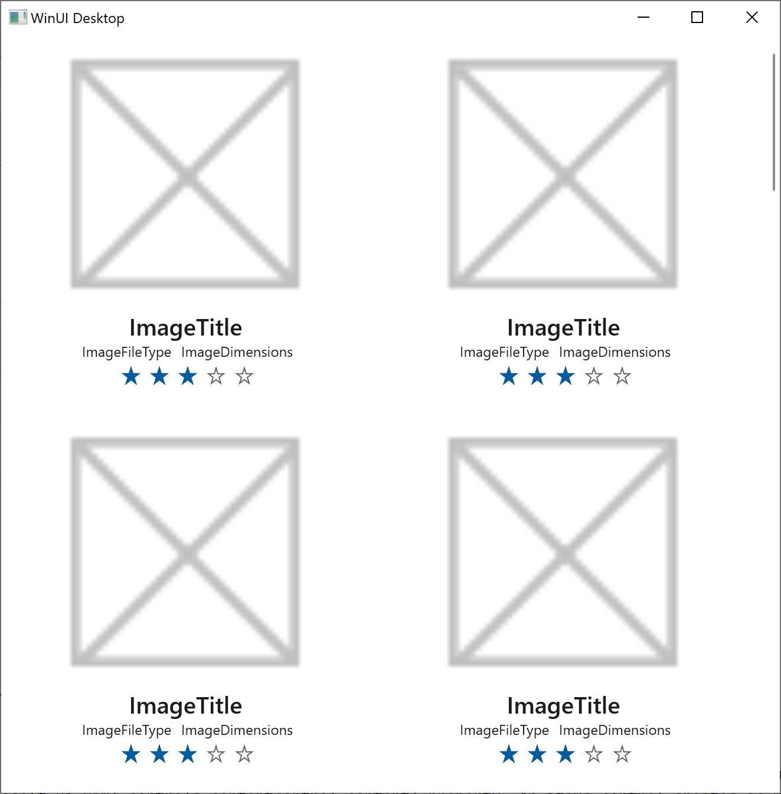

# Tutorial: Create a simple photo viewer with WinUI 3

In this topic we walk through the process of creating a new WinUI 3 project in Visual Studio; and then building a simple app to display photos. We'll use controls, layout panels, and data-binding; and we'll be writing both XAML markup (which is *declarative*) and C#/C++ code (which is *imperative*, or *procedural*).

> [!NOTE]
> For info about the benefits of WinUI 3, as well as other app type options, see [Overview of app development options](./index.md).

> [!TIP]
> If you're a C++ developer, then see the [C++/WinRT](/windows/uwp/cpp-and-winrt-apis/) documentation before development. It explains how to use Windows Runtime APIs in C++. Relevant topics there include [XAML controls; bind to a C++/WinRT property](/windows/uwp/cpp-and-winrt-apis/binding-property), [XAML items controls; bind to a C++/WinRT collection](/windows/uwp/cpp-and-winrt-apis/binding-collection), and [Photo Editor C++/WinRT sample application](/windows/uwp/cpp-and-winrt-apis/photo-editor-sample). Those topics show how to use C++/WinRT to implement equivalent techniques to the ones shown here. For converting C# code to C++/WinRT, see [Move to C++/WinRT from C#](/windows/uwp/cpp-and-winrt-apis/move-to-winrt-from-csharp).

## Step 1: Install tools for the Windows App SDK

To set up your development computer, see [Install tools for the Windows App SDK](../windows-app-sdk/set-up-your-development-environment.md). You could then optionally follow along with [Create your first WinUI 3 project](../winui/winui3/create-your-first-winui3-app.md). To install the latest visual studio manually, read the following sections.

> [!IMPORTANT]
> You'll find release notes topics along with the [Windows App SDK release channels](../windows-app-sdk/release-channels.md) topic. There are release notes for each channel. Be sure to check any *limitations and known issues* in those release notes, since those might affect the results of following along with this tutorial and/or running the app we'll build.

### Install Visual Studio

Use these links to install Visual Studio 2022. You can choose between the free Visual Studio Community Edition, Visual Studio Professional, or Visual Studio Enterprise. Before you begin, see [System requirements for Windows app development](../windows-app-sdk/system-requirements.md).

> [!div class="button"]
> [Download Visual Studio 2022](/visualstudio/releases/2022/release-notes)

### Install required workloads and components

While installing, select the following workloads and components:

#### [C#](#tab/cs)

* On the **Workloads** tab of the installation dialog box, select **.NET Desktop Development**.
* In the **Installation details** pane of the installation dialog box, select **Windows App SDK C# Templates** (at the bottom of the list).

#### [C++](#tab/cpp)

* On the **Workloads** tab of the installation dialog box, select **Desktop development with C++**.
* In the **Installation details** pane of the installation dialog box, select **Windows App SDK C++ Templates** (at the bottom of the list).

---

## Step 2: Create and build a new project

1. In Visual Studio, select **File** > **New** > **Project**.

1. In the **New Project** dialog's drop-down filters, select **C#**/**C++**, **Windows**, and **WinUI**, respectively.

1. Select the **Blank App, Packaged (WinUI 3 in Desktop)** project template, and click **Next**.

1. Name the project *SimplePhotos*, and (so that your folder structure will match the one described in this tutorial) uncheck **Place solution and project in the same directory**. You can target the most recent release (not preview) of the client operating system.

1. Build and run your project. You can see a window including a button.

## Step 3: Add asset files

The app that we'll be building carries image files around with it in the form of asset files; and those are the photos that it displays. In this section you'll add those assets to your project. But first you'll need to obtain a copy of the files.

### Download and copy images

1. So clone (or download as a [Zip  file](https://github.com/microsoft/WindowsAppSDK-Samples/archive/refs/heads/main.zip)) the Windows App SDK samples repo (see [WindowsAppSDK-Samples](https://github.com/microsoft/WindowsAppSDK-Samples)). Having done that, you'll find the asset files that we'll be using in the folder `\WindowsAppSDK-Samples\Samples\PhotoEditor\cs-winui\Assets\Samples`. If you want to see them in the repo online, then you can visit [WindowsAppSDK-Samples/Samples/PhotoEditor/cs-winui/Assets/Samples/](https://github.com/microsoft/WindowsAppSDK-Samples/tree/main/Samples/PhotoEditor/cs-winui/Assets/Samples).

1. In **File Explorer**, select that **Samples** folder, and copy it to the clipboard.

### Include the images in your project

#### [C#](#tab/cs/)

1. In **Solution Explorer** in Visual Studio, right-click the **Assets** folder (it's a child of the project node), and click **Open Folder in File Explorer**. That opens the **Assets** folder in **File Explorer**.

1. Paste (into the **Assets** folder) the **Samples** folder that you just copied.

#### [C++](#tab/cpp/)

1. In **Solution Explorer** in Visual Studio, turn on **Show All Files** option to show existing folders and files in you project folder.

1. Right-click the **Assets** folder (it's a child of the project node), and click **Open Folder in File Explorer**. That opens the **Assets** folder in **File Explorer**.

1. Paste (into the **Assets** folder) the **Samples** folder that you just copied.

1. In **Solution Explorer** in Visual Studio, click **Refresh**, right-click copied asset files, and click **Include In Project**.

---

Back in Visual Studio you'll see that a new **Samples** folder is now a child of **Assets**; and inside **Samples** are several photos. You can hover the mouse pointer over them, and a thumbnail preview will appear for each.

## Step 4: Create a blank window

The WinUI 3 project template contains a button example. In this section, remove the sample code and start with a blank window.

A window activated after staring a application is represented by `MainWindow.*` files. Edit the files to customize UIs and logics of the window.

To create a blank window, replace the contents of `MainWindow.*` with the code listing below.

### [C#](#tab/cs/)

```xaml
<!-- MainWindow.xaml -->
<Window
    x:Class="SimplePhotos.MainWindow"
    xmlns="http://schemas.microsoft.com/winfx/2006/xaml/presentation"
    xmlns:x="http://schemas.microsoft.com/winfx/2006/xaml"
    xmlns:local="using:SimplePhotos"
    xmlns:d="http://schemas.microsoft.com/expression/blend/2008"
    xmlns:mc="http://schemas.openxmlformats.org/markup-compatibility/2006"
    mc:Ignorable="d">

</Window>
```

```csharp
// MainWindow.xaml.cs
using Microsoft.UI.Xaml;
using Microsoft.UI.Xaml.Controls;
using Microsoft.UI.Xaml.Controls.Primitives;
using Microsoft.UI.Xaml.Data;
using Microsoft.UI.Xaml.Input;
using Microsoft.UI.Xaml.Media;
using Microsoft.UI.Xaml.Navigation;
using System;
using System.Collections.Generic;
using System.IO;
using System.Linq;
using System.Runtime.InteropServices.WindowsRuntime;
using Windows.Foundation;
using Windows.Foundation.Collections;

namespace App1
{
    public sealed partial class MainWindow : Window
    {
        public MainWindow()
        {
            this.InitializeComponent();
        }
    }
}
```

### [C++](#tab/cpp/)

In C++ WinUI 3 project, if your type is referenced by XAML UI, then it does need to be a runtime class. You declare a runtime class in a Microsoft Interface Definition Language (MIDL). You must declare interfaces binded by XAML UI in IDL files.

```xaml
<!-- MainWindow.xaml -->
<Window
    x:Class="App1.MainWindow"
    xmlns="http://schemas.microsoft.com/winfx/2006/xaml/presentation"
    xmlns:x="http://schemas.microsoft.com/winfx/2006/xaml"
    xmlns:local="using:App1"
    xmlns:d="http://schemas.microsoft.com/expression/blend/2008"
    xmlns:mc="http://schemas.openxmlformats.org/markup-compatibility/2006"
    mc:Ignorable="d">

</Window>
```

```idl
// MainWindow.idl
namespace SimplePhotos
{
    [default_interface]
    runtimeclass MainWindow : Microsoft.UI.Xaml.Window
    {
        MainWindow();
    }
}
```

`MainWindow.xaml.*` files include code generated from `MainWindow.xaml` and `ManiWindow.idl` by tools. Note MainWindow uses itself as a template argument to its base, MyRuntimeClassT. This is also called the curiously recurring template pattern (CRTP). Don't care about the details. It works. All you need to do is to customize `MainWindow` structure in `winrt::SimplePhots::implementation` namespace.

```cpp
// MainWindow.xaml.h
#pragma once

#include "MainWindow.g.h"

namespace winrt::SimplePhotos::implementation
{
    struct MainWindow : MainWindowT<MainWindow>
    {
        MainWindow();
    };
}

namespace winrt::SimplePhotos::factory_implementation
{
    struct MainWindow : MainWindowT<MainWindow, implementation::MainWindow>
    {
    };
}
```

```cpp
// MainWindow.xaml.cpp
#include "pch.h"
#include "MainWindow.xaml.h"
#include "MainWindow.g.cpp"

using namespace winrt;
using namespace Microsoft::UI::Xaml;

namespace winrt::SimplePhotos::implementation
{
    MainWindow::MainWindow()
    {
        InitializeComponent();
    }
}
```

Build and run your project. You can see a blank window. Internally, `InitializeComponent` loads a XAML file and initializes UI components.

---

## Step 5: Add a GridView control

Our app needs to display rows and columns of photos. In other words, a grid of images. For a UI like that, the main controls to use are [List view and grid view](../design/controls/listview-and-gridview.md).

1. Open `MainWindow.xaml`. Currently, there's a **Window** element, and within that a **StackPanel** layout panel. Inside the **StackPanel** is a **Button** control, which is hooked up to an event handler method.

    The main window of any app represents the view that you see first when you run the app. In the app we'll be building, the main window's job is to load the photos from the **Samples** folder, and to display a tiled view of those images together with various info about them.

1. Replace the **StackPanel** and **Button** markup with the **Grid** layout panel and the [**GridView**](/windows/windows-app-sdk/api/winrt/microsoft.ui.xaml.controls.gridview) control shown in the listing below.

    ```xaml
    <Window ...>
        <Grid>
            <GridView x:Name="ImageGridView"/>
        </Grid>
    </Window>
    ```

    > [!TIP]
    > `x:Name` identifies a XAML element so that you can refer to it elsewhere in the XAML and in the code-behind.

You *can* build and run now, but the window will be empty at this stage. For the **GridView** control to show anything, we need to give it a collection of objects to show. We'll make a start on that next.

For background info about some of the types we've just mentioned, see [Layout panels](../design/layout/layout-panels.md) and [Controls for Windows apps](../design/controls/index.md).

## Step 6: The ImageFileInfo model

A *model* (in the sense of models, views, and view models) is a class that to some degree represents a real-world object or concept (such as a bank account). It's an *abstraction* of that real-world thing. In this section we'll be adding to our project a new class called **ImageFileInfo**. **ImageFileInfo** will be a model of an image file, such as a photo. This section will take us a step closer to being able to display photos in the app's user interface (UI).

> [!TIP]
> In preparation for the code example below, let's introduce the term *observable*. A property that can be dynamically bound to a XAML control (so that the UI updates each time the property value changes) is known as an *observable* property. This idea is based on the software design pattern known as the observer pattern. In the app that we build in this tutorial, the properties of our **ImageFileInfo** model won't change. But even so, we'll show how to make **ImageFileInfo** observable, by having it implement the [**INotifyPropertyChanged**](/uwp/api/windows.ui.xaml.data.inotifypropertychanged) interface.

### [C#](#tab/cs/)

1. Right-click the project node (**SimplePhotos**), and click **Add** > **New Item...**. Under **Visual C# Items** > **Code**, select **Class**. Set the name to *ImageFileInfo.cs*, and click **Add**.

1. Replace the contents of `ImageFileInfo.cs` with the code listing below.

    ```csharp
    using Microsoft.UI.Xaml.Media.Imaging;
    using System;
    using System.ComponentModel;
    using System.Runtime.CompilerServices;
    using System.Threading.Tasks;
    using Windows.Storage;
    using Windows.Storage.FileProperties;
    using Windows.Storage.Streams;

    namespace SimplePhotos
    {
        public class ImageFileInfo : INotifyPropertyChanged
        {
            public ImageFileInfo(ImageProperties properties,
                StorageFile imageFile,
                string name,
                string type)
            {
                ImageProperties = properties;
                ImageName = name;
                ImageFileType = type;
                ImageFile = imageFile;
                var rating = (int)properties.Rating;
                var random = new Random();
                ImageRating = rating == 0 ? random.Next(1, 5) : rating;
            }

            public StorageFile ImageFile { get; }

            public ImageProperties ImageProperties { get; }

            public async Task<BitmapImage> GetImageSourceAsync()
            {
                using IRandomAccessStream fileStream = await ImageFile.OpenReadAsync();

                // Create a bitmap to be the image source.
                BitmapImage bitmapImage = new();
                bitmapImage.SetSource(fileStream);

                return bitmapImage;
            }

            public async Task<BitmapImage> GetImageThumbnailAsync()
            {
                StorageItemThumbnail thumbnail = 
                    await ImageFile.GetThumbnailAsync(ThumbnailMode.PicturesView);
                // Create a bitmap to be the image source.
                var bitmapImage = new BitmapImage();
                bitmapImage.SetSource(thumbnail);
                thumbnail.Dispose();

                return bitmapImage;
            }

            public string ImageName { get; }

            public string ImageFileType { get; }

            public string ImageDimensions => $"{ImageProperties.Width} x {ImageProperties.Height}";

            public string ImageTitle
            {
                get => string.IsNullOrEmpty(ImageProperties.Title) ? ImageName : ImageProperties.Title;
                set
                {
                    if (ImageProperties.Title != value)
                    {
                        ImageProperties.Title = value;
                        _ = ImageProperties.SavePropertiesAsync();
                        OnPropertyChanged();
                    }
                }
            }

            public int ImageRating
            {
                get => (int)ImageProperties.Rating;
                set
                {
                    if (ImageProperties.Rating != value)
                    {
                        ImageProperties.Rating = (uint)value;
                        _ = ImageProperties.SavePropertiesAsync();
                        OnPropertyChanged();
                    }
                }
            }

            public event PropertyChangedEventHandler PropertyChanged;

            protected void OnPropertyChanged([CallerMemberName] string propertyName = null) =>
                PropertyChanged?.Invoke(this, new PropertyChangedEventArgs(propertyName));
        }
    }
    ```

1. Save, and close the `ImageFileInfo.cs` file.

### [C++](#tab/cpp/)

1. Right-click the project node (**SimplePhotos**), and click **Add** > **New Item...**. Under **Visual C++** > **Code**, select **Midl File**. Set the name to *ImageFileInfo.idl*, and click **Add**.

1. Replace the contents of `ImageFileInfo.idl` with the code listing below.

    ```idl
    namespace SimplePhotos
    {
        runtimeclass ImageFileInfo : Microsoft.UI.Xaml.Data.INotifyPropertyChanged
        {
            ImageFileInfo(Windows.Storage.FileProperties.ImageProperties properties, Windows.Storage.StorageFile imageFile, String name, String type);
            Windows.Storage.FileProperties.ImageProperties ImageProperties{ get; };
            Windows.Storage.StorageFile ImageFile{ get; };
            String ImageName{ get; };
            String ImageFileType{ get; };
            String ImageDimensions{ get; };
            String ImageTitle;
            UInt32 ImageRating;
        }
    }
    ```

1. Save and build the project. The build won't succeed yet, but it will do some necessary things for us. During the build process, C++/WinRT toolchains generate an implementation of ImageFileInfo runtime class. Generated source files `ImageFileInfo.h` and `ImageFileInfo.cpp` are in `\SimplePhotos\SimplePhotos\Generated Files\sources`.

1. In Solution Explorer, click **Refresh**, right-click `ImageFileInfo.h` and `ImageFileInfo.cpp` in `Generated Files\sources`, and click **Copy**.

1. Right-click the project node (**SimplePhotos**), and click **Paste**.

1. Right-click copied `ImageFileInfo.h` and `ImageFileInfo.cpp`, and click **Include In Project**.

1. Include following required header files in a precompiled header file `pch.h`. You must add stable header files, such as Windows Runtime projections or C++ standard library, in `pch.h` to reduce compilation time and include `pch.h` first in source files.

    ```cpp
    // pch.h
    ...
    #include <winrt/Windows.Storage.FileProperties.h>
    #include <winrt/Windows.Storage.Streams.h>
    #include <winrt/Windows.Storage.Search.h>
    #include <winrt/Microsoft.UI.Xaml.Media.Imaging.h>
    ```

1. Replace the contents of `ImageFileInfo.h` and `ImageFileInfo.cpp` with the code listing below to implement ImageFileInfo structure.

    ```cpp
    // ImageFileInfo.h
    #pragma once
    #include "ImageFileInfo.g.h"

    namespace winrt::SimplePhotos::implementation
    {
        struct ImageFileInfo : ImageFileInfoT<ImageFileInfo>
        {
            ImageFileInfo() = default;

            ImageFileInfo(
                Windows::Storage::FileProperties::ImageProperties const& properties,
                Windows::Storage::StorageFile const& imageFile,
                hstring const& name,
                hstring const& type);

            winrt::Windows::Storage::FileProperties::ImageProperties ImageProperties()
            {
                return m_imageProperties;
            }

            winrt::Windows::Storage::StorageFile ImageFile()
            {
                return m_imageFile;
            }

            hstring ImageName()
            {
                return m_imageName;
            }

            hstring ImageFileType()
            {
                return m_imageFileType;
            }

            hstring ImageDimensions()
            {
                return to_hstring(ImageProperties().Width()) + L" x " + to_hstring(ImageProperties().Height());
            }

            hstring ImageTitle()
            {
                return ImageProperties().Title() == L"" ? ImageName() : ImageProperties().Title();
            }

            void ImageTitle(hstring const& value);

            uint32_t ImageRating()
            {
                return ImageProperties().Rating();
            }

            void ImageRating(uint32_t value);

            Windows::Foundation::IAsyncOperation<Microsoft::UI::Xaml::Media::Imaging::BitmapImage> GetImageSourceAsync();

            Windows::Foundation::IAsyncOperation<Microsoft::UI::Xaml::Media::Imaging::BitmapImage> GetImageThumbnailAsync();

            winrt::event_token PropertyChanged(winrt::Microsoft::UI::Xaml::Data::PropertyChangedEventHandler const& handler)
            {
                return m_propertyChanged.add(handler);
            }
            
            void PropertyChanged(winrt::event_token const& token) noexcept
            {
                m_propertyChanged.remove(token);
            }
        private:
            Windows::Storage::FileProperties::ImageProperties m_imageProperties;
            Windows::Storage::StorageFile m_imageFile;
            hstring m_imageName;
            hstring m_imageFileType;
            uint32_t  m_imageRating;
            event<Microsoft::UI::Xaml::Data::PropertyChangedEventHandler> m_propertyChanged;

            void OnPropertyChanged(hstring propertyName)
            {
                m_propertyChanged(*this, Microsoft::UI::Xaml::Data::PropertyChangedEventArgs(propertyName));
            }
        };
    }
    namespace winrt::SimplePhotos::factory_implementation
    {
        struct ImageFileInfo : ImageFileInfoT<ImageFileInfo, implementation::ImageFileInfo>
        {
        };
    }
    ```

    ```cpp
    // "ImageFileInfo.cpp
    #include "pch.h"
    #include "ImageFileInfo.h"
    #include "ImageFileInfo.g.cpp"
    #include <random>

    using namespace winrt;
    using namespace Microsoft::UI::Xaml::Data;
    using namespace Microsoft::UI::Xaml::Media::Imaging;
    using namespace Windows::Foundation;
    using namespace Windows::Storage;
    using namespace Windows::Storage::FileProperties;
    using namespace Windows::Storage::Streams;

    namespace winrt::SimplePhotos::implementation
    {
        ImageFileInfo::ImageFileInfo(
            FileProperties::ImageProperties const& properties,
            StorageFile const& imageFile,
            hstring const& name,
            hstring const& type) :
            m_imageProperties{ properties },
            m_imageName{ name },
            m_imageFileType{ type },
            m_imageFile{ imageFile }
        {
            auto rating = properties.Rating();
            auto random = std::random_device();
            std::uniform_int_distribution<> dist(1, 5);
            ImageRating(rating == 0 ? dist(random) : rating);
        }

        void ImageFileInfo::ImageTitle(hstring const& value)
        {
            if (ImageProperties().Title() != value)
            {
                ImageProperties().Title(value);
                ImageProperties().SavePropertiesAsync();
                OnPropertyChanged(L"ImageTitle");
            }
        }

        void ImageFileInfo::ImageRating(uint32_t value)
        {
            if (ImageProperties().Rating() != value)
            {
                ImageProperties().Rating(value);
                ImageProperties().SavePropertiesAsync();
                OnPropertyChanged(L"ImageRating");
            }
        }

        IAsyncOperation<BitmapImage> ImageFileInfo::GetImageSourceAsync()
        {
            IRandomAccessStream fileStream = co_await ImageFile().OpenReadAsync();

            // Create a bitmap to be the image source.
            BitmapImage bitmapImage;
            bitmapImage.SetSource(fileStream);

            co_return bitmapImage;
        }

        IAsyncOperation<BitmapImage> ImageFileInfo::GetImageThumbnailAsync()
        {
            StorageItemThumbnail thumbnail = co_await ImageFile().GetThumbnailAsync(ThumbnailMode::PicturesView);

            // Create a bitmap to be the image source.
            auto bitmapImage = BitmapImage();
            bitmapImage.SetSource(thumbnail);
            thumbnail.Close();

            co_return bitmapImage;
        }
    }
    ```

---

## Step 7: Define and populate a property for a collection of images

In this section we'll add a new property to the **MainWindow** class. The property (named **Images**) will be a collection class that contains the images that we want to display.

### [c#](#tab/cs/)

1. Define the property like this, in `MainWindow.xaml.cs`:

    ```csharp
    ...
    using System.Collections.ObjectModel;
    ...
    namespace SimplePhotos
    {
        public sealed partial class MainWindow : Window
        {
            public ObservableCollection<ImageFileInfo> Images { get; } = 
                new ObservableCollection<ImageFileInfo>();
            ...
        }
    }
    ```

1. The code to populate the new collection property with images is shown in the **GetItemsAsync** and **LoadImageInfo** methods below. Paste the `using` directives, and the two method implementations, into `MainWindow.xaml.cs`, too.

    ```csharp
    ...
    using System.Threading.Tasks;
    using Windows.ApplicationModel;
    using Windows.Storage;
    using Windows.Storage.Search;
    ...
    private async Task GetItemsAsync()
    {
        StorageFolder appInstalledFolder = Package.Current.InstalledLocation;
        StorageFolder picturesFolder = await appInstalledFolder.GetFolderAsync("Assets\\Samples");

        var result = picturesFolder.CreateFileQueryWithOptions(new QueryOptions());

        IReadOnlyList<StorageFile> imageFiles = await result.GetFilesAsync();
        foreach (StorageFile file in imageFiles)
        {
            Images.Add(await LoadImageInfo(file));
        }

        ImageGridView.ItemsSource = Images;
    }
    
    public async static Task<ImageFileInfo> LoadImageInfo(StorageFile file)
    {
        var properties = await file.Properties.GetImagePropertiesAsync();
        ImageFileInfo info = new(properties, 
                                 file, file.DisplayName, file.DisplayType);

        return info;
    }
    ```

1. The last thing we need to do in this section is to update the constructor of **MainWindow** to call **GetItemsAsync**.

    ```csharp
    public MainWindow()
    {
        ...
        GetItemsAsync();
    }
    ```

### [C++](#tab/cpp/)

1. Images property is referenced by XAML UI, so it must be declared in IDL file. 

    ```idl
    // MainWindow.idl
    import "ImageFileInfo.idl";

    namespace SimplePhotos
    {
        [default_interface]
        runtimeclass MainWindow : Microsoft.UI.Xaml.Window
        {
            MainWindow();
            Windows.Foundation.Collections.IObservableVector<ImageFileInfo> Images{ get; };
        }
    }
    ```

1. Build the project and generate implementation of MainWindow runtime class.

1. You can copy the generated implementation and define the property like this, in `MainWindow.xaml.h` and `MainWindow.xaml.cpp`:

    ```cpp
    // MainWindow.xaml.h
    ...
    #include "ImageFileInfo.h"
    ...
    namespace winrt::SimplePhotos::implementation
    {
        struct MainWindow : MainWindowT<MainWindow>
        {
            MainWindow();
            Windows::Foundation::Collections::IObservableVector<SimplePhotos::ImageFileInfo> Images()
            {
                return m_images;
            }
        private:
            Windows::Foundation::Collections::IObservableVector<SimplePhotos::ImageFileInfo> m_images{ nullptr };
        };
    }
    ...
    ```

    ```cpp
    // MainWindow.xaml.cpp
    namespace winrt::SimplePhotos::implementation
    {
        MainWindow::MainWindow()
            : m_images(single_threaded_observable_vector<SimplePhotos::ImageFileInfo>())
        {
            InitializeComponent();
        }
    }
    ```

1. The code to populate the new collection property with images is shown in the **GetItemsAsync** and **LoadImageInfo** methods below. Declare and implement two methods in `MainWindow.xaml.h` and `MainWindow.xaml.cpp`.

    ```cpp
    // MainWindow.xaml.h
    ...
    namespace winrt::SimplePhotos::implementation
    {
        struct MainWindow : MainWindowT<MainWindow>
        {
            MainWindow();
            Windows::Foundation::Collections::IObservableVector<SimplePhotos::ImageFileInfo> Images()
            {
                return m_images;
            }
        private:
            Windows::Foundation::Collections::IObservableVector<SimplePhotos::ImageFileInfo> m_images{ nullptr };
            Windows::Foundation::IAsyncAction GetItemsAsync();
            Windows::Foundation::IAsyncOperation<SimplePhotos::ImageFileInfo> LoadImageInfo(Windows::Storage::StorageFile file);
        };
    }
    ...
    ```

    ```cpp
    // MainWindow.xaml.cpp
    ...
    using namespace Windows::ApplicationModel;
    using namespace Windows::Foundation;
    using namespace Windows::Foundation::Collections;
    using namespace Windows::Storage;
    using namespace Windows::Storage::Search;

    namespace winrt::SimplePhotos::implementation
    {
        ...

        IAsyncAction MainWindow::GetItemsAsync()
        {
            StorageFolder appInstalledFolder = Package::Current().InstalledLocation();
            StorageFolder picturesFolder = co_await appInstalledFolder.GetFolderAsync(L"Assets\\Samples");

            auto result = picturesFolder.CreateFileQueryWithOptions(QueryOptions());

            IVectorView<StorageFile> imageFiles = co_await result.GetFilesAsync();

            IVector<SimplePhotos::ImageFileInfo> imageFileInfos = single_threaded_vector<SimplePhotos::ImageFileInfo>();
            for (auto&& file : imageFiles)
            {
                Images().Append(co_await LoadImageInfo(file));
            }

            ImageGridView().ItemsSource(Images());
        }

        IAsyncOperation<SimplePhotos::ImageFileInfo> MainWindow::LoadImageInfo(StorageFile file)
        {
            auto properties = co_await file.Properties().GetImagePropertiesAsync();
            SimplePhotos::ImageFileInfo info(properties, file, file.DisplayName(), file.DisplayType());

            co_return info;
        }
    }
    ```

1. The last thing we need to do in this section is to update the constructor of **MainWindow** to call **GetItemsAsync**.

    ```cpp
    MainWindow::MainWindow()
		...
    {
        ...
        GetItemsAsync();
    }
    ```

---

You can build and run now if you like (to confirm you've followed the steps ok), but there's not much to see in the window at this stage. That's because what we've done so far is to ask the **GridView** to render a collection of objects of type **ImageFileInfo**; and the **GridView** doesn't quite know how to do that yet.

Remember that the **Images** property is an observable collection of **ImageFileInfo** objects. And the last line of **GetItemsAsync** is `ImageGridView.ItemsSource = Images;` in C# and `ImageGridView().ItemsSource(Images());` in C++, which tells the **GridView** (which is named *ImageGridView*) that the source of its items ([**ItemsSource**](/windows/windows-app-sdk/api/winrt/microsoft.ui.xaml.controls.itemscontrol.itemssource)) is the **Images** property. And the job of the **GridView** is then to display those items.

But we haven't yet told the **GridView** anything about the **ImageFileInfo** class. So the best it can do so far is to display the **ToString** value of each **ImageFileInfo** object in the collection. And by default, that's just the type's name. In the next section we'll create a data template to define how we want an **ImageFileInfo** object to be displayed.

> [!TIP]
> I used the term *observable collection* above. In the app that we build in this tutorial, the number of images doesn't change (and as we've said, neither do the values of the properties of each image, either). But it's still convenient, and a good practice, to use data-binding to initially connect the UI to the data. So that's what we'll do.

## Step 8: Add a data template

To begin with, let's use a sketch-like placeholder data template. That will serve until we're done exploring some layout options. After that we can update the data template to show the actual photos.

> [!TIP]
> That's actually a very practical thing to do. It's been found that if a UI looks like a sketch (in other words, low-fidelity), then people are more willing to suggest and/or test out quick ideas with it&mdash;sometimes involving quite substantial changes. That's because we guess (correctly) that such changes will be cheap to try.
>
> On the other hand, the more finished a UI looks (the higher fidelity it has), the more we guess (again, correctly) that a lot of work has gone into the current look of it. And that makes us less inclined to suggest, or to try out, new ideas.

1. Open `MainWindow.xaml`, and change the contents of the **Window** so that they look like this markup:

    ```xaml
    <Grid>
        <Grid.Resources>
            <DataTemplate x:Key="ImageGridView_ItemTemplate">
                <Grid/>
            </DataTemplate>
        </Grid.Resources>
        <GridView x:Name="ImageGridView"
                ItemTemplate="{StaticResource ImageGridView_ItemTemplate}">
        </GridView>
    </Grid>
    ```

    To the layout root, we've added a simple [**DataTemplate**](/windows/windows-app-sdk/api/winrt/microsoft.ui.xaml.datatemplate) resource, and given it a key of `ImageGridView_ItemTemplate`. And we've used that same key to set the [**ItemTemplate**](/windows/windows-app-sdk/api/winrt/microsoft.ui.xaml.controls.itemscontrol.itemtemplate) of the **GridView**. Items controls such as **GridView** have an **ItemTemplate** property (just like they have the **ItemsSource** property that we saw earlier). An item template is a data template; and it's used for displaying each item in the collection.

    For more info, see [Item containers and templates](../design/controls/item-containers-templates.md).

1. Now we can take a few edit passes over the data template&mdash;adding to, and editing, the elements inside it to make it more interesting and useful. We'll give the root **Grid** a height and a width of 300, and a margin of 8. Then we'll add two row definitions, and set the height of the second row definition to **Auto**.

    ```xaml
    <DataTemplate x:Key="ImageGridView_ItemTemplate">
        <Grid Height="300"
              Width="300"
              Margin="8">
            <Grid.RowDefinitions>
                <RowDefinition />
                <RowDefinition Height="Auto" />
            </Grid.RowDefinitions>
        </Grid>
    </DataTemplate>
    ```

    For more info, see [Alignment, margin, padding](../design/layout/alignment-margin-padding.md).

1. We want the data template to display each photo's image, name, file type, dimensions, and rating. So we'll be adding, respectively, an [**Image**](/windows/windows-app-sdk/api/winrt/microsoft.ui.xaml.controls.image) control, some [**TextBlock**](/windows/windows-app-sdk/api/winrt/microsoft.ui.xaml.controls.textblock) controls, and a [**RatingControl**](/windows/windows-app-sdk/api/winrt/microsoft.ui.xaml.controls.ratingcontrol) control. We'll lay out the text inside [**StackPanel**](/windows/windows-app-sdk/api/winrt/microsoft.ui.xaml.controls.stackpanel) layout panels. The **Image** will, initially, display the project's sketch-like Microsoft Store logo as a placeholder.

1. After all those edits, here's how the data template looks:

    ```xaml
    <DataTemplate x:Key="ImageGridView_ItemTemplate">
        <Grid Height="300"
              Width="300"
              Margin="8">
            <Grid.RowDefinitions>
                <RowDefinition />
                <RowDefinition Height="Auto" />
            </Grid.RowDefinitions>

            <Image x:Name="ItemImage"
                   Source="Assets/StoreLogo.png"
                   Stretch="Uniform" />

            <StackPanel Orientation="Vertical"
                        Grid.Row="1">
                <TextBlock Text="ImageTitle"
                           HorizontalAlignment="Center"
                           Style="{StaticResource SubtitleTextBlockStyle}" />
                <StackPanel Orientation="Horizontal"
                            HorizontalAlignment="Center">
                    <TextBlock Text="ImageFileType"
                               HorizontalAlignment="Center"
                               Style="{StaticResource CaptionTextBlockStyle}" />
                    <TextBlock Text="ImageDimensions"
                               HorizontalAlignment="Center"
                               Style="{StaticResource CaptionTextBlockStyle}"
                               Margin="8,0,0,0" />
                </StackPanel>

                <RatingControl Value="3" IsReadOnly="True"/>
            </StackPanel>
        </Grid>
    </DataTemplate>
    ```

Build the project now, and run the app to see the **GridView** control with the item template that you just created. Next, we'll take a look at how the items are laid out. We'll change some brushes, and we'll add space between the items.



## Step 9: Edit the item container's style

Another concept related to items controls such as **GridView** is the *item container*. An item container is a *content control* that displays an item as the value of its [**Content**](/windows/windows-app-sdk/api/winrt/microsoft.ui.xaml.controls.contentcontrol.content) property. An items control creates as many item containers as it needs in order to display the items that are visible on the screen at any time.

Being a control, an item container has a style and a control template. Its style and control template determine how the item container looks in its various states (such as selection, pointer over, and focus). And, as we've seen, the item template (which is a data template) determines how the item itself looks.

For **GridView**, the type of its item containers is [**GridViewItem**](/windows/windows-app-sdk/api/winrt/microsoft.ui.xaml.controls.gridviewitem).

So in this section we'll focus on designing the item container's style. And for that we'll be creating a **Style** resource for **GridViewItem**, and then setting that as the **ItemContainerStyle** of the ***GridView**. In the style, we'll set the **Background** and **Margin** properties of the item container to give it a gray background and a bit of a margin around the outside of it.

1. In `MainWindow.xaml`, add a new **Style** resource to the same **Grid.Resources** XML element that we put the data template into.

    ```xaml
    <Grid>
        <Grid.Resources>
        ...
            <Style x:Key="ImageGridView_ItemContainerStyle"
                TargetType="GridViewItem">
                <Setter Property="Background" Value="Gray"/>
                <Setter Property="Margin" Value="8"/>
            </Style>
        </Grid.Resources>
    ```

1. Next, we use the `ImageGridView_ItemContainerStyle` key to set the [**ItemContainerStyle**](/windows/windows-app-sdk/api/winrt/microsoft.ui.xaml.controls.itemscontrol.itemcontainerstyle) of the **GridView**.

    ```xaml
    <GridView x:Name="ImageGridView"
            ...
            ItemContainerStyle="{StaticResource ImageGridView_ItemContainerStyle}">
    </GridView>
    ```

Build and run the app, and see how it looks now. As you resize the window, the **GridView** control takes care of rearranging the items to best fit into the space. At some widths, there's a lot of space on the right-hand side of the app window. It would look better if the **GridView**, and/or its contents, were centered. So we'll take care of that next.

> [!TIP]
> If you want to experiment, try setting the **Background** and **Margin** setters to different values to see what effect that has.

## Step 10: Experimenting with layout

You might be wondering whether it's best to center the **GridView** itself, or to center its contents. Let's try centering the **GridView** first.

1. To make it easy to see exactly where the **GridView** is in the Window&mdash;and what happens as we experiment with layout&mdash;we'll set its **Background** property to red.

    ```xaml
    <GridView x:Name="ImageGridView"
            ...
            Background="Red">
    </GridView>
    ```

1. And now we'll set its [**HorizontalAlignment**](/windows/windows-app-sdk/api/winrt/microsoft.ui.xaml.frameworkelement.horizontalalignment) property to *Center*.

    ```xaml
    <GridView x:Name="ImageGridView"
            ...
            HorizontalAlignment="Center">
    </GridView>
    ```

    Also see [Alignment, margin, padding](../design/layout/alignment-margin-padding.md).

    Build and run now, and experiment with adjusting the width of the window. You can see that there's an equal amount of empty space on either side of the **GridView**'s red background. So we have achieved the goal of centering the images. But it's now clearer than before that the scroll bar belongs to the **GridView**, and not to the window. So we need to change the **GridView** back to filling the window. We've demonstrated that (instead of centering the **GridView** in the window) we need to center the images in the **GridView**.

3. So now delete the **HorizontalAlignment** attribute that you added in the previous step.

## Step 11: Edit the items panel template

Items controls lay out their item containers inside what's known as an *items panel*. We can define what kind of panel is used, and set properties on that panel, by editing the **GridView**'s *items panel template*. So that's what we'll do in this section.

1. In `MainWindow.xaml`, add an **ItemsPanelTemplate** resource to our resource dictionary. The items panel is of type [**ItemsWrapGrid**](/windows/windows-app-sdk/api/winrt/microsoft.ui.xaml.controls.itemswrapgrid), and we're setting its **HorizontalAlignment** property to **Center**.

    ```xaml
    <Grid>
        <Grid.Resources>
        ...
            <ItemsPanelTemplate x:Key="ImageGridView_ItemsPanelTemplate">
                <ItemsWrapGrid Orientation="Horizontal"
                               HorizontalAlignment="Center"/>
            </ItemsPanelTemplate>
        </Grid.Resources>
    ```

1. Next, we use the `ImageGridView_ItemsPanelTemplate` key to set the [**ItemsPanel**](/windows/windows-app-sdk/api/winrt/microsoft.ui.xaml.controls.itemscontrol.itemspanel) of the **GridView**.

    ```xaml
    <GridView x:Name="ImageGridView"
            ...
            ItemsPanel="{StaticResource ImageGridView_ItemsPanelTemplate}">
    </GridView>
    ```

    When you build and run this time, and experiment with adjusting the width of the window, there's an equal amount of the **GridView**'s red background on either side of the images. And because the **GridView** fills the window, the scroll bar aligns nicely with the edge of the window, where users might expect it to be.

1. Now that we're done experiment with layout, remove `Background="Red"` from the **GridView**.

## Step 12: Replace the placeholder image with a photo

Now it's time to move our sketch to a higher level of fidelity; and that means replacing the placeholder image with the real ones, and replacing the "lorem ipsum"-style placeholder text with real data. Let's take care of the images first.

> [!IMPORTANT]
> The technique we'll use to display the photos in the `Assets\Samples` folder involves updating the **GridView**'s items progressively. Specifically, that's the code in the **ImageGridView_ContainerContentChanging** and **ShowImage** methods in the code example below, including use of the **ContainerContentChangingEventArgs.InRecycleQueue** and **ContainerContentChangingEventArgs.Phase** properties. For more info, see [ListView and GridView UI optimization](/windows/uwp/debug-test-perf/optimize-gridview-and-listview). But in a nutshell, the **GridView** will let us know (by way of an event) when one of its item containers is ready to display its item. And then we'll keep track of which phase of its update lifecycle the item container is in so that we can determine when it's ready to display photo data.

### [C#](#tab/cs/)

1. In `MainWindow.xaml.cs`, add a new method to **MainWindow** named **ImageGridView_ContainerContentChanging**. This is an event-handling method, and the event it handles is [**ContainerContentChanging**](/windows/windows-app-sdk/api/winrt/microsoft.ui.xaml.controls.listviewbase.containercontentchanging). We also need to provide the implementation of the **ShowImage** method that **ImageGridView_ContainerContentChanging** depends on. Paste the `using` directive and the two method implementations into `MainWindow.xaml.cs`:

    ```csharp
    ...
    using Microsoft.UI.Xaml.Controls;
    ...
    private void ImageGridView_ContainerContentChanging(
        ListViewBase sender,
        ContainerContentChangingEventArgs args)
    {
        if (args.InRecycleQueue)
        {
            var templateRoot = args.ItemContainer.ContentTemplateRoot as Grid;
            var image = templateRoot.FindName("ItemImage") as Image;
            image.Source = null;
        }

        if (args.Phase == 0)
        {
            args.RegisterUpdateCallback(ShowImage);
            args.Handled = true;
        }
    }

    private async void ShowImage(ListViewBase sender, ContainerContentChangingEventArgs args)
    {
        if (args.Phase == 1)
        {
            // It's phase 1, so show this item's image.
            var templateRoot = args.ItemContainer.ContentTemplateRoot as Grid;
            var image = templateRoot.FindName("ItemImage") as Image;
            var item = args.Item as ImageFileInfo;
            image.Source = await item.GetImageThumbnailAsync();
        }
    }
    ```

1. Then, in `MainWindow.xaml`, register the **ImageGridView_ContainerContentChanging** event-handler with the **GridView**'s **ContainerContentChanging** event.

    ```xaml
    <GridView x:Name="ImageGridView"
            ...
            ContainerContentChanging="ImageGridView_ContainerContentChanging">
    </GridView>
    ```

### [C++](#tab/cpp/)

1. In `MainWindow.xaml.h` and `MainWindow.xaml.cpp`, add a new method to **MainWindow** named **ImageGridView_ContainerContentChanging**. This is an event-handling method, and the event it handles is [**ContainerContentChanging**](/windows/windows-app-sdk/api/winrt/microsoft.ui.xaml.controls.listviewbase.containercontentchanging). We also need to provide the implementation of the **ShowImage** method that **ImageGridView_ContainerContentChanging** depends on. Paste the two method implementations into `MainWindow.xaml.h` and `MainWindow.xaml.cpp`:

    ```cpp
    // MainWindow.xaml.h
    ...

    namespace winrt::SimplePhotos::implementation
    {
        struct MainWindow : MainWindowT<MainWindow>
        {
            ...
            void ImageGridView_ContainerContentChanging(Microsoft::UI::Xaml::Controls::ListViewBase const& sender, Microsoft::UI::Xaml::Controls::ContainerContentChangingEventArgs const& args);
        private:
            ...
            fire_and_forget ShowImage(Microsoft::UI::Xaml::Controls::ListViewBase const& sender, Microsoft::UI::Xaml::Controls::ContainerContentChangingEventArgs const& args);
        };
    }
    ...
    ```

    ```cpp
    ...
    using namespace Microsoft::UI::Xaml::Controls;
    ...
    namespace winrt::SimplePhotos::implementation
    {
        ...

        void MainWindow::ImageGridView_ContainerContentChanging(ListViewBase const& sender, ContainerContentChangingEventArgs const& args)
        {
            if (args.InRecycleQueue())
            {
                auto templateRoot = args.ItemContainer().ContentTemplateRoot().try_as<Grid>();
                auto image = templateRoot.FindName(L"ItemImage").try_as<Image>();
                image.Source(nullptr);
            }

            if (args.Phase() == 0)
            {
                args.RegisterUpdateCallback({ this, &MainWindow::ShowImage});
                args.Handled(true);
            }
        }

        fire_and_forget MainWindow::ShowImage(ListViewBase const& sender, ContainerContentChangingEventArgs const& args)
        {
            if (args.Phase() == 1)
            {
                // It's phase 1, so show this item's image.
                auto templateRoot = args.ItemContainer().ContentTemplateRoot().try_as<Grid>();
                auto image = templateRoot.FindName(L"ItemImage").try_as<Image>();
                auto item = args.Item().try_as<SimplePhotos::ImageFileInfo>();
                image.Source(co_await get_self<SimplePhotos::implementation::ImageFileInfo>(item)->GetImageThumbnailAsync());
            }
        }
    }
    ```

1. Then, in `MainWindow.xaml`, register the **ImageGridView_ContainerContentChanging** event-handler with the **GridView**'s **ContainerContentChanging** event.

    ```xaml
    <GridView x:Name="ImageGridView"
            ...
            ContainerContentChanging="ImageGridView_ContainerContentChanging">
    </GridView>
    ```

---

## Step 13: Replace the placeholder text with real data

In this section we'll use one-time data-bindings. A one-time binding is great for data that doesn't change at run-time. And that means that one-time bindings are high-performance and easy to create.

1. In `MainWindow.xaml`, find the *ImageGridView_ItemTemplate* data template resource. We're going to tell the data template that its job is to be a template for the **ImageFileInfo** class, which you'll recall is the type of the items that our **GridView** is displaying.

1. To do that, add an `x:DataType` value to the template, like this:

    ```xaml
    <DataTemplate x:Key="ImageGridView_ItemTemplate"
                  x:DataType="local:ImageFileInfo">
        ...
    ```

    If you're unfamiliar with the `local:` syntax shown above (or with the `xmlns:local` syntax already in the opening **Window** tag), then see [XAML namespaces and namespace mapping](/windows/uwp/xaml-platform/xaml-namespaces-and-namespace-mapping).

    Now that we've set an `x:DataType`, we can use `x:Bind` data-binding expressions in the data template to bind to properties of the data type we specified (**ImageFileInfo**, in this case).

1. In the data template, find the first **TextBlock** element (the one with its **Text** currently set to *ImageTitle*). Replace its **Text** value as shown below.

    > [!TIP]
    > You can either copy and paste the markup below, or you can use IntelliSense in Visual Studio. To do that, select the current value that's inside the quotation marks, and type `{`. IntelliSense automatically adds the closing brace, and displays a code-completion list. You *could* scroll down to `x:Bind`, and double-click it. But it might be more efficient to type `x:` (note how `x:Bind` is then filtered to the of completion list), and press the TAB key. Now press the SPACE key, and type `ImageT` (as much of the property name `ImageTitle` as necessary to get it to the top of the completion list), and TAB.

    ```xaml
    <TextBlock Text="{x:Bind ImageTitle}"
        ... />
    ```

    An `x:Bind` expression links the value of a UI property with the value of a **data-object** property. Of course, that depends on first setting `x:DataType` to the type of that **data-object** so that the tooling and the runtime know what properties are available to bind to.

    For more info, see [{x:Bind} markup extension](/windows/uwp/xaml-platform/x-bind-markup-extension) and [Data binding in depth](/windows/uwp/data-binding/data-binding-in-depth).

1. In the same way, replace the values of the other **TextBlock**s and the **RatingControl**. Here's the result:

    ```xaml
    <TextBlock Text="{x:Bind ImageTitle}" ... />
    <StackPanel ... >
        <TextBlock Text="{x:Bind ImageFileType}" ... />
        <TextBlock Text="{x:Bind ImageDimensions}" ... />
    </StackPanel>
    <RatingControl Value="{x:Bind ImageRating}" ... />
    ```

If you build and run the app now, instead of placeholders you'll see real photos, and real text (and other data). Visually and functionally, this simple little app is now complete. But as a coda, let's do one last little bit of data binding.


### Bind the GridView to the Images collection

> [!TIP]
> You'll find that there are some things (usually related to dynamically-generated UI) that you can't do in XAML markup. But in general if you *can* do something in markup, then that's preferable. It gives a slightly cleaner separation between the *view* that the XAML markup represents and the *model* (or *view model*) that the imperative code represents. And that tends to improve workflow in tooling and between team members.

We're currently using imperative code to associate the **GridView**'s [**ItemsSource**](/windows/windows-app-sdk/api/winrt/microsoft.ui.xaml.controls.itemscontrol.itemssource)) property with **MainWindow**'s **Images** property. But we can do that in markup instead.

1. In `MainWindow.xaml.cs` in C# or `MainWindow.xaml.cpp` in C++, delete (or comment-out) the last line of **GetItemsAsync**, which is `ImageGridView.ItemsSource = Images;` in C# or `ImageGridView().ItemsSource(Images());` in C++.

1. And then in `MainWindow.xaml`, find the **GridView** named *ImageGridView*, and add an **ItemsSource** attribute like this. You can use IntelliSense to make this change if you like.

    ```xaml
    <GridView x:Name="ImageGridView"
              ...
              ItemsSource="{x:Bind Images}"
    ```

The **Images** property value doesn't change at run-time for this particular app. But because **Images** is of type `ObservableCollection<T>` in C# or `IObservableVector<T>` in C++, the *contents* of the collection can change (that is, elements can be added or deleted), and the binding will automatically notice the changes and update the UI.

## Conclusion

In this tutorial we walked through the process of using Visual Studio to build a simple WinUI 3 app that displays photos. Hopefully this tutorial has given you experience working in a WinUI 3 app with controls, layout panels, data-binding, and GridView UI optimization.