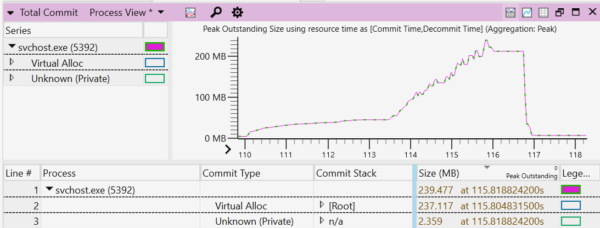

# Improve app performance by reducing the use of memory and disk space

This guide will demonstrate how to improve the performance of your Windows application in two primary ways:

- [Minimize memory usage](#minimize-memory-usage)

- [Efficiently use Disk Space](#efficiently-use-disk-space)

## Minimize memory usage

There are a variety of ways to minimize the amount of memory that your Windows app uses, you can:

- Reduce foreground memory usage
- Minimize background work
- Release resources while in the background
- Ensure your application does not leak memory

In order to appropriately minimize memory usage, it is first important to understand:

- how memory is used and allocated, using the [working set, dynamic memory, and virtual allocation](#working-set-dynamic-memory-and-virtual-allocation),
- how to [capture a system trace](#capture-a-system-trace-to-analyze-memory-usage), and
- how to [analyze the system trace](#analyze-the-system-trace).

Once you have a system trace to analyze, we will recommend guidance for [Applying your trace analysis to reduce memory usage](#applying-your-trace-analysis-to-reduce-memory-usage).

### Working set, dynamic memory, and virtual allocation

The [working set](/windows/win32/memory/working-set) of an application – the set of pages in its virtual address space that currently resident in memory – is one measure of the app's memory usage.

The amount of memory that an application uses impacts its runtime performance, as well as the responsiveness of the system as a whole. Minimizing the use of memory will help the app to perform better by reducing the CPU costs associated with accessing more memory. Lower memory usage also helps with the system responsiveness, and the app user's experience in general, as the application does not end up displacing other memory content.

Memory displacement can happen as the system attempts to retain in-memory content accessed recently and, if necessary, will trim and page-out content used earlier. When the user switches back to the shell, or another application, and the necessary data is not resident in-memory, the data will need to be read from the disk. The user will likely notice a slowdown due to this process.

There are two key pieces to the memory used by an application: 1) dynamic memory, and 2) file-backed memory. File-backed memory usage comes from binaries and data files, such as databases, used by an application. This is commonly not a significant chunk of an application's memory usage and often a constant. *(Exceptions would be data processing applications, code compilation etc.)* The more significant source of memory usage and where leaks manifest is dynamic memory.

Dynamic memory corresponds to virtual memory allocated by an application using [memory allocation routines](/cpp/c-runtime-library/memory-allocation). Unlike file-backed memory, which persists across system reboots, dynamic memory only exists for the lifetime of the application. Dynamic memory is a commonly significant source of memory usage and where memory leaks manifest.

[Virtual Allocation routines](/windows/win32/memory/allocating-virtual-memory) (`VirtualAlloc`) handle memory allocation requests from a Windows application independent of the application-layer routine used for memory allocation. While not all of the memory allocated by an application may be resident in memory all of the time, analyzing such allocations provides a consistent way to understand the memory usage of an application.

To understand your application's memory usage and find places to make improvements, we recommend capturing a VirtualAllocation trace as described below.

## Capture a system trace to analyze memory usage

Recording device activity over a period of time is known as *system tracing.* System tracing produces a trace file that can be used to generate a report and help you identify how to be improve your app's performance.

Traces can vary in length:

- A short running trace can be used to capture the launch of an application. This can include your app's transition to the inactive state, where the application window is minimized or the application windows is closed while the application process persists.
- A long running trace, typically several minutes in duration, is useful in diagnosing memory leaks. If the memory usage continues to trend up over time, this is usually suggestive of a leak.

There are multiple tools available for monitoring memory use, including:

- [Windows Performance Analyzer](/windows-hardware/test/wpt/windows-performance-analyzer)
- [Visual Studio Memory usage diagnostic tool](/visualstudio/profiling/memory-usage)

For the purposes of this article, we will focus on using the Windows Performance Analyzer. To learn more about choosing a tool for profiling the performance of your application, see [Choosing among Visual Studio Performance Profiler, Windows Performance Toolkit, and PerfView](./choose-between-tools.md).

**To capture a trace:**

1. Open a [command line](/windows/terminal/) (PowerShell or Command Prompt) in [administrator mode](/windows/terminal/faq#how-do-i-run-a-shell-in-windows-terminal-in-administrator-mode). (If not run in admin mode, you may receive error code: 0xc5585011, "Failed to enable the policy to profile system performance.")

2. Enter the command: `wpr -start VirtualAllocation -filemode`

3. Run the scenario that you are investigating. (Launching your application, for example.)

4. Enter the command: `wpr -stop Trace.etl`

## Analyze the system trace

In order to find which of your app's functions have allocated memory that you may be able to reduce, you now need to analyze the system trace that was captured. To analyze the trace:

1. Open the trace using [Windows Performance Analyzer](/windows-hardware/test/wpt/windows-performance-analyzer), by entering the command: `wpa.exe Trace.etl`

2. In the [Graph Explorer window](/windows-hardware/test/wpt/introduction-to-the-wpa-user-interface#graph-explorer-window), expand the **Memory** section, right-click on the **Total Commit** graph, and select **Add graph to New Analysis View**.

3. Open the **[View Editor](/windows-hardware/test/wpt/view-editor)** by clicking on the **Settings** gear and selecting the following column arrangement: **Process**, **Commit Type**, **Commit Stack** and **Size**.

4. Click on the **Size** column header so that the results are sorted in descending order. The **Commit Stack** shows the code path leading to memory being allocated. These results may help to understand the reason for the allocation. Sorting by size enables you to focus on the larger allocations and investigate whether there is an opportunity to optimize.

5. Filter to the process(es) that you are interested in analyzing by right-clicking on the process and selecting **Filter To Selection**.

6. To zoom in to your region of interest in the viewport, select a range, right-click on the graph, and select **Zoom**.

7. Navigate through the Commit Stack to understand which functions have allocated memory. Commit stacks will need [symbols loaded](/windows-hardware/test/wpt/loading-symbols). To load symbols, select **Trace** > **Load symbols** from the top navigation menu bar.

    

## Applying your trace analysis to reduce memory usage

In analyzing the allocated memory, you will find clues to help you decide where memory usage can be minimized.

A few areas to consider in regard to applying your trace analysis toward updating your code to reduce memory usage, include:

- **Reduce memory usage when in the foreground**: Analyzing the memory trace may help you to identify any unnecessary memory use in the foreground and update your code to reduce or remove that usage.

- **Minimizing work while in the background**: The system has policies to age out pages from the process working sets. Using less memory in the background allows the system to be more efficient by keeping less of the application memory resident. Learn more about how to [Improve power consumption and battery life by minimizing background work](./power.md), which will also translate into using less memory usage while in the background.

- **Release resources in the background**: At runtime, an application may create some memory caches, as well as creating graphics allocations to support its UI. These allocations may be able to be freed when the application is minimized or not visible. An application can register for low-memory notifications to take such action, but a better strategy may be to free memory after a period of not being used, when the application concludes it is inactive. This period of disuse can vary by application, so possible indicators of inactive use can range from a handful of minutes to a ½ hour or more. Care should be taken to balance this kind of memory savings with responsiveness. If a cache is expensive to rebuild, the application can choose to retain it for the lifetime of the application.

- **Ensure your application does not leak memory**: To check for memory leaks, first establish a steady-state benchmark, where the application memory usage plateaus or does not grow beyond a certain value. You can establish this steady-state by continuously using the application or leaving it idle in the background. Using the trace you've captured to identify a possible memory leak, you can find where that memory is being allocated in your code and how it can be freed of use after it has served its purpose. If the memory continues to grow as the application is running, this is a likely indication of a memory leak. Zoom in to the region corresponding to the growth within your trace and carefully analyze the commit stacks.

## Efficiently use Disk Space

**Disk footprint** refers to the size of an application when it's stored in an inactive state (not executing code). If the application takes up a lot of disk footprint it can be an opportunity to optimize.

There are several ways that reducing the disk footprint of your app can improve performance:

- As a disk gets full, the file system can no longer store new content in a contiguous fashion. A full disk becomes fragmented, storing new content on non-contiguous sectors. This translates to longer latency time when that content is accessed from the disk. IO systems will provide much better disk throughput when the content is contiguous and can be accessed sequentially or using larger IOs.

- A full disk may translate to longer write latencies for SSD-based systems. When there are fewer empty cells to absorb writes, a write may incur a read-modify-write operation, slowing performance.

- A full disk can hinder the ability to update your application. While the OS is resilient and able to keep the system up to date and secure, even with low available disk space, a healthy amount of available disk space for staging the content for your app update will translate to a faster, smoother update experience.

- Requiring a significant amount of a large disk footprint to be accessed at run time will translate to memory use as well. This will impact the responsiveness of your application and the system in general. Additionally, if a small proportion of the disk footprint is required at run time, then the application may be using disk space inefficiently.

A few ways to reduce, or be more efficient with, your disk space include:

- **Apply "pay-for-play" principles to your disk footprint  (download only what you need)**: An application may include a broad range of features with not all features applying to all users. This can be one reason for a large on disk footprint. By applying "pay-for-play" principles, you can ask users to select only to download the features that they need, translating to a smaller disk footprint when they download your app. Additional content is made optional for download only when the user has a need for richer capabilities. In addition to features, you may apply the same "pay-for-play" principles to language support. The application can include a subset of popular language choices by default, with additional languages optionally included or dependent on the location set on the user's system.

- **Apply efficient cache sizing**: In some cases, an application can use on-disk caches to make the user experience more responsive. Policies can be set for how your application manages the cache, with an upper limit set on the cache size based on disk capacity and resizing the cache when available space on the disk is low.

- **Apply efficient use of assets**: An application will often include image assets and may consist of a range of image size to support multiple resolutions. Optimizing image size, dimensions, format, and compression for a subset of resolutions, and leveraging scaling to support remaining resolutions, can significantly reduce disk footprint.

- **Investigate binary optimization opportunities**: Tools, such as [SizeBench](https://devblogs.microsoft.com/performance-diagnostics/sizebench-a-new-tool-for-analyzing-windows-binary-size/), enable application authors to investigate what contributes to the binary footprint and find opportunities to reduce the amount of disk space used.

## Additional resources

- [Windows Performance Analyzer step-by-step guide](/windows-hardware/test/wpt/wpa-step-by-step-guide)

- [Windows Performance Analyzer common scenarios](/windows-hardware/test/wpt/windows-performance-analyzer-common-scenarios)

- [Tracelogging](/windows/win32/tracelogging/trace-logging-portal)

- [Event Tracing for Windows](/windows-hardware/test/wpt/event-tracing-for-windows)

- [Memory Footprint Optimization](/windows-hardware/test/wpt/memory-footprint-optimization)

- [Measure memory usage in Visual Studio](/visualstudio/profiling/memory-usage)

- [Planning for performance](/windows/uwp/debug-test-perf/planning-and-measuring-performance)

- [Q&A forum](/answers/questions/679026/performance-monitor-to-log-cpu-amp-memory-usage.html)
