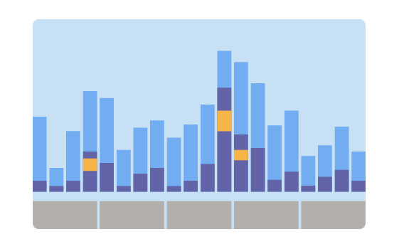

# Introduction to Windows Application Performance

:::row:::
   :::column:::
      
   :::column-end:::
   :::column span="2":::
      Performance is an aspect of software development that focuses on measuring and improving code. After reading this article, you will have a better idea of: what performance entails, why it is important for you and your customers, and how to get started with measuring your application's performance.
   :::column-end:::
:::row-end:::

## What is application performance?

Performance is the measure of how effectively your application uses the system's resources to do what you've designed it to do. It covers different aspects of how your program interacts with the underlying device. This can include things like:

* CPU usage
* Memory consumption
* Power consumption
* Network and storage utilization
* Animation performance

...and more.

All of these different properties have an element of cost associated with them: for example, how much CPU does my application use? How much of the user's bandwidth will it consume? How fast does this particular page of my application load? Measurement is therefore central to performance.

## Why is it important?

Users expect performance as a fundamental property of the software they use. They want their applications to be responsive and make efficient use of their system's resources. Applications that exhibit poor performance cause frustration, which can lead to reduced user engagement. To provide your customers with the best possible experience, it is therefore crucial to make performance a regular part of your development workflow.

## When should you measure application performance?

:::row:::
   :::column:::
      
   :::column-end:::
   :::column span="2":::
      Application performance can span many stages of the development process. It has implications on everything ranging from your choice of data structure to the technology that you choose for building your application.

      Keep performance in mind as you are developing your application, and plan to do regular performance testing as part of updating and maintaining your application.
   :::column-end:::
:::row-end:::

## How is application performance measured?

Here are some suggestions for how to approach testing your application for performance.

* **Leverage your knowledge of your application.** Understanding the most common scenarios for your users will enable you to spend your time wisely on optimizing the right things. Unclear scenarios can make your measurements difficult to interpret, so don't skip this step! If you have data available on how users interact with your application, this would be a great time to look at it.
  * Where are your users spending most of their time?
  * What are the most important things that a customer will do with your software?
  * What are your application's hardware requirements?
* **Set performance goals for your most important user scenarios.**
* **Be precise about what you are trying to optimize.** Is it CPU? Battery? Network throughput?
* **Select the tools you will use to do your measurements.**
* **Apply a scientific mindset when testing.** Create benchmarks in a controlled environment. Then, make your change, and re-measure to see how your changes have affected your application's behavior.
* **Add regression testing into your test environment.** This will ensure that your performance metrics don't regress over time. Modern hardware is complex and measuring the impact of your performance improvements can be a challenge. Investigating, measuring, and testing your application performance in these ways will ensure you know the impact of your work.

### Intertwining metrics

While you will typically focus on one area of performance during your analysis, be aware that areas are often intertwined. An improvement in one can cascade into an improvement in the other areas.

For example, fixing power consumption is frequently a synchronization problem. Reducing memory usage can result in reducing the time spent using the CPU.

There can also be situations where additional resources spent in one area yield a more impactful improvement in another area.

For example, increasing memory consumption can decrease network or storage utilization through caching.

The decision to make a change depends on what is most important for your customers. It is also part of the challenge (and fun!) of performance work.

## Next steps

With this background in place, here are some actions you can now take:

* **Identify your application's most common scenarios**. These will be the basis of what you are trying to measure.
* **Figure out your test strategy.** What will be your test environment and choice of measurement tools?

Head to the [Windows app performance overview](index.md) to learn more about the tools and guidance that are available for you to use on your performance journey.
