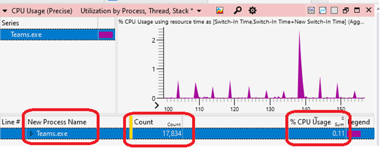

# Improve power consumption and battery life by minimizing background work

This guide will demonstrate how to improve the way that your Windows application consumes power, offering principles to help you improve overall device performance and battery life.

The most basic principles for improving power consumption are to ensure that while your app is in the background, it does not:

- use system resources,
- wake the CPU through timers,
- wake the CPU by waiting for vsync events.

Being "in the background" means that your app is not visible, nor audible, to the user. There should be few, if any, reasons to wake the CPU or utilize system resources while in the background. Checking whether your app is triggering these events and addressing the cause can significantly improve your app's power consumption, battery life, and [reduce the carbon emissions that will result from customers using your app](./index.md#performance-and-sustainability).

To check that the CPU is not waking up to do unnecessary work while your app is not in use, you can capture and analyze a trace using [Windows Performance Analyzer (WPA)](/windows-hardware/test/wpt/windows-performance-analyzer). We will walk through the steps explaining how to do so below.

## Capture a trace and check for unnecessary work

It is important to set up the correct conditions when running your app before capturing a trace to analyze whether unnecessary work is being performed that can drain power. You also may want to run multiple traces in order to test your app under a variety of conditions.

### Setup

1. Get your test device to idle by opening Task Manager and ensuring that CPU utilization is less than 5%. Doing so will minimize measurement interference and provide reasonable size traces.

2. Launch your app and navigate to a view that's expected to be commonly used.

3. Minimize your app. *You may want to repeat the following steps while your app window is fully occluded (blocked from view) behind other windows and when your app is in the foreground, after a period of no interaction by the user, to ensure unnecessary work is not being initiated by the app.

### Measure and evaluate CPU use while in the background

1. Open a [command line](/windows/terminal/) (PowerShell or Command Prompt) in [administrator mode](/windows/terminal/faq#how-do-i-run-a-shell-in-windows-terminal-in-administrator-mode). (If not run in admin mode, you may receive error code: 0xc5585011, "Failed to enable the policy to profile system performance.")

2. Enter the command: `wpr -start power -filemode`

3. Leave device idle for 5 minutes.

4. Enter the command: `wpr -stop idletrace.etl`

5. To open the trace using [Windows Performance Analyzer (WPA)](/windows-hardware/test/wpt/windows-performance-analyzer), enter the command: `wpa.exe idletrace.etl`

6. Open the **Computation** > **[CPU Usage (Precise)](/windows-hardware/test/wpt/cpu-analysis#cpu-usage-precise-graph)** graph.

    - Navigate to your process (or if you have a multi-process model all processes related to your app) and evaluate the [Cswitch](/windows/win32/etw/cswitch) count, "Utilization by CPU". Ideally these are as close to 0 as possible while the app is in background. Looking at the stacks is a great way to find where resources are being used and how to improve it.

    - Look for excessive wakes by adding a "New Thread Stack" to see which stack the thread woke on.

    

7. Open the **Computation** > **[CPU Usage (Sampled)](/windows-hardware/test/wpt/cpu-analysis#cpu-usage-sampled-graph)** graph. Track down CPU usage issues by evaluating where in-code time is being spent executing.

### Measure and evaluate vsync waiting while in the background

> [!NOTE]
> Focus on basic CPU usage in the previous section before investigating this more advanced scenario.

1. Open a [command line](/windows/terminal/) (PowerShell or Command Prompt) in administrator mode.

2. Enter the command: `wpr -start gpu -filemode`

3. Leave the device idle for 5 minutes.

4. Enter the command: `wpr -stop gputrace.etl`

5. To open the trace using [Windows Performance Analyzer (WPA)](/windows-hardware/test/wpt/windows-performance-analyzer), enter the command: `wpa.exe gputrace.etl`

6. Open the **System Activity** > **Generic events** graph.

    - Filter to "Microsoft-Windows-Dxgkrnl" events.
    - Drag the **Process** column over to be the 2nd column.
    - Check if you are calling into WaitForVsync. For example, through APIs like [IDXGIOutput::WaitForVBlank (dxgi.h)](/windows/win32/api/dxgi/nf-dxgi-idxgioutput-waitforvblank) through the `WaitForVerticalBlankEventInternal` event.

    

To learn more, see the article [Using Windows Performance Analyzer to analyze Modern Standby issues](/windows-hardware/design/device-experiences/using-windows-performance-analyzer-to-analyze-modern-standby-issues).

## Additional resources

- [Windows Performance Analyzer step-by-step guide](/windows-hardware/test/wpt/wpa-step-by-step-guide)

- [Windows Performance Analyzer common scenarios](/windows-hardware/test/wpt/windows-performance-analyzer-common-scenarios)

- [Using Windows Performance Analyzer to analyze Modern Standby issues](/windows-hardware/design/device-experiences/using-windows-performance-analyzer-to-analyze-modern-standby-issues)

- [CPU Analysis](/windows-hardware/test/wpt/cpu-analysis)

- [Event Tracing for Windows](/windows-hardware/test/wpt/event-tracing-for-windows)

- [Q&A forum](/answers/questions/812324/i-don39t-have-sampled-cpu-usage-data-in-my-profile.html)

- [List of Windows Performance Toolkit (WPA) Graphs](/windows-hardware/test/wpt/list-of-wpa-graphs)