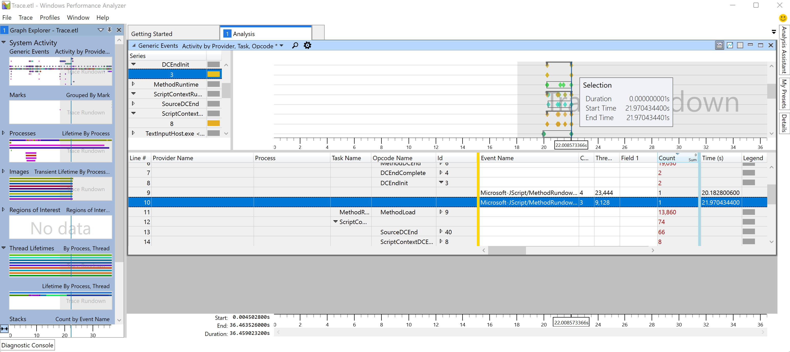

# Improve the responsiveness of your Windows app

This guide will help you to improve the responsiveness of your Windows application by optimizing latency for launch and key interactions. Quick, responsive interactions (otherwise known as low-latency interactions) creates a better user experience. Understanding interaction expectations, measuring current durations, and setting goals for improvement depending on the interaction class can lead to significant improvements in your users experience and satisfaction.

## Step by step guide to optimizing interactions for responsive behavior

Customers can feel when an application launch, menu navigation, or page/content load is slow. They have come to expect a fast, seamless experience and we have shared some steps and guidance to better understand those expectations below.

The basic steps to drive latency optimization are:

1. Define the scenario and add TraceLogging events.

    Make a list of the key interactions that a user will go through while using your app, such as launch, opening a menu, navigating to a new page and rendering content, etc. For each of these interactions, add a start event and stop event to be used for measurement and analysis. Learn more about how to add [TraceLogging](/windows/win32/tracelogging/trace-logging-portal), a format for self-describing Event Tracing for Windows (ETW).

2. Set goals based on the interaction class.

    Users have different expectations for an app's performance and responsiveness depending on the type of interaction. For example, how quickly an app launches versus how quickly a page loads. Think of the acceptable range of elapsed time that it takes for users to complete the key interactions in your app. This may range from 200 milliseconds (ms) to 5 seconds (sec). Then assign each task an interaction class label with an associated goal. Below are a few basic guidelines, along with suggestions for how you might include a user interface (UI) to improve the perception of responsiveness:

| Interaction class label | User perception| Range of delay | Examples | Suggested UI |
|---|---|---|---|---|
| Fast | Minimally noticeable delay| 100 - 200 milliseconds | Open app bar, right click menu | |
| Interactive | Quick, but not fast | 300 - 500 ms | Exit an app, display cached search results | |
| Pause | Not quick, but feels responsive | 500 ms - 1 sec | Navigate to a different page, resume the app from a suspended state, display web search results | An entrance animation (e.g. fly in new content) may be used to mask the time taken for this scenario. |
| Wait | Not quick due to amount of work for scenario | 1 - 3 sec | Launching the app | A spinning/waiting cursor may be used to note progress. Both an exit and entrance animation (e.g. fly old page out, fly new page in) may be used to mask the time taken for this scenario. |
| Long wait | No longer feels responsive | 2 - 5 sec| Large app launches (use extended splash screen), starting an HD video stream | A "loading UI" is displayed – where possible, include a "cancel" option for the user. The loading UI should appear within the Fast interaction class. The loading UI does not need to display a percentage or time remaining. |
| Captive | A long wait – reserved for unavoidably long/complex scenarios | 5 - 10 sec| System login | A "loading UI" or dialog is displayed – where possible, include a "cancel" option for the user. The dialog should appear within the Fast interaction class. The dialog should display a percentage or time remaining if this would provide useful context to the user. |
| Long-running | Long operations – users will probably multitask (switch away during operation) | 10 - 30+ sec| Installing new features or updates, large file downloads | UI should be designed to reflect multitasking possibility. A progress dialog should be displayed including an estimate of completion (percentage, time remaining, etc.). Alternatively, the UI can minimize completely and only notify the user when the scenario has finished by using a toast notification. |

3. To check the exact durations for specific interactions, you can capture and analyze a trace using [Windows Performance Analyzer (WPA)](/windows-hardware/test/wpt/windows-performance-analyzer).

    - Before capturing your trace, get your test device to idle by opening Task Manager and ensuring that CPU utilization is less than 5%. Doing so will minimize measurement interference and provide reasonable size traces. This will help you to better isolate the interaction that you aim to measure.

    - To capture a trace, open a [command line](/windows/terminal/) (PowerShell or Command Prompt) in [administrator mode](/windows/terminal/faq#how-do-i-run-a-shell-in-windows-terminal-in-administrator-mode).

    - Enter the command: `wpr -start GeneralProfile -filemode`

    - Run the interaction scenario on your app.

    - Enter the command: `wpr -stop Trace.etl`

4. Analyze the trace and find improvement opportunities.

    Analyze the duration of each key interaction supported by your app by opening the trace that you just captured in [Windows Performance Analyzer (WPA)](/windows-hardware/test/wpt/windows-performance-analyzer).

    - To open the trace in WPA, in your command line, enter: `wpa.exe Trace.etl`
    - Expand the **System Activity** dropdown and double-click on "Generic Events" to open the analysis view.
    - Choose the event series related to your application and expand the "Provider Name" dropdown until you are able to find the Process, Task Name, and Event name associated with the key interaction you are seeking. The duration of the interaction event will be listed in the **Time** column, as well as in the graph, showing **Duration**, **Start Time**, and **End Time**.

    If the duration from your trace does not meet the interaction class goals (ex: 500ms), identify the key threads for your App (likely the UI thread), and look at the top stacks for CPU usage and waits. *Remember that as you perform the analysis, some issues may not be specific to your own application's code.

    

## Additional resources

- [Windows Performance Analyzer step-by-step guide](/windows-hardware/test/wpt/wpa-step-by-step-guide)

- [Windows Performance Analyzer: Optimizing Performance and Responsiveness](/windows-hardware/test/wpt/optimizing-performance-and-responsiveness)

- [TraceLogging](/windows/win32/tracelogging/trace-logging-portal)

- [Event Tracing for Windows](/windows/win32/tracelogging/trace-logging-portal)

- [Planning for performance](/windows/uwp/debug-test-perf/planning-and-measuring-performance)

- [Q&A forum](/answers/questions/812324/i-don39t-have-sampled-cpu-usage-data-in-my-profile.html)

- [List of Windows Performance Toolkit (WPA) Graphs](/windows-hardware/test/wpt/list-of-wpa-graphs)
