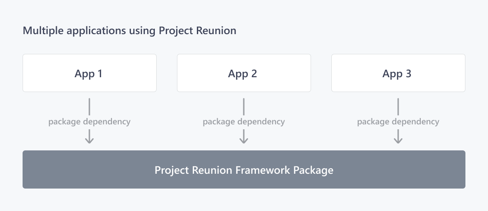
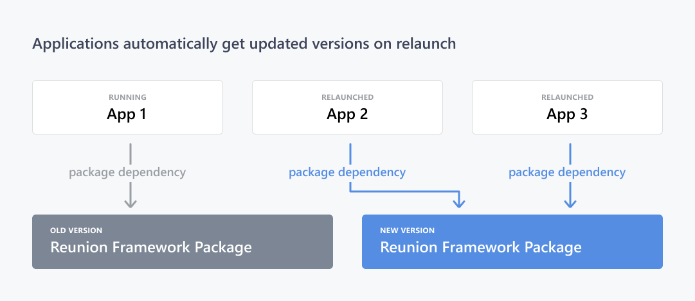

# Deploy apps that use Project Reunion

To deploy apps that use Project Reunion 0.5 to other computers, you must package the apps using [MSIX](/windows/msix). Project Reunion will support deploying unpackaged apps in a future release. For more information about our future plans, see our [roadmap](https://github.com/microsoft/ProjectReunion/blob/main/docs/roadmap.md).

By default, when you create a project using one of the [WinUI project templates](..\winui\winui3\winui-project-templates-in-visual-studio.md) that are provided with the Project Reunion extension for Visual Studio, your project includes a [Windows Application Packaging Project](/windows/msix/desktop/desktop-to-uwp-packaging-dot-net) that is configured to build the app into an MSIX package. For more information about configuring this project to build an MSIX package for your app, see [Package a desktop or UWP app in Visual Studio](/windows/msix/package/packaging-uwp-apps).

After you build an MSIX package for your app, you have several options for deploying it to other computers. For more information, see [Manage your MSIX deployment](/windows/msix/desktop/managing-your-msix-deployment-overview).

> [!NOTE]
> Project Reunion 0.5 is supported for use in MSIX-packaged desktop apps (C#/.NET 5 or C++/Win32) in production environments. Packaged desktop apps that use Project Reunion 0.5 can be published to the Microsoft Store.

## Dependencies on the Project Reunion framework package

When you build an app that uses Project Reunion, your app references a set of Project Reunion runtime components that are distributed to end users via a *framework package*. The framework package allows packaged apps to access Project Reunion components through a single shared source on the user's device, instead of bundling them into the app package. The framework package also carries its own resources, such as DLLs and API definitions (COM and Windows Runtime registrations). These resources run in the context of your app, so they inherit the capabilities and privileges of your app, and don't assert any capabilities or privileges of their own.

The Project Reunion framework package is an MSIX package that is deployed to end users through the Microsoft Store. It can be easily and quickly updated with the latest releases, in addition to security and reliability fixes. All apps that use Project Reunion on a computer have a dependency on a shared instance of the framework package, as illustrated in the following diagram.



The way that dependency is configured depends on whether you're using a prerelease or release version of Project Reunion in your app. Project Reunion will be available in prerelease and release versions, and these will include prerelease and release versions of the framework package. Apps must ensure they are referencing the correct package for the functionality they desire.

## Configure dependencies on preview versions of the framework package

Preview versions of Project Reunion are intended for investigation and feedback on new features. They are not licensed to be used in production environments and should not be published to the Microsoft Store.

When you install a preview version of the Project Reunion extension for Visual Studio or the Project Reunion NuGet package on your development computer, the preview version of the framework package is deployed during build time as a NuGet package dependency.

## Configure dependencies on release versions of the framework package

Release versions of Project Reunion are supported for use in production environments.

When you install a release version of the Project Reunion extension or the Project Reunion NuGet package on your development computer and you create a project using one of the provided WinUI 3 project templates, the generated package manifest contains a [PackageDependency](/uwp/schemas/appxpackage/uapmanifestschema/element-packagedependency) element that specifies a dependency on the framework package.

```xml
<Dependencies>
    <PackageDependency Name="Microsoft.ProjectReunion.0.5" MinVersion="0.52103.9000.0" Publisher="CN=Microsoft Corporation, O=Microsoft Corporation, L=Redmond, S=Washington, C=US" />
</Dependencies>
```

However, if you build your app package manually, you must add this **PackageDependency** element to your package manifest yourself to declare a dependency on the Project Reunion framework package.

## Updates and versioning of the framework package

When a new version of the Project Reunion framework package is released, all apps are updated to the new version without themselves having to redistribute a copy. Windows updates to the newest version of frameworks as they are released, and apps will automatically reference the latest framework package version during relaunch. Older framework package versions will not be removed from the system until they are no longer running or being actively used by apps on the system.



Because app compatibility is important to Microsoft and to apps that depend on Project Reunion, the Project Reunion framework package follows [Semantic Versioning 2.0.0](https://semver.org/) rules. This means that after we release version 1.0 of Project Reunion, the Project Reunion framework package will guarantee compatibility between minor and patch version changes, and breaking changes will occur only between major version updates.

## Related topics

- [Build desktop Windows apps with Project Reunion](index.md)
- [Get started with Project Reunion](get-started-with-project-reunion.md)
