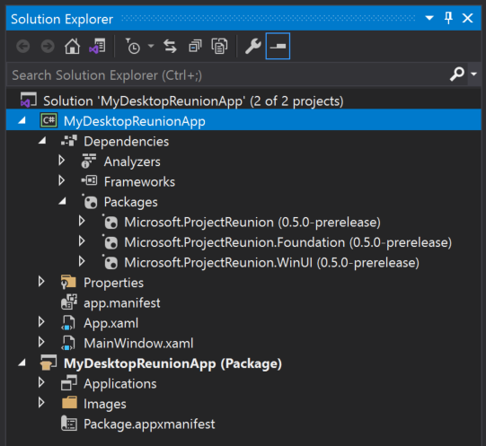
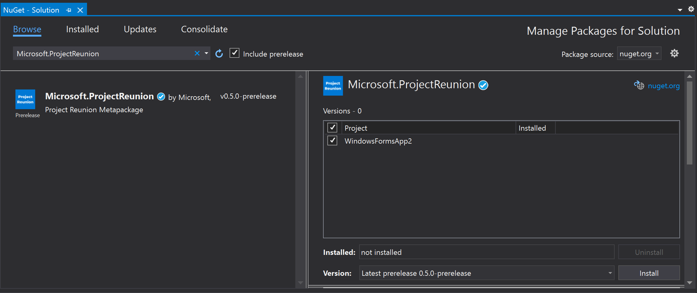

# Get started developing apps with Project Reunion 

After you [set up your development environment](set-up-your-development-environment.md), you're ready to start developing with Project Reunion. This article provides instructions about using Project Reunion in new or existing projects.

## Create a new project that uses Project Reunion

If you created a project with an earlier preview or release version of Project Reunion or WinUI 3, see [Update existing projects to the latest release of Project Reunion](update-existing-projects-to-the-latest-release.md) for instructions on updating to the latest version.

> [!NOTE]
> The desktop (C#/.NET 5 and C++/WinRT) project templates included in the [stable release channel](stable-channel.md) of Project Reunion are supported for use in production environments. The UWP and other project templates included in the [preview release channel](preview-channel.md) Project Reunion (Preview) extension are available as a developer preview only, and should not be used to build apps for production environments.

To create a new project that uses Project Reunion:

1. Follow the instructions in the following articles:

    - [Get started with WinUI 3 for desktop apps](..\winui\winui3\get-started-winui3-for-desktop.md)
    - [Get started with WinUI 3 for UWP apps (Preview)](..\winui\winui3\get-started-winui3-for-uwp.md)
    - [Build a basic WinUI 3 desktop app](..\winui\winui3\desktop-build-basic-winui3-app.md)

    > [!NOTE]
    > If you create a C#/.NET 5 project, make sure that your project's .NET SDK references are up to date using [these instructions](release-channels.md#net-sdk-references).

2. After you create your project, you have access to the Project Reunion APIs and components in addition to all other Windows and .NET APIs that are typically available to desktop and UWP apps. For more information about the available APIs and components, see [stable release channel](stable-channel.md) and [preview release channel](preview-channel.md).

To confirm that your new project uses Project Reunion, expand the **Dependencies** > **Packages** node under your project in **Solution Explorer**. You should see several **Microsoft.ProjectReunion** packages listed under this node, similar to the following image.

## Use Project Reunion in an existing project

If you have an existing project in which you want to use Project Reunion, you can install the latest stable or latest preview version of the Project Reunion NuGet package in your project. This scenario has [some limitations](release-channels.md#using-the-project-reunion-nuget-package-in-existing-projects).

1. Open an existing desktop project (either C#/.NET 5 or C++/WinRT) or UWP project in Visual Studio 2019.

    > [!NOTE]
    > If you have a C#/.NET 5 desktop project, make sure the **TargetFramework** element in the project file is assigned to a Windows 10-specific .NET 5 moniker, such as **net5.0-windows10.0.19041.0**, so that it can call Windows Runtime APIs. For more information, see [this section](../../apps/desktop/modernize/desktop-to-uwp-enhance.md#net-5-use-the-target-framework-moniker-option).

2. Make sure [package references](/nuget/consume-packages/package-references-in-project-files) are enabled:

    1. In Visual Studio, click **Tools -> NuGet Package Manager -> Package Manager Settings**.
    2. Make sure **PackageReference** is selected for **Default package management format**.

3. Right-click your project in **Solution Explorer** and choose **Manage NuGet Packages**.

4. In the **NuGet Package Manager** window, select the **Browse** tab and search for `Microsoft.ProjectReunion`.

5. After the **Microsoft.ProjectReunion** package is found, in the right pane of the **NuGet Package Manager** window click **Install**.

    

6. **For C#/.NET 5 projects only**: In order to receive all of the fixes from the latest stable release of Project Reunion 0.5, you'll need to update your project file to explicitly set your .NET SDK to the latest version. For more information, see [.NET SDK references](release-channels.md#net-sdk-references).

7. After you install the **Microsoft.ProjectReunion** package, you can use the following Project Reunion APIs and components in your project:

    - [Manage resources MRT Core](mrtcore/mrtcore-overview.md)
    - [Render text with DWriteCore](dwritecore.md)

## Samples

The following Project Reunion samples are currently available for you to explore.

> [!NOTE]
> These samples currently support Project Reunion version 0.5. New and updated samples for Project Reunion version 0.8 Preview are coming soon.

- [DWriteCore gallery sample](https://github.com/microsoft/Project-Reunion-Samples/tree/main/DWriteCore/DWriteCoreGallery): This sample application demonstrates the [DWriteCore](dwritecore.md) API.
- [MRT Core sample](https://github.com/microsoft/Project-Reunion-Samples/tree/main/MrtCore): This sample application demonstrates the [MRT Core](mrtcore/mrtcore-overview.md) API.
- [Hello World sample](https://github.com/microsoft/Project-Reunion-Samples/tree/main/HelloWorld/reunioncppdesktopsampleapp): This sample demonstrates a basic integration with the Project Reunion NuGet package.
- [Xaml Controls Gallery](https://aka.ms/winui3/xcg): This is a sample app that showcases all of the WinUI 3 controls in action.

## Related topics

- [Build desktop Windows apps with Project Reunion](index.md)
- [Release channels and release notes](release-channels.md)
- [Set up your development environment](set-up-your-development-environment.md)
- [Deploy apps that use Project Reunion](deploy-apps-that-use-project-reunion.md)