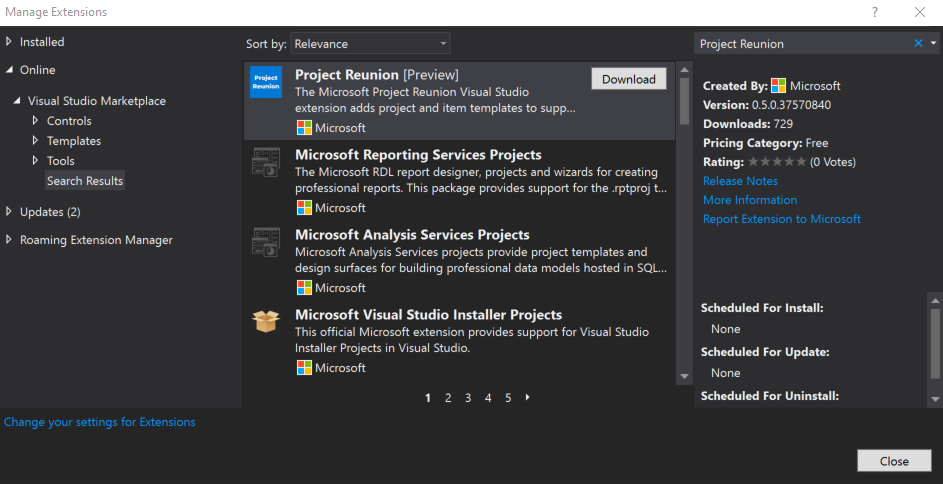

# Set up your development environment

This article provides instructions for installing and setting up the Project Reunion extension for Visual Studio 2019 on your development computer. Before you install and use Project Reunion, see the information about [release channels](release-channels.md).

## 1. Verify that you meet OS version requirements

Project Reunion is currently supported on Windows 10, version 1809 (build 17763), or later.

## 2. Install Visual Studio

Project Reunion requires Visual Studio 2019 version 16.9 or higher.

> [!div class="button"]
> [Download Visual Studio 2019](https://visualstudio.microsoft.com/vs/)

If you want to access the full suite of interactive and debugging features with Project Reunion, install the latest Visual Studio 2019 version 16.10 Preview.

> [!div class="button"]
> [Download Visual Studio Preview](https://visualstudio.microsoft.com/vs/preview/)

If you already have Visual Studio installed, you can check your version:

1. Open Visual Studio.
2. Select **Help** > **About Microsoft Visual Studio**.
3. Read the version number from the **About** dialog.

### Required workloads and components

Project Reunion requires that the following workloads and components are installed with Visual Studio. These workloads and components are all selected by default.

- On the **Workloads** tab of the installation dialog, these workloads are required:
  - **Universal Windows Platform development**
  - **Desktop development with C++**
  - **.NET Desktop Development**

- On the **Individual components** tab of the installation dialog, **Windows 10 SDK (10.0.19041.0)** is required in the **SDKs, libraries, and frameworks** section.

- In the **Installation details** pane of the installation dialog, **C++ (v142) Universal Windows Platform tools** is required in the **Universal Windows Platform development** section.

## 3. Enable NuGet Package source

Make sure your system has a NuGet package source enabled for the official NuGet service index at `https://api.nuget.org/v3/index.json`. 

 1. In Visual Studio, select **Tools** -> **NuGet Package Manager** -> **Package Manager Settings** to open the **Options** dialog.
 2. In the left pane of the **Options** dialog, select the **Package Sources** tab, and make sure there is a package source for **nuget.org** that points to `https://api.nuget.org/v3/index.json` as the source URL. For more information, see [Common NuGet configurations](/nuget/consume-packages/configuring-nuget-behavior).

## 4. Install the Project Reunion Extension for Visual Studio

There are two versions of the Project Reunion extension available you can choose from: the stable channel and preview channel.

> [!NOTE]
> If you previously installed the [WinUI 3 Preview extension for Visual Studio](https://marketplace.visualstudio.com/items?itemName=Microsoft-WinUI.WinUIProjectTemplates), uninstall the extension. For more information about how to uninstall an extension, see [Manage extensions for Visual Studio](/visualstudio/ide/finding-and-using-visual-studio-extensions).

### Install the stable release

To develop desktop (C#/.NET 5 or C++/WinRT) apps that can be used in production environments, install the latest extension from the [stable release channel](stable-channel.md). Choose one of these options to install:

- In Visual Studio 2019, click **Extensions** > **Manage Extensions**, search for **Project Reunion**, and install the latest extension.
- Alternatively, you can download and install the extension directly from Visual Studio Marketplace.

    > [!div class="button"]
    > [Download latest stable release](https://aka.ms/projectreunion/vsixdownload)

### Install the preview release

To develop desktop (C#/.NET 5 or C++/WinRT) apps or UWP apps that use the latest experimental Reunion features, install the latest extension from the [preview release channel](preview-channel.md). This version of Project Reunion cannot be used by apps in production environments. Choose one of these options to install:

- In Visual Studio 2019, click **Extensions** > **Manage Extensions**, search for **Project Reunion (Preview)**, and install the latest extension.
- Alternatively, you can download and install the extension directly from Visual Studio Marketplace.

    > [!div class="button"]
    > [Download latest preview release](https://aka.ms/projectreunion/previewdownload)

## Related topics

- [Build desktop Windows apps with Project Reunion](index.md)
- [Release channels and release notes](release-channels.md)
- [Get started developing apps with Project Reunion](get-started-with-project-reunion.md)
- [Deploy apps that use Project Reunion](deploy-apps-that-use-project-reunion.md)