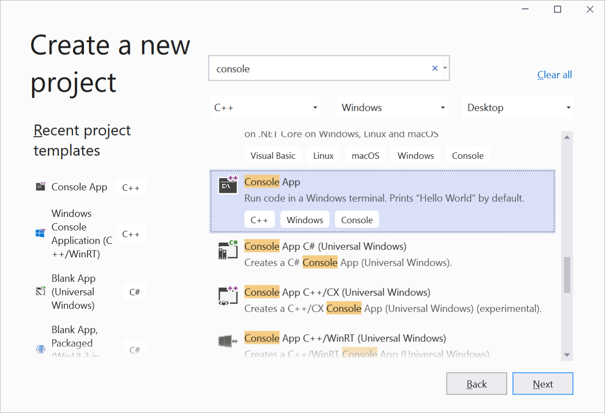
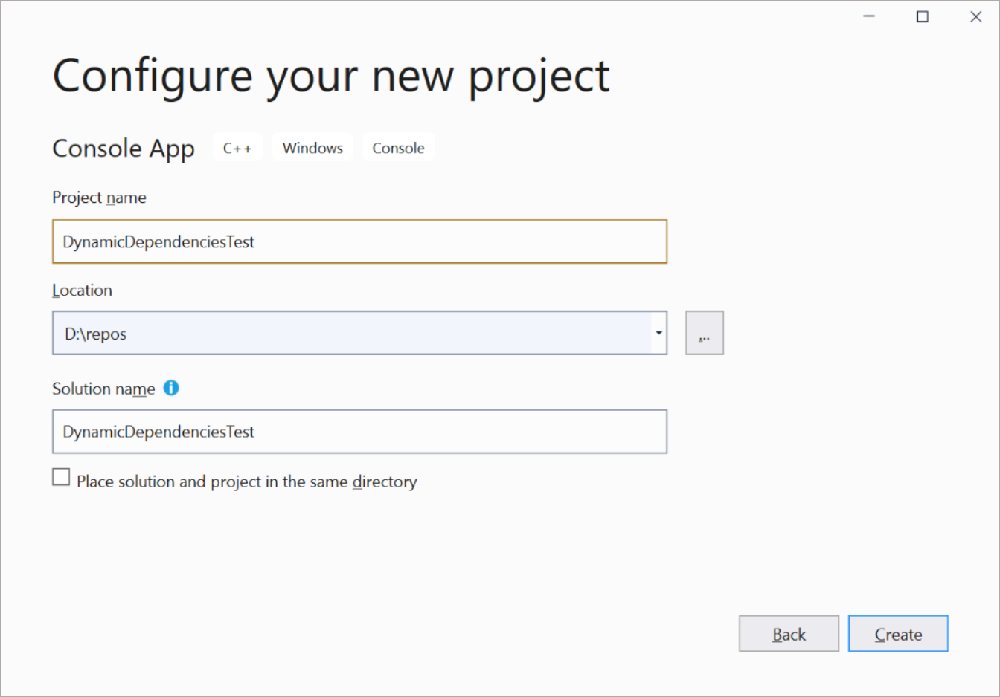

# Tutorial: Build and deploy an unpackaged app that uses Project Reunion

> [!IMPORTANT]
> [Unpackaged app deployment](deploy-unpackaged-apps.md) is an experimental feature that is currently supported only in the [preview release channel](preview-channel.md). This feature is not supported for use by apps in production environments.

This article provides a step-by-step tutorial for deploying a non-MSIX packaged app that uses Project Reunion. This tutorial demonstrates this scenario using a basic C++ Console app.

Before completing this tutorial, we recommend that you review [Runtime architecture and deployment scenarios](deployment-architecture.md) to learn more about the Framework package dependency your app takes when it uses Reunion, and the additional components required to work in an unpackaged app.

## Prerequisites

- A supported version of Visual Studio 2019. For more information, see [Set up your development environment](set-up-your-development-environment.md).
    > [!NOTE]
    > Although we encourage you to install the Project Reunion extension for Visual Studio, you do not need to install the extension to perform this tutorial. In this tutorial, you will install the Project Reunion NuGet package directly in an existing project.
- Ensure all [dependencies for unpackaged apps](deployment-architecture.md#additional-requirements-for-unpackaged-apps) are installed. The simplest solution is to run the Project Reunion runtime installer:

  1. Download [ReunionRuntimeInstaller.exe from GitHub](https://aka.ms/projectreunion/0.8preview).
  2. From a command prompt, run `ReunionRuntimeInstaller.exe` to install all the dependencies.

## 1. Create a new C++ Console app in Visual Studio

Create a new C++ **Console App** project. Name the project **DynamicDependenciesTest**.





After you create the project, you should have a 'Hello World' C++ console app.

## 2. Install the Project Reunion NuGet package

Next, install the Project Reunion NuGet package to your Console project.

1. In **Solution Explorer**, right-click the **References** node and choose **Manage Nuget Packages**. 
2. Search for **Project Reunion**, and install the latest preview version of the **Microsoft.ProjectReunion** package.

## 3. Initialize the Bootstrapper in your code

You are now ready to use the [dynamic dependencies API](https://github.com/microsoft/ProjectReunion/blob/main/specs/dynamicdependencies/DynamicDependencies.md) to initialize the [Bootstrapper](deployment-architecture.md#bootstrapper) component in your app.

1. Add the following include files to the top of your **DynamicDependenciesTest.cpp** file.

    ```cpp
     #include <windows.h> 
     #include <MddBootstrap.h>   
    ```

2. Add the following code to initialize the Bootstrapper at the top of your `main` method. This code defines what version of Project Reunion the app is dependent upon when initializing the Bootstrapper.

    ```cpp
    const UINT32 majorMinorVersion{ 0x00000008 }; 
    PCWSTR versionTag{ L"preview" }; 
    const PACKAGE_VERSION minVersion{}; 
    HRESULT hr{ MddBootstrapInitialize(majorMinorVersion, versionTag, minVersion) }; 
    ```

3. Add error checking code and display the result.

    ```cpp
    // Check the return code for errors. If there is an error, display the result.
    if (FAILED(hr)) 
    { 
        wprintf(L"Error 0x%X in MddBootstrapInitialize(0x%08X, %s, %hu.%hu.%hu.%hu)\n", 
            hr, majorMinorVersion, versionTag, minVersion.Major, minVersion.Minor, minVersion.Build, minVersion.Revision); 
        return hr; 
    } 
    ```

4. Your final code should look like this.

    ```cpp
    #include <iostream> 
    #include <windows.h> 
    #include <MddBootstrap.h>
    
    int main() 
    
    { 
        // Take a dependency on Project Reunion preview 
        const UINT32 majorMinorVersion{ 0x00000008 }; 
        PCWSTR versionTag{ L"preview" }; 
        const PACKAGE_VERSION minVersion{}; 
        
        HRESULT hr{ MddBootstrapInitialize(majorMinorVersion, versionTag, minVersion) }; 
    
        // Check the return code. If there is a failure, display the result.
        if (FAILED(hr)) 
        { 
            wprintf(L"Error 0x%X in MddBootstrapInitialize(0x%08X, %s, %hu.%hu.%hu.%hu)\n", 
                hr, majorMinorVersion, versionTag, minVersion.Major, minVersion.Minor, minVersion.Build, minVersion.Revision); 
            return hr; 
        } 
    
        std::cout << "Hello World!\n"; 
    
        // Release the DDLM and clean up.
        MddBootstrapShutdown(); 
    } 
    ```

## 4. Run the app

Press F5 to build and run your app.

## Related topics

- [Deploy unpackaged apps that use Project Reunion](deploy-unpackaged-apps.md)
- [Runtime architecture and deployment scenarios](deployment-architecture.md)
- [Get started with Project Reunion](get-started-with-project-reunion.md)
