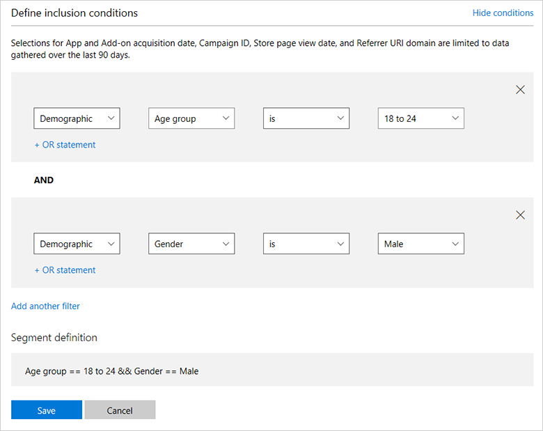

# Create customer groups

You can create *customer groups* that include a subset of your app's customers. These groups can be used to target customers for promotions, testing, and other purposes.

To view and create customer groups, expand **Engage** in the left navigation menu of [Partner Center](https://partner.microsoft.com/dashboard), then select **Customer groups**.

Currently, two types of customer groups are supported:

- **Segments.** These are dynamically-created groups of Windows 10 or Windows 11 customers who meet the demographic or revenue criteria that you choose. Segments are typically used with [push notifications](send-push-notifications-to-your-apps-customers.md) or [targeted offers](use-targeted-offers-to-maximize-engagement-and-conversions.md). For more info, see [Create customer segments](create-customer-segments.md).
- **Known user groups.** These are groups of specific customers, created from the email addresses associated with their Microsoft accounts. Known user groups are most often used with [package flighting](package-flights.md) in order to deliver specific packages to customers in that group, or for distribution of a submission to a [private audience](publish-your-app/msix/visibility-options.md#audience). For more info, see [Create known user groups](create-known-user-groups.md).

## Create customer segments

There are times when you may want to target a subset of your customer base for promotional and engagement purposes. You can accomplish this in [Partner Center](https://partner.microsoft.com/dashboard) by creating a type of [customer group](create-customer-groups.md) known as a *segment* that includes the Windows 10 or Windows 11 customers who meet the demographic or revenue criteria that you choose.

For example, you could create a segment that includes only customers who are age 50 or older, or that includes customers who’ve spent more than $10 in the Microsoft Store. You could also combine these criteria and create a segment that includes all customers over 50 who have spent more than $10 in the Store. 

We provide a few segment templates to help get you started, but you can define and combine the criteria however you'd like.

> [!TIP]
> Segments can be used to send [targeted notifications](send-push-notifications-to-your-apps-customers.md) or [targeted offers](use-targeted-offers-to-maximize-engagement-and-conversions.md) to a group of customers as part of your engagement campaigns.

Things to keep in mind about customer segments:
- After you save a segment, it takes 24 hours before you’ll be able to use it for [targeted push notifications](send-push-notifications-to-your-apps-customers.md).
- Segment results are refreshed daily, so you may see the total count of customers in a segment change from day to day as customers drop in or out of the segment criteria.
- Most segment attributes are calculated using all historical data, although there are some exceptions. For example, **App acquisition date**, **Campaign ID**, **Store page view date**, and **Referrer URI domain** are limited to the last 90 days of data.
- Segments only include customers who acquired your app on Windows 10 or Windows 11 while signed in with a valid Microsoft account. 
- Segments do not include any customers who are younger than 17 years old.

## To create a customer segment

1.	In [Partner Center](https://partner.microsoft.com/dashboard), expand **Engage** in the left navigation menu and then select **Customer groups**.
2.	On the **Customer groups** page, do one of the following:
 - In the **My customer groups** section, select **Create new group** to define a segment from scratch. On the next page, select the **Segment** radio button.
 - In the **Segment templates** section, select **Copy** next to one of the predefined segments (that you can use as is or modify to suit your needs).
3.	In the **Group name** box, enter a name for your segment.
4.	In the **Include customers from this app** list, select one of your apps to target.
5.	In the **Define inclusion conditions** section, specify the filter criteria for the segment.

    You can choose from a variety of filter criteria, including **Acquisitions**, **Acquisition source**, **Demographic**, **Rating**, **Churn prediction**, **Store purchases**, **Store acquisitions**, and **Store spend**.

    For example, if you wanted to create a segment that only included your app customers who are 18- to 24-years old, you’d select the filter criteria [**Demographic**] [**Age group**] [**is**] [**18 to 24**] from the drop-down lists.

    You can build more complex segments by using AND/OR queries to include or exclude customers based on various attributes. To add an OR query, select **+ OR statement**. To add an ADD query, select **Add another filter**.

    So, if you wanted to refine that segment to only include male customers who are in the specified age range, you would select **Add another filter** and then select the additional filter criteria [**Demographic**] [**Gender**] [**is**] [**Male**]. For this example, the **Segment definition** would display **Age group == 18 to 24 && Gender == Male**.

    
6. Select **Save**.

> [!IMPORTANT]
> You won't be able to use a segment that includes too few customers. If your segment definition does not include enough customers, you can adjust the segment criteria, or try again later, when your app may have acquired more customers that meet your segment criteria.

## App statistics

The **App statistics** section on the segment provides some info about your app, as well as the size of the segment you just created.

Note that **Available app customers** does not reflect the actual number of customers who have acquired your app, but only the number of customers that are available to be included in segments (that is, customers that we can determine meet age requirements, have acquired your app on Windows 10 or Windows 11, and who are associated with a valid Microsoft account).

If you view the results and **Customers in this segment** says **Small**, the segment doesn't include enough customers and the segment is marked as inactive. Inactive segments can't be used for notifications or other features. You might be able to activate and use a segment by doing one of the following:

- In the **Define inclusion conditions** section, adjust the filter criteria so the segment includes more customers.
- On the **Customer groups** page, in the **Inactive segments** section, select **Refresh** to see if the segment now contains enough customers (for example, if more customers who meet your segment criteria have downloaded your app since you first created the segment, or if more existing customers now meet your segment criteria).

## Create known user groups

Known user groups let you add specific people to a group, using the email address associated with their Microsoft account. These known user groups are most often used to distribute specific packages to a selected group of people with [package flights](package-flights.md), or for distribution of a submission to a [private audience](publish-your-app/msix/visibility-options.md#audience). They can also be used for engagement campaigns, such as sending [targeted notifications](send-push-notifications-to-your-apps-customers.md) or [targeted offers](use-targeted-offers-to-maximize-engagement-and-conversions.md) to a group of specific customers.

In order to be counted as a member of the group, each person must be authenticated with the Store using the Microsoft account associated with the email address you provide. To download the app with package flighting, group members must be using a version of Windows 10 or Windows 11 that supports package flights (Windows.Desktop build 10586 or later or Xbox One). With private audience submissions, group members must be using Windows 10, version 1607 or later (including Xbox One).

## To create a known user group

1. In [Partner Center](https://partner.microsoft.com/dashboard), expand **Engage** in the left navigation menu and then select **Customer groups**. 
2. In the **My customer groups** section, select **Create new group**.
3. On the next page, enter a name for your group in the **Group name** box.
4. Ensure that the **Known user group** radio button is selected.
5. Enter the email addresses of the people you'd like to add to the group. You must include at least one email address, with a maximum of 10,000. You can enter email addresses directly into the field (separated by spaces, commas, semicolons, or line breaks), or you can click the **Import .csv** link to create the flight group from a list of email addresses in a .csv file.
6. Select **Save**.

The group will now be available for you to use.

You can also create a known user group by selecting **Create a flight group** from the [package flight](package-flights.md) creation page. Note that you'll need to re-enter any info you've already provided in the package flight creation page if you do this.

> [!IMPORTANT]
> When using known user groups with package flighting, be sure that you have obtained any necessary consent from people that you add to your group, and that they understand that they will be getting packages that are different from your non-flighted submission. 

## To edit a known user group

You cannot remove a known user group from Partner Center (or change its name) after it's been created, but you can edit its membership at any time.

To review and edit your known user groups, expand the **Engage** menu in the left navigation menu and select **Customer groups**. Under **My customer groups**, select the name of the group you want to edit. You can also edit a known user group from the package flight creation page by selecting **View and manage existing groups** when creating a new flight, or by selecting the group's name from a package flight's overview page. 

After you've selected the group you want to edit, you can add or remove email addresses directly in the field.

For larger changes, select **Export .csv** to save your group membership info to a .csv file. Make your changes in this file, then click **Import .csv** to use the new version to update the group membership.

Note that it may take up to 30 minutes for membership changes to be implemented. You don't need to publish a new submission in order for new group members to be able to access your submission through package flights or private audience; they will have access as soon as the changes are implemented.
