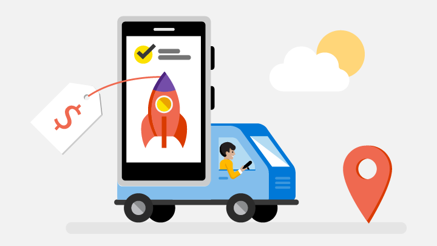

# Engage with your customers

Drive customer engagement and satisfaction by using features like targeted offers, and responses to reviews. [Partner Center](https://partner.microsoft.com/dashboard) includes these features and more to help you drive customer engagement and satisfaction.

:::row:::
    :::column:::
        
    :::column-end:::
    :::column span="2":::
**Targeted Offers**

Show attractive, personalized content to specific segments of your customers to increase engagement, retention, and monetization.

[Promote offers](use-targeted-offers-to-maximize-engagement-and-conversions.md)

:::row:::
    :::column:::
        
    :::column-end:::
    :::column span="2":::
**Targeted push notifications**

Use the dashboard to create and send push notifications to segments of your app’s customers, tailoring each notification for each audience.

**Respond to reviews**

Follow up and connect with your customers by responding publicly or privately to their reviews. You can submit your responses either in the dashboard or by using our REST API.

[Respond to reviews](respond-to-customer-reviews.md)

## Engagement analytics

Keep tabs on your customer engagement activities by using these features and reports.

- [Create customer groups](create-customer-groups.md)
- [Reviews report](reviews-report.md)
- [Get analytics data using our REST API](/windows/uwp/monetize/access-analytics-data-using-windows-store-services)
