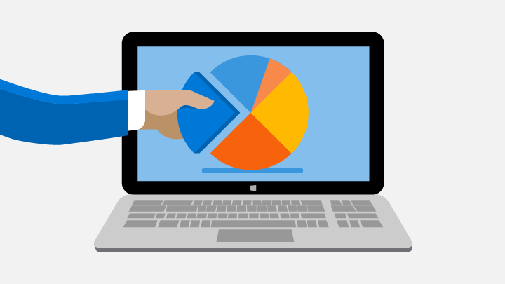
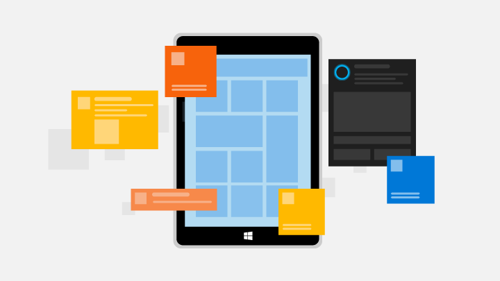
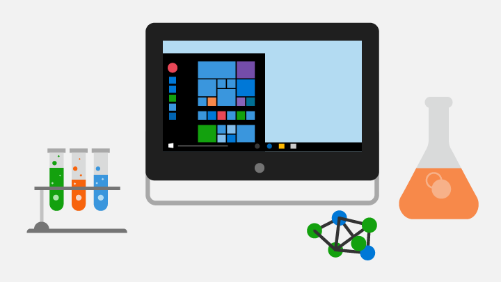
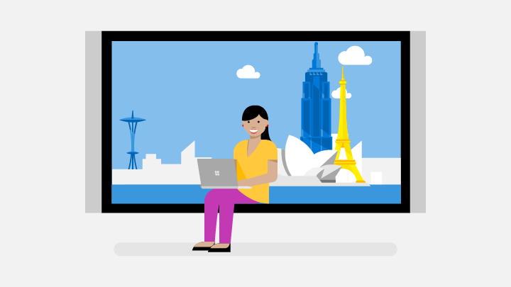

# Engage with your customers

Drive customer engagement and satisfaction by using features like push notifications, targeted offers, and responses to feedback and reviews. [Partner Center](https://partner.microsoft.com/dashboard) includes these features and more to help you drive customer engagement and satisfaction.

## Understand your audience

:::row:::
    :::column:::
        
    :::column-end:::
    :::column span="2":::
**Targeted Offers**

Show attractive, personalized content to specific segments of your customers to increase engagement, retention, and monetization.

[Promote offers](use-targeted-offers-to-maximize-engagement-and-conversions.md)
    :::column-end:::
:::row-end:::

:::row:::
    :::column:::
        
    :::column-end:::
    :::column span="2":::
**Targeted push notifications**

Use the dashboard to create and send push notifications to segments of your app’s customers, tailoring each notification for each audience.

[Send notifications](send-push-notifications-to-your-apps-customers.md)
    :::column-end:::
:::row-end:::

## Run experiments and connect with customers

:::row:::
    :::column:::
        
    :::column-end:::
    :::column span="2":::
**A/B testing**

Run experiments in your apps to measure the effectiveness of feature changes before you enable them for all of your customers.

[Run A/B tests](/windows/uwp/monetize/run-app-experiments-with-a-b-testing)
    :::column-end:::
:::row-end:::

:::row:::
    :::column:::
        
    :::column-end:::
    :::column span="2":::

## Engagement analytics

Keep tabs on your customer engagement activities by using these features and reports.

- [Create customer groups](create-customer-groups.md)
- [Reviews report](reviews-report.md)
- [Feedback report](feedback-report.md)
- [Get analytics data using our REST API](/windows/uwp/monetize/access-analytics-data-using-windows-store-services)
