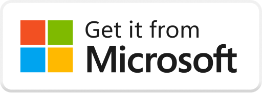
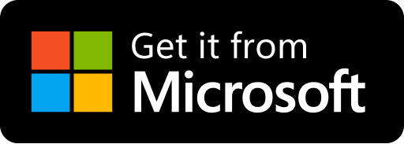
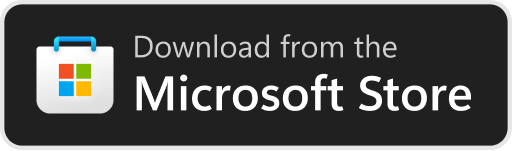

# Leverage Developer Tools

This section answers frequently asked questions about using analytics in Partner Center and leveraging the Microsoft Store Developer CLI for publishing and automation.

<strong>What analytics and insights does Partner Center provide for my app after it’s published?</strong>

Once your app is live, **Partner Center** provides a powerful analytics dashboard with detailed reports and data visualizations, covering:

- **Acquisitions (Installs):** Track how many users are downloading your app, where they're coming from (search, direct links, etc.), and which devices or OS versions they use.
- **Usage:** See how users interact with your app, including session length, frequency of use, and custom telemetry events.
- **Health (Quality):** Monitor app stability through crash reports and error tracking, with detailed stack traces and failure types.
- **Ratings & Reviews:** View and respond to user feedback in the Store, including sorting and filtering by market or date.

All reports can be viewed online or exported as Excel/CSV files for further analysis. Developers can also access this data through APIs or CLI tools for integration with custom dashboards. These insights help identify areas for improvement, measure update impact, and better understand your audience.

<strong>What is the Microsoft Store Developer CLI and how can it help me?</strong>

The **Microsoft Store Developer CLI** is a cross-platform command-line tool that allows developers to automate many Partner Center tasks, such as:

- Listing and retrieving app information
- Uploading new packages
- Updating Store metadata
- Submitting and publishing app updates

This tool is particularly useful for **CI/CD pipelines**, where new builds can be automatically submitted and published. Authentication is done using Entra ID credentials linked to your Partner Center account.

Although still in preview, the CLI offers a flexible alternative to the web UI and supports scripting workflows across Windows, macOS, and Linux. To use it, developers must first configure API access with appropriate permissions. With this tool, teams can significantly streamline and scale their release operations.

<strong>What are product page experiments?</strong>

Product page experiments allow you to perform A/B tests on your app’s visuals, like icons or screenshots, to see which performs best with users.

<strong>How do I set up product page experiments?</strong>

Set them up via Partner Center, specify visual asset variations, and monitor their performance to select the most effective visuals.

<strong>What is package flighting?</strong>

Package flighting lets you distribute app updates to a selected group of users for testing, without impacting the general audience.

<strong>How do I create a package flight?</strong>

Upload a package in Partner Center, select specific users for testing, and promote successful builds to all users when ready.

<strong>How can I use promo codes to promote my app?</strong>

Generate promo codes in Partner Center to distribute free access to your app or add-ons for promotions, reviews, or testing.

<strong>What types of promo codes are available?</strong>

Single-use codes (one redemption per user) and multi-use codes (multiple redemptions up to a defined limit).

<strong>What is the Microsoft Store Web Installer?</strong>

A streamlined installer allowing users to download and install your app directly from the web without opening the Store app.

<strong>How can I implement the Web Installer?</strong>

Generate a Microsoft Store badge with Web Installer integration from the Store badge generator and embed it on your site.

<strong>What is the Microsoft Store CLI?</strong>

A command-line interface tool for managing Store submissions, updates, and metadata directly from your terminal or scripts.

<strong>Can I automate Store submissions with CLI?</strong>

Yes, the Store CLI integrates with CI/CD pipelines, enabling automated submissions and app management.

<strong>What is WNS?</strong>

WNS enables you to send push notifications (toasts, tiles, badges) to your Windows apps via Microsoft's notification infrastructure.

<strong>How do I send notifications using WNS?</strong>

Acquire a channel URI in your app, authenticate with WNS via your server, and send notifications directly to user devices.

<strong>How should I package my app for distribution?</strong>

Use MSIX for modern packaging, automatic updates, and full Store support, or traditional EXE/MSI for existing installers.

<strong>What are the advantages of using MSIX?</strong>

Automatic updates, clean install/uninstall experiences, Store-managed hosting, and built-in signing.

<strong>What tools does Microsoft offer to engage customers?</strong>

Customer segmentation, targeted push notifications via Azure Notification Hubs, promotional campaigns, and responding to user reviews.

<strong>Can I respond to customer reviews?</strong>

Yes, Partner Center lets you directly respond to user reviews publicly or via email, improving user engagement.

<strong>How do I get the link to my app's Store listing?</strong>

To get the URL for your app's Store listing, navigate to the app's [Product Identity](../view-app-identity-details.md) page in the **Product management** section of [Partner Center](https://partner.microsoft.com/). The URL is in the format **`https://apps.microsoft.com/store/detail/<your app's Store ID>`**.

When a customer clicks this link, it opens the web-based listing page for your app. From there, customers on Windows devices can launch the Microsoft Store to download and install your app.

<strong>How do I link to my app's Store listing using the Microsoft Store badge?</strong>

To create a badge, visit the [Microsoft Store badges](https://developer.microsoft.com/store/badges) page. You'll need your app's 12-character **Store ID**, which is available in [Partner Center](https://partner.microsoft.com/) on the [Product identity](../view-app-identity-details.md) page.

<strong>How do I link directly to the Store using a URI?</strong>

You can create a link that launches the Microsoft Store and goes directly to your app's listing page without opening a browser by using the **ms-windows-store:** URI scheme.

These links are useful if you know your users are on a Windows device and you want them to arrive directly at the listing page in the Store. For example, you might want to use this link after checking user agent strings in a browser to confirm that the user's operating system supports the Store, or when you are already communicating via a UWP app.

To use this URI scheme to link directly to your app's Store listing, append your app's Store ID to this link:

**`ms-windows-store://pdp/?ProductId=<your app's Store ID>`**

For more about launching the Microsoft Store app using a URI, see [Launch the Microsoft app](/windows/uwp/launch-resume/launch-store-app).

<strong>What are the Microsoft Store marketing guidelines?</strong>

These guidelines explain how to promote your apps and content in the Store across print, TV, social media, and advertising. Microsoft provides:

- [Microsoft Store Badge Guidelines (PDF)](https://download.microsoft.com/download/0/7/D/07DF43D4-B1A8-4D38-BC02-4903BB36CEE8/Microsoft_Store_Badge_Guidelines.pdf)
- [All badge images](https://download.microsoft.com/download/6/6/6/66641831-E662-4898-BB21-75D6C193A8F9/All%20Badges.zip)
- [Windows device art](https://download.microsoft.com/download/1/A/5/1A58A23A-1388-4097-B441-A3E8DBC14849/Windows_Store_Device_Art.zip)

Make sure to follow the logo usage specifications described in the guidelines above.

<strong>What are the terms for using Microsoft Store badges?</strong>

To use Microsoft Marks (including badges), you must:

- Have a published app or be in the [Microsoft Affiliate Program](https://www.microsoft.com/microsoft-365/business/microsoft-365-affiliate-program)
- Comply with the [License to Microsoft Marks](/legal/windows/agreements/app-developer-agreement#license_to_mark) if you’re registered in Partner Center
- Follow the [badge guidelines](https://download.microsoft.com/download/0/7/D/07DF43D4-B1A8-4D38-BC02-4903BB36CEE8/Microsoft_Store_Badge_Guidelines.pdf)

Microsoft retains ownership of the marks and may revoke usage rights at any time.

<strong>What’s new with Microsoft Store badges?</strong>

The Store badge has been refreshed with a new logo and refined call-to-action. It will go live on [August 7, 2024](https://apps.microsoft.com/badge) in all supported languages.

#### To get the new badge:
If you’re using the badge from our generator, it will update automatically. If you have a custom implementation, update your badge manually.

| Old | New |
|---|---|
|  |  |
|  |  |

**Tips**:
- Match badge color with your site’s theme (light/dark)
- Use JS-based badge for dynamic handling
- Add campaign ID to track traffic in Partner Center

Avoid altering the badge’s colors, shape, or message.

<strong>What are the Microsoft Store requirements for featured apps?</strong>

The Microsoft Store showcases different apps grouped by category or theme. While there's no guarantee your app will be featured, following these best practices increases your eligibility:

<strong>How do screenshots and images help my app get featured?</strong>

When the Store promotes apps, it often uses your [app screenshots and images](../publish-your-app/msix/screenshots-and-images.md). To maximize chances of being featured:

- Ensure your screenshots represent your app well, especially the first one.
- Provide screenshots tailored to each supported device type.
- Upload promotional images such as:
  - **9:16 Poster art** (720x1080 or 1440x2160 pixels)
  - **16:9 Super hero art** (1920x1080 or 3840x2160 pixels)
- If your app supports Xbox or Holographic, include images for those too.

For detailed specs, see [App screenshots, images, and trailers](../publish-your-app/msix/screenshots-and-images.md).

<strong>Should I create separate free and paid versions of my app?</strong>

No. Instead of separate versions, publish a single version of your app:

- Offer a **free trial** of the paid version, or
- Make the app free and use **add-ons** for paid features.

This provides a unified listing that appeals to both free and paying users and simplifies promotion.

<strong>Why should I list my app in multiple markets and languages?</strong>

Publishing your app in all relevant [markets](../publish-your-app/msix/market-selection.md) expands your global reach. To support this:

- Localize your app and Store listing content into appropriate [languages](../publish-your-app/msix/app-package-requirements.md#supported-languages).
- Ensure your app complies with local laws and guidelines in each market.

<strong>Can my app be featured if it contains 16+ or 18+ content?</strong>

Generally, the Microsoft Store does not feature apps rated 16+ or 18+ unless they implement **content filtering**:

- Filter must be **enabled by default**
- Must be **password protected**
- Filter must be available **within the app** (not via an external site)

These steps ensure age-inappropriate content is hidden unless the user explicitly enables it.

