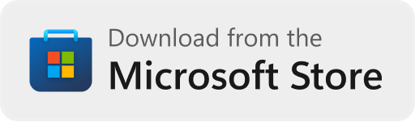

# The new Microsoft Store badges are here

We’ve refreshed the Microsoft Store badge to feature the new logo, with a more refined call-to-action to give users more confidence to acquire your app. These will go live on our [badge creator page](https://apps.microsoft.com/badge) on **August 12, 2024** in all supported languages.

If you’re a developer with an app published on the Microsoft Store, and if you’ve been using these badges externally, you should switch to the new design once they’re live.

## Old

|   |  |
| ------------- | ------------- |

## New

|   |  |
| ------------- | ------------- |

If you don’t have a badge yet, visit the [Microsoft Store badge creator page](https://apps.microsoft.com/badge) to choose the options that work best for your badge and hit Generate to create one for your app.

### Some tips to make the most of your badge
* We’ll have a different badge color for dark and light modes, and you should pick what works best for your website or allow it to be automatically detected.
* We recommend using the standard JavaScript-based badge, but if your website doesn’t use JavaScript, you’ll be able to create a non-JS version too.
* Remember to add a campaign ID with a unique string so you can better track your traffic sources on the Microsoft Store Partner Center dashboard.

Please avoid altering the badge – including changing the color, the text, or the elements within.
