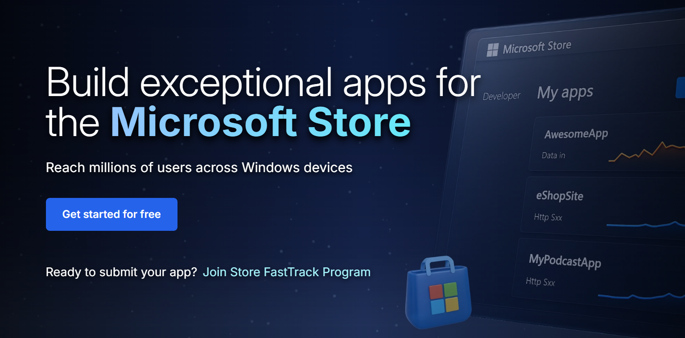
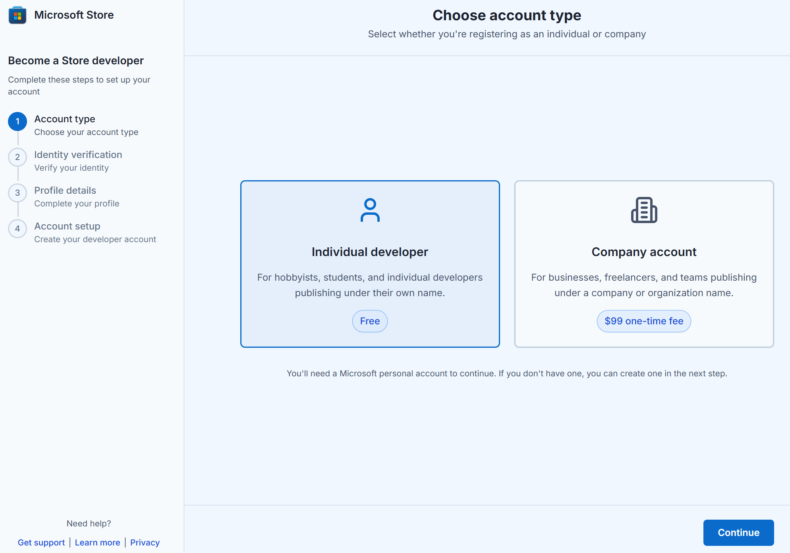

# Steps to open a developer account

There are 2 types of developer accounts available in Partner Center: **Individual and Company**. Depending on your Microsoft account and other factors, you may be able to choose between these account types, or the system may pre-determine the appropriate type for you. Select a developer account below to understand the account creation process:

## [Open individual developer account](#tab/individual)

### Who should select an individual account:
- **Independent developers** whose distribution of apps through the Store is **not in relation to their business, trade, or profession**
- **Small scale creators** producing content for non-commercial purposes 
- Individuals creating digital content as a **hobbyist, amateur, school, or personal project**

For more details, you can refer to the steps below:

## Step-by-Step Flow

1. **Go to** [storedeveloper.microsoft.com](https://storedeveloper.microsoft.com)

   > **Note for existing developers:**  If you already have a developer account and sign in with an existing MSA, you will skip Steps 5–8 and be taken directly to Step 9. Alternatively, you can go straight to the [Partner Center apps and games page](https://aka.ms/submitwindowsapp).

2. **Click “Get started for free”** to begin.

3. Select **Individual developer** (free). If you’re a business, select Company account.

   > **Note for Company developers:** Selecting **Company account** will redirect you to the existing onboarding flow for Company developers. Learn more about Company account setup [here](/windows/apps/publish/partner-center/open-a-developer-account?tabs=company).

4. **Sign in** with your Microsoft account (MSA) or create a new one.

5. **Begin identity verification** with a government-issued ID and selfie.

6. **Capture** your ID and selfie on mobile in good lighting with original documents.

7. **Complete** your profile details. Review your auto-filled information, and update if required.

8. Complete your account setup and click **“Go to Partner Center dashboard”**

9. After clicking, you’ll first be prompted with the **Microsoft account (MSA) picker**  
> - Select the same account you used earlier to create your Store developer account.  
> - Once signed in, you’ll land on the "Apps & Games overview" page.  

> **Note:** If you're not taken there immediately:  
> - Wait ~5 minutes and refresh your browser until you see the **Apps & Games** tile, then click it.  
> - Or navigate directly to the [Partner Center apps and games page](https://aka.ms/submitwindowsapp) after a few minutes.

You’ll be redirected to Partner Center to finish setup and publish your first app.

## Need help? Contact us

If you need assistance with the new account onboarding process for individual developers (zero registration fees), you can email us directly at **storesupport@service.microsoft.com**. This inbox is only for issues related to the new onboarding process in **flighted markets**.

For help with anything else — including account creation or management, app submission, app certification, or app analytics — please raise a support ticket [here](https://aka.ms/windowsdevelopersupport).  
You can also explore guidance in our [publishing documentation](/windows/apps/publish).

## Frequently Asked Questions (FAQs)

### Do I need to pay the registration fee?

No — if you're using the new flow via the [Store marketing page](https://storedeveloper.microsoft.com/) in a flighted market. If you land on the legacy flow via other entry points or are in a non-flighted market, the registration fee still applies.  

The free onboarding flow applies only to individual developers. Company accounts continue to pay a one-time $99 USD registration fee as part of the existing onboarding process.

### How do I access the new flow?

You must begin your journey at [storedeveloper.microsoft.com](https://storedeveloper.microsoft.com). This is the only supported entry point during the flighting phase. Other paths (e.g. direct via Partner Center, Xbox, or Visual Studio) will show the legacy flow.

### Why is ID verification required?

To ensure platform integrity. Verifying your identity helps protect against fraud and impersonation, which in turn improves safety for customers and trust in the developer ecosystem.

### What happens to my ID data?

Your ID information is used solely for verification and processed securely per Microsoft’s privacy standards. Microsoft may retain non-PII data like Publisher name and country for support and dispute resolution purposes.

### I already have a developer account—do I need to use this?

No — this flow is only for new individual developers creating their account for the first time.

## [Open company developer account](#tab/company)

### Who should select a company account:
- **Independent developers and freelancers** whose distribution of apps through the Store is **in relation to their business, trade, or profession**
- **Businesses and Organizations** such as corporations, LLCs, partnerships, non-profits, or government organizations
- **Teams or Groups** within a company or organization

You can watch the following video to understand how to open company developer account:

 

>[!VIDEO https://learn-video.azurefd.net/vod/player?id=2125b1c6-20d4-47da-ba76-d1ff17b89cc2]

For more details, you can refer to the steps below:

### Steps to open company account

1. Navigate to the [registration page](https://aka.ms/partnercenterregistration).
1. Now, sign in with your Microsoft account. If you do not have a Microsoft account, click on **Create an account**. The Microsoft account you use here is what you'll use to sign in to your developer account. If you want to know what is a Microsoft account, [click here.](https://aka.ms/microsoftaccount)

   **Note:** If you have an Microsoft Entra ID, you can link it to the developer account in Partner Center after **successful developer account creation**, and then use the Microsoft Entra ID for future sign-ins. Here are the steps to [associate an existing Microsoft Entra ID tenant with your developer account in Partner Center](./associate-existing-azure-ad-tenant-with-partner-center-account.md).

1. Next step is to join a partner program. Partner Center is home to partner programs for multiple marketplaces including Windows. For submitting apps to Microsoft Store, join the **Windows and Xbox** program.

1. Select the [country or region](account-types-locations-and-fees.md#developer-account-and-app-submission-markets) where your business is located. You won't be able to change this later.

1. Select your developer account type. If account type selection is available, choose **Company**. If the options are grayed out or only Individual is available, see the [Account type availability](account-types-locations-and-fees.md#account-type-availability) section for guidance on proceeding with a company account setup.

1. Next, if your company is registered with [Dun & Bradstreet](https://partner.microsoft.com/marketing/usisvshowcase/dunandbrad), use the **DUNS number** to access company information. Otherwise select **I don't have a DUNS number** to manually provide details like company name, address, company registration number etc.

1. Enter the **contact info** you want to use for your developer account and also provide the company website.

   > [!NOTE]
   > We'll use this info to contact you about account-related matters. For example, you'll receive an email confirmation after you complete your registration. After that, we'll send messages when we pay you or if you need to fix something with your account. We may also send informational emails as described earlier, unless you opt out of receiving non-transactional emails.

1. Next, enter the name, email address, and phone number of the person who will approve your company's account.

1. Enter the **publisher display name** that you want to use (50 characters or fewer). Select this carefully, as customers will see this name when browsing and will come to know your apps by this name. Be sure to use your organization's registered business name or trade name. If you enter a name that someone else has already selected, or if someone else has the rights to use that name, we won't permit you to use it.

   > [!NOTE]
   > Make sure you have the rights to use the name you enter here. If someone else has trademarked or copyrighted the name you picked, your account could be closed. See [App Developer Agreement](https://go.microsoft.com/fwlink/?linkid=528905) for more info. If someone else is using a publisher display name for which you hold the trademark or other legal right, [contact Microsoft](https://www.microsoft.com/info/cpyrtInfrg.html).

1. Upload **a legal document** with your company address and name details such as formation documents, government issued letter/license etc.   

1. Then, read and accept the terms and conditions of the [App Developer Agreement](https://go.microsoft.com/fwlink/?linkid=528905). 

1. Select **Accept and Continue** to move on to the **Payment** section.

1. Enter your payment info for the one-time registration fee. The company account costs approximately **$99 USD**. (The fees varies depending on your [country or region](./account-types-locations-and-fees.md#developer-account-and-app-submission-markets)). If you have a promo code that covers the cost of registration, you can enter that here. Otherwise, provide your credit card info (or PayPal info in supported markets). Note that prepaid credit cards can't be used for this purchase. When you're finished, select **Pay and Register** to complete the registration.

After you've completed the signup process, your account will go through the verification process. For company accounts, we check to make sure another individual or company isn't already using your publisher display name. Our verification process also needs to confirm whether you’re associated with the company that you’re representing. This process can take from a few days to a couple of weeks, and often includes a phone call to your company (so make sure all of your contact information is up to date when you fill out the registration forms). You can't submit apps from a company account until it's been verified, but while you're waiting, you can [reserve an app name](/windows/apps/publish/?tabs=msix-pwa-getting-started#get-started-with-app-submission) continue building and testing apps, and work on getting your submissions ready.

You can check your verification status on the [Account settings](https://aka.ms/windowsdevaccountverification) page.

> [!NOTE]
> There is a known issue where users in some locales might be unable to finish completing their registration. Until we can confirm that it is resolved, we recommend that you manually change your browser's locale tag to **en-us** once you begin the sign-up process on partner.microsoft.com.

---

> [!NOTE]
> In some cases, the screens and fields you see when you register for a developer account may vary slightly from what's outlined in the above steps. But the basic information and process will match what these steps describe.

> [!TIP]
> If you're unsure which account type is appropriate for your situation, look for the "Learn More" link during registration for additional guidance on account types, or refer to our [account types documentation](account-types-locations-and-fees.md) to understand the differences between Individual and Company accounts.
