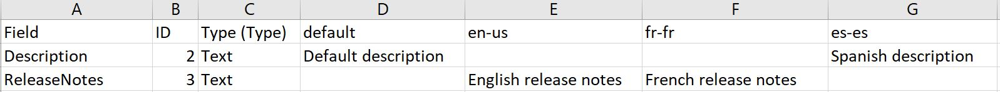

# Import and export store listings for PWA

Instead of [entering info for your Store listings directly in Partner Center](./create-app-store-listing.md), you have the option to add or update info by exporting your listings in a .csv file, entering your info and assets, and then importing the updated file. You can use this method to create listings from scratch, or to update listings you’ve already created.

This option is especially useful if you want to create or update Store listings for your product in multiple languages, since you can copy/paste the same info into multiple fields and easily make any changes that should apply to specific languages.

> [!TIP]
> You can also use this feature to import and export Store listing details for an add-on. For add-ons, the process works the same except that [only the fields relevant to add-ons](#add-ons) are included.
> Keep in mind that you can always create or update listings directly in Partner Center (even if you have previously used the import/export method). Updating directly in Partner Center may be easier when you are just making a simple change, but you can use either method at any time.

## Export listings

On the app overview page for an app, click **Export listing** (in the **Store listings** section) to generate a .csv file encoded in UTF-8. Save this file to a location on your computer.

You can use Microsoft Excel or another editor to edit this file. Note that Microsoft 365 versions of Excel will let you save a .csv file as **CSV UTF-8 (Comma-delimited) (\*.csv)**, but other versions may not support this. You can find details about which versions of Excel support this feature at the [Excel 2016 New features bulletin](https://support.office.com/article/what-s-new-in-excel-for-office-365-5fdb9208-ff33-45b6-9e08-1f5cdb3a6c73?ui=en-US&rs=en-001&ad=US), and more info about encoding as UTF-8 in various editors [here](https://help.surveygizmo.com/help/encode-an-excel-file-to-utf-8-or-utf-16).

If you haven’t created any listings for your product yet, the .csv file you exported will not contain any custom data. You’ll see columns for **Field**, **ID**, **Type**, and **default**, and rows which correspond to every item that can appear in a Store listing.

If you have already created listings (or have uploaded packages), you’ll also see columns labelled with language-locale codes that correspond to the language for each listing that you’ve created (or that we’ve detected in your packages), as well as any listing info that you’ve previously provided.

Here’s an overview of what’s contained in each of the columns in the exported .csv file:

- The **Field** column contains a name that is associated with every part of a Store listing. These correspond to the same items you can provide when creating Store listings in Partner Center, although some of the names are slightly different. For items where you can enter more than one of the same type of item, you’ll see multiple rows, up to the maximum number that you can provide. For example, for **App features** you will see **Feature1**, **Feature2**, etc., going up to **Feature20** (since you can provide up to 20 app features).
- The **ID** column contains a number that Partner Center associates with each field.
- The **Type** column provides general guidance about what type of info to provide for that field, such as **Text** or **Relative path (or URL to file in Partner Center)**.
- The **default** column (and any columns labelled with language-locale codes) represent the text or assets associated with each part of the Store listing. You can edit the fields in these columns to make updates to your Store listings.

> [!IMPORTANT]
> Don’t change any of the info in the **Field**, **ID**, or **Type** columns. The info in these columns must remain unchanged in order for your imported file to be processed.

## Update listing info

Once you’ve exported your listings and saved your .csv file, you can edit your listing info directly in the .csv file.

Along with the **default** column, each language for which you’ve created a listing has its own column. The changes you make in a column will be applied to your description in that language. You can create listings for new languages by adding the language-locale code into the next empty column in the top row. For a list of valid language-locale codes, see [Supported languages](./app-package-requirements.md#supported-languages).

You can use the **default** column to enter info that you want to share across all of your app’s descriptions. If the field for a given language is left blank, the info from the default column will be used for that language. You can override that field for a particular language by entering different info for that language.

Most of the Store listing fields are optional. The **Description** and one screenshot are required for each listing; for languages which don’t have associated packages, you will also need to provide a **Title** to indicate which of your reserved app names should be used for that listing. For all other fields, you can leave the field empty if you don’t want to include it in your listing. Remember that if you leave a field for a given language blank, we’ll check to see if there is info in that field in the default column. If so, that info will be used.

For instance, consider the following example:

- The text “Default description” will be used for the **Description** field in the en-us and fr-fr listings. However, the **Description** field in the es-es listing would use the text “Spanish description”.
- For the **ReleaseNotes** field, the text “English release notes” will be used for en-us, and the text “French release notes” will be used for fr-fr. However, no release notes will appear for es-es.

If you don’t want to make any edits to a particular field, you can delete the entire row from the spreadsheet, **with the exception of the rows for trailers and their associated thumbnails and titles**. Other than for these items, deleting a row will not impact the data associated with that field in your listings. This lets you remove any rows which you don’t intend to edit, so you can focus on the fields in which you’re making changes.

Deleting the info in a field for one language, without removing the entire row, works differently, depending on the field. For fields whose **Type** is **Text**, deleting the info in a field will simply remove that entry from the listing in that language. However, deleting the info in a field for an image, such as a screenshot or logo, will not have any effect; the previous image will still be used unless you remove it by editing directly in Partner Center. Deleting the info for a trailer field will actually remove that trailer from Partner Center, so be sure you have a copy of any needed files before you do so.

Many of the fields in your exported listings require text entry, such as the ones in the example above, **Description** and **ReleaseNotes**. For these types of fields, simply enter the appropriate text into the field for each language. Be sure to follow the length and other requirements for each field. For more info on these requirements, see [Create app Store listings](./create-app-store-listing.md).

Providing info for fields that correspond to assets, such as images and trailers, are a bit more complicated. Rather than **Text**, the **Type** for these assets is **Relative path (or URL to file in Partner Center)**.

If you’ve already uploaded assets for your Store listings, these assets will then be represented by a URL. These URLs can be reused in multiple descriptions for a product, or even across different products within the same developer account, so you can copy these URLs to reuse them in a different field if you’d like.

> [!TIP]
> To confirm which asset corresponds to a URL, you can enter the URL into a browser to view the image (or download the trailer video). You must be signed in to your Partner Center account in order for this URL to work.
> If you want to use a new asset that you haven’t previously added to Partner Center, you can do so by importing your listings as a folder, rather than as a single .csv file. You’ll need to create a folder that contains your .csv file. Then, add your images that same folder, either in the root folder or in a subfolder. You’ll need to enter the full path, including the root folder name, in the field.

> [!TIP]
> For best results when importing your listings as a folder, be sure you are using the latest version of either Microsoft Edge, Chrome, or Firefox.
> For example, if your root folder is named **my_folder**, and you want to use an image called **screenshot1.png** for **DesktopScreenshot1**, you could add screenshot1.png to the root of that folder, then enter **my_folder/screenshot1.png** in the **DesktopScreenshot1** field. If you created an images folder within your root folder and then placed screenshot1.jpg there, you would enter **my_folder/images/screenshot1.png**. Note that after you import your listings using a folder, paths to your images will be converted to URLs to the files in Partner Center the next time you export your listings. You can copy and paste these URLs to use them again (for example, to use the same assets in several listing languages).

> [!IMPORTANT]
> If your exported listing includes trailers, be aware that deleting the URL to the trailer or its thumbnail image from your .csv file will completely remove the deleted file from Partner Center, and you will no longer be able to access it there (unless it is also used in another listing where it hasn’t been deleted).

## Import listings

Once you have entered all of your changes into the .csv file (and included any assets you want to upload), you’ll need to save your file before uploading it. If you're using a version of Microsoft Excel that supports UTF-8 encoding, be sure to select **Save as** and use the **CSV UTF-8 (Comma-delimited) (\*.csv)** format. If you use a different editor to view and edit your .csv file, make sure the .csv file is encoded in UTF-8 before you upload.

When you’re ready to upload the updated .csv file and import your listing data, select **Import listings** on your app overview page. If you’re only importing a .csv file, choose **Import .csv**, browse to your file, and click **Open**. If you’re importing a folder with image files, choose Import folder, browse to your folder, and click **Select folder**. Make sure there is only one .csv file in your folder, along with any assets you’re uploading.

As we process your imported .csv file, you’ll see a progress bar reflecting the import and validation status. This can take some time, especially if you have a lot of listings and/or image files.

If we detect any problems, you’ll see a note indicating that you’ll need to make any needed updates and try again. Select the **View errors** link to see which fields are invalid and why. You’ll need to correct these issues in your .csv file (or replace any invalid assets) and then import your listings again.

> [!TIP]
> You can access this info again later via the **View errors for last import** link.
> None of the info from your .csv file will be saved in Partner Center until all of the errors in your file have been resolved, even for fields without errors. Once you have imported a .csv file that has no errors, the listing info you’ve provided will be saved in Partner Center, and will be used for that submission.

You can continue to make updates to your listings either by importing another updated .csv file, or by making changes directly in Partner Center.

## Add-ons

For add-ons, importing and exporting Store listings uses the same process described above, except that you'll only see the three fields relevant to [add-on Store listings](./create-app-store-listing.md): **Description**, **Title**, and **StoreLogo300x300** (referred to as **Icon** in the Store listing page in Partner Center). The **Title** field is required, and the other two fields are optional.

Note that you must import and export Store listings separately for each add-on in your app by navigating to the submission overview page for the add-on.
