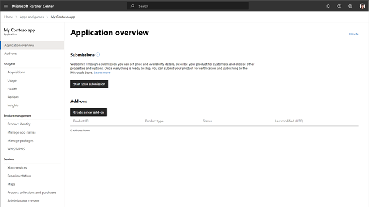
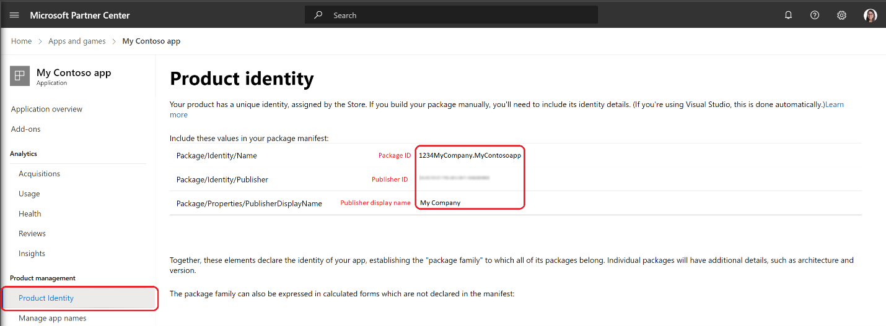

# Turn your website into a high quality PWA

Turning your website into a fully functional high quality PWA (Progressive Web Application) can be done in a lunch break! In this article well take you through the end-to-end process.

## Step 1: Create a report card in PWA Builder

First, you'll want to check if your website has the features and metadata that great PWAs need.

1. Navigate to [PWA Builder](https://www.pwabuilder.com/)
2. Enter the URL of the website you'd like to convert to a PWA and click **Start**
3. PWA builder will display a PWA Report Card that indicates the features your website has and does not have.

## Step 2: Review your PWA Report Card

Your PWA Report Card contains your website's score, out of a maximum score of 100. Scores are based off of three categories of features.

### Manifest

PWA evaluates your website's [Web Application Manifest](https://www.w3.org/TR/appmanifest/) if one is available, and identifies fields or values tht are required, recommended, and optional. You can improve your score by adding missing values, either by editing and re-publishing your manifest file, or by using the online manifest editor.

> [!WARNING]
> Changes made in the online manifest editor will not be published to your website. The changes you make will only be used by PWA Builder when creating your PWA.

**Required** values must be present, otherwise PWA builder won't be able to create your PWA. Required fields include simply having a manifest, icons, name, short name, and a start_url.

**Recommended** fields aren't required, but are important for your PWA's user experience. It is strongly recommended you provide all recommended values, though PWA Builder can create a PWA without them. Recommended values include display mode, splash screen background color, description, orientation, screenshots, high resolution icon, maskable icon, categories, and shortcuts.

**Optional** fields are not required, but can be specified if appropriate. Optional fields include an age rating and related applications.

### Service Worker

A service worker runs in the background to enable rich web app features where there would otherwise be 404 errors. PWA Builder requires a service worker to create your PWA, but if you do not have one you can use one of several prebuilt service workers provided by PWA Builder. To use a prebuilt service worker:

1. Choose the **Service Worker Options** tab in the menu.
2. Select the appropriate service worker from the curated list. Note that there are many prebuilt options; make sure to pick the service worker most appropriate for your specific use case.
3. Once you've selected the service worker you'd like to use, you'll be returned to your PWA Report Card.

### Security

All PWAs built with PWA Builder require three security protocols.

1. Your site must use HTTPS.
2. Your site must have a corresponding HTTPS certificate.

   If your website does not have a HTTPS certificate present you can publish to Azure to get built-in HTTPS support. Alternatively there are free third-party tools such as [Letsencrypt](https://letsencrypt.org/) that will allow you to obtain a HTTPS certificate for free.

3. Your site must not contain mixed content. Mixed content is when a page served over HTTPS contains resources loaded over HTTP. Mixed content compromises the security of HTTPS and your PWA.

## Step 3: Collect important information from Partner Center

You'll need several pieces of information from your Partner Center account to create your PWA. If you do not have an MSA, [click here for instructions on how to get started](/partner-center/mpn-create-a-partner-center-account). You will also need to enroll in the Windows Developer Program.

If you have not already done so, you'll need to [create your PWA app by reserving a new name](./reserve-your-apps-name.md). Once you've reserved your name, click the **Start your submission** button to create a new app submission.

Next, click on the **Product Management** tab and select **Product Identity**. The product identity page will list your product's package ID, your publisher ID, and your publisher display name. Save these values and return to PWA Builder.

## Step 4: Generate your PWA on PWA Builder

You now have everything you need to create your PWA on PWA Builder. Return to the PWA Builder site and click **Generate**.

PWA builder will prompt you for the information you obtained from Partner Center in step 3. Fill in the values and click **Generate**.

Once PWA Builder has created your PWA, your browser will automatically download it. Your PWA is packaged in a .zip file that contains six files.

The **msix** file is your PWA's main app package. This file will install your PWA on the user's machine.

The **appx** file is a classic app package. It is used to install your PWA on older versions of Windows. See [Classic app packages](https://github.com/pwa-builder/pwabuilder-windows-chromium-docs/blob/master/classic-package.md) for more information.

## Step 5: Submit your app packages to the Microsoft Store

These packages can be submitted to the Microsoft Store in the same way any other app packaged as an MSIX file can be. For further instructions submitting your PWA packages to the store, see [App submissions](./create-app-submission.md).
